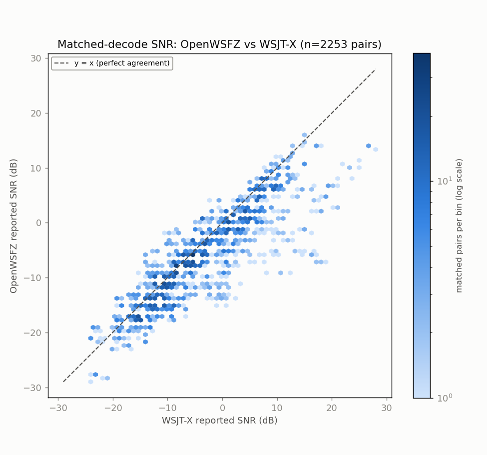
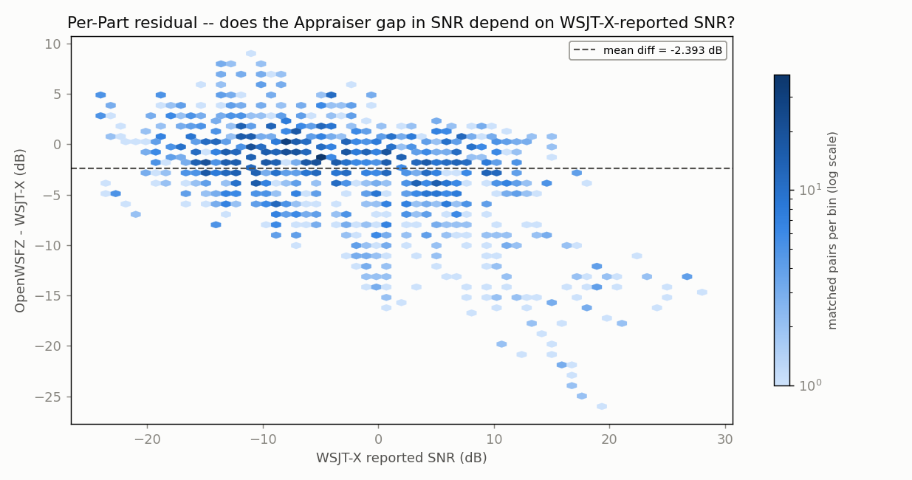
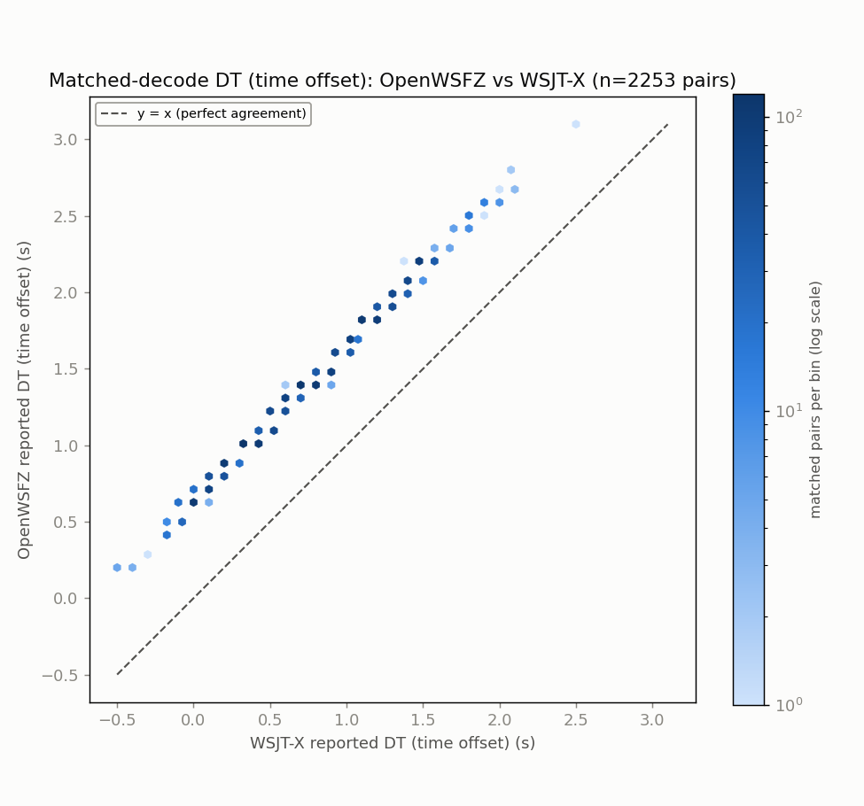
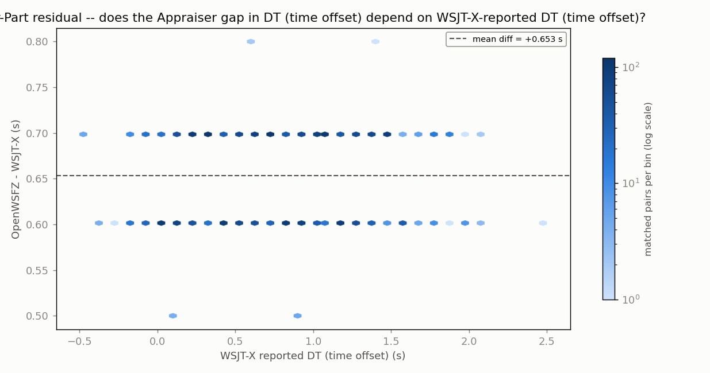
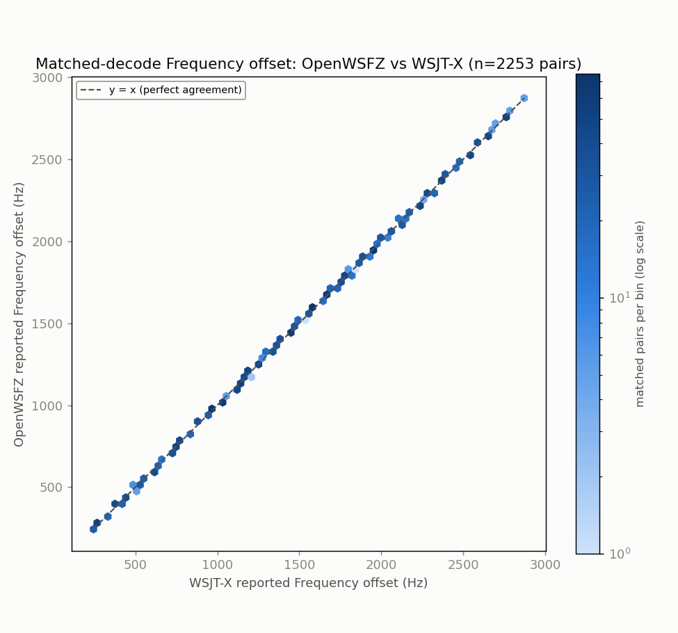
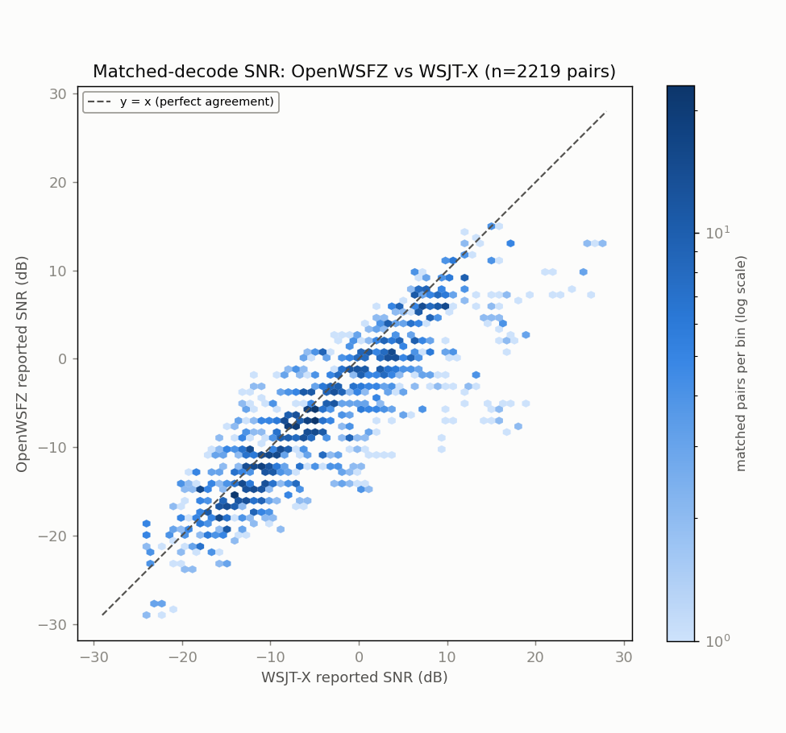
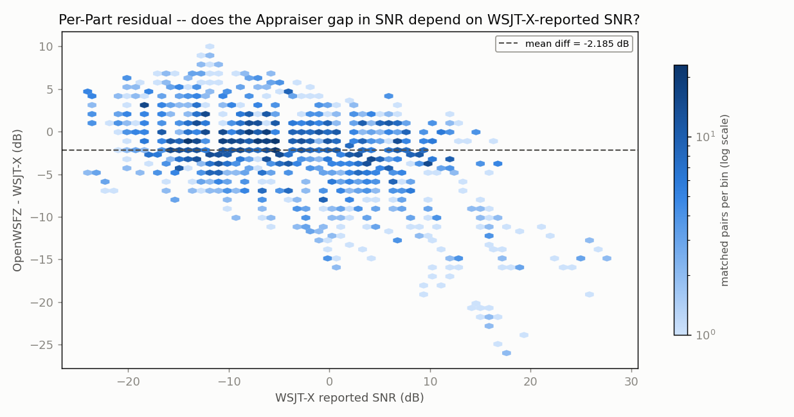
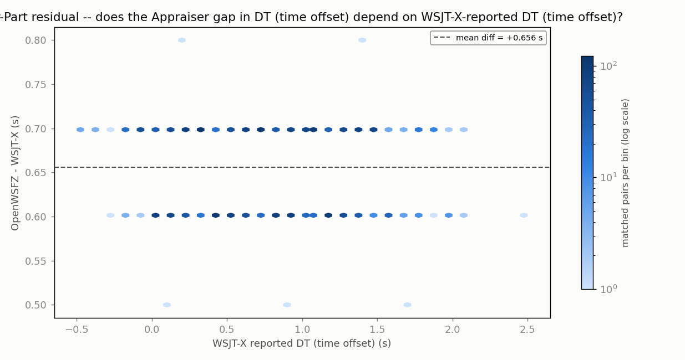
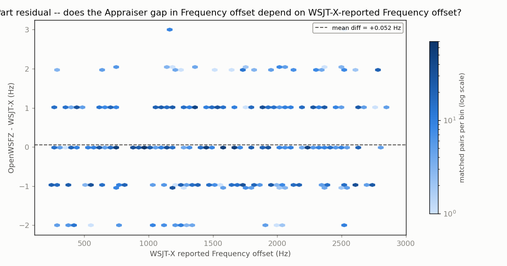

# Live cross-decode replay -- full ANOVA report (n=5 runs)

Generated 2026-08-06 21:14 UTC. `qa/cycleframer-alignment-replay/2026-08-06-live-cross-decode-replay/build_full_anova.py`.

5 independent live replays of the identical 20-cycle window from
`20260803_live_run_1713` (260804_085845 -> 260804_090330), both decoders decoding the
same real-time audio simultaneously via VB-CABLE loopback (no offline `jt9`). Two designs:

1. **3-way decode-count ANOVA (Decoder x Source x Cycle)**: answers directly whether
   Decoder and Source are confounded -- they are not, but Source is perfectly aliased
   with within-run pass order (see the section itself). Fixed-effects model, all terms
   tested against the pure run-to-run residual.
2. **Per-source decode-count ANOVA**: two-way ANOVA WITH replication and interaction
   (Decoder x Cycle x Run), generalised from `qa/rr-study/harness/anova_compute.py`'s
   Gauge-R&R design, run separately per source pass (AIAG convention: main effects tested
   against the Decoder x Cycle interaction). Superseded by #1 for any claim about Source
   itself; kept as the simpler within-source view of Decoder alone.
3. **SNR / DT / frequency**: `qa/endurance/anova_common.py`'s established randomized-
   complete-block design (Part = one matched decode, Appraiser = decoder), Parts pooled
   across all 5 runs' matched pairs -- same machinery as every other live-corpus
   ANOVA in this project, just fed a bigger pooled Part set. Also run separately per source.

NFR-021: message text read only to build match keys, never printed or written. Aggregate
statistics only below.

## 3-way ANOVA: does the design separate Decoder from Source?

Fixed-effects 3-way factorial with replication: Decoder (A, 2 levels) x Source (B, 2 levels) x Cycle (C, 20 levels, which of the 20 original archived cycles) x Run (5 replicates/cell). Every term tested against the pure run-to-run residual MS -- see this function's header comment for why that convention (not the AIAG main-effect-vs-interaction convention used for the per-source 2-way tables) is the right one here.

**Order confound, stated again because it matters for how to read this table**: every run played WSJT-X-source WAVs first, OpenWSFZ-source WAVs second, always in that order. The Source term and the Decoder x Source interaction below cannot distinguish a genuine source effect from a within-run pass-order effect -- read both as 'Source-or-order', not 'Source'.

| Source | DF | SS | MS | F | P | %SS |
|---|---:|---:|---:|---:|---:|---:|
| Decoder | 1 | 21800.522 | 21800.522 | 17422.995 | 0.000000 | 84.7% |
| Source | 1 | 6.502 | 6.502 | 5.197 | 0.023286 | 0.0% |
| Cycle | 19 | 2723.748 | 143.355 | 114.570 | 0.000000 | 10.6% |
| Decoder x Source | 1 | 0.202 | 0.202 | 0.162 | 0.687738 | 0.0% |
| Decoder x Cycle | 19 | 763.028 | 40.159 | 32.095 | 0.000000 | 3.0% |
| Source x Cycle | 19 | 21.047 | 1.108 | 0.885 | 0.601705 | 0.1% |
| Decoder x Source x Cycle | 19 | 36.948 | 1.945 | 1.554 | 0.066218 | 0.1% |
| Residual (run-to-run) | 320 | 400.400 | 1.251 | | | 1.6% |
| Total | 399 | 25752.397 | | | | 100.0% |

Grand mean: 30.30 decodes/cycle.
Decoder means: OpenWSFZ=22.92, WSJT-X=37.69  
Source means: WSJT-X-source WAVs=30.43, OpenWSFZ-source WAVs=30.18

- **Decoder main effect**: SIGNIFICANT (p=0.000000)
- **Source main effect (read as Source-or-order)**: SIGNIFICANT (p=0.023286)
- **Decoder x Source interaction (read as Decoder x [Source-or-order])**: not significant (p=0.687738)
- **Cycle main effect**: SIGNIFICANT (p=0.000000)
- **Decoder x Cycle interaction**: SIGNIFICANT (p=0.000000)
- **Source x Cycle interaction**: not significant (p=0.601705)
- **3-way interaction**: not significant (p=0.066218)

---

## WSJT-X-source WAVs

### Decode-count ANOVA (WSJT-X-source WAVs)

Design: Decoder (a=2) x Cycle (b=20, which of the 20 original archived cycles) x Run (n=5 replicate live sessions). Response: decode count in that cycle.

| Source | DF | SS | MS | F | P |
|---|---:|---:|---:|---:|---:|
| Cycle (Part) | 19 | 1351.820 | 71.148 | 3.170 | 0.00780 |
| Decoder (Appraiser) | 1 | 10833.920 | 10833.920 | 482.659 | 0.00000 |
| Decoder x Cycle | 19 | 426.480 | 22.446 | 22.904 | 0.00000 |
| Repeatability (run-to-run) | 160 | 156.800 | 0.980 | | |
| Total | 199 | 12769.020 | | | |

Grand mean: 30.43 decodes/cycle. Decoder means: OpenWSFZ=23.07, WSJT-X=37.79

| Variance component | Value | % of total |
|---|---:|---:|
| Repeatability (run-to-run) | 0.980 | 0.8% |
| Reproducibility (decoder) | 112.408 | 95.1% |
|   Decoder | 108.115 | 91.4% |
|   Decoder x Cycle | 4.293 | 3.6% |
| Cycle-to-cycle | 4.870 | 4.1% |
| Total | 118.258 | 100.0% |

Decoder main effect: **SIGNIFICANT** (p=0.00000). Cycle main effect: **significant** (p=0.00780). Interaction: **significant** (p=0.00000).

# Endurance-session ANOVA -- matched-decode metrics (OpenWSFZ vs WSJT-X)

**Run:** 5-run live cross-decode replay -- WSJT-X-source WAVs  
**Generated:** 2026-08-06T21:14:54Z (`date -u`, HK-017)  
**Design:** two-way ANOVA without replication (randomized complete block design) -- Part (matched decode instance) x Appraiser (OpenWSFZ, WSJT-X), run separately for each paired numeric response below (SNR, DT, frequency offset) over the identical matched Parts. See anova_common.py's module docstring for why this design applies to single-pass live data, and not the replicated design in `qa/rr-study/harness/anova_compute.py`.

5 independent live replays of the same 20-cycle window (260804_085845-260804_090330, WSJT-X-source WAVs), both decoders decoding the same real-time audio simultaneously via VB-CABLE loopback. Parts pooled across all 5 runs (not one run's matched decodes).

- OpenWSFZ decodes in window: **2307**
- WSJT-X decodes in window: **3779**
- Matched pairs (Parts, shared across every response below): **2253**

## Decode coverage

- OpenWSFZ decoded **2307** messages in this window; WSJT-X decoded **3779**.
- **2253** decodes matched between the two (same cycle + normalised message text) -- **97.7%** of OpenWSFZ's decodes, **59.6%** of WSJT-X's decodes.
- OpenWSFZ-only (WSJT-X did not report it): **54** (2.3% of OpenWSFZ's total).
- WSJT-X-only (OpenWSFZ did not report it): **1526** (40.4% of WSJT-X's total).

## SNR (dB)

| Source | SS | df | MS | F | P |
|---|---:|---:|---:|---:|---:|
| Part | 324947.8140 | 2252 | 144.2930 | 15.395 | 0.0000 |
| Appraiser | 6452.2113 | 1 | 6452.2113 | 688.422 | 0.0000 |
| Residual (confounded with interaction, n=1/cell) | 21106.7887 | 2252 | 9.3725 | | |
| Total | 352506.8140 | 4505 | | | |

Appraiser means (SNR, dB): OpenWSFZ -6.119 dB, WSJT-X -3.726 dB, grand mean -4.922 dB.

## DT (time offset) (s)

| Source | SS | df | MS | F | P |
|---|---:|---:|---:|---:|---:|
| Part | 1208.5455 | 2252 | 0.5367 | 413.472 | 0.0000 |
| Appraiser | 480.9971 | 1 | 480.9971 | 370590.101 | 0.0000 |
| Residual (confounded with interaction, n=1/cell) | 2.9229 | 2252 | 0.0013 | | |
| Total | 1692.4655 | 4505 | | | |

Appraiser means (DT (time offset), s): OpenWSFZ 1.3881 s, WSJT-X 0.7346 s, grand mean 1.0613 s.

## Frequency offset (Hz)

| Source | SS | df | MS | F | P |
|---|---:|---:|---:|---:|---:|
| Part | 2164089766.0777 | 2252 | 960963.4840 | 2030551.912 | 0.0000 |
| Appraiser | 9.2357 | 1 | 9.2357 | 19.515 | 0.0000 |
| Residual (confounded with interaction, n=1/cell) | 1065.7643 | 2252 | 0.4733 | | |
| Total | 2164090841.0777 | 4505 | | | |

Appraiser means (Frequency offset, Hz): OpenWSFZ 1482.0 Hz, WSJT-X 1481.9 Hz, grand mean 1481.9 Hz.

## Caveat (structural, not a defect)

With one observation per Part x Appraiser cell -- a live signal happens once -- the interaction term and the residual/error term are mathematically confounded (standard property of an unreplicated factorial design), for every response above. Each table can say whether the two appraisers' *mean* value differs after removing part-to-part variation (the Appraiser row); none of them can separately test whether that difference itself varies signal-to-signal.

Cross-run comparison and interpretation of these numbers is Architect/Captain territory, not this module's.

---

## OpenWSFZ-source WAVs

### Decode-count ANOVA (OpenWSFZ-source WAVs)

Design: Decoder (a=2) x Cycle (b=20, which of the 20 original archived cycles) x Run (n=5 replicate live sessions). Response: decode count in that cycle.

| Source | DF | SS | MS | F | P |
|---|---:|---:|---:|---:|---:|
| Cycle (Part) | 19 | 1392.975 | 73.314 | 3.730 | 0.00308 |
| Decoder (Appraiser) | 1 | 10966.805 | 10966.805 | 557.890 | 0.00000 |
| Decoder x Cycle | 19 | 373.495 | 19.658 | 12.911 | 0.00000 |
| Repeatability (run-to-run) | 160 | 243.600 | 1.522 | | |
| Total | 199 | 12976.875 | | | |

Grand mean: 30.18 decodes/cycle. Decoder means: OpenWSFZ=22.77, WSJT-X=37.58

| Variance component | Value | % of total |
|---|---:|---:|
| Repeatability (run-to-run) | 1.522 | 1.3% |
| Reproducibility (decoder) | 113.098 | 94.3% |
|   Decoder | 109.471 | 91.2% |
|   Decoder x Cycle | 3.627 | 3.0% |
| Cycle-to-cycle | 5.366 | 4.5% |
| Total | 119.987 | 100.0% |

Decoder main effect: **SIGNIFICANT** (p=0.00000). Cycle main effect: **significant** (p=0.00308). Interaction: **significant** (p=0.00000).

# Endurance-session ANOVA -- matched-decode metrics (OpenWSFZ vs WSJT-X)

**Run:** 5-run live cross-decode replay -- OpenWSFZ-source WAVs  
**Generated:** 2026-08-06T21:14:56Z (`date -u`, HK-017)  
**Design:** two-way ANOVA without replication (randomized complete block design) -- Part (matched decode instance) x Appraiser (OpenWSFZ, WSJT-X), run separately for each paired numeric response below (SNR, DT, frequency offset) over the identical matched Parts. See anova_common.py's module docstring for why this design applies to single-pass live data, and not the replicated design in `qa/rr-study/harness/anova_compute.py`.

5 independent live replays of the same 20-cycle window (260804_085845-260804_090330, OpenWSFZ-source WAVs), both decoders decoding the same real-time audio simultaneously via VB-CABLE loopback. Parts pooled across all 5 runs (not one run's matched decodes).

- OpenWSFZ decodes in window: **2277**
- WSJT-X decodes in window: **3758**
- Matched pairs (Parts, shared across every response below): **2219**

## Decode coverage

- OpenWSFZ decoded **2277** messages in this window; WSJT-X decoded **3758**.
- **2219** decodes matched between the two (same cycle + normalised message text) -- **97.5%** of OpenWSFZ's decodes, **59.0%** of WSJT-X's decodes.
- OpenWSFZ-only (WSJT-X did not report it): **58** (2.5% of OpenWSFZ's total).
- WSJT-X-only (OpenWSFZ did not report it): **1539** (41.0% of WSJT-X's total).

## SNR (dB)

| Source | SS | df | MS | F | P |
|---|---:|---:|---:|---:|---:|
| Part | 324399.0689 | 2218 | 146.2575 | 14.824 | 0.0000 |
| Appraiser | 5298.0624 | 1 | 5298.0624 | 536.986 | 0.0000 |
| Residual (confounded with interaction, n=1/cell) | 21883.4376 | 2218 | 9.8663 | | |
| Total | 351580.5689 | 4437 | | | |

Appraiser means (SNR, dB): OpenWSFZ -6.488 dB, WSJT-X -4.302 dB, grand mean -5.395 dB.

## DT (time offset) (s)

| Source | SS | df | MS | F | P |
|---|---:|---:|---:|---:|---:|
| Part | 1184.7199 | 2218 | 0.5341 | 425.888 | 0.0000 |
| Appraiser | 477.6782 | 1 | 477.6782 | 380869.602 | 0.0000 |
| Residual (confounded with interaction, n=1/cell) | 2.7818 | 2218 | 0.0013 | | |
| Total | 1665.1799 | 4437 | | | |

Appraiser means (DT (time offset), s): OpenWSFZ 1.3870 s, WSJT-X 0.7309 s, grand mean 1.0589 s.

## Frequency offset (Hz)

| Source | SS | df | MS | F | P |
|---|---:|---:|---:|---:|---:|
| Part | 2120974835.7657 | 2218 | 956255.5617 | 2042305.132 | 0.0000 |
| Appraiser | 2.9799 | 1 | 2.9799 | 6.364 | 0.0117 |
| Residual (confounded with interaction, n=1/cell) | 1038.5201 | 2218 | 0.4682 | | |
| Total | 2120975877.2657 | 4437 | | | |

Appraiser means (Frequency offset, Hz): OpenWSFZ 1477.2 Hz, WSJT-X 1477.1 Hz, grand mean 1477.2 Hz.

## Caveat (structural, not a defect)

With one observation per Part x Appraiser cell -- a live signal happens once -- the interaction term and the residual/error term are mathematically confounded (standard property of an unreplicated factorial design), for every response above. Each table can say whether the two appraisers' *mean* value differs after removing part-to-part variation (the Appraiser row); none of them can separately test whether that difference itself varies signal-to-signal.

Cross-run comparison and interpretation of these numbers is Architect/Captain territory, not this module's.

