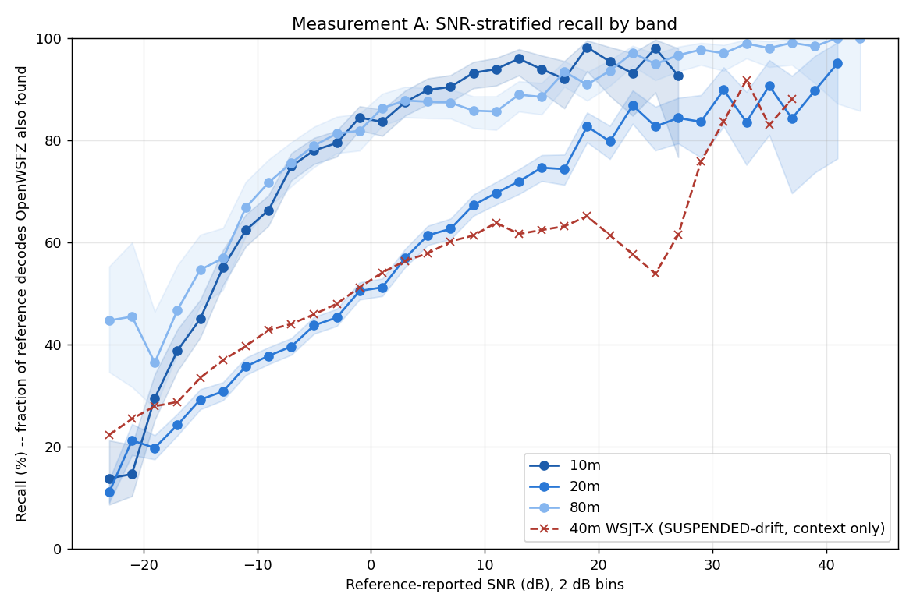

# Measurement A -- SNR-stratified recall (D-001 ruling S5)

Generated by `measurement_a_snr_recall.py`. Bin width 2 dB. 95% Wilson intervals.

**Self-check: all four corpora reproduce the published ANOVA matched counts exactly** (20m=24201, 10m=9177, 80m=8290, 40m=52736).

## Per-bin recall

| band | ref decodes/cycle | SNR bin (dB) | ref decodes | matched | recall | 95% CI |
|---|---:|---:|---:|---:|---:|---|
| 10m | 8.52 | [-24, -22) | 116 | 16 | 13.8% | [8.7%, 21.2%] |
| 10m | 8.52 | [-22, -20) | 191 | 28 | 14.7% | [10.3%, 20.4%] |
| 10m | 8.52 | [-20, -18) | 400 | 118 | 29.5% | [25.2%, 34.1%] |
| 10m | 8.52 | [-18, -16) | 541 | 210 | 38.8% | [34.8%, 43.0%] |
| 10m | 8.52 | [-16, -14) | 695 | 313 | 45.0% | [41.4%, 48.8%] |
| 10m | 8.52 | [-14, -12) | 799 | 440 | 55.1% | [51.6%, 58.5%] |
| 10m | 8.52 | [-12, -10) | 927 | 578 | 62.4% | [59.2%, 65.4%] |
| 10m | 8.52 | [-10, -8) | 961 | 637 | 66.3% | [63.2%, 69.2%] |
| 10m | 8.52 | [-8, -6) | 1018 | 762 | 74.9% | [72.1%, 77.4%] |
| 10m | 8.52 | [-6, -4) | 1008 | 786 | 78.0% | [75.3%, 80.4%] |
| 10m | 8.52 | [-4, -2) | 962 | 764 | 79.4% | [76.7%, 81.9%] |
| 10m | 8.52 | [-2, 0) | 917 | 774 | 84.4% | [81.9%, 86.6%] |
| 10m | 8.52 | [0, 2) | 802 | 670 | 83.5% | [80.8%, 85.9%] |
| 10m | 8.52 | [2, 4) | 707 | 618 | 87.4% | [84.8%, 89.7%] |
| 10m | 8.52 | [4, 6) | 550 | 494 | 89.8% | [87.0%, 92.1%] |
| 10m | 8.52 | [6, 8) | 490 | 443 | 90.4% | [87.5%, 92.7%] |
| 10m | 8.52 | [8, 10) | 379 | 353 | 93.1% | [90.1%, 95.3%] |
| 10m | 8.52 | [10, 12) | 311 | 292 | 93.9% | [90.7%, 96.1%] |
| 10m | 8.52 | [12, 14) | 245 | 235 | 95.9% | [92.7%, 97.8%] |
| 10m | 8.52 | [14, 16) | 179 | 168 | 93.9% | [89.3%, 96.5%] |
| 10m | 8.52 | [16, 18) | 137 | 126 | 92.0% | [86.2%, 95.5%] |
| 10m | 8.52 | [18, 20) | 108 | 106 | 98.1% | [93.5%, 99.5%] |
| 10m | 8.52 | [20, 22) | 86 | 82 | 95.3% | [88.6%, 98.2%] |
| 10m | 8.52 | [22, 24) | 72 | 67 | 93.1% | [84.8%, 97.0%] |
| 10m | 8.52 | [24, 26) | 49 | 48 | 98.0% | [89.3%, 99.6%] |
| 10m | 8.52 | [26, 28) | 27 | 25 | 92.6% | [76.6%, 97.9%] |
| 10m | 8.52 | [28, 30) | 7 | 7 | 100.0% | [64.6%, 100.0%] |
| 10m | 8.52 | [30, 32) | 5 | 5 | 100.0% | [56.6%, 100.0%] |
| 10m | 8.52 | [32, 34) | 4 | 4 | 100.0% | [51.0%, 100.0%] |
| 10m | 8.52 | [34, 36) | 2 | 2 | 100.0% | [34.2%, 100.0%] |
| 10m | 8.52 | [36, 38) | 4 | 4 | 100.0% | [51.0%, 100.0%] |
| 10m | 8.52 | [38, 40) | 2 | 2 | 100.0% | [34.2%, 100.0%] |
| 20m | 36.36 | [-24, -22) | 792 | 88 | 11.1% | [9.1%, 13.5%] |
| 20m | 36.36 | [-22, -20) | 692 | 147 | 21.2% | [18.4%, 24.4%] |
| 20m | 36.36 | [-20, -18) | 1092 | 216 | 19.8% | [17.5%, 22.2%] |
| 20m | 36.36 | [-18, -16) | 1570 | 381 | 24.3% | [22.2%, 26.4%] |
| 20m | 36.36 | [-16, -14) | 2032 | 594 | 29.2% | [27.3%, 31.2%] |
| 20m | 36.36 | [-14, -12) | 2628 | 810 | 30.8% | [29.1%, 32.6%] |
| 20m | 36.36 | [-12, -10) | 3040 | 1085 | 35.7% | [34.0%, 37.4%] |
| 20m | 36.36 | [-10, -8) | 3269 | 1235 | 37.8% | [36.1%, 39.5%] |
| 20m | 36.36 | [-8, -6) | 3505 | 1388 | 39.6% | [38.0%, 41.2%] |
| 20m | 36.36 | [-6, -4) | 3505 | 1533 | 43.7% | [42.1%, 45.4%] |
| 20m | 36.36 | [-4, -2) | 3398 | 1539 | 45.3% | [43.6%, 47.0%] |
| 20m | 36.36 | [-2, 0) | 3388 | 1710 | 50.5% | [48.8%, 52.2%] |
| 20m | 36.36 | [0, 2) | 3270 | 1674 | 51.2% | [49.5%, 52.9%] |
| 20m | 36.36 | [2, 4) | 2914 | 1658 | 56.9% | [55.1%, 58.7%] |
| 20m | 36.36 | [4, 6) | 2562 | 1572 | 61.4% | [59.5%, 63.2%] |
| 20m | 36.36 | [6, 8) | 2230 | 1397 | 62.6% | [60.6%, 64.6%] |
| 20m | 36.36 | [8, 10) | 1971 | 1326 | 67.3% | [65.2%, 69.3%] |
| 20m | 36.36 | [10, 12) | 1656 | 1153 | 69.6% | [67.4%, 71.8%] |
| 20m | 36.36 | [12, 14) | 1310 | 942 | 71.9% | [69.4%, 74.3%] |
| 20m | 36.36 | [14, 16) | 1134 | 846 | 74.6% | [72.0%, 77.1%] |
| 20m | 36.36 | [16, 18) | 833 | 619 | 74.3% | [71.2%, 77.2%] |
| 20m | 36.36 | [18, 20) | 652 | 539 | 82.7% | [79.6%, 85.4%] |
| 20m | 36.36 | [20, 22) | 587 | 468 | 79.7% | [76.3%, 82.8%] |
| 20m | 36.36 | [22, 24) | 416 | 361 | 86.8% | [83.2%, 89.7%] |
| 20m | 36.36 | [24, 26) | 300 | 248 | 82.7% | [78.0%, 86.5%] |
| 20m | 36.36 | [26, 28) | 255 | 215 | 84.3% | [79.3%, 88.3%] |
| 20m | 36.36 | [28, 30) | 140 | 117 | 83.6% | [76.6%, 88.8%] |
| 20m | 36.36 | [30, 32) | 108 | 97 | 89.8% | [82.7%, 94.2%] |
| 20m | 36.36 | [32, 34) | 103 | 86 | 83.5% | [75.1%, 89.4%] |
| 20m | 36.36 | [34, 36) | 64 | 58 | 90.6% | [81.0%, 95.6%] |
| 20m | 36.36 | [36, 38) | 38 | 32 | 84.2% | [69.6%, 92.6%] |
| 20m | 36.36 | [38, 40) | 29 | 26 | 89.7% | [73.6%, 96.4%] |
| 20m | 36.36 | [40, 42) | 20 | 19 | 95.0% | [76.4%, 99.1%] |
| 20m | 36.36 | [42, 44) | 12 | 11 | 91.7% | [64.6%, 98.5%] |
| 20m | 36.36 | [44, 46) | 2 | 1 | 50.0% | [9.5%, 90.5%] |
| 20m | 36.36 | [46, 48) | 4 | 4 | 100.0% | [51.0%, 100.0%] |
| 20m | 36.36 | [48, 50) | 1 | 1 | 100.0% | [20.7%, 100.0%] |
| 20m | 36.36 | [50, 52) | 2 | 2 | 100.0% | [34.2%, 100.0%] |
| 20m | 36.36 | [54, 56) | 3 | 3 | 100.0% | [43.9%, 100.0%] |
| 80m | 3.38 | [-24, -22) | 85 | 38 | 44.7% | [34.6%, 55.3%] |
| 80m | 3.38 | [-22, -20) | 44 | 20 | 45.5% | [31.7%, 59.9%] |
| 80m | 3.38 | [-20, -18) | 96 | 35 | 36.5% | [27.5%, 46.4%] |
| 80m | 3.38 | [-18, -16) | 124 | 58 | 46.8% | [38.2%, 55.5%] |
| 80m | 3.38 | [-16, -14) | 194 | 106 | 54.6% | [47.6%, 61.5%] |
| 80m | 3.38 | [-14, -12) | 255 | 145 | 56.9% | [50.7%, 62.8%] |
| 80m | 3.38 | [-12, -10) | 304 | 203 | 66.8% | [61.3%, 71.8%] |
| 80m | 3.38 | [-10, -8) | 346 | 248 | 71.7% | [66.7%, 76.2%] |
| 80m | 3.38 | [-8, -6) | 380 | 287 | 75.5% | [71.0%, 79.6%] |
| 80m | 3.38 | [-6, -4) | 408 | 322 | 78.9% | [74.7%, 82.6%] |
| 80m | 3.38 | [-4, -2) | 459 | 373 | 81.3% | [77.4%, 84.6%] |
| 80m | 3.38 | [-2, 0) | 440 | 360 | 81.8% | [77.9%, 85.1%] |
| 80m | 3.38 | [0, 2) | 465 | 401 | 86.2% | [82.8%, 89.1%] |
| 80m | 3.38 | [2, 4) | 465 | 408 | 87.7% | [84.4%, 90.4%] |
| 80m | 3.38 | [4, 6) | 488 | 427 | 87.5% | [84.3%, 90.1%] |
| 80m | 3.38 | [6, 8) | 521 | 455 | 87.3% | [84.2%, 89.9%] |
| 80m | 3.38 | [8, 10) | 491 | 421 | 85.7% | [82.4%, 88.6%] |
| 80m | 3.38 | [10, 12) | 437 | 374 | 85.6% | [82.0%, 88.6%] |
| 80m | 3.38 | [12, 14) | 432 | 384 | 88.9% | [85.6%, 91.5%] |
| 80m | 3.38 | [14, 16) | 415 | 367 | 88.4% | [85.0%, 91.2%] |
| 80m | 3.38 | [16, 18) | 391 | 365 | 93.4% | [90.4%, 95.4%] |
| 80m | 3.38 | [18, 20) | 416 | 378 | 90.9% | [87.7%, 93.3%] |
| 80m | 3.38 | [20, 22) | 373 | 349 | 93.6% | [90.6%, 95.6%] |
| 80m | 3.38 | [22, 24) | 305 | 296 | 97.0% | [94.5%, 98.4%] |
| 80m | 3.38 | [24, 26) | 293 | 278 | 94.9% | [91.7%, 96.9%] |
| 80m | 3.38 | [26, 28) | 235 | 227 | 96.6% | [93.4%, 98.3%] |
| 80m | 3.38 | [28, 30) | 216 | 211 | 97.7% | [94.7%, 99.0%] |
| 80m | 3.38 | [30, 32) | 198 | 192 | 97.0% | [93.5%, 98.6%] |
| 80m | 3.38 | [32, 34) | 177 | 175 | 98.9% | [96.0%, 99.7%] |
| 80m | 3.38 | [34, 36) | 150 | 147 | 98.0% | [94.3%, 99.3%] |
| 80m | 3.38 | [36, 38) | 103 | 102 | 99.0% | [94.7%, 99.8%] |
| 80m | 3.38 | [38, 40) | 60 | 59 | 98.3% | [91.1%, 99.7%] |
| 80m | 3.38 | [40, 42) | 26 | 26 | 100.0% | [87.1%, 100.0%] |
| 80m | 3.38 | [42, 44) | 23 | 23 | 100.0% | [85.7%, 100.0%] |
| 80m | 3.38 | [44, 46) | 16 | 16 | 100.0% | [80.6%, 100.0%] |
| 80m | 3.38 | [46, 48) | 5 | 5 | 100.0% | [56.6%, 100.0%] |
| 80m | 3.38 | [48, 50) | 2 | 2 | 100.0% | [34.2%, 100.0%] |
| 80m | 3.38 | [50, 52) | 1 | 1 | 100.0% | [20.7%, 100.0%] |
| 80m | 3.38 | [52, 54) | 2 | 2 | 100.0% | [34.2%, 100.0%] |
| 80m | 3.38 | [54, 56) | 2 | 2 | 100.0% | [34.2%, 100.0%] |
| 80m | 3.38 | [58, 60) | 2 | 2 | 100.0% | [34.2%, 100.0%] |
| 40m (WSJT-X, SUSPENDED-drift, context only) | 19.81 | [-24, -22) | 3311 | 739 | 22.3% | [20.9%, 23.8%] |
| 40m (WSJT-X, SUSPENDED-drift, context only) | 19.81 | [-22, -20) | 2008 | 511 | 25.4% | [23.6%, 27.4%] |
| 40m (WSJT-X, SUSPENDED-drift, context only) | 19.81 | [-20, -18) | 2861 | 799 | 27.9% | [26.3%, 29.6%] |
| 40m (WSJT-X, SUSPENDED-drift, context only) | 19.81 | [-18, -16) | 3848 | 1107 | 28.8% | [27.4%, 30.2%] |
| 40m (WSJT-X, SUSPENDED-drift, context only) | 19.81 | [-16, -14) | 4864 | 1628 | 33.5% | [32.2%, 34.8%] |
| 40m (WSJT-X, SUSPENDED-drift, context only) | 19.81 | [-14, -12) | 5678 | 2098 | 36.9% | [35.7%, 38.2%] |
| 40m (WSJT-X, SUSPENDED-drift, context only) | 19.81 | [-12, -10) | 6427 | 2550 | 39.7% | [38.5%, 40.9%] |
| 40m (WSJT-X, SUSPENDED-drift, context only) | 19.81 | [-10, -8) | 7170 | 3072 | 42.8% | [41.7%, 44.0%] |
| 40m (WSJT-X, SUSPENDED-drift, context only) | 19.81 | [-8, -6) | 7452 | 3280 | 44.0% | [42.9%, 45.1%] |
| 40m (WSJT-X, SUSPENDED-drift, context only) | 19.81 | [-6, -4) | 7825 | 3592 | 45.9% | [44.8%, 47.0%] |
| 40m (WSJT-X, SUSPENDED-drift, context only) | 19.81 | [-4, -2) | 7988 | 3832 | 48.0% | [46.9%, 49.1%] |
| 40m (WSJT-X, SUSPENDED-drift, context only) | 19.81 | [-2, 0) | 7951 | 4070 | 51.2% | [50.1%, 52.3%] |
| 40m (WSJT-X, SUSPENDED-drift, context only) | 19.81 | [0, 2) | 7234 | 3911 | 54.1% | [52.9%, 55.2%] |
| 40m (WSJT-X, SUSPENDED-drift, context only) | 19.81 | [2, 4) | 6666 | 3758 | 56.4% | [55.2%, 57.6%] |
| 40m (WSJT-X, SUSPENDED-drift, context only) | 19.81 | [4, 6) | 5846 | 3380 | 57.8% | [56.5%, 59.1%] |
| 40m (WSJT-X, SUSPENDED-drift, context only) | 19.81 | [6, 8) | 5144 | 3096 | 60.2% | [58.8%, 61.5%] |
| 40m (WSJT-X, SUSPENDED-drift, context only) | 19.81 | [8, 10) | 4200 | 2576 | 61.3% | [59.9%, 62.8%] |
| 40m (WSJT-X, SUSPENDED-drift, context only) | 19.81 | [10, 12) | 3382 | 2158 | 63.8% | [62.2%, 65.4%] |
| 40m (WSJT-X, SUSPENDED-drift, context only) | 19.81 | [12, 14) | 2562 | 1579 | 61.6% | [59.7%, 63.5%] |
| 40m (WSJT-X, SUSPENDED-drift, context only) | 19.81 | [14, 16) | 2008 | 1253 | 62.4% | [60.3%, 64.5%] |
| 40m (WSJT-X, SUSPENDED-drift, context only) | 19.81 | [16, 18) | 1614 | 1019 | 63.1% | [60.8%, 65.5%] |
| 40m (WSJT-X, SUSPENDED-drift, context only) | 19.81 | [18, 20) | 1186 | 772 | 65.1% | [62.3%, 67.8%] |
| 40m (WSJT-X, SUSPENDED-drift, context only) | 19.81 | [20, 22) | 865 | 531 | 61.4% | [58.1%, 64.6%] |
| 40m (WSJT-X, SUSPENDED-drift, context only) | 19.81 | [22, 24) | 633 | 365 | 57.7% | [53.8%, 61.5%] |
| 40m (WSJT-X, SUSPENDED-drift, context only) | 19.81 | [24, 26) | 442 | 238 | 53.8% | [49.2%, 58.4%] |
| 40m (WSJT-X, SUSPENDED-drift, context only) | 19.81 | [26, 28) | 288 | 177 | 61.5% | [55.7%, 66.9%] |
| 40m (WSJT-X, SUSPENDED-drift, context only) | 19.81 | [28, 30) | 264 | 200 | 75.8% | [70.2%, 80.5%] |
| 40m (WSJT-X, SUSPENDED-drift, context only) | 19.81 | [30, 32) | 245 | 205 | 83.7% | [78.5%, 87.8%] |
| 40m (WSJT-X, SUSPENDED-drift, context only) | 19.81 | [32, 34) | 157 | 144 | 91.7% | [86.3%, 95.1%] |
| 40m (WSJT-X, SUSPENDED-drift, context only) | 19.81 | [34, 36) | 82 | 68 | 82.9% | [73.4%, 89.5%] |
| 40m (WSJT-X, SUSPENDED-drift, context only) | 19.81 | [36, 38) | 25 | 22 | 88.0% | [70.0%, 95.8%] |
| 40m (WSJT-X, SUSPENDED-drift, context only) | 19.81 | [38, 40) | 6 | 6 | 100.0% | [61.0%, 100.0%] |

## Common-SNR-support comparison (10m/20m/80m only, n>=20/bin/band)

| SNR bin (dB) | 10m recall | 20m recall | 80m recall | max separation (pts) |
|---:|---:|---:|---:|---:|
| [-24, -22) | 13.8% | 11.1% | 44.7% | 33.6 |
| [-22, -20) | 14.7% | 21.2% | 45.5% | 30.8 |
| [-20, -18) | 29.5% | 19.8% | 36.5% | 16.7 |
| [-18, -16) | 38.8% | 24.3% | 46.8% | 22.5 |
| [-16, -14) | 45.0% | 29.2% | 54.6% | 25.4 |
| [-14, -12) | 55.1% | 30.8% | 56.9% | 26.0 |
| [-12, -10) | 62.4% | 35.7% | 66.8% | 31.1 |
| [-10, -8) | 66.3% | 37.8% | 71.7% | 33.9 |
| [-8, -6) | 74.9% | 39.6% | 75.5% | 35.9 |
| [-6, -4) | 78.0% | 43.7% | 78.9% | 35.2 |
| [-4, -2) | 79.4% | 45.3% | 81.3% | 36.0 |
| [-2, 0) | 84.4% | 50.5% | 81.8% | 33.9 |
| [0, 2) | 83.5% | 51.2% | 86.2% | 35.0 |
| [2, 4) | 87.4% | 56.9% | 87.7% | 30.8 |
| [4, 6) | 89.8% | 61.4% | 87.5% | 28.5 |
| [6, 8) | 90.4% | 62.6% | 87.3% | 27.8 |
| [8, 10) | 93.1% | 67.3% | 85.7% | 25.9 |
| [10, 12) | 93.9% | 69.6% | 85.6% | 24.3 |
| [12, 14) | 95.9% | 71.9% | 88.9% | 24.0 |
| [14, 16) | 93.9% | 74.6% | 88.4% | 19.3 |
| [16, 18) | 92.0% | 74.3% | 93.4% | 19.0 |
| [18, 20) | 98.1% | 82.7% | 90.9% | 15.5 |
| [20, 22) | 95.3% | 79.7% | 93.6% | 15.6 |
| [22, 24) | 93.1% | 86.8% | 97.0% | 10.3 |
| [24, 26) | 98.0% | 82.7% | 94.9% | 15.3 |
| [26, 28) | 92.6% | 84.3% | 96.6% | 12.3 |

**Max separation across common-support bins: 36.0 points.** 80m-recall >= 20m-recall in 26/26 usable bins (100%).

## Pre-registered reading rule (S5.3, quoted verbatim)

| outcome | reading | consequence |
|---|---|---|
| **Curves overlay** (band separation < 5 pts across the common region) | Density is a *marginal artefact* of differing SNR mixes. Recall is a function of SNR alone. | **Pure sensitivity. The co-channel withdrawal STANDS.** |
| **Dense bands sit materially below sparse at matched SNR** (>= 10 pts, monotone in density) | Competition, not sensitivity. | **The co-channel withdrawal REVERSES.** Escalate to the Captain before any further work. |
| **Separation 5-10 pts, or non-monotone in density** | Partial/ambiguous. | Report as ambiguous. **Do not interpret further.** |
| **Curves cross** (sparse below dense at some SNRs) | Not anticipated by any current model. | Escalation. Do not rationalise. |

**Mechanical outcome per the table above: DENSE BELOW SPARSE (>=10 pts, monotone) -> Co-channel withdrawal REVERSES. ESCALATE.**

## 40m (live-WSJT-X, SUSPENDED-drift) series -- context only, NOT part of the decisive reading

Per S3.2/S5.2, this corpus sits on the drifting device and averages a healthy ~13h with a collapsed ~12h (see the capture-clock-drift defect report). Its recall curve is reported below for completeness only and must not be pooled with, or compared point-for-point against, the three jt9-referenced bands.

| SNR bin (dB) | ref decodes | matched | recall |
|---:|---:|---:|---:|
| [-24, -22) | 3311 | 739 | 22.3% |
| [-22, -20) | 2008 | 511 | 25.4% |
| [-20, -18) | 2861 | 799 | 27.9% |
| [-18, -16) | 3848 | 1107 | 28.8% |
| [-16, -14) | 4864 | 1628 | 33.5% |
| [-14, -12) | 5678 | 2098 | 36.9% |
| [-12, -10) | 6427 | 2550 | 39.7% |
| [-10, -8) | 7170 | 3072 | 42.8% |
| [-8, -6) | 7452 | 3280 | 44.0% |
| [-6, -4) | 7825 | 3592 | 45.9% |
| [-4, -2) | 7988 | 3832 | 48.0% |
| [-2, 0) | 7951 | 4070 | 51.2% |
| [0, 2) | 7234 | 3911 | 54.1% |
| [2, 4) | 6666 | 3758 | 56.4% |
| [4, 6) | 5846 | 3380 | 57.8% |
| [6, 8) | 5144 | 3096 | 60.2% |
| [8, 10) | 4200 | 2576 | 61.3% |
| [10, 12) | 3382 | 2158 | 63.8% |
| [12, 14) | 2562 | 1579 | 61.6% |
| [14, 16) | 2008 | 1253 | 62.4% |
| [16, 18) | 1614 | 1019 | 63.1% |
| [18, 20) | 1186 | 772 | 65.1% |
| [20, 22) | 865 | 531 | 61.4% |
| [22, 24) | 633 | 365 | 57.7% |
| [24, 26) | 442 | 238 | 53.8% |
| [26, 28) | 288 | 177 | 61.5% |
| [28, 30) | 264 | 200 | 75.8% |
| [30, 32) | 245 | 205 | 83.7% |
| [32, 34) | 157 | 144 | 91.7% |
| [34, 36) | 82 | 68 | 82.9% |
| [36, 38) | 25 | 22 | 88.0% |
| [38, 40) | 6 | 6 | 100.0% |
