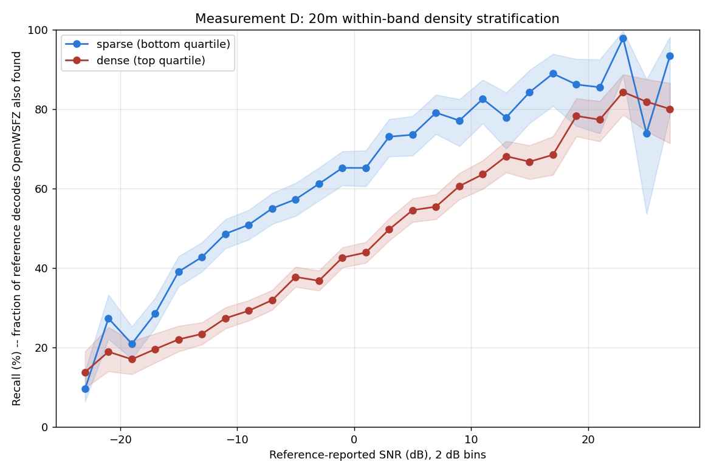

# Measurement D -- within-band density stratification (D-001)

> **ERRATA (2026-07-31 15:50 UTC), per Architect ruling
> `2026-07-31-1530-architect-ruling-measurement-d-corpus-is-two-sessions.md`:**
> **This report's premise that band, antenna, receiver and session were held constant is
> FALSE.** The 20m corpus below is **two sessions 18h28m apart**
> (2026-07-29 18:31:30-21:14:30, then 2026-07-30 15:42:15-18:40:00), and the sparse/dense
> strata read below are substantially a segment split (sparse 90.1% segment 1, dense 65.4%
> segment 2). **The headline 18.21-point matched figure below is SUSPENDED, not refuted.**
> The density/competition effect itself is UPHELD -- it reproduces independently within each
> segment, more strongly in segment 1 alone (median +22.33 pts, ROW 1 fires) -- see
> `measurement_d_segment_rerun_report.md` for the per-segment re-run and quote that, not the
> pooled figure below, going forward. Self-checks 1-4 below are unaffected (they are blind to
> temporal structure, which is exactly the gap the ruling's new self-check 5 closes). Nothing
> below this notice has been altered; it is preserved as the original pooled run.

Spec: `2026-07-31-0853-architect-to-qa-measurement-d-spec-within-band-density.md`. Reading taken on **20m** only; 10m/80m are free replication, reported not decisive.

## Self-check 1 -- matching gate: PASS

All three bands reproduce the published ANOVA matched counts exactly (20m=24201, 10m=9177, 80m=8290).

## Self-check 2 -- density contrast achieved

| band | sparse mean ref decodes/cycle | dense mean ref decodes/cycle | contrast (dense/sparse) |
|---|---:|---:|---:|
| 20m | 23.15 | 50.97 | 2.20x |
| 10m | 5.17 | 11.78 | 2.28x |
| 80m | 2.21 | 8.83 | 4.01x |

## Self-check 3 -- duplicate-key artefact

| band | sparse dup-key rate | dense dup-key rate | gap (pts) | median diff (pts) | confounded? |
|---|---:|---:|---:|---:|---|
| 20m | 0.00% | 0.24% | 0.24 | 18.21 | no |
| 10m | 0.00% | 0.00% | 0.00 | 7.81 | no |
| 80m | 0.00% | 0.00% | 0.00 | 3.63 | no |

## Self-check 4 -- common support (usable bins, n>=20 both strata)

| band | usable bins |
|---|---:|
| 20m | 26 |
| 10m | 20 |
| 80m | 26 |

**All four self-checks pass.**

## 20m per-bin recall  (DECISIVE)

Sparse stratum cutoff: density <= 30.0 ref decodes/cycle. Dense stratum cutoff: density >= 43.0 ref decodes/cycle.

| SNR bin (dB) | sparse n | sparse matched | sparse recall | sparse 95% CI | dense n | dense matched | dense recall | dense 95% CI | diff (pts) |
|---:|---:|---:|---:|---|---:|---:|---:|---|---:|
| [-24, -22) | 229 | 22 | 9.6% | [6.4%,14.1%] | 217 | 30 | 13.8% | [9.9%,19.0%] | -4.2 |
| [-22, -20) | 245 | 67 | 27.3% | [22.1%,33.2%] | 190 | 36 | 18.9% | [14.0%,25.1%] | +8.4 |
| [-20, -18) | 382 | 80 | 20.9% | [17.2%,25.3%] | 311 | 53 | 17.0% | [13.3%,21.6%] | +3.9 |
| [-18, -16) | 546 | 156 | 28.6% | [24.9%,32.5%] | 449 | 88 | 19.6% | [16.2%,23.5%] | +9.0 |
| [-16, -14) | 637 | 249 | 39.1% | [35.4%,42.9%] | 635 | 140 | 22.0% | [19.0%,25.4%] | +17.0 |
| [-14, -12) | 690 | 295 | 42.8% | [39.1%,46.5%] | 896 | 210 | 23.4% | [20.8%,26.3%] | +19.3 |
| [-12, -10) | 712 | 346 | 48.6% | [44.9%,52.3%] | 1082 | 296 | 27.4% | [24.8%,30.1%] | +21.2 |
| [-10, -8) | 684 | 348 | 50.9% | [47.1%,54.6%] | 1203 | 352 | 29.3% | [26.8%,31.9%] | +21.6 |
| [-8, -6) | 622 | 342 | 55.0% | [51.1%,58.9%] | 1353 | 432 | 31.9% | [29.5%,34.5%] | +23.1 |
| [-6, -4) | 543 | 311 | 57.3% | [53.1%,61.4%] | 1409 | 532 | 37.8% | [35.3%,40.3%] | +19.5 |
| [-4, -2) | 528 | 323 | 61.2% | [57.0%,65.2%] | 1408 | 518 | 36.8% | [34.3%,39.3%] | +24.4 |
| [-2, 0) | 471 | 307 | 65.2% | [60.8%,69.3%] | 1478 | 630 | 42.6% | [40.1%,45.2%] | +22.6 |
| [0, 2) | 425 | 277 | 65.2% | [60.5%,69.6%] | 1367 | 600 | 43.9% | [41.3%,46.5%] | +21.3 |
| [2, 4) | 341 | 249 | 73.0% | [68.1%,77.5%] | 1217 | 605 | 49.7% | [46.9%,52.5%] | +23.3 |
| [4, 6) | 302 | 222 | 73.5% | [68.3%,78.2%] | 1078 | 588 | 54.5% | [51.6%,57.5%] | +19.0 |
| [6, 8) | 258 | 204 | 79.1% | [73.7%,83.6%] | 978 | 542 | 55.4% | [52.3%,58.5%] | +23.7 |
| [8, 10) | 192 | 148 | 77.1% | [70.6%,82.5%] | 835 | 506 | 60.6% | [57.2%,63.9%] | +16.5 |
| [10, 12) | 183 | 151 | 82.5% | [76.4%,87.3%] | 686 | 436 | 63.6% | [59.9%,67.1%] | +19.0 |
| [12, 14) | 131 | 102 | 77.9% | [70.0%,84.1%] | 533 | 363 | 68.1% | [64.0%,71.9%] | +9.8 |
| [14, 16) | 114 | 96 | 84.2% | [76.4%,89.8%] | 466 | 311 | 66.7% | [62.3%,70.9%] | +17.5 |
| [16, 18) | 90 | 80 | 88.9% | [80.7%,93.9%] | 352 | 241 | 68.5% | [63.4%,73.1%] | +20.4 |
| [18, 20) | 65 | 56 | 86.2% | [75.7%,92.5%] | 285 | 223 | 78.2% | [73.1%,82.6%] | +7.9 |
| [20, 22) | 55 | 47 | 85.5% | [73.8%,92.4%] | 260 | 201 | 77.3% | [71.8%,82.0%] | +8.1 |
| [22, 24) | 45 | 44 | 97.8% | [88.4%,99.6%] | 197 | 166 | 84.3% | [78.5%,88.7%] | +13.5 |
| [24, 26) | 23 | 17 | 73.9% | [53.5%,87.5%] | 132 | 108 | 81.8% | [74.4%,87.5%] | -7.9 |
| [26, 28) | 30 | 28 | 93.3% | [78.7%,98.2%] | 105 | 84 | 80.0% | [71.4%,86.5%] | +13.3 |

**Median diff: +18.21 pts. 22/26 bins (85%) have diff >= 8 pts.**

## 10m per-bin recall

Sparse stratum cutoff: density <= 6.0 ref decodes/cycle. Dense stratum cutoff: density >= 10.0 ref decodes/cycle.

| SNR bin (dB) | sparse n | sparse matched | sparse recall | sparse 95% CI | dense n | dense matched | dense recall | dense 95% CI | diff (pts) |
|---:|---:|---:|---:|---|---:|---:|---:|---|---:|
| [-24, -22) | 20 | 4 | 20.0% | [8.1%,41.6%] | 48 | 4 | 8.3% | [3.3%,19.6%] | +11.7 |
| [-22, -20) | 51 | 9 | 17.6% | [9.6%,30.3%] | 63 | 12 | 19.0% | [11.2%,30.4%] | -1.4 |
| [-20, -18) | 71 | 25 | 35.2% | [25.1%,46.8%] | 155 | 40 | 25.8% | [19.6%,33.2%] | +9.4 |
| [-18, -16) | 101 | 44 | 43.6% | [34.3%,53.3%] | 208 | 75 | 36.1% | [29.8%,42.8%] | +7.5 |
| [-16, -14) | 145 | 72 | 49.7% | [41.6%,57.7%] | 284 | 118 | 41.5% | [36.0%,47.4%] | +8.1 |
| [-14, -12) | 125 | 81 | 64.8% | [56.1%,72.6%] | 361 | 170 | 47.1% | [42.0%,52.2%] | +17.7 |
| [-12, -10) | 137 | 103 | 75.2% | [67.3%,81.7%] | 407 | 228 | 56.0% | [51.2%,60.8%] | +19.2 |
| [-10, -8) | 157 | 121 | 77.1% | [69.9%,83.0%] | 439 | 264 | 60.1% | [55.5%,64.6%] | +16.9 |
| [-8, -6) | 153 | 130 | 85.0% | [78.5%,89.8%] | 456 | 311 | 68.2% | [63.8%,72.3%] | +16.8 |
| [-6, -4) | 141 | 121 | 85.8% | [79.1%,90.6%] | 480 | 358 | 74.6% | [70.5%,78.3%] | +11.2 |
| [-4, -2) | 157 | 139 | 88.5% | [82.6%,92.6%] | 442 | 330 | 74.7% | [70.4%,78.5%] | +13.9 |
| [-2, 0) | 150 | 132 | 88.0% | [81.8%,92.3%] | 407 | 340 | 83.5% | [79.6%,86.8%] | +4.5 |
| [0, 2) | 137 | 121 | 88.3% | [81.9%,92.7%] | 357 | 284 | 79.6% | [75.1%,83.4%] | +8.8 |
| [2, 4) | 116 | 104 | 89.7% | [82.8%,94.0%] | 323 | 273 | 84.5% | [80.2%,88.1%] | +5.1 |
| [4, 6) | 82 | 77 | 93.9% | [86.5%,97.4%] | 260 | 227 | 87.3% | [82.7%,90.8%] | +6.6 |
| [6, 8) | 66 | 63 | 95.5% | [87.5%,98.4%] | 237 | 212 | 89.5% | [84.9%,92.8%] | +6.0 |
| [8, 10) | 47 | 45 | 95.7% | [85.8%,98.8%] | 188 | 173 | 92.0% | [87.3%,95.1%] | +3.7 |
| [10, 12) | 34 | 33 | 97.1% | [85.1%,99.5%] | 165 | 156 | 94.5% | [90.0%,97.1%] | +2.5 |
| [12, 14) | 24 | 23 | 95.8% | [79.8%,99.3%] | 131 | 124 | 94.7% | [89.4%,97.4%] | +1.2 |
| [14, 16) | 26 | 24 | 92.3% | [75.9%,97.9%] | 102 | 95 | 93.1% | [86.5%,96.6%] | -0.8 |

**Median diff: +7.81 pts. 10/20 bins (50%) have diff >= 8 pts.**

## 80m per-bin recall

Sparse stratum cutoff: density <= 3.0 ref decodes/cycle. Dense stratum cutoff: density >= 7.0 ref decodes/cycle.

| SNR bin (dB) | sparse n | sparse matched | sparse recall | sparse 95% CI | dense n | dense matched | dense recall | dense 95% CI | diff (pts) |
|---:|---:|---:|---:|---|---:|---:|---:|---|---:|
| [-16, -14) | 25 | 14 | 56.0% | [37.1%,73.3%] | 92 | 52 | 56.5% | [46.3%,66.2%] | -0.5 |
| [-14, -12) | 36 | 15 | 41.7% | [27.1%,57.8%] | 129 | 76 | 58.9% | [50.3%,67.0%] | -17.2 |
| [-12, -10) | 29 | 19 | 65.5% | [47.3%,80.1%] | 152 | 98 | 64.5% | [56.6%,71.6%] | +1.0 |
| [-10, -8) | 41 | 32 | 78.0% | [63.3%,88.0%] | 179 | 127 | 70.9% | [63.9%,77.1%] | +7.1 |
| [-8, -6) | 41 | 34 | 82.9% | [68.7%,91.5%] | 186 | 132 | 71.0% | [64.1%,77.0%] | +12.0 |
| [-6, -4) | 43 | 39 | 90.7% | [78.4%,96.3%] | 212 | 155 | 73.1% | [66.8%,78.6%] | +17.6 |
| [-4, -2) | 47 | 39 | 83.0% | [69.9%,91.1%] | 245 | 189 | 77.1% | [71.5%,82.0%] | +5.8 |
| [-2, 0) | 48 | 41 | 85.4% | [72.8%,92.8%] | 232 | 174 | 75.0% | [69.1%,80.1%] | +10.4 |
| [0, 2) | 52 | 48 | 92.3% | [81.8%,97.0%] | 242 | 200 | 82.6% | [77.4%,86.9%] | +9.7 |
| [2, 4) | 57 | 54 | 94.7% | [85.6%,98.2%] | 231 | 203 | 87.9% | [83.0%,91.5%] | +6.9 |
| [4, 6) | 54 | 52 | 96.3% | [87.5%,99.0%] | 266 | 227 | 85.3% | [80.6%,89.1%] | +11.0 |
| [6, 8) | 49 | 49 | 100.0% | [92.7%,100.0%] | 266 | 222 | 83.5% | [78.5%,87.4%] | +16.5 |
| [8, 10) | 53 | 49 | 92.5% | [82.1%,97.0%] | 253 | 213 | 84.2% | [79.2%,88.2%] | +8.3 |
| [10, 12) | 53 | 44 | 83.0% | [70.8%,90.8%] | 216 | 185 | 85.6% | [80.3%,89.7%] | -2.6 |
| [12, 14) | 55 | 45 | 81.8% | [69.7%,89.8%] | 205 | 183 | 89.3% | [84.3%,92.8%] | -7.5 |
| [14, 16) | 40 | 32 | 80.0% | [65.2%,89.5%] | 217 | 185 | 85.3% | [79.9%,89.4%] | -5.3 |
| [16, 18) | 61 | 59 | 96.7% | [88.8%,99.1%] | 178 | 160 | 89.9% | [84.6%,93.5%] | +6.8 |
| [18, 20) | 67 | 59 | 88.1% | [78.2%,93.8%] | 175 | 157 | 89.7% | [84.3%,93.4%] | -1.7 |
| [20, 22) | 85 | 80 | 94.1% | [87.0%,97.5%] | 139 | 128 | 92.1% | [86.4%,95.5%] | +2.0 |
| [22, 24) | 69 | 68 | 98.6% | [92.2%,99.7%] | 112 | 109 | 97.3% | [92.4%,99.1%] | +1.2 |
| [24, 26) | 73 | 72 | 98.6% | [92.6%,99.8%] | 104 | 100 | 96.2% | [90.5%,98.5%] | +2.5 |
| [26, 28) | 39 | 39 | 100.0% | [91.0%,100.0%] | 85 | 81 | 95.3% | [88.5%,98.2%] | +4.7 |
| [28, 30) | 35 | 35 | 100.0% | [90.1%,100.0%] | 78 | 76 | 97.4% | [91.1%,99.3%] | +2.6 |
| [30, 32) | 31 | 30 | 96.8% | [83.8%,99.4%] | 76 | 72 | 94.7% | [87.2%,97.9%] | +2.0 |
| [32, 34) | 30 | 30 | 100.0% | [88.6%,100.0%] | 76 | 75 | 98.7% | [92.9%,99.8%] | +1.3 |
| [34, 36) | 24 | 24 | 100.0% | [86.2%,100.0%] | 61 | 58 | 95.1% | [86.5%,98.3%] | +4.9 |

**Median diff: +3.63 pts. 7/26 bins (27%) have diff >= 8 pts.**

## Reading rule (spec S4, quoted verbatim)

| # | condition | reading | consequence |
|---|---|---|---|
| 1 | median `diff` >= 8 pts AND >= 80% of usable bins have `diff >= 8` | At the same signal strength we miss more when the band is busier, with band identity held constant. | **Competition confirmed as a named, measured mechanism.** Row 4's decomposition re-scopes toward it. **Escalate to the Captain before any engineering.** |
| 2 | else if -3 < median `diff` < 3 | Density does not act within a band. | **The cross-band effect is 20m-specific and the density law is withdrawn entirely.** Row 4's target reverts to sensitivity/front-end. The 20m deficit becomes its own bounded question. |
| 3 | else if median `diff` <= -3 | Sparse recalls worse than dense. Not anticipated by any current model. | **Escalate. Do not rationalise it in the findings document.** |
| 4 | else | Partial. | **Report as ambiguous. Do not interpret.** Escalate. |

Evaluated in strict order; the first row that matches is the outcome.

**Mechanical outcome on 20m (decisive): ROW 1: median diff >= 8pts AND >= 80% of bins >= 8pts -> Competition CONFIRMED as a named, measured mechanism. ESCALATE before any engineering.**

## Descriptive extras (NOT subject to the reading rule -- inform mechanism, do not decide it)

### Effect size vs density contrast, across all three bands

| band | density contrast (dense/sparse) | median diff (pts) |
|---|---:|---:|
| 20m | 2.20x | +18.21 |
| 10m | 2.28x | +7.81 |
| 80m | 4.01x | +3.63 |

If the effect scales with the *ratio* between strata (contrast), it is a density law; if it scales with *absolute* density (appearing only where occupancy is high regardless of contrast), it is a threshold -- a different mechanism, a different engineering target. Descriptive only.

### Our decodes per cycle vs the reference's, bucketed by reference density (capacity-ceiling check)

| band | ref decodes/cycle bucket | mean ref/cycle | mean ours/cycle |
|---|---|---:|---:|
| 20m | Q1 (sparsest) | 23.15 | 14.16 |
| 20m | Q2 | 35.09 | 19.15 |
| 20m | Q3 | 40.89 | 21.67 |
| 20m | Q4 (densest) | 52.32 | 23.01 |
| 10m | Q1 (sparsest) | 5.17 | 4.33 |
| 10m | Q2 | 7.53 | 5.99 |
| 10m | Q3 | 9.47 | 7.31 |
| 10m | Q4 (densest) | 12.61 | 9.32 |
| 80m | Q1 (sparsest) | 2.21 | 2.15 |
| 80m | Q2 | 4.50 | 4.26 |
| 80m | Q3 | 6.42 | 6.00 |
| 80m | Q4 (densest) | 9.61 | 8.20 |

If our per-cycle output flattens while the reference's keeps rising across buckets, that is a capacity ceiling, visible directly in this table. Descriptive only, not part of the reading rule.

