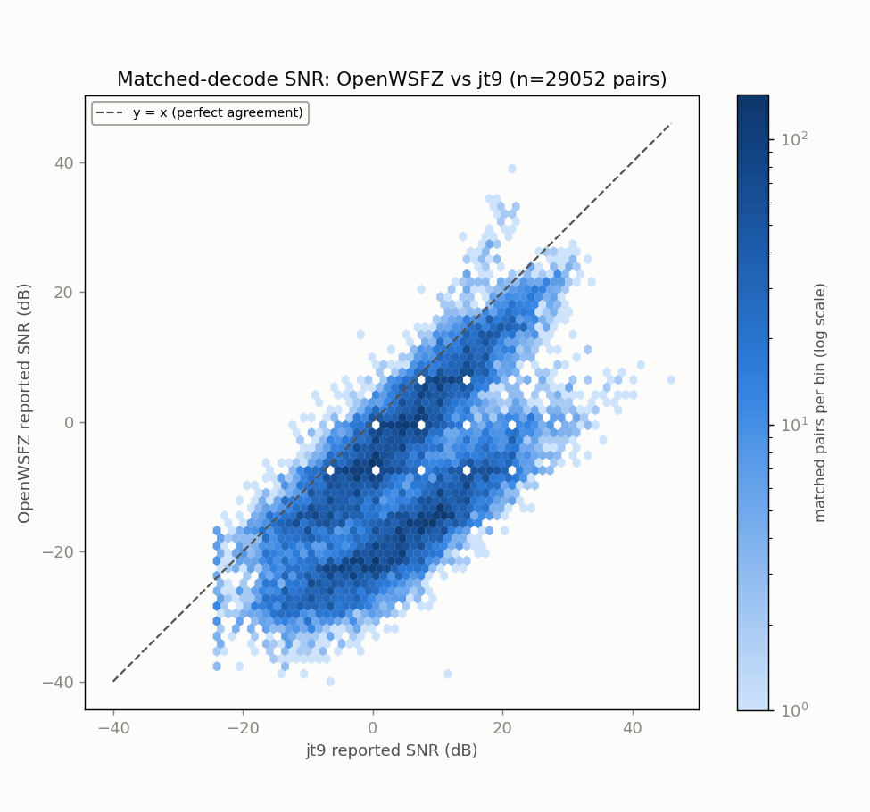
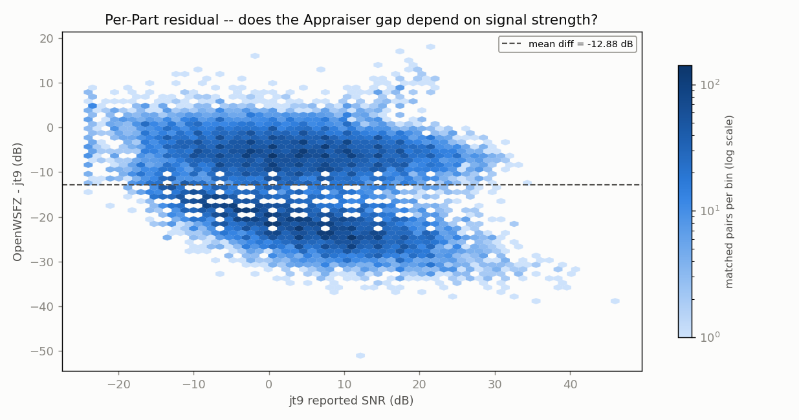

# Endurance-session ANOVA -- matched-decode SNR (OpenWSFZ vs jt9)

**Run:** 2026-07-26/27 overnight, 80m->40m mixed-band, commit f283844 (see report.md Sec 3.6 for the mixed-band caveat)  
**Generated:** 2026-07-27T23:44:23Z (`date -u`, HK-017)  
**Design:** two-way ANOVA without replication (randomized complete block design) -- Part (matched decode instance) x Appraiser (OpenWSFZ, jt9), response = reported SNR (dB). See this script's docstring for why this design applies to single-pass live data, and not the replicated design in `qa/rr-study/harness/anova_compute.py`.

- WAV cycles fed to jt9: **2760**
- Our decodes in window: **40094**
- jt9 decodes in window: **45469**
- Matched pairs (Parts, used below): **29052**

## Charts

## ANOVA table

| Source | SS | df | MS | F | P |
|---|---:|---:|---:|---:|---:|
| Part | 5737668.2076 | 29051 | 197.5033 | 4.531 | 0.0000 |
| Appraiser | 2408754.8551 | 1 | 2408754.8551 | 55265.103 | 0.0000 |
| Residual (confounded with interaction, n=1/cell) | 1266201.1449 | 29051 | 43.5855 | | |
| Total | 9412624.2076 | 58103 | | | |

## Appraiser means (matched-decode SNR, dB)

- OpenWSFZ mean: -9.056 dB
- jt9 mean: 3.821 dB
- Grand mean: -2.618 dB

## Caveat (structural, not a defect)

With one observation per Part x Appraiser cell -- a live signal happens once -- the interaction term and the residual/error term are mathematically confounded (standard property of an unreplicated factorial design). This table can say whether the two appraisers' *mean* reported SNR differs after removing part-to-part variation (the Appraiser row); it cannot separately test whether that difference itself varies signal-to-signal.

Cross-run comparison and interpretation of these numbers is Architect/Captain territory, not this script's.

