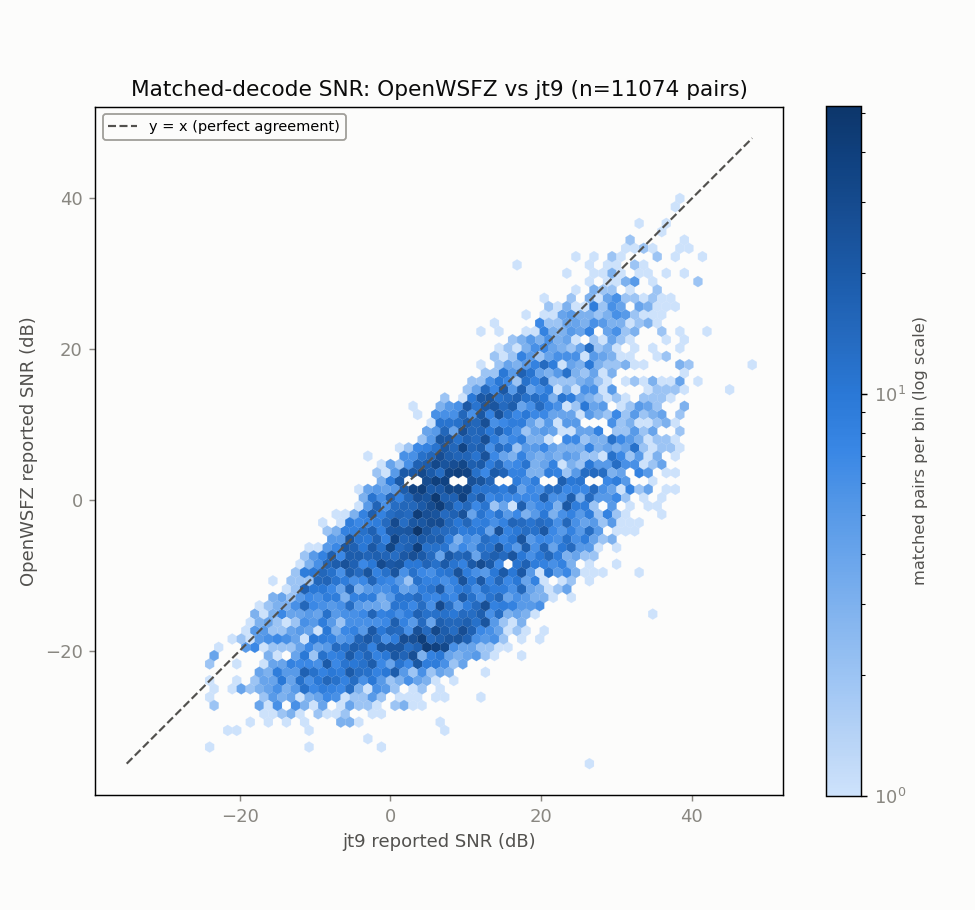
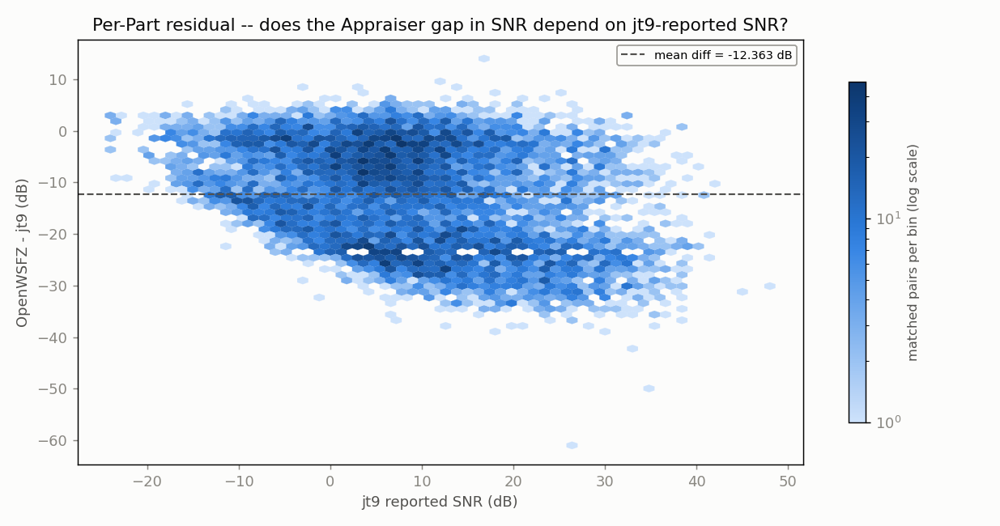
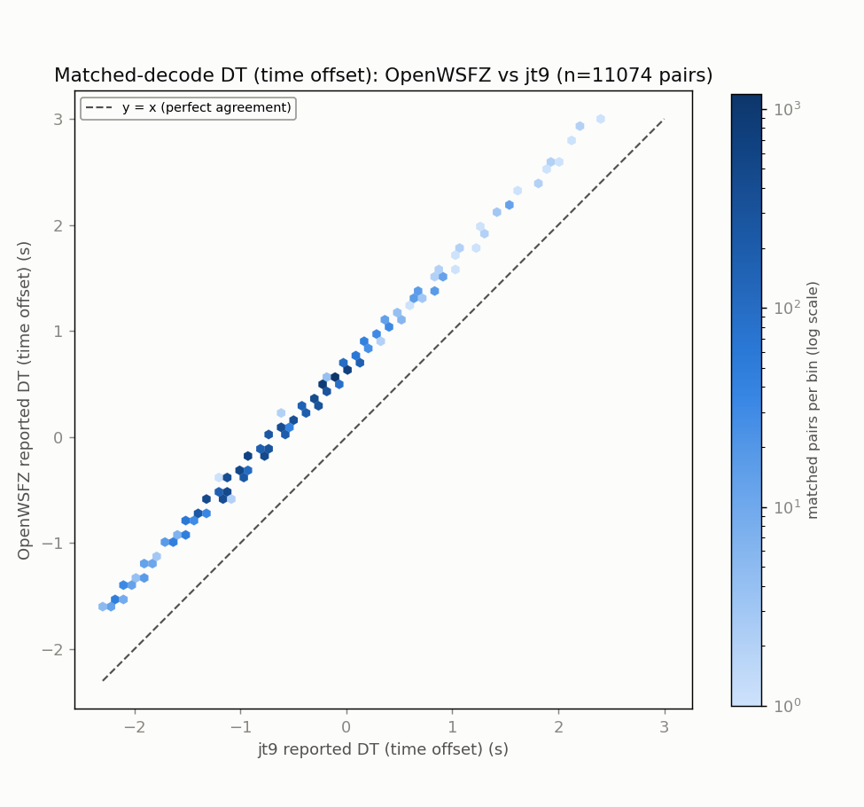
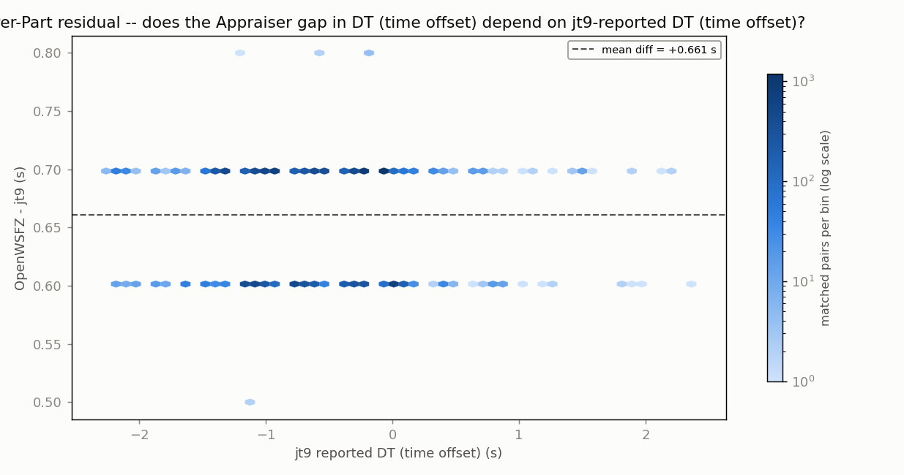
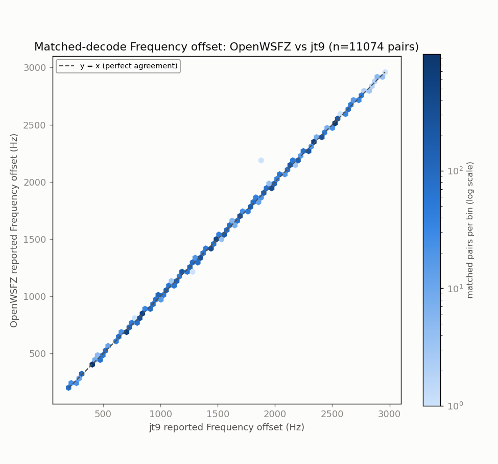
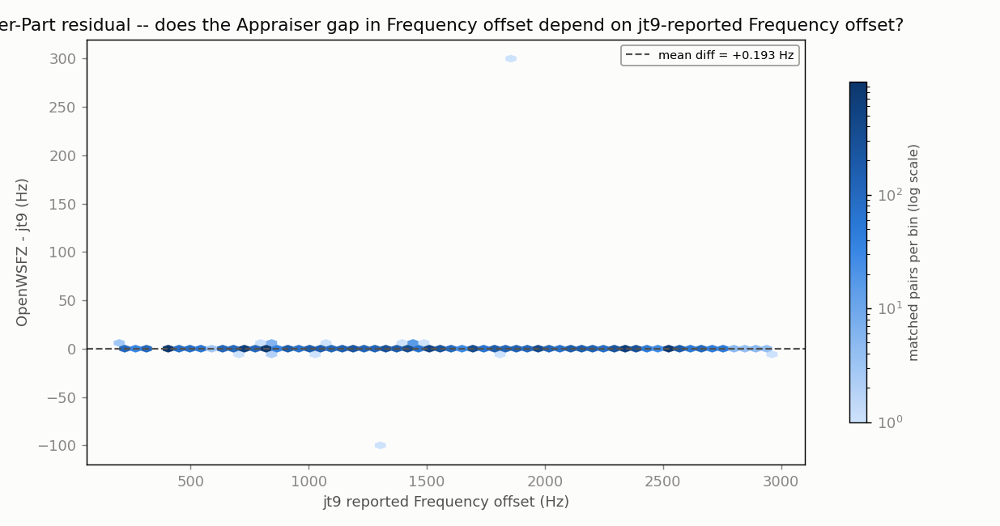

# Endurance-session ANOVA -- matched-decode metrics (OpenWSFZ vs jt9)

**Run:** 2026-07-27/28 overnight, 80m (mislabeled 10m tail from 260728_090315 onward, see artefacts/20260727_live_run_2048/contents.md), commit 8d180bd  
**Generated:** 2026-07-28T10:16:27Z (`date -u`, HK-017)  
**Design:** two-way ANOVA without replication (randomized complete block design) -- Part (matched decode instance) x Appraiser (OpenWSFZ, jt9), run separately for each paired numeric response below (SNR, DT, frequency offset) over the identical matched Parts. See this script's docstring for why this design applies to single-pass live data, and not the replicated design in `qa/rr-study/harness/anova_compute.py`.

- WAV cycles fed to jt9: **2971**
- Our decodes in window: **11704**
- jt9 decodes in window: **12852**
- Matched pairs (Parts, shared across every response below): **11074**

## Decode coverage

- OpenWSFZ decoded **11704** messages in this window; jt9 decoded **12852**.
- **11074** decodes matched between the two (same cycle + normalised message text) -- **94.6%** of OpenWSFZ's decodes, **86.2%** of jt9's decodes.
- OpenWSFZ-only (jt9 did not report it): **630** (5.4% of OpenWSFZ's total).
- jt9-only (OpenWSFZ did not report it): **1778** (13.8% of jt9's total).

## SNR (dB)

| Source | SS | df | MS | F | P |
|---|---:|---:|---:|---:|---:|
| Part | 2513643.8527 | 11073 | 227.0066 | 4.696 | 0.0000 |
| Appraiser | 846260.5664 | 1 | 846260.5664 | 17507.500 | 0.0000 |
| Residual (confounded with interaction, n=1/cell) | 535235.9336 | 11073 | 48.3370 | | |
| Total | 3895140.3527 | 22147 | | | |

Appraiser means (SNR, dB): OpenWSFZ -3.955 dB, jt9 8.408 dB, grand mean 2.226 dB.

## DT (time offset) (s)

| Source | SS | df | MS | F | P |
|---|---:|---:|---:|---:|---:|
| Part | 6017.6170 | 11073 | 0.5434 | 453.839 | 0.0000 |
| Appraiser | 2419.4206 | 1 | 2419.4206 | 2020475.929 | 0.0000 |
| Residual (confounded with interaction, n=1/cell) | 13.2594 | 11073 | 0.0012 | | |
| Total | 8450.2970 | 22147 | | | |

Appraiser means (DT (time offset), s): OpenWSFZ 0.0538 s, jt9 -0.6072 s, grand mean -0.2767 s.

## Frequency offset (Hz)

| Source | SS | df | MS | F | P |
|---|---:|---:|---:|---:|---:|
| Part | 11737769391.8830 | 11073 | 1060035.1659 | 214009.946 | 0.0000 |
| Appraiser | 207.1593 | 1 | 207.1593 | 41.823 | 0.0000 |
| Residual (confounded with interaction, n=1/cell) | 54846.8407 | 11073 | 4.9532 | | |
| Total | 11737824445.8830 | 22147 | | | |

Appraiser means (Frequency offset, Hz): OpenWSFZ 1478.8 Hz, jt9 1478.6 Hz, grand mean 1478.7 Hz.

## Caveat (structural, not a defect)

With one observation per Part x Appraiser cell -- a live signal happens once -- the interaction term and the residual/error term are mathematically confounded (standard property of an unreplicated factorial design), for every response above. Each table can say whether the two appraisers' *mean* value differs after removing part-to-part variation (the Appraiser row); none of them can separately test whether that difference itself varies signal-to-signal.

Cross-run comparison and interpretation of these numbers is Architect/Captain territory, not this script's.

