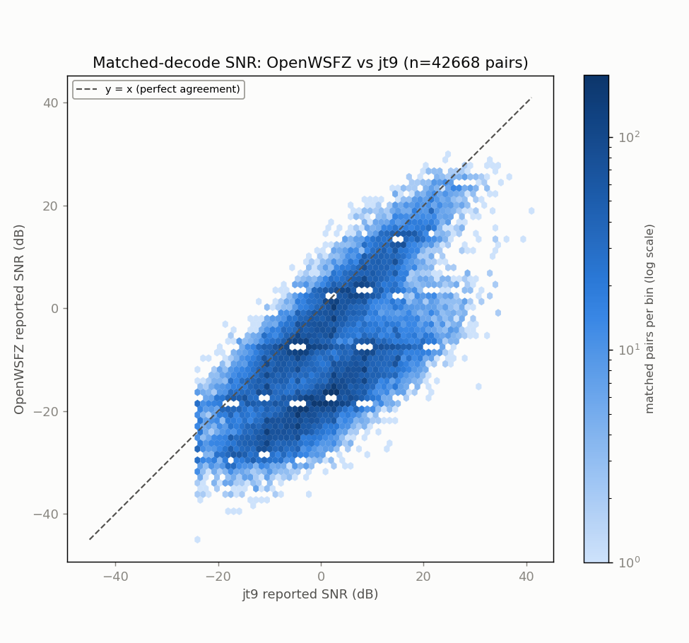
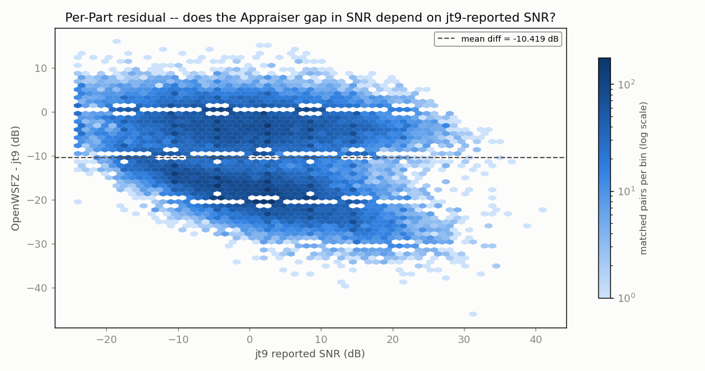
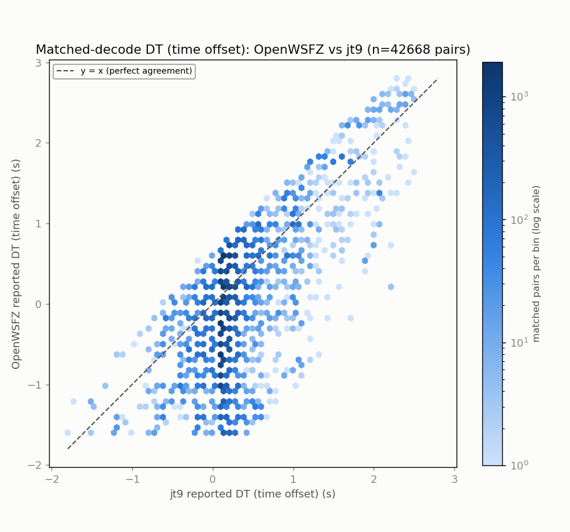
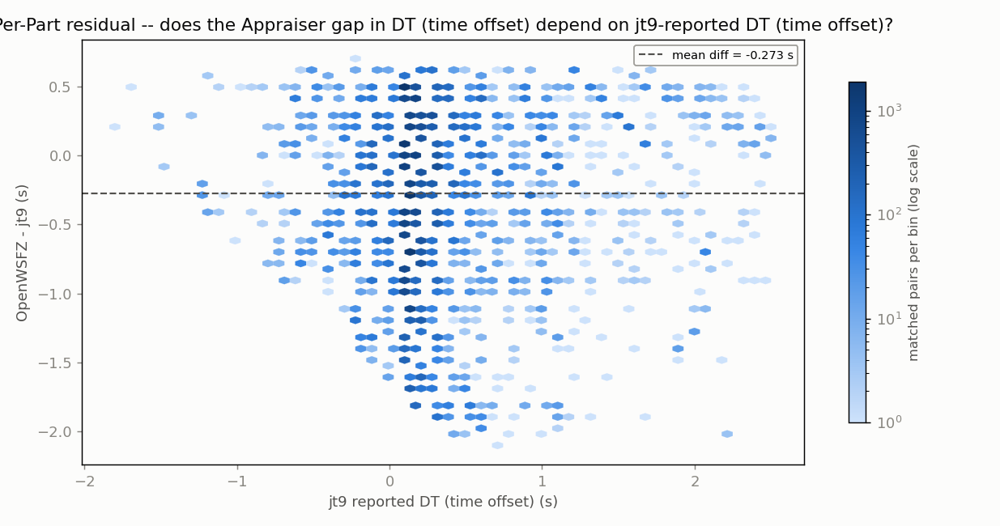
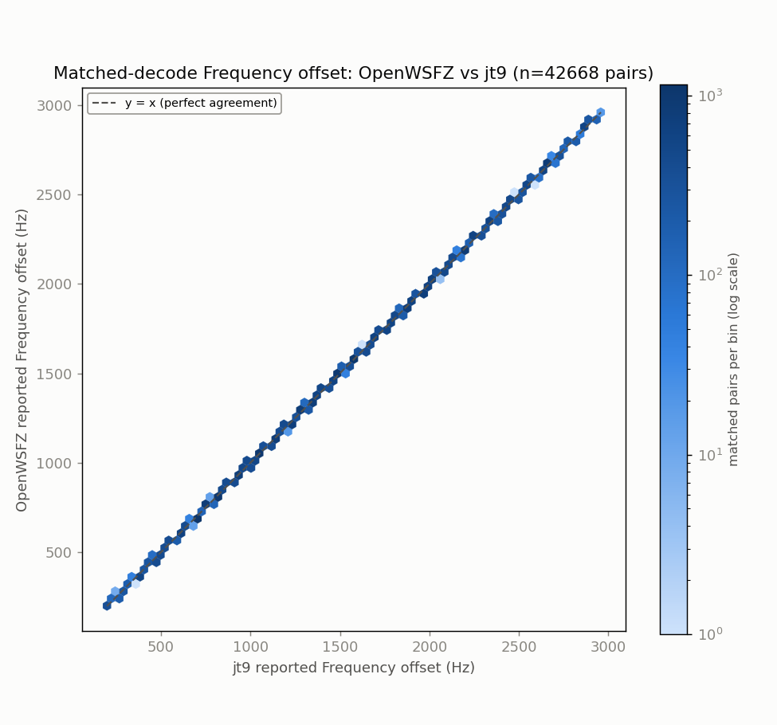
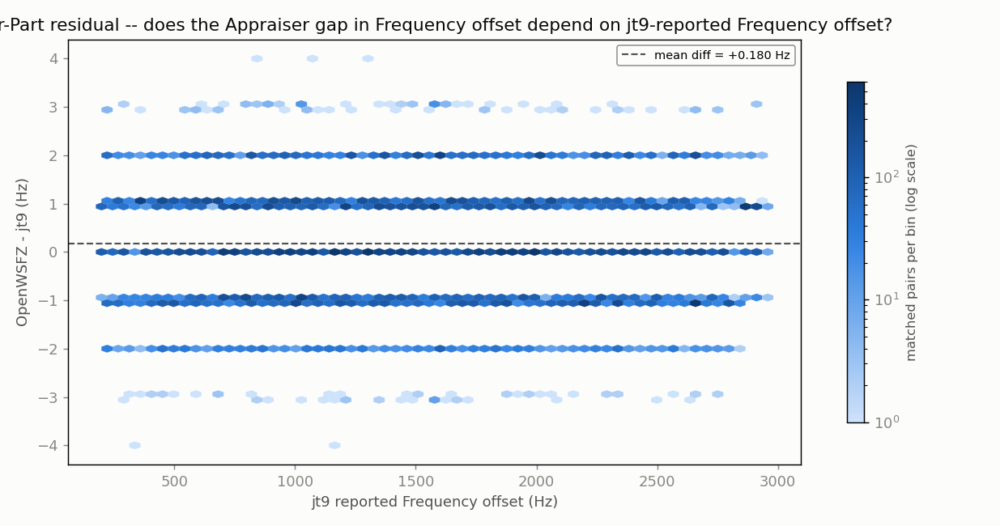

# Endurance-session ANOVA -- matched-decode metrics (OpenWSFZ vs jt9)

> **ANNOTATION, 2026-07-31 (QA, per `2026-07-31-1222` S5 item 1, ruled at
> `2026-07-31-1212` S5/S6):** this session ran on the capture-clock-drift-affected device
> (`DEFECT-capture-clock-drift-silent-decode-loss.md`) and its headline 62.4% parity figure --
> cited elsewhere as this corpus's density-law point (`2026-07-30-2253` S3.1) -- is
> **session-averaged across a drift ramp and a late collapse**, not a clean measurement. It is
> **un-suspended but superseded**, not restored to its original standing:
>
> - **The corpus's honest figure is 56.6% drift-free parity** (h < 2.40, per the corrected
>   `drift(h) = DT_ours(h) - 0.7251` definition), or 56.7% under the alternate slope-only
>   cutoff -- both cutoffs agree, robust to the definition. Full recompute, curve, and
>   self-checks at `qa/cycleframer-alignment-replay/2026-07-31-1137-qa-measurement-task4-result-489135a-recompute.md`.
> - **This corpus DID reach the DT cliff** (2.34-2.48s) in its final ~2 hours -- drift(14) =
>   -2.473s, corroborated by a directly-measured parity collapse (79.4% -> 48.8% -> 20.6% across
>   h=12->14). Superseded prior claims of "never crossed it" / "degraded, not broken".
> - **Neither 62.4% nor 56.6% may be compared against the cross-band density law**
>   (`parity ~= 111.9 - 37.63*log10(density)`). That fit has only 1 residual degree of freedom
>   (3 points, 2 fitted parameters) and a 95% prediction interval of [50.2%, 76.4%] at this
>   corpus's 19.81 ref decodes/cycle -- far too wide to adjudicate a new observation in either
>   direction. Task 4 (the recompute this annotation records) closed **INCONCLUSIVE** on the
>   cross-instance question; do not cite either figure as evidence the two capture chains do or
>   do not obey the same law.
> - **The durable output of that recompute is a calibration, not a parity figure**: sub-0.5s
>   capture misalignment between two independent recordings of the same audio costs
>   approximately **0.15 points** of matched parity (measured directly, n=150 healthy-window
>   cycles, `2026-07-31-1207-qa-task4-calibration-result-row2-confirmed.md`, ruled accurate at
>   `2026-07-31-1212` S1.2). See also `DEFECT-capture-clock-drift-silent-decode-loss.md` where
>   this constant is recorded for general reference.
>
> The raw ANOVA tables below are unchanged and still describe exactly what they always did (the
> full, uncorrected 3575-cycle session) -- read them with the above in mind, not edited out.

**Run:** 2026-07-28/29 40m endurance (dual-band overnight; sibling 20m/originally-80m instance had no audio archived -- see anova_report_20m_no_audio.md)  
**Generated:** 2026-07-29T15:22:21Z (`date -u`, HK-017)  
**Design:** two-way ANOVA without replication (randomized complete block design) -- Part (matched decode instance) x Appraiser (OpenWSFZ, jt9), run separately for each paired numeric response below (SNR, DT, frequency offset) over the identical matched Parts. See this script's docstring for why this design applies to single-pass live data, and not the replicated design in `qa/rr-study/harness/anova_compute.py`.

- WAV cycles fed to jt9: **3575**
- Our decodes in window: **44223**
- jt9 decodes in window: **70822**
- Matched pairs (Parts, shared across every response below): **42668**

## Decode coverage

- OpenWSFZ decoded **44223** messages in this window; jt9 decoded **70822**.
- **42668** decodes matched between the two (same cycle + normalised message text) -- **96.5%** of OpenWSFZ's decodes, **60.2%** of jt9's decodes.
- OpenWSFZ-only (jt9 did not report it): **1555** (3.5% of OpenWSFZ's total).
- jt9-only (OpenWSFZ did not report it): **28154** (39.8% of jt9's total).

## SNR (dB)

| Source | SS | df | MS | F | P |
|---|---:|---:|---:|---:|---:|
| Part | 8635228.6887 | 42667 | 202.3866 | 4.993 | 0.0000 |
| Appraiser | 2315810.8560 | 1 | 2315810.8560 | 57128.011 | 0.0000 |
| Residual (confounded with interaction, n=1/cell) | 1729601.6440 | 42667 | 40.5372 | | |
| Total | 12680641.1887 | 85335 | | | |

Appraiser means (SNR, dB): OpenWSFZ -9.653 dB, jt9 0.766 dB, grand mean -4.443 dB.

## DT (time offset) (s)

| Source | SS | df | MS | F | P |
|---|---:|---:|---:|---:|---:|
| Part | 18001.3296 | 42667 | 0.4219 | 2.536 | 0.0000 |
| Appraiser | 1594.0545 | 1 | 1594.0545 | 9580.347 | 0.0000 |
| Residual (confounded with interaction, n=1/cell) | 7099.2755 | 42667 | 0.1664 | | |
| Total | 26694.6596 | 85335 | | | |

Appraiser means (DT (time offset), s): OpenWSFZ -0.0720 s, jt9 0.2013 s, grand mean 0.0647 s.

## Frequency offset (Hz)

| Source | SS | df | MS | F | P |
|---|---:|---:|---:|---:|---:|
| Part | 42744505322.0829 | 42667 | 1001816.5168 | 1937417.549 | 0.0000 |
| Appraiser | 693.8810 | 1 | 693.8810 | 1341.900 | 0.0000 |
| Residual (confounded with interaction, n=1/cell) | 22062.6190 | 42667 | 0.5171 | | |
| Total | 42744528078.5829 | 85335 | | | |

Appraiser means (Frequency offset, Hz): OpenWSFZ 1522.4 Hz, jt9 1522.2 Hz, grand mean 1522.3 Hz.

## Caveat (structural, not a defect)

With one observation per Part x Appraiser cell -- a live signal happens once -- the interaction term and the residual/error term are mathematically confounded (standard property of an unreplicated factorial design), for every response above. Each table can say whether the two appraisers' *mean* value differs after removing part-to-part variation (the Appraiser row); none of them can separately test whether that difference itself varies signal-to-signal.

Cross-run comparison and interpretation of these numbers is Architect/Captain territory, not this script's.

