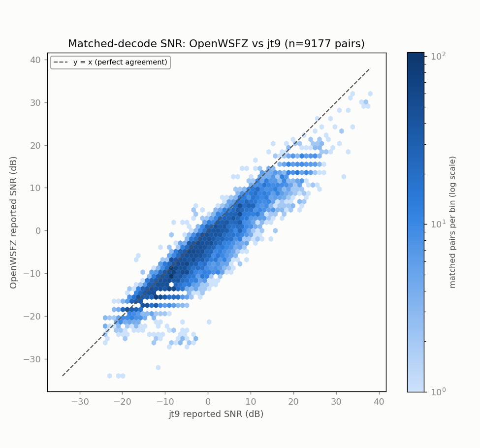
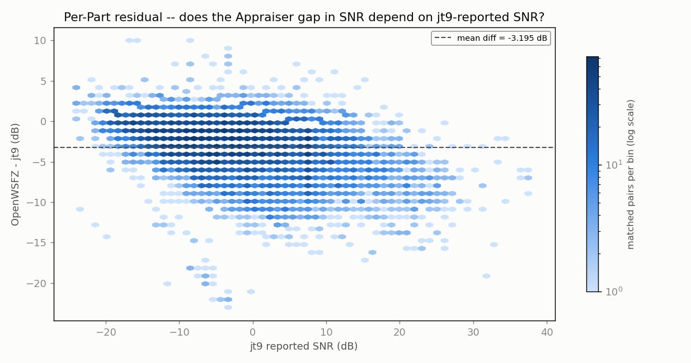
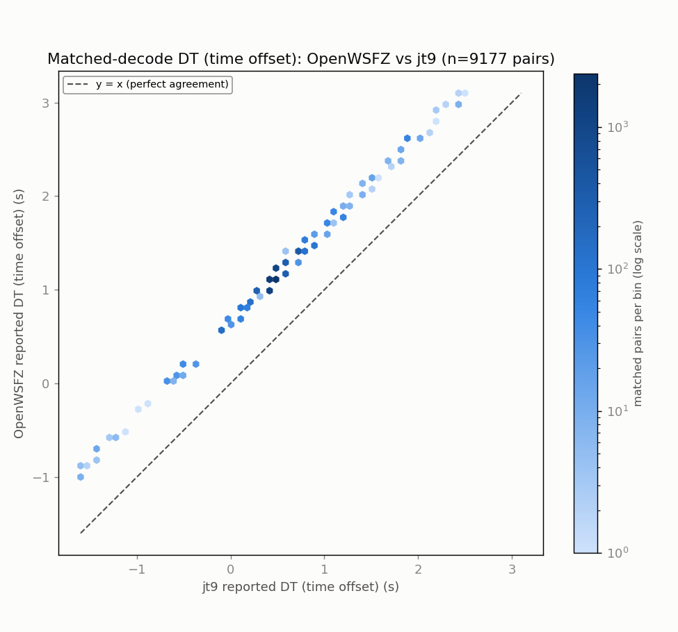
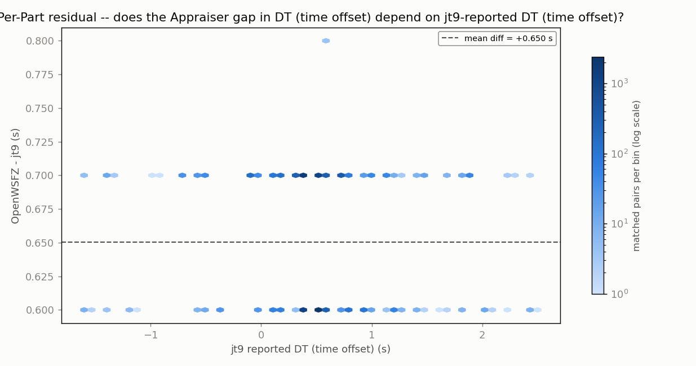
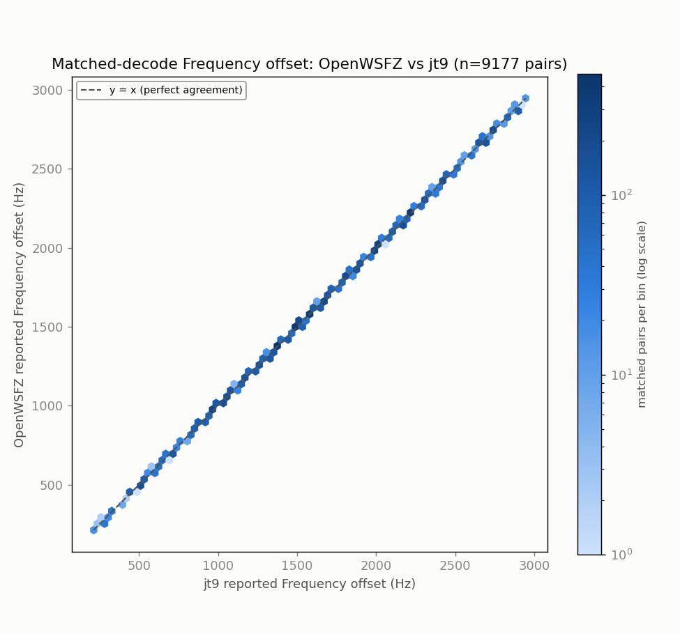
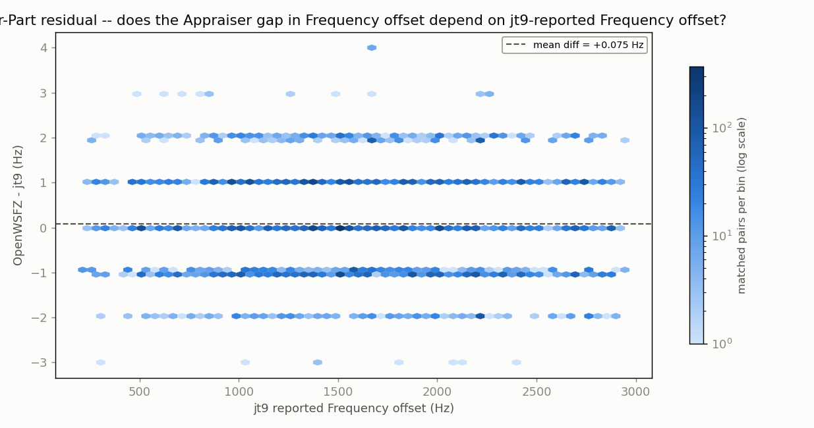

# Endurance-session ANOVA -- matched-decode metrics (OpenWSFZ vs jt9)

**Run:** 2026-07-29/30 10m stretch, SDR Uno / Voicemeeter B1 instance (OpenWSFZ vs jt9)  
**Generated:** 2026-07-30T19:35:54Z (`date -u`, HK-017)  
**Design:** two-way ANOVA without replication (randomized complete block design) -- Part (matched decode instance) x Appraiser (OpenWSFZ, jt9), run separately for each paired numeric response below (SNR, DT, frequency offset) over the identical matched Parts. See anova_common.py's module docstring for why this design applies to single-pass live data, and not the replicated design in `qa/rr-study/harness/anova_compute.py`.

jt9's decodes were obtained by re-running WSJT-X's own decode engine (jt9.exe) against each archived WAV in this window -- used here because there is no live third-party decode log already covering this feed (see endurance_anova_wsjtx.py for the 40m case, where one exists and no re-decode is needed).

- WAV cycles fed to jt9: **1490**
- OpenWSFZ decodes in window: **9870**
- jt9 decodes in window: **12701**
- Matched pairs (Parts, shared across every response below): **9177**

## Decode coverage

- OpenWSFZ decoded **9870** messages in this window; jt9 decoded **12701**.
- **9177** decodes matched between the two (same cycle + normalised message text) -- **93.0%** of OpenWSFZ's decodes, **72.3%** of jt9's decodes.
- OpenWSFZ-only (jt9 did not report it): **693** (7.0% of OpenWSFZ's total).
- jt9-only (OpenWSFZ did not report it): **3524** (27.7% of jt9's total).

## SNR (dB)

| Source | SS | df | MS | F | P |
|---|---:|---:|---:|---:|---:|
| Part | 1492708.0441 | 9176 | 162.6752 | 26.905 | 0.0000 |
| Appraiser | 46828.2930 | 1 | 46828.2930 | 7744.900 | 0.0000 |
| Residual (confounded with interaction, n=1/cell) | 55481.2070 | 9176 | 6.0463 | | |
| Total | 1595017.5441 | 18353 | | | |

Appraiser means (SNR, dB): OpenWSFZ -4.950 dB, jt9 -1.755 dB, grand mean -3.353 dB.

## DT (time offset) (s)

| Source | SS | df | MS | F | P |
|---|---:|---:|---:|---:|---:|
| Part | 1796.1805 | 9176 | 0.1957 | 156.041 | 0.0000 |
| Appraiser | 1940.2341 | 1 | 1940.2341 | 1546669.016 | 0.0000 |
| Residual (confounded with interaction, n=1/cell) | 11.5109 | 9176 | 0.0013 | | |
| Total | 3747.9255 | 18353 | | | |

Appraiser means (DT (time offset), s): OpenWSFZ 1.1200 s, jt9 0.4697 s, grand mean 0.7949 s.

## Frequency offset (Hz)

| Source | SS | df | MS | F | P |
|---|---:|---:|---:|---:|---:|
| Part | 7127398066.4084 | 9176 | 776743.4684 | 1412342.199 | 0.0000 |
| Appraiser | 25.4907 | 1 | 25.4907 | 46.349 | 0.0000 |
| Residual (confounded with interaction, n=1/cell) | 5046.5093 | 9176 | 0.5500 | | |
| Total | 7127403138.4084 | 18353 | | | |

Appraiser means (Frequency offset, Hz): OpenWSFZ 1607.5 Hz, jt9 1607.5 Hz, grand mean 1607.5 Hz.

## Caveat (structural, not a defect)

With one observation per Part x Appraiser cell -- a live signal happens once -- the interaction term and the residual/error term are mathematically confounded (standard property of an unreplicated factorial design), for every response above. Each table can say whether the two appraisers' *mean* value differs after removing part-to-part variation (the Appraiser row); none of them can separately test whether that difference itself varies signal-to-signal.

Cross-run comparison and interpretation of these numbers is Architect/Captain territory, not this module's.

