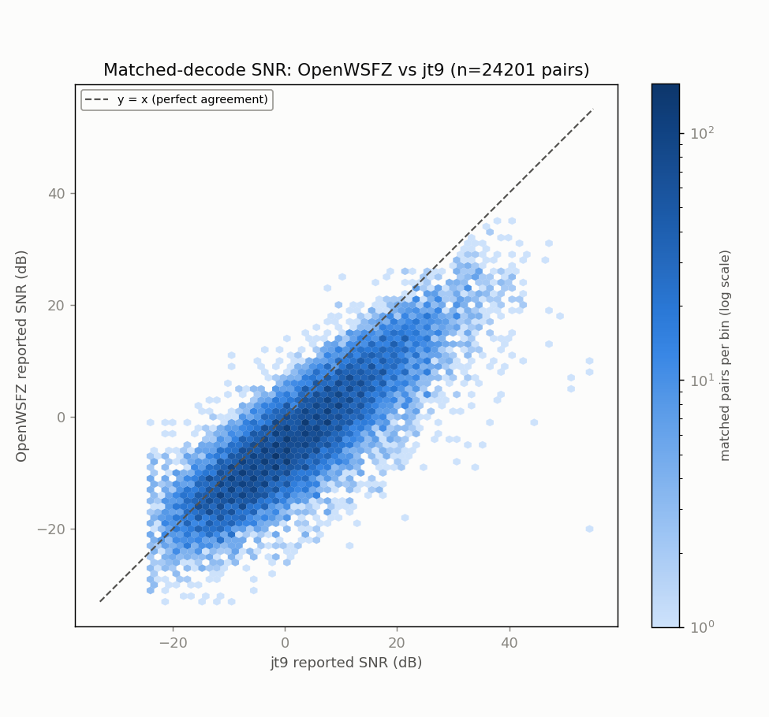
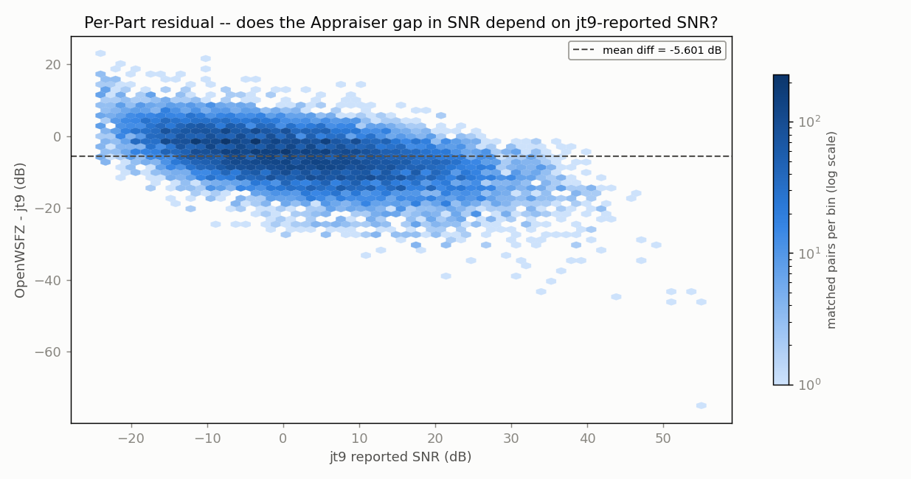
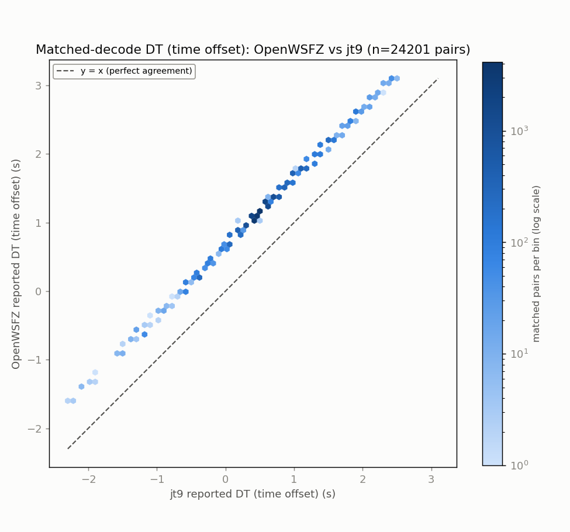
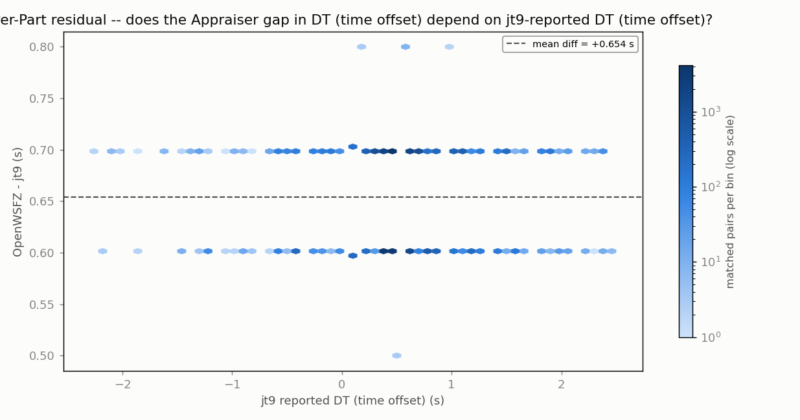
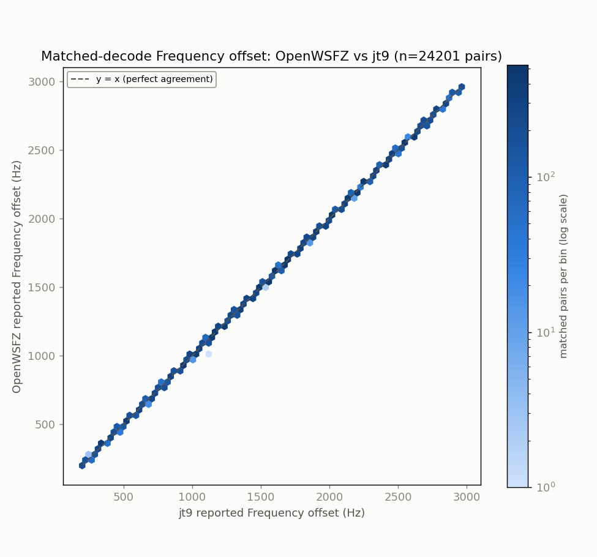
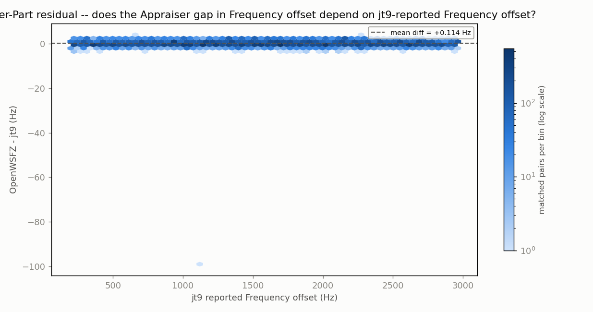

# Endurance-session ANOVA -- matched-decode metrics (OpenWSFZ vs jt9)

**Run:** 2026-07-29 20m stretch, SDR Uno / Voicemeeter B1 instance (OpenWSFZ vs jt9)  
**Generated:** 2026-07-30T19:27:40Z (`date -u`, HK-017)  
**Design:** two-way ANOVA without replication (randomized complete block design) -- Part (matched decode instance) x Appraiser (OpenWSFZ, jt9), run separately for each paired numeric response below (SNR, DT, frequency offset) over the identical matched Parts. See anova_common.py's module docstring for why this design applies to single-pass live data, and not the replicated design in `qa/rr-study/harness/anova_compute.py`.

jt9's decodes were obtained by re-running WSJT-X's own decode engine (jt9.exe) against each archived WAV in this window -- used here because there is no live third-party decode log already covering this feed (see endurance_anova_wsjtx.py for the 40m case, where one exists and no re-decode is needed).

- WAV cycles fed to jt9: **1362**
- OpenWSFZ decodes in window: **26357**
- jt9 decodes in window: **49527**
- Matched pairs (Parts, shared across every response below): **24201**

## Decode coverage

- OpenWSFZ decoded **26357** messages in this window; jt9 decoded **49527**.
- **24201** decodes matched between the two (same cycle + normalised message text) -- **91.8%** of OpenWSFZ's decodes, **48.9%** of jt9's decodes.
- OpenWSFZ-only (jt9 did not report it): **2156** (8.2% of OpenWSFZ's total).
- jt9-only (OpenWSFZ did not report it): **25326** (51.1% of jt9's total).

## SNR (dB)

| Source | SS | df | MS | F | P |
|---|---:|---:|---:|---:|---:|
| Part | 4922295.7784 | 24200 | 203.4007 | 11.363 | 0.0000 |
| Appraiser | 379653.1417 | 1 | 379653.1417 | 21209.876 | 0.0000 |
| Residual (confounded with interaction, n=1/cell) | 433175.8583 | 24200 | 17.8998 | | |
| Total | 5735124.7784 | 48401 | | | |

Appraiser means (SNR, dB): OpenWSFZ -3.704 dB, jt9 1.898 dB, grand mean -0.903 dB.

## DT (time offset) (s)

| Source | SS | df | MS | F | P |
|---|---:|---:|---:|---:|---:|
| Part | 8133.6819 | 24200 | 0.3361 | 269.184 | 0.0000 |
| Appraiser | 5177.4389 | 1 | 5177.4389 | 4146599.341 | 0.0000 |
| Residual (confounded with interaction, n=1/cell) | 30.2161 | 24200 | 0.0012 | | |
| Total | 13341.3369 | 48401 | | | |

Appraiser means (DT (time offset), s): OpenWSFZ 1.1897 s, jt9 0.5356 s, grand mean 0.8626 s.

## Frequency offset (Hz)

| Source | SS | df | MS | F | P |
|---|---:|---:|---:|---:|---:|
| Part | 26081845214.4478 | 24200 | 1077762.1989 | 1536723.811 | 0.0000 |
| Appraiser | 156.1299 | 1 | 156.1299 | 222.617 | 0.0000 |
| Residual (confounded with interaction, n=1/cell) | 16972.3701 | 24200 | 0.7013 | | |
| Total | 26081862342.9478 | 48401 | | | |

Appraiser means (Frequency offset, Hz): OpenWSFZ 1583.0 Hz, jt9 1582.9 Hz, grand mean 1582.9 Hz.

## Caveat (structural, not a defect)

With one observation per Part x Appraiser cell -- a live signal happens once -- the interaction term and the residual/error term are mathematically confounded (standard property of an unreplicated factorial design), for every response above. Each table can say whether the two appraisers' *mean* value differs after removing part-to-part variation (the Appraiser row); none of them can separately test whether that difference itself varies signal-to-signal.

Cross-run comparison and interpretation of these numbers is Architect/Captain territory, not this module's.

