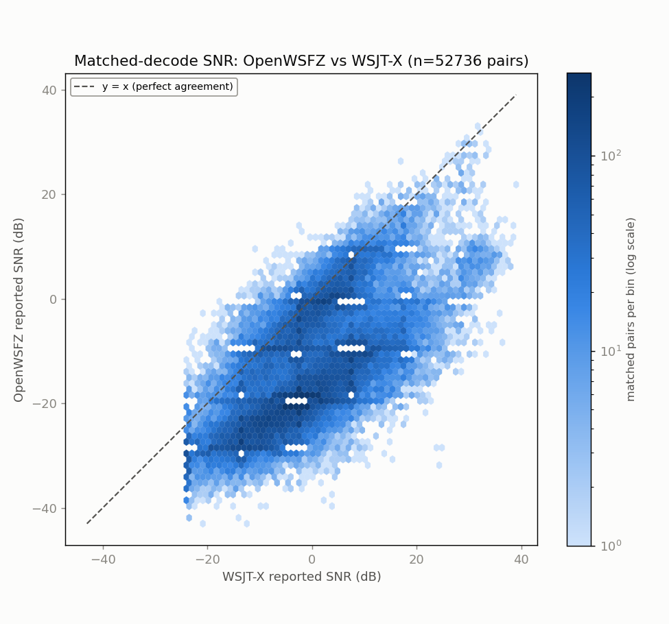
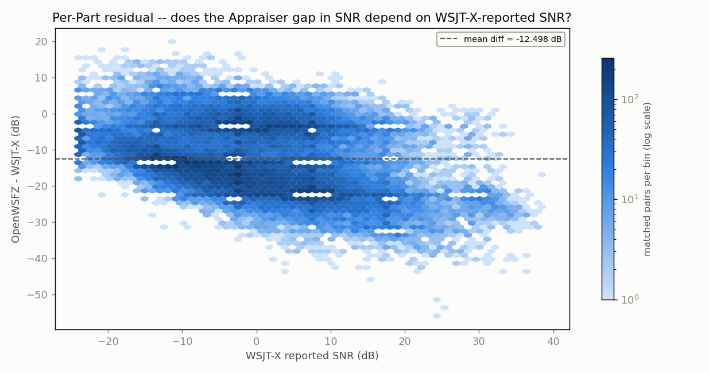
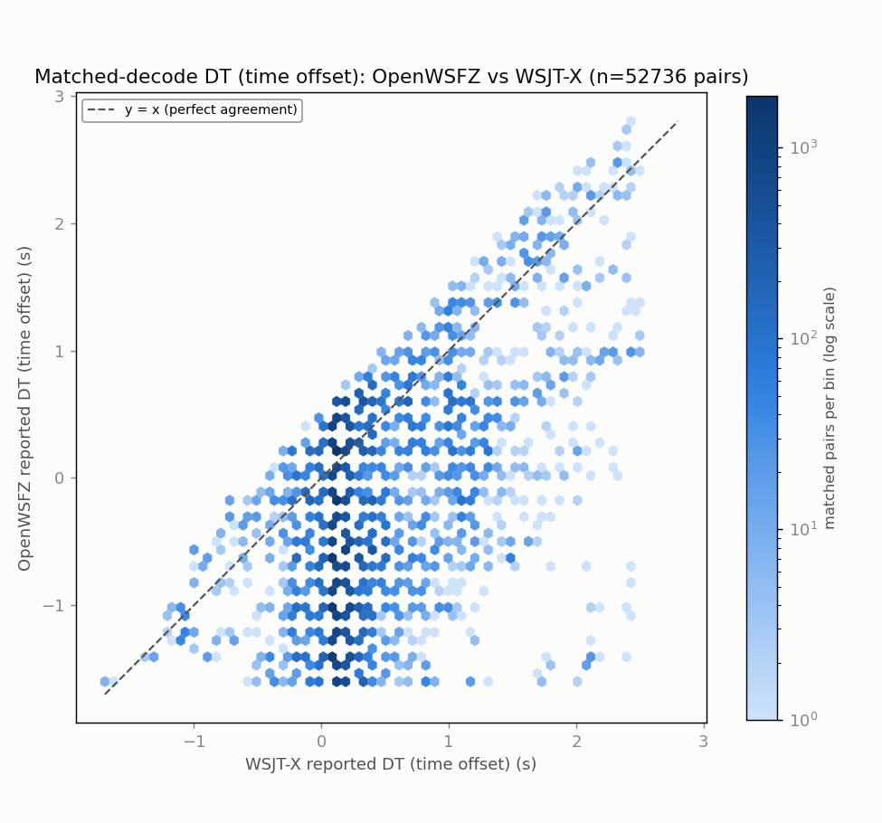
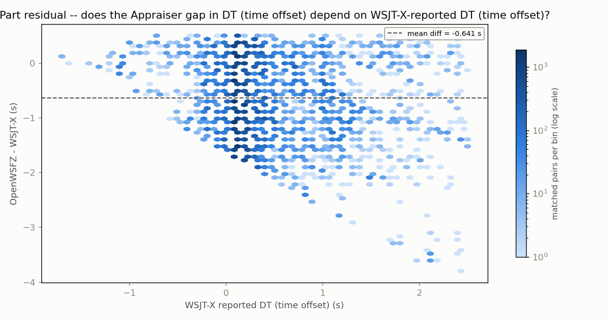
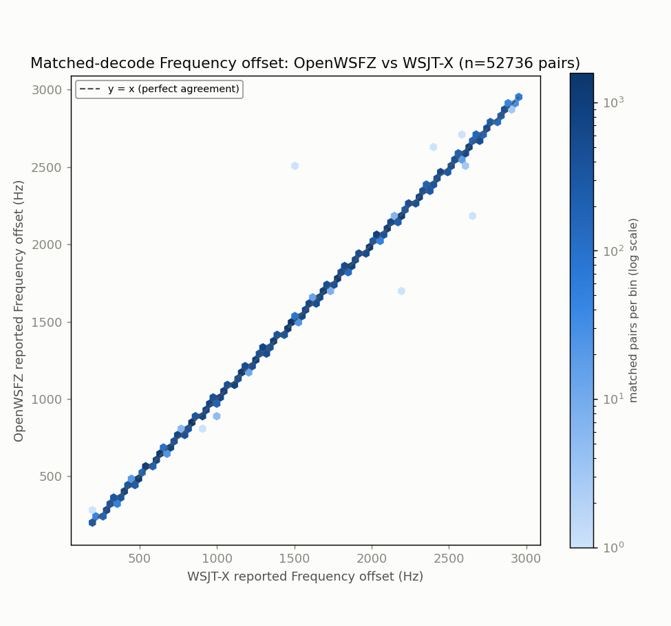
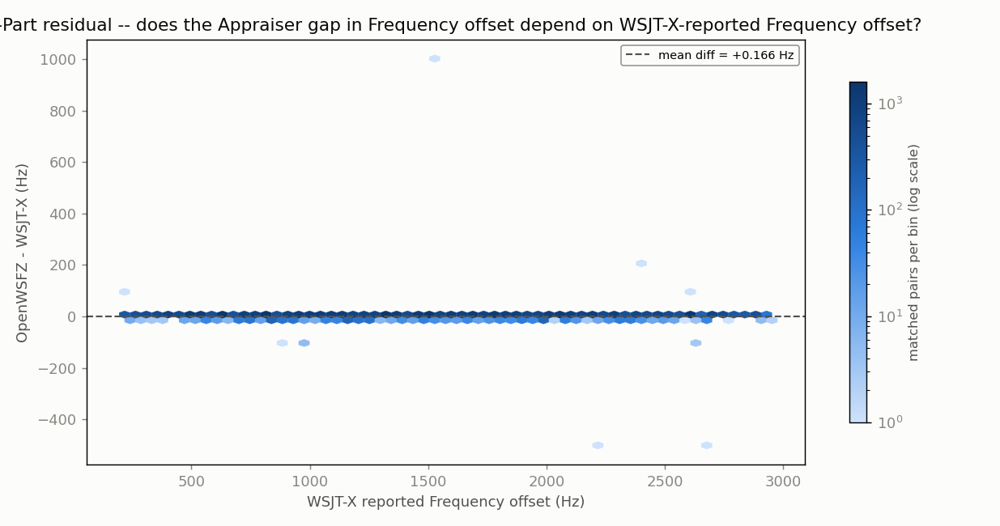

# Endurance-session ANOVA -- matched-decode metrics (OpenWSFZ vs WSJT-X)

**Run:** 2026-07-29/30 40m endurance session (OpenWSFZ vs live WSJT-X), ~24h continuous  
**Generated:** 2026-07-30T18:51:12Z (`date -u`, HK-017)  
**Design:** two-way ANOVA without replication (randomized complete block design) -- Part (matched decode instance) x Appraiser (OpenWSFZ, WSJT-X), run separately for each paired numeric response below (SNR, DT, frequency offset) over the identical matched Parts. See anova_common.py's module docstring for why this design applies to single-pass live data, and not the replicated design in `qa/rr-study/harness/anova_compute.py`.

Both appraisers' decode logs come from the same live session already on disk -- OpenWSFZ's own ALL.TXT and the real WSJT-X application's own ALL.TXT, both listening to the same physical radio feed throughout. No re-decoding was performed (contrast endurance_anova_jt9.py, used when there is no live third-party log to read).

- OpenWSFZ decodes in window: **55027**
- WSJT-X decodes in window: **110232**
- Matched pairs (Parts, shared across every response below): **52736**

## Decode coverage

- OpenWSFZ decoded **55027** messages in this window; WSJT-X decoded **110232**.
- **52736** decodes matched between the two (same cycle + normalised message text) -- **95.8%** of OpenWSFZ's decodes, **47.8%** of WSJT-X's decodes.
- OpenWSFZ-only (WSJT-X did not report it): **2291** (4.2% of OpenWSFZ's total).
- WSJT-X-only (OpenWSFZ did not report it): **57496** (52.2% of WSJT-X's total).

## SNR (dB)

| Source | SS | df | MS | F | P |
|---|---:|---:|---:|---:|---:|
| Part | 10431180.6170 | 52735 | 197.8037 | 4.821 | 0.0000 |
| Appraiser | 4118862.5785 | 1 | 4118862.5785 | 100381.976 | 0.0000 |
| Residual (confounded with interaction, n=1/cell) | 2163816.9215 | 52735 | 41.0319 | | |
| Total | 16713860.1170 | 105471 | | | |

Appraiser means (SNR, dB): OpenWSFZ -13.061 dB, WSJT-X -0.563 dB, grand mean -6.812 dB.

## DT (time offset) (s)

| Source | SS | df | MS | F | P |
|---|---:|---:|---:|---:|---:|
| Part | 23692.5637 | 52735 | 0.4493 | 2.029 | 0.0000 |
| Appraiser | 10834.7025 | 1 | 10834.7025 | 48920.664 | 0.0000 |
| Residual (confounded with interaction, n=1/cell) | 11679.4825 | 52735 | 0.2215 | | |
| Total | 46206.7487 | 105471 | | | |

Appraiser means (DT (time offset), s): OpenWSFZ -0.3930 s, WSJT-X 0.2480 s, grand mean -0.0725 s.

## Frequency offset (Hz)

| Source | SS | df | MS | F | P |
|---|---:|---:|---:|---:|---:|
| Part | 51686880711.4948 | 52735 | 980124.7883 | 60330.343 | 0.0000 |
| Appraiser | 726.4014 | 1 | 726.4014 | 44.713 | 0.0000 |
| Residual (confounded with interaction, n=1/cell) | 856731.0986 | 52735 | 16.2460 | | |
| Total | 51687738168.9948 | 105471 | | | |

Appraiser means (Frequency offset, Hz): OpenWSFZ 1495.4 Hz, WSJT-X 1495.3 Hz, grand mean 1495.3 Hz.

## Caveat (structural, not a defect)

With one observation per Part x Appraiser cell -- a live signal happens once -- the interaction term and the residual/error term are mathematically confounded (standard property of an unreplicated factorial design), for every response above. Each table can say whether the two appraisers' *mean* value differs after removing part-to-part variation (the Appraiser row); none of them can separately test whether that difference itself varies signal-to-signal.

Cross-run comparison and interpretation of these numbers is Architect/Captain territory, not this module's.

