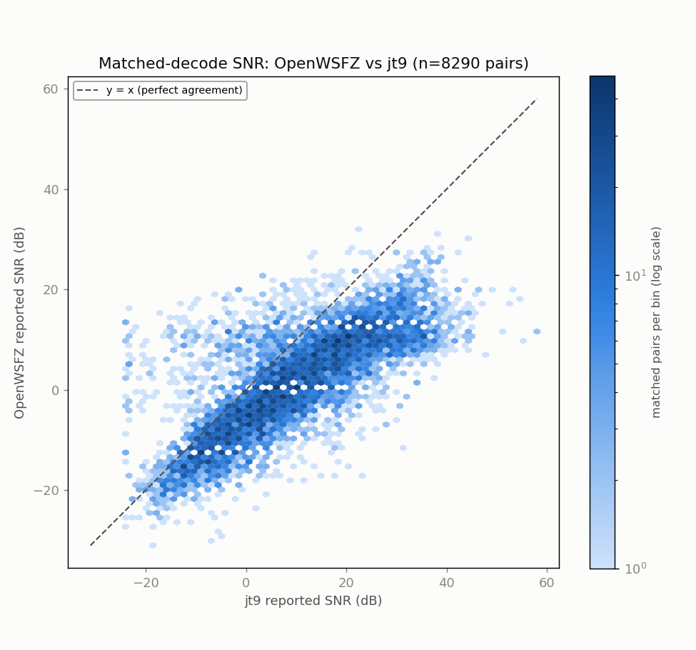
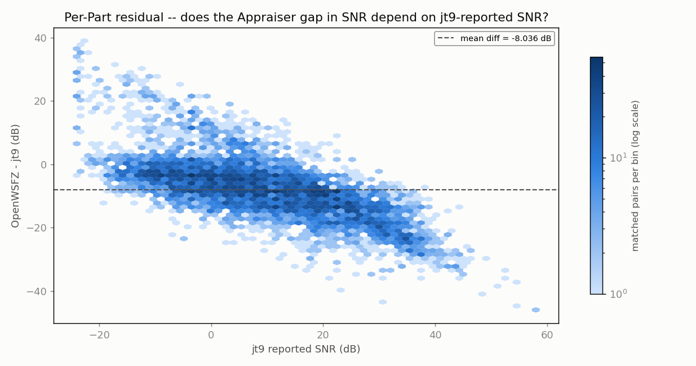
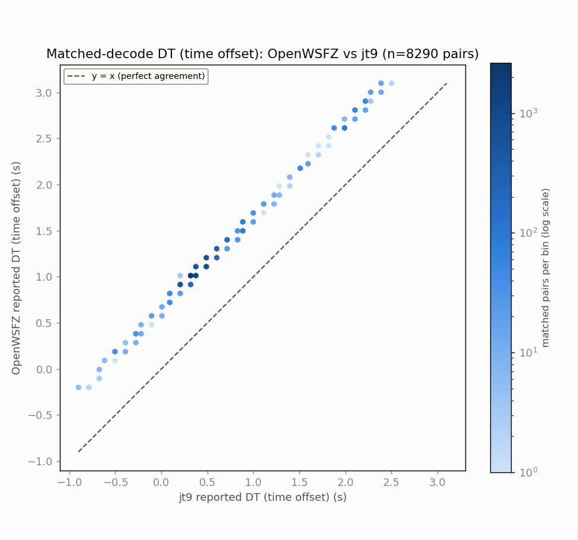
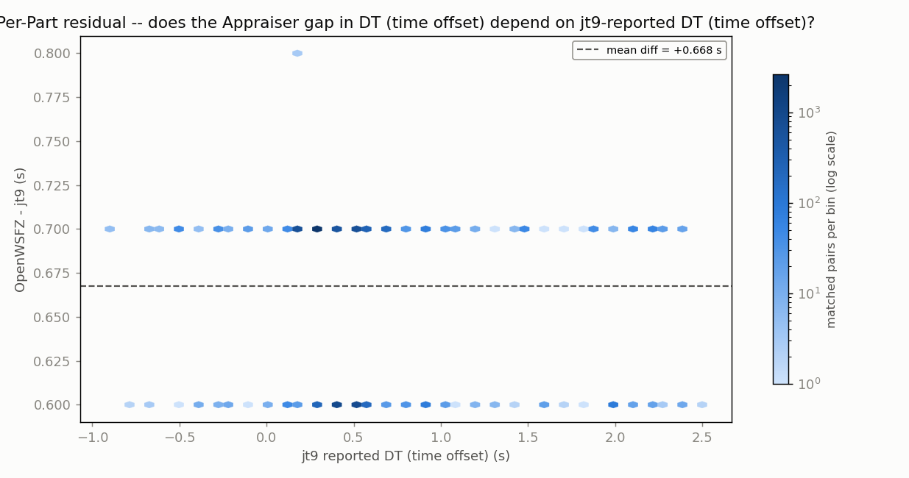
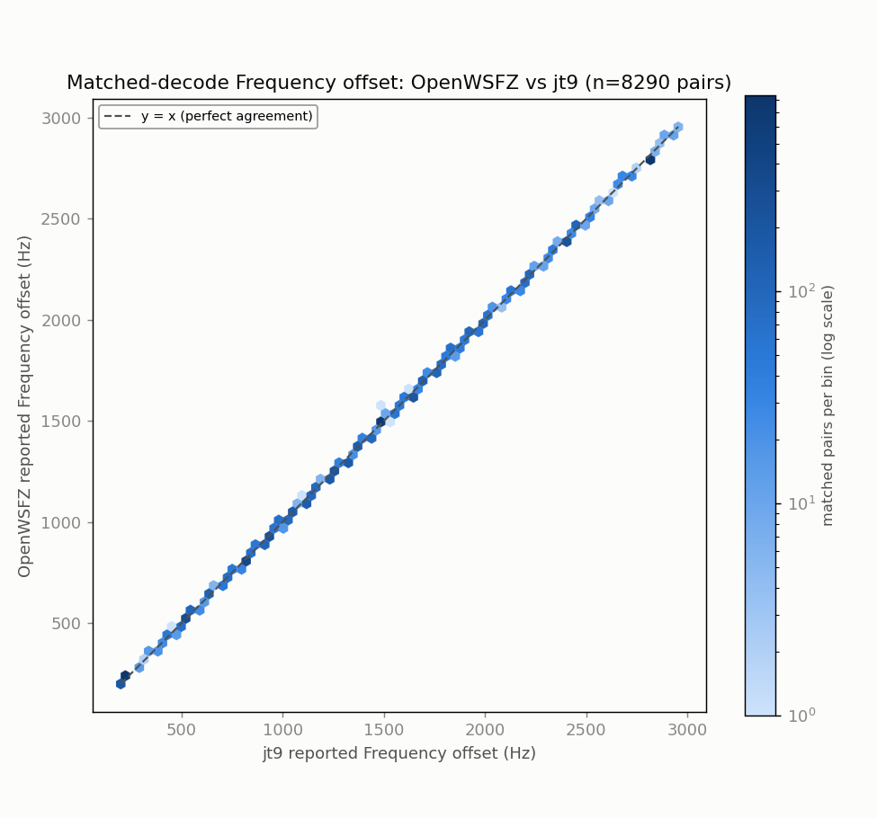
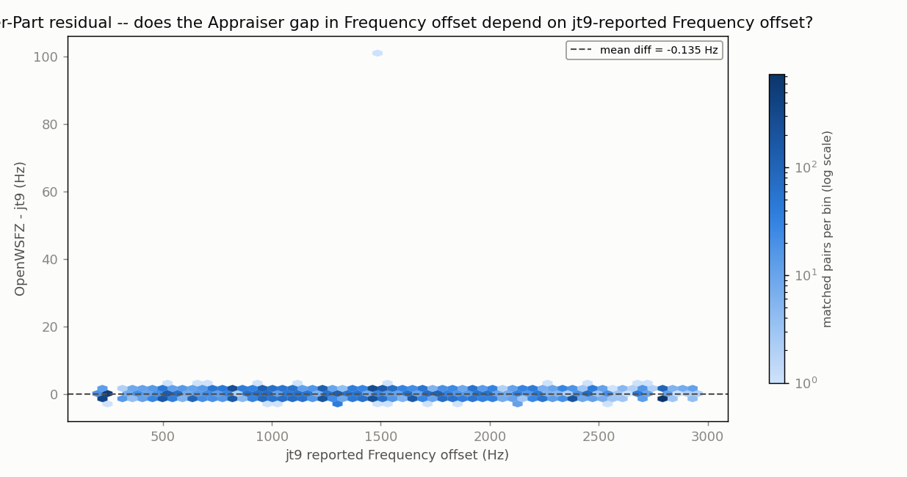

# Endurance-session ANOVA -- matched-decode metrics (OpenWSFZ vs jt9)

**Run:** 2026-07-29 80m stretch, SDR Uno / Voicemeeter B1 instance (OpenWSFZ vs jt9) -- includes the partial audio-leak-contaminated window, see CONTAMINATION-NOTE.md  
**Generated:** 2026-07-30T19:32:32Z (`date -u`, HK-017)  
**Design:** two-way ANOVA without replication (randomized complete block design) -- Part (matched decode instance) x Appraiser (OpenWSFZ, jt9), run separately for each paired numeric response below (SNR, DT, frequency offset) over the identical matched Parts. See anova_common.py's module docstring for why this design applies to single-pass live data, and not the replicated design in `qa/rr-study/harness/anova_compute.py`.

jt9's decodes were obtained by re-running WSJT-X's own decode engine (jt9.exe) against each archived WAV in this window -- used here because there is no live third-party decode log already covering this feed (see endurance_anova_wsjtx.py for the 40m case, where one exists and no re-decode is needed).

- WAV cycles fed to jt9: **2917**
- OpenWSFZ decodes in window: **9016**
- jt9 decodes in window: **9845**
- Matched pairs (Parts, shared across every response below): **8290**

## Decode coverage

- OpenWSFZ decoded **9016** messages in this window; jt9 decoded **9845**.
- **8290** decodes matched between the two (same cycle + normalised message text) -- **91.9%** of OpenWSFZ's decodes, **84.2%** of jt9's decodes.
- OpenWSFZ-only (jt9 did not report it): **726** (8.1% of OpenWSFZ's total).
- jt9-only (OpenWSFZ did not report it): **1555** (15.8% of jt9's total).

## SNR (dB)

| Source | SS | df | MS | F | P |
|---|---:|---:|---:|---:|---:|
| Part | 2155496.3178 | 8289 | 260.0430 | 6.638 | 0.0000 |
| Appraiser | 267693.4645 | 1 | 267693.4645 | 6833.600 | 0.0000 |
| Residual (confounded with interaction, n=1/cell) | 324706.0355 | 8289 | 39.1731 | | |
| Total | 2747895.8178 | 16579 | | | |

Appraiser means (SNR, dB): OpenWSFZ 1.417 dB, jt9 9.454 dB, grand mean 5.435 dB.

## DT (time offset) (s)

| Source | SS | df | MS | F | P |
|---|---:|---:|---:|---:|---:|
| Part | 2762.9960 | 8289 | 0.3333 | 302.988 | 0.0000 |
| Appraiser | 1846.9808 | 1 | 1846.9808 | 1678842.751 | 0.0000 |
| Residual (confounded with interaction, n=1/cell) | 9.1192 | 8289 | 0.0011 | | |
| Total | 4619.0960 | 16579 | | | |

Appraiser means (DT (time offset), s): OpenWSFZ 1.1354 s, jt9 0.4679 s, grand mean 0.8016 s.

## Frequency offset (Hz)

| Source | SS | df | MS | F | P |
|---|---:|---:|---:|---:|---:|
| Part | 10438744346.1486 | 8289 | 1259349.0585 | 1078455.924 | 0.0000 |
| Appraiser | 75.6574 | 1 | 75.6574 | 64.790 | 0.0000 |
| Residual (confounded with interaction, n=1/cell) | 9679.3426 | 8289 | 1.1677 | | |
| Total | 10438754101.1486 | 16579 | | | |

Appraiser means (Frequency offset, Hz): OpenWSFZ 1392.1 Hz, jt9 1392.2 Hz, grand mean 1392.1 Hz.

## Caveat (structural, not a defect)

With one observation per Part x Appraiser cell -- a live signal happens once -- the interaction term and the residual/error term are mathematically confounded (standard property of an unreplicated factorial design), for every response above. Each table can say whether the two appraisers' *mean* value differs after removing part-to-part variation (the Appraiser row); none of them can separately test whether that difference itself varies signal-to-signal.

Cross-run comparison and interpretation of these numbers is Architect/Captain territory, not this module's.

