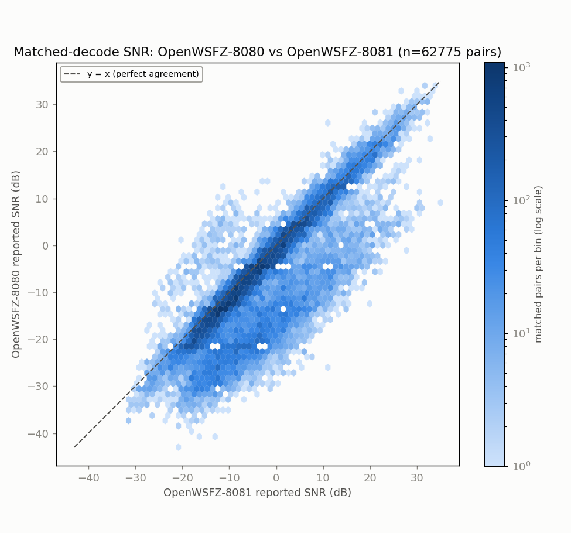
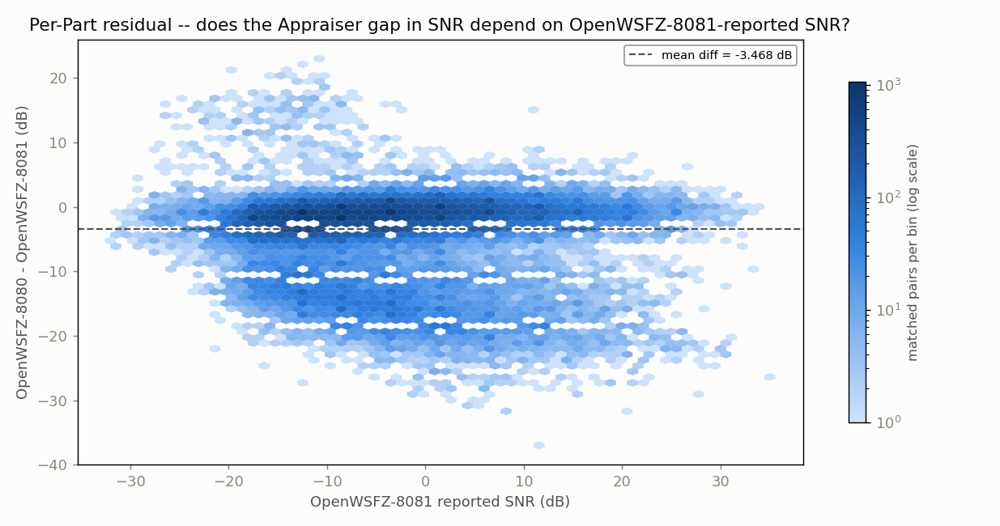
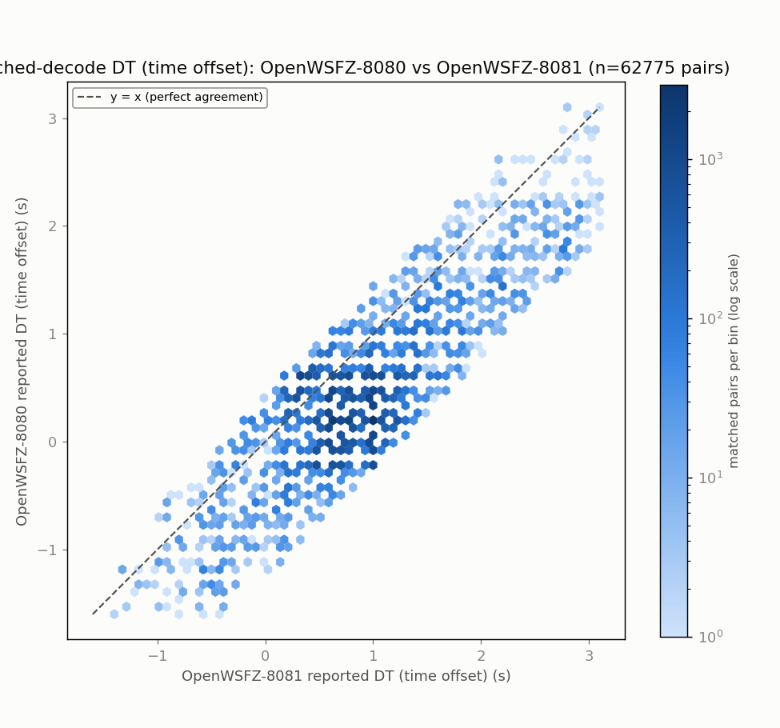
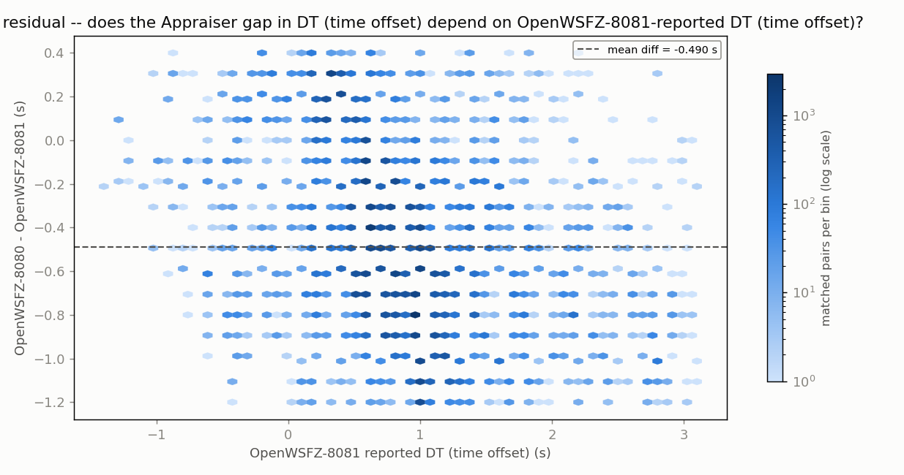
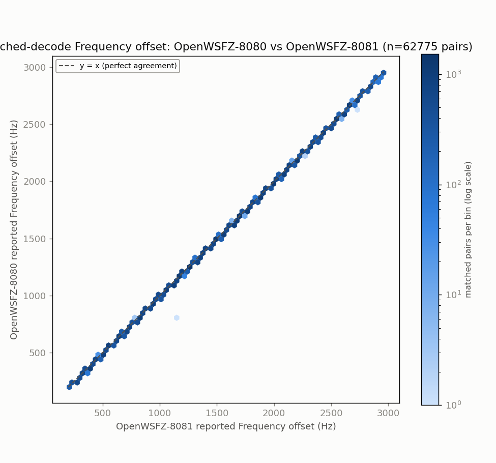
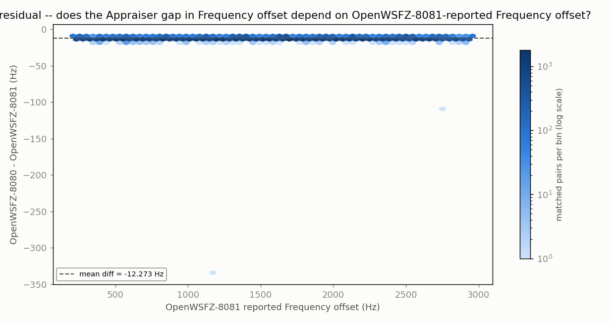

# Endurance-session ANOVA -- matched-decode metrics (OpenWSFZ-8080 vs OpenWSFZ-8081)

**Run:** 2026-07-31 20:04Z -> 2026-08-02 15:52Z multi-day 20m live run (OpenWSFZ 8080/FT-991A vs OpenWSFZ 8081/SDR Uno, same decoder, same split antenna, different receiver hardware)  
**Generated:** 2026-08-02T16:42:06Z (`date -u`, HK-017)  
**Design:** two-way ANOVA without replication (randomized complete block design) -- Part (matched decode instance) x Appraiser (OpenWSFZ-8080, OpenWSFZ-8081), run separately for each paired numeric response below (SNR, DT, frequency offset) over the identical matched Parts. See anova_common.py's module docstring for why this design applies to single-pass live data, and not the replicated design in `qa/rr-study/harness/anova_compute.py`.

Both appraisers run the identical OpenWSFZ decoder against the same split antenna; the only variable between them is the receiver/audio chain -- 8080 is fed by the FT-991A, 8081 by SDR Uno -> Voicemeeter B1. This isolates the hardware/capture-chain contribution in a way anova_report_8080_vs_wsjtx.md and anova_report_8081_vs_wsjtx.md cannot individually, since each of those also swaps decoder identity for one side. 8080 experienced several decode-collapse-induced restarts this run (dev-tasks/2026-08-01-8080-decode-collapse-after-long-uptime.md); 8081 ran on a single continuous daemon instance throughout -- a coverage/uptime asymmetry that any Appraiser-row difference below should be read alongside, not just the hardware difference.

- OpenWSFZ-8080 decodes in window: **184918**
- OpenWSFZ-8081 decodes in window: **212422**
- Matched pairs (Parts, shared across every response below): **62775**

## Decode coverage

- OpenWSFZ-8080 decoded **184918** messages in this window; OpenWSFZ-8081 decoded **212422**.
- **62775** decodes matched between the two (same cycle + normalised message text) -- **33.9%** of OpenWSFZ-8080's decodes, **29.6%** of OpenWSFZ-8081's decodes.
- OpenWSFZ-8080-only (OpenWSFZ-8081 did not report it): **122143** (66.1% of OpenWSFZ-8080's total).
- OpenWSFZ-8081-only (OpenWSFZ-8080 did not report it): **149647** (70.4% of OpenWSFZ-8081's total).

## SNR (dB)

| Source | SS | df | MS | F | P |
|---|---:|---:|---:|---:|---:|
| Part | 12075561.1463 | 62774 | 192.3656 | 12.388 | 0.0000 |
| Appraiser | 377436.8347 | 1 | 377436.8347 | 24306.892 | 0.0000 |
| Residual (confounded with interaction, n=1/cell) | 974753.1653 | 62774 | 15.5280 | | |
| Total | 13427751.1463 | 125549 | | | |

Appraiser means (SNR, dB): OpenWSFZ-8080 -7.754 dB, OpenWSFZ-8081 -4.287 dB, grand mean -6.021 dB.

## DT (time offset) (s)

| Source | SS | df | MS | F | P |
|---|---:|---:|---:|---:|---:|
| Part | 21751.9514 | 62774 | 0.3465 | 4.883 | 0.0000 |
| Appraiser | 7543.2699 | 1 | 7543.2699 | 106304.034 | 0.0000 |
| Residual (confounded with interaction, n=1/cell) | 4454.4051 | 62774 | 0.0710 | | |
| Total | 33749.6264 | 125549 | | | |

Appraiser means (DT (time offset), s): OpenWSFZ-8080 0.3229 s, OpenWSFZ-8081 0.8132 s, grand mean 0.5681 s.

## Frequency offset (Hz)

| Source | SS | df | MS | F | P |
|---|---:|---:|---:|---:|---:|
| Part | 66129558467.1220 | 62774 | 1053454.5905 | 741475.750 | 0.0000 |
| Appraiser | 4728163.5924 | 1 | 4728163.5924 | 3327925.738 | 0.0000 |
| Residual (confounded with interaction, n=1/cell) | 89186.4076 | 62774 | 1.4208 | | |
| Total | 66134375817.1220 | 125549 | | | |

Appraiser means (Frequency offset, Hz): OpenWSFZ-8080 1504.2 Hz, OpenWSFZ-8081 1516.5 Hz, grand mean 1510.4 Hz.

## Caveat (structural, not a defect)

With one observation per Part x Appraiser cell -- a live signal happens once -- the interaction term and the residual/error term are mathematically confounded (standard property of an unreplicated factorial design), for every response above. Each table can say whether the two appraisers' *mean* value differs after removing part-to-part variation (the Appraiser row); none of them can separately test whether that difference itself varies signal-to-signal.

Cross-run comparison and interpretation of these numbers is Architect/Captain territory, not this module's.

