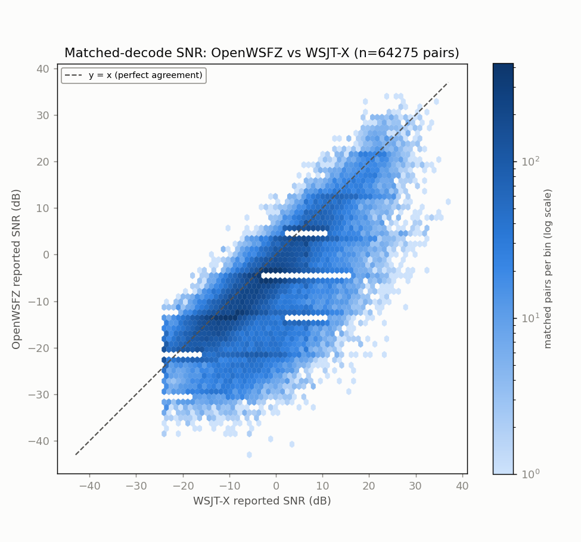
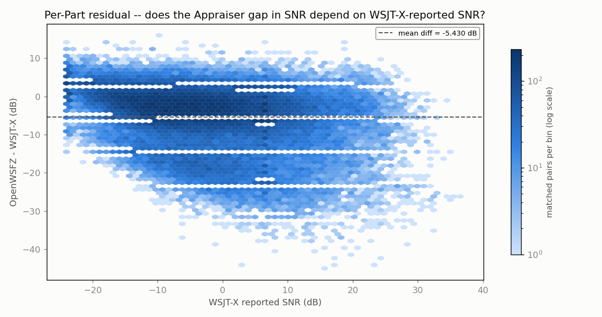
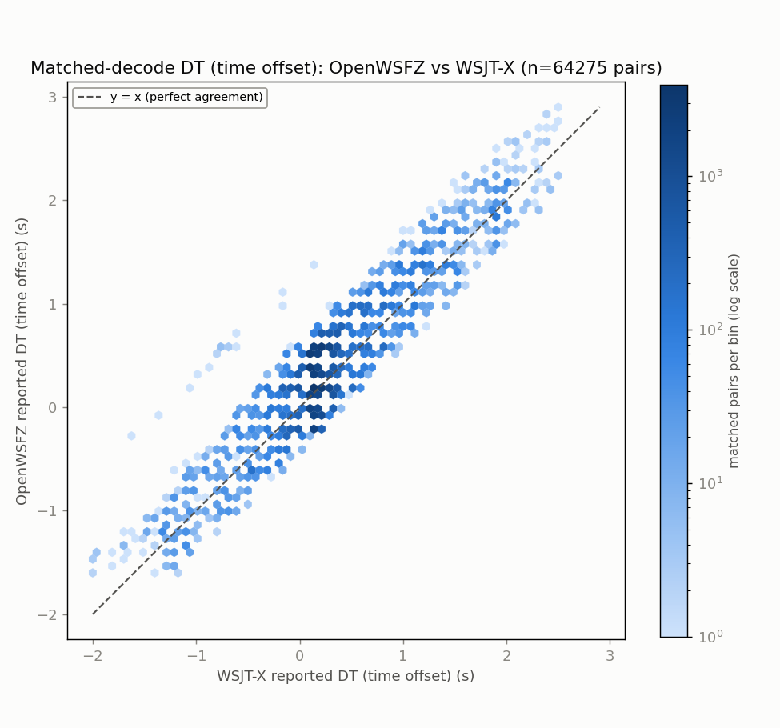
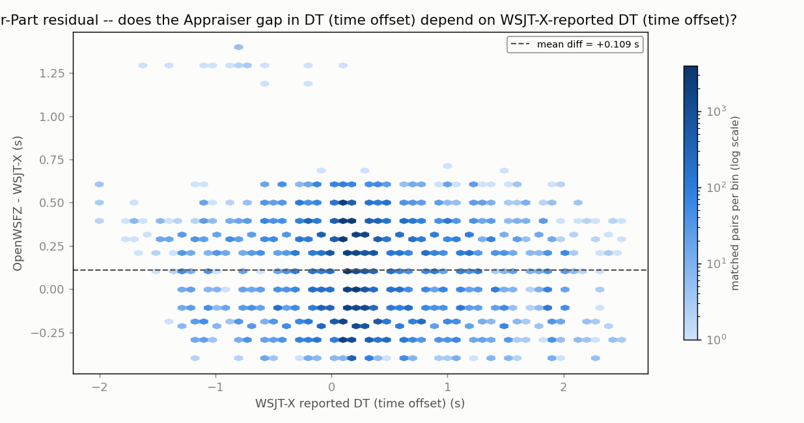
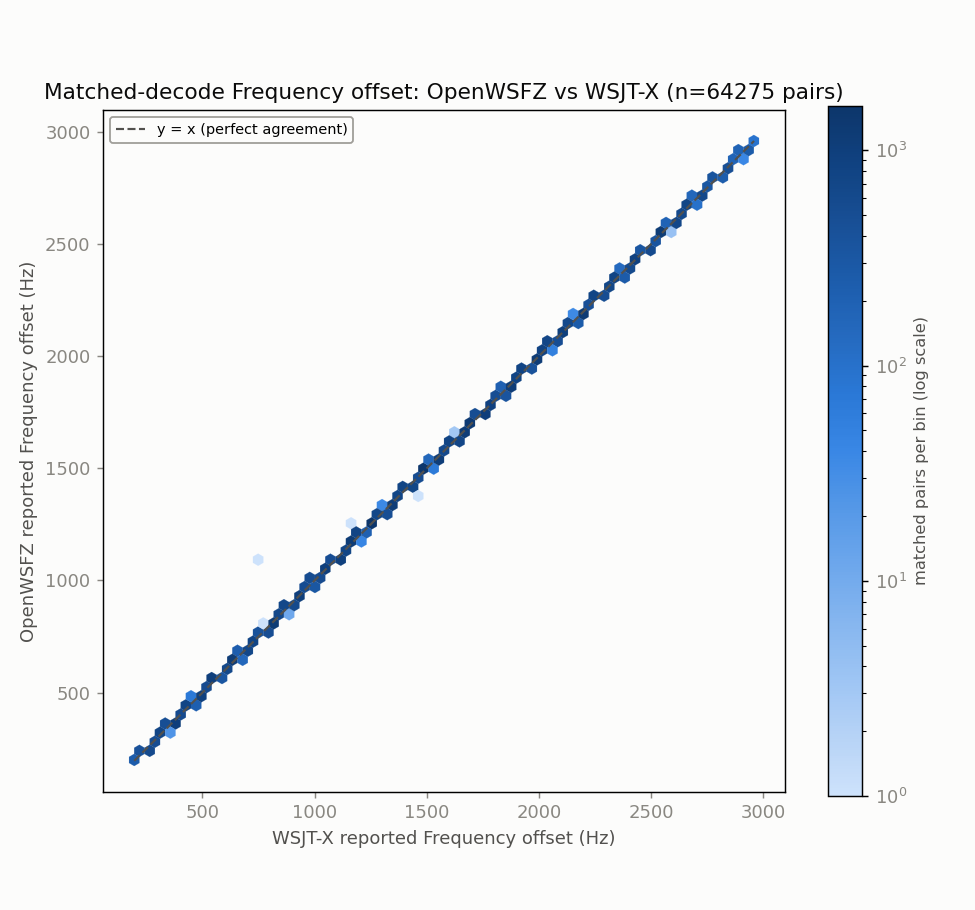
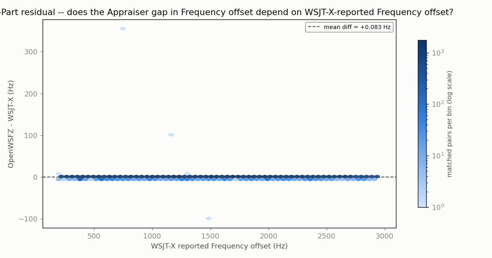

# Endurance-session ANOVA -- matched-decode metrics (OpenWSFZ vs WSJT-X)

**Run:** 2026-07-31 20:04Z -> 2026-08-02 15:52Z multi-day 20m live run (OpenWSFZ 8080/FT-991A vs live WSJT-X, same audio feed)  
**Generated:** 2026-08-02T16:40:02Z (`date -u`, HK-017)  
**Design:** two-way ANOVA without replication (randomized complete block design) -- Part (matched decode instance) x Appraiser (OpenWSFZ, WSJT-X), run separately for each paired numeric response below (SNR, DT, frequency offset) over the identical matched Parts. See anova_common.py's module docstring for why this design applies to single-pass live data, and not the replicated design in `qa/rr-study/harness/anova_compute.py`.

Both appraisers' decode logs come from the same live session already on disk -- OpenWSFZ's own ALL.TXT and the real WSJT-X application's own ALL.TXT, both listening to the same physical radio feed throughout. No re-decoding was performed (contrast endurance_anova_jt9.py, used when there is no live third-party log to read).

- OpenWSFZ decodes in window: **184918**
- WSJT-X decodes in window: **354831**
- Matched pairs (Parts, shared across every response below): **64275**

## Decode coverage

- OpenWSFZ decoded **184918** messages in this window; WSJT-X decoded **354831**.
- **64275** decodes matched between the two (same cycle + normalised message text) -- **34.8%** of OpenWSFZ's decodes, **18.1%** of WSJT-X's decodes.
- OpenWSFZ-only (WSJT-X did not report it): **120643** (65.2% of OpenWSFZ's total).
- WSJT-X-only (OpenWSFZ did not report it): **290556** (81.9% of WSJT-X's total).

## SNR (dB)

| Source | SS | df | MS | F | P |
|---|---:|---:|---:|---:|---:|
| Part | 12552494.1898 | 64274 | 195.2966 | 6.937 | 0.0000 |
| Appraiser | 947737.9536 | 1 | 947737.9536 | 33664.540 | 0.0000 |
| Residual (confounded with interaction, n=1/cell) | 1809468.0464 | 64274 | 28.1524 | | |
| Total | 15309700.1898 | 128549 | | | |

Appraiser means (SNR, dB): OpenWSFZ -7.923 dB, WSJT-X -2.492 dB, grand mean -5.208 dB.

## DT (time offset) (s)

| Source | SS | df | MS | F | P |
|---|---:|---:|---:|---:|---:|
| Part | 20540.8350 | 64274 | 0.3196 | 10.493 | 0.0000 |
| Appraiser | 383.7055 | 1 | 383.7055 | 12598.132 | 0.0000 |
| Residual (confounded with interaction, n=1/cell) | 1957.6145 | 64274 | 0.0305 | | |
| Total | 22882.1550 | 128549 | | | |

Appraiser means (DT (time offset), s): OpenWSFZ 0.3220 s, WSJT-X 0.2127 s, grand mean 0.2674 s.

## Frequency offset (Hz)

| Source | SS | df | MS | F | P |
|---|---:|---:|---:|---:|---:|
| Part | 67385164041.0063 | 64274 | 1048404.7055 | 631550.828 | 0.0000 |
| Appraiser | 223.5731 | 1 | 223.5731 | 134.679 | 0.0000 |
| Residual (confounded with interaction, n=1/cell) | 106697.9269 | 64274 | 1.6600 | | |
| Total | 67385270962.5063 | 128549 | | | |

Appraiser means (Frequency offset, Hz): OpenWSFZ 1503.1 Hz, WSJT-X 1503.0 Hz, grand mean 1503.0 Hz.

## Caveat (structural, not a defect)

With one observation per Part x Appraiser cell -- a live signal happens once -- the interaction term and the residual/error term are mathematically confounded (standard property of an unreplicated factorial design), for every response above. Each table can say whether the two appraisers' *mean* value differs after removing part-to-part variation (the Appraiser row); none of them can separately test whether that difference itself varies signal-to-signal.

Cross-run comparison and interpretation of these numbers is Architect/Captain territory, not this module's.

