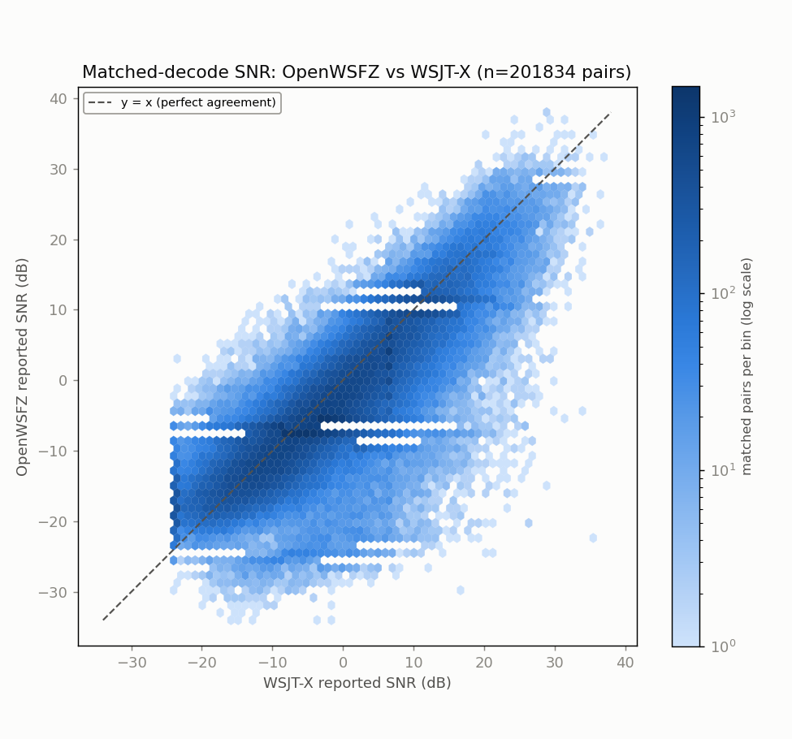
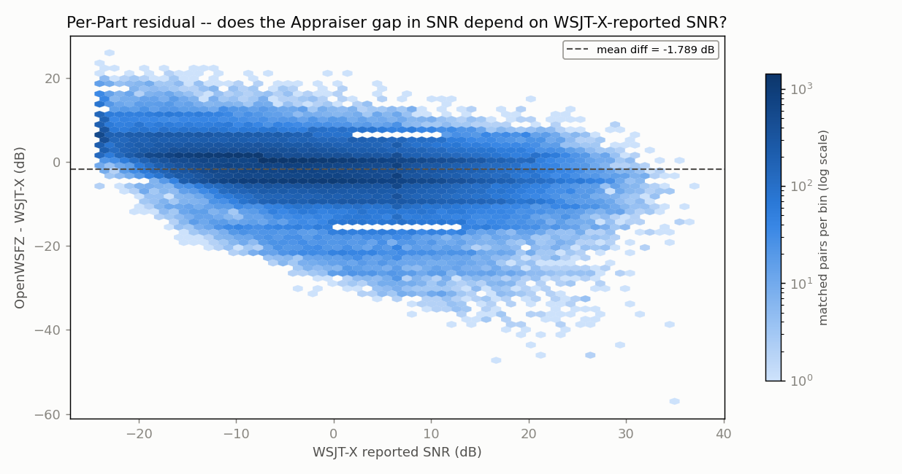
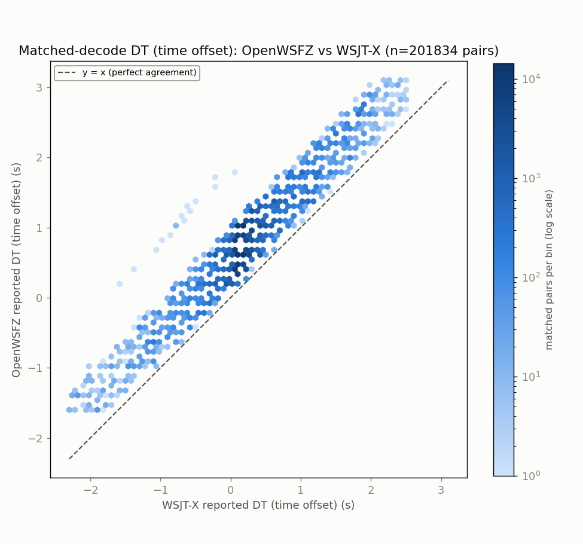
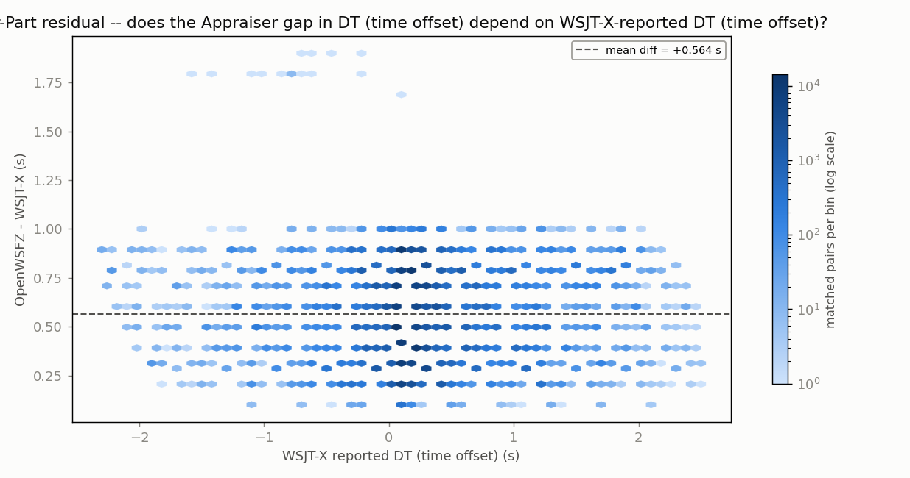
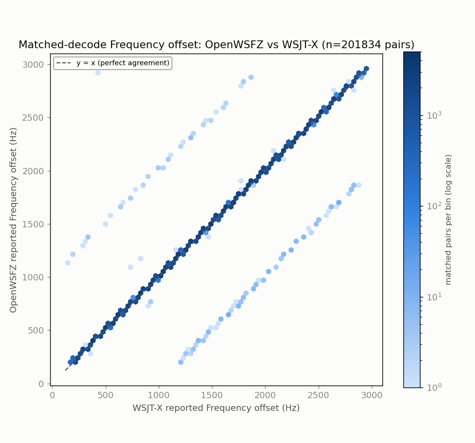
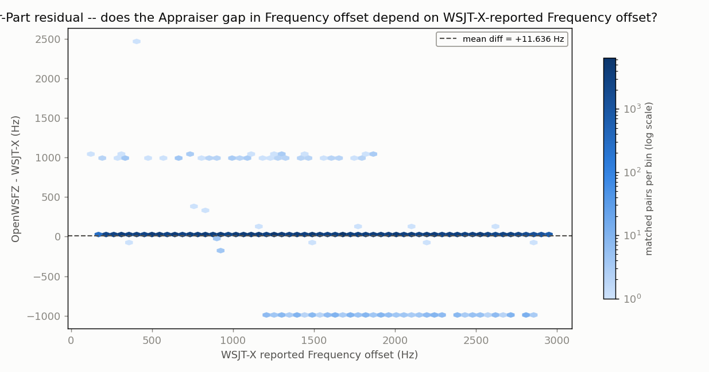

# Endurance-session ANOVA -- matched-decode metrics (OpenWSFZ vs WSJT-X)

**Run:** 2026-07-31 20:04Z -> 2026-08-02 15:52Z multi-day 20m live run (OpenWSFZ 8081/SDR Uno vs live WSJT-X, cross-hardware feed)  
**Generated:** 2026-08-02T16:41:25Z (`date -u`, HK-017)  
**Design:** two-way ANOVA without replication (randomized complete block design) -- Part (matched decode instance) x Appraiser (OpenWSFZ, WSJT-X), run separately for each paired numeric response below (SNR, DT, frequency offset) over the identical matched Parts. See anova_common.py's module docstring for why this design applies to single-pass live data, and not the replicated design in `qa/rr-study/harness/anova_compute.py`.

OpenWSFZ's decodes come from the 8081 instance (SDR Uno -> Voicemeeter B1). WSJT-X's decodes come from a separate WSJT-X application running against the 8080 instance's radio (FT-991A) -- NOT the same receiver. Both instances are fed from one physical antenna via a splitter, so the two ALL.TXTs describe the same population of on-air transmissions, but the receiver hardware, audio chain, and decoder differ between them (contrast anova_report_8080_vs_wsjtx.md, where OpenWSFZ and WSJT-X share the same FT-991A feed and only the decoder differs). No re-decoding was performed.

- OpenWSFZ decodes in window: **212422**
- WSJT-X decodes in window: **354831**
- Matched pairs (Parts, shared across every response below): **201834**

## Decode coverage

- OpenWSFZ decoded **212422** messages in this window; WSJT-X decoded **354831**.
- **201834** decodes matched between the two (same cycle + normalised message text) -- **95.0%** of OpenWSFZ's decodes, **56.9%** of WSJT-X's decodes.
- OpenWSFZ-only (WSJT-X did not report it): **10588** (5.0% of OpenWSFZ's total).
- WSJT-X-only (OpenWSFZ did not report it): **152997** (43.1% of WSJT-X's total).

## SNR (dB)

| Source | SS | df | MS | F | P |
|---|---:|---:|---:|---:|---:|
| Part | 37579290.7479 | 201833 | 186.1900 | 10.979 | 0.0000 |
| Appraiser | 323033.4469 | 1 | 323033.4469 | 19048.033 | 0.0000 |
| Residual (confounded with interaction, n=1/cell) | 3422863.0531 | 201833 | 16.9589 | | |
| Total | 41325187.2479 | 403667 | | | |

Appraiser means (SNR, dB): OpenWSFZ -3.892 dB, WSJT-X -2.103 dB, grand mean -2.998 dB.

## DT (time offset) (s)

| Source | SS | df | MS | F | P |
|---|---:|---:|---:|---:|---:|
| Part | 67256.0587 | 201833 | 0.3332 | 14.086 | 0.0000 |
| Appraiser | 32048.5952 | 1 | 32048.5952 | 1354728.834 | 0.0000 |
| Residual (confounded with interaction, n=1/cell) | 4774.7298 | 201833 | 0.0237 | | |
| Total | 104079.3837 | 403667 | | | |

Appraiser means (DT (time offset), s): OpenWSFZ 0.7743 s, WSJT-X 0.2108 s, grand mean 0.4925 s.

## Frequency offset (Hz)

| Source | SS | df | MS | F | P |
|---|---:|---:|---:|---:|---:|
| Part | 219254599798.4422 | 201833 | 1086316.9046 | 1638.415 | 0.0000 |
| Appraiser | 13664082.5185 | 1 | 13664082.5185 | 20608.564 | 0.0000 |
| Residual (confounded with interaction, n=1/cell) | 133821200.4815 | 201833 | 663.0293 | | |
| Total | 219402085081.4422 | 403667 | | | |

Appraiser means (Frequency offset, Hz): OpenWSFZ 1522.5 Hz, WSJT-X 1510.8 Hz, grand mean 1516.7 Hz.

## Caveat (structural, not a defect)

With one observation per Part x Appraiser cell -- a live signal happens once -- the interaction term and the residual/error term are mathematically confounded (standard property of an unreplicated factorial design), for every response above. Each table can say whether the two appraisers' *mean* value differs after removing part-to-part variation (the Appraiser row); none of them can separately test whether that difference itself varies signal-to-signal.

Cross-run comparison and interpretation of these numbers is Architect/Captain territory, not this module's.

