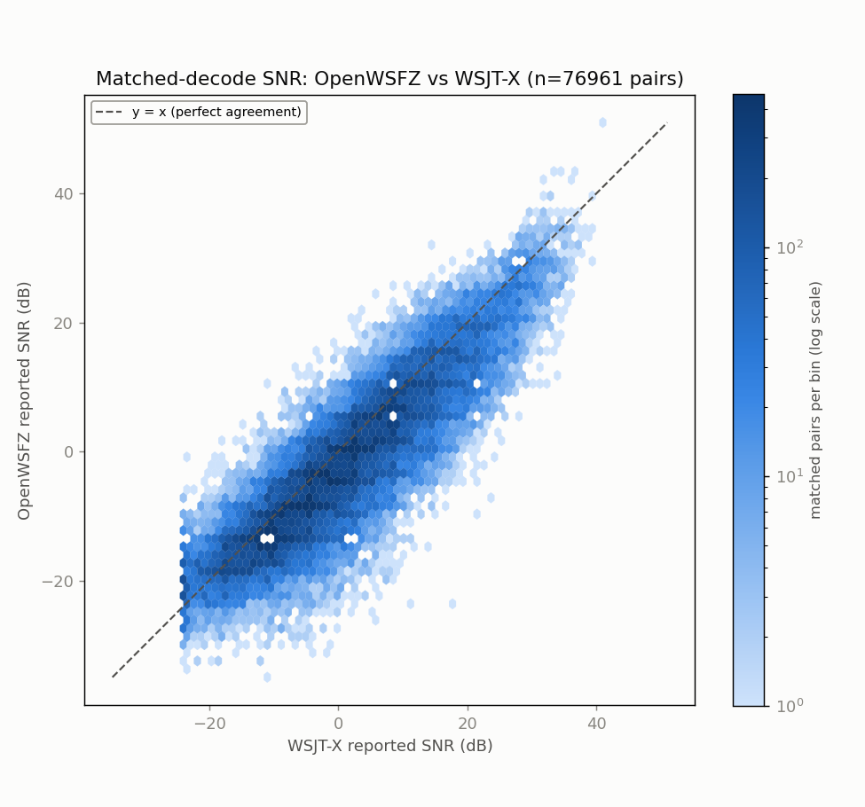
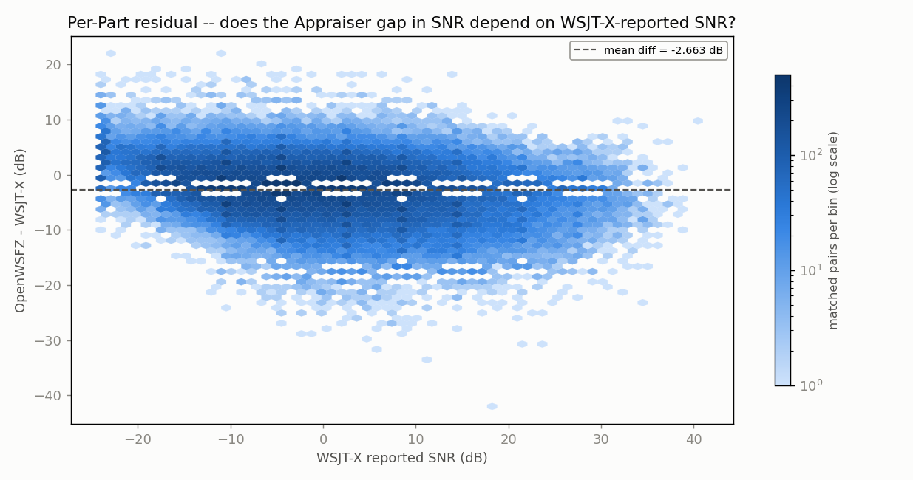
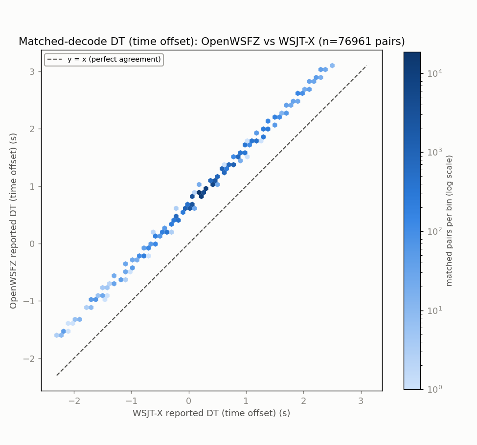
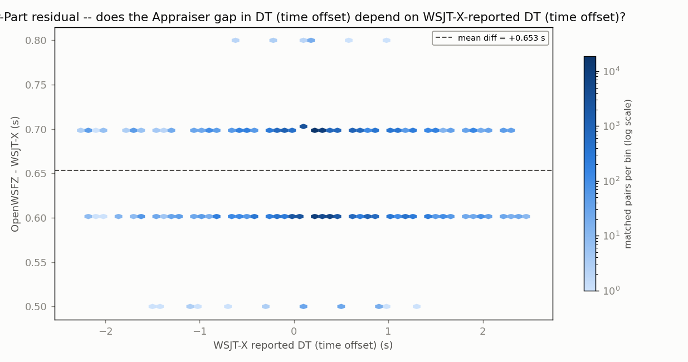
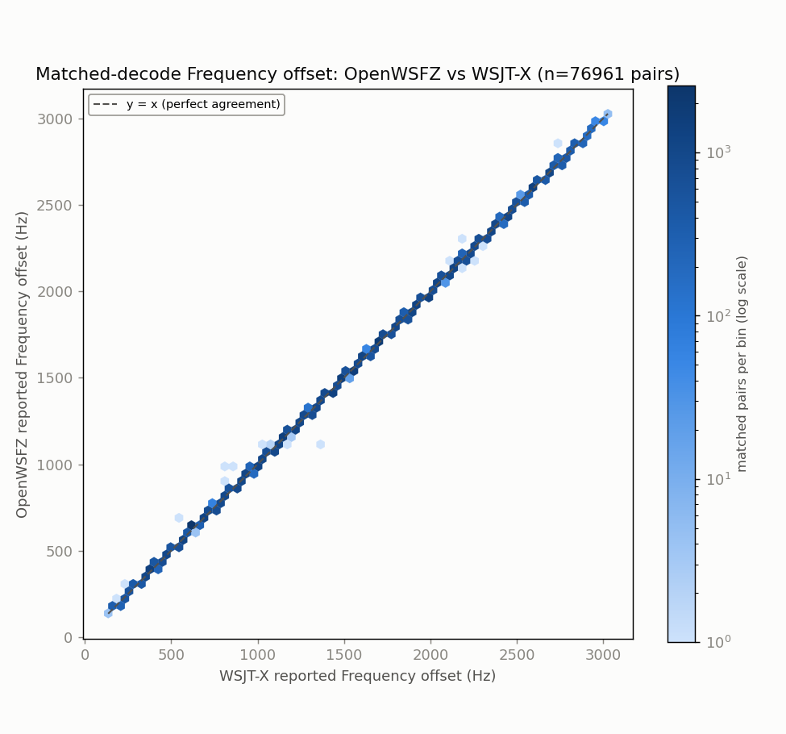
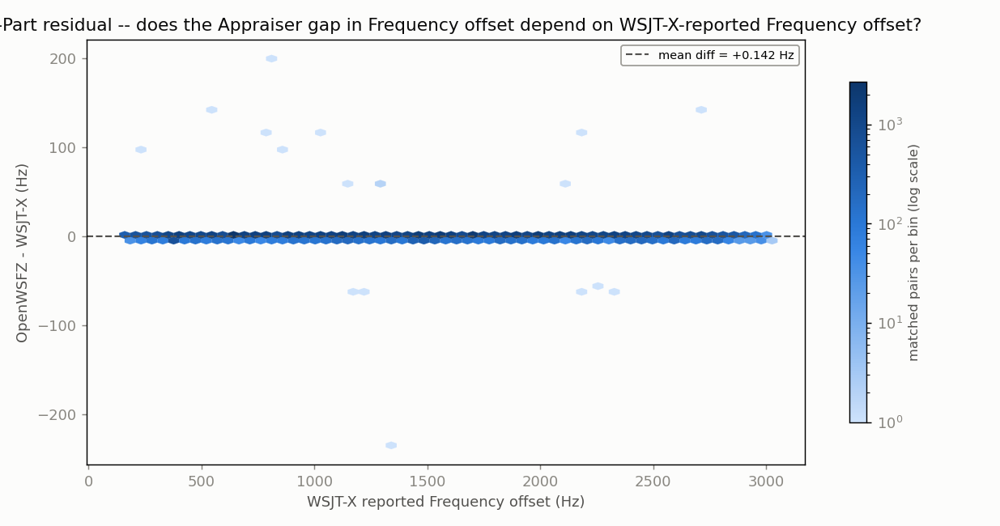

## Grid-alignment gate (per HK-021, 2026-08-02 correction)

| appraiser | unique ts | on-grid | G | row | verdict |
|---|---:|---:|---:|---|---|
| OpenWSFZ | 4852 | 4852 | 1.0000 | ROW 1 | PASS |
| WSJT-X | 4896 | 4896 | 1.0000 | ROW 1 | PASS |

# Endurance-session ANOVA -- matched-decode metrics (OpenWSFZ vs WSJT-X)

**Run:** 2026-09-21/22 20m LIVE-GAP-MAP endurance run (OpenWSFZ decoding_improvement 84cac119 vs live WSJT-X, same audio feed, FT-991A)  
**Generated:** 2026-09-22T19:30:44Z (`date -u`, HK-017)  
**Design:** two-way ANOVA without replication (randomized complete block design) -- Part (matched decode instance) x Appraiser (OpenWSFZ, WSJT-X), run separately for each paired numeric response below (SNR, DT, frequency offset) over the identical matched Parts. See anova_common.py's module docstring for why this design applies to single-pass live data, and not the replicated design in `qa/rr-study/harness/anova_compute.py`.

Both appraisers' decode logs come from the same live session already on disk -- OpenWSFZ's own ALL.TXT and the real WSJT-X application's own ALL.TXT, both listening to the same physical radio feed throughout. No re-decoding was performed (contrast endurance_anova_jt9.py, used when there is no live third-party log to read).

- OpenWSFZ decodes in window: **77985**
- WSJT-X decodes in window: **128369**
- Matched pairs (Parts, shared across every response below): **76961**

## Decode coverage

- OpenWSFZ decoded **77985** messages in this window; WSJT-X decoded **128369**.
- **76961** decodes matched between the two (same cycle + normalised message text) -- **98.7%** of OpenWSFZ's decodes, **60.0%** of WSJT-X's decodes.
- OpenWSFZ-only (WSJT-X did not report it): **1024** (1.3% of OpenWSFZ's total).
- WSJT-X-only (OpenWSFZ did not report it): **51408** (40.0% of WSJT-X's total).

## SNR (dB)

| Source | SS | df | MS | F | P |
|---|---:|---:|---:|---:|---:|
| Part | 18335853.7768 | 76960 | 238.2517 | 18.308 | 0.0000 |
| Appraiser | 272857.4479 | 1 | 272857.4479 | 20967.227 | 0.0000 |
| Residual (confounded with interaction, n=1/cell) | 1001520.5521 | 76960 | 13.0135 | | |
| Total | 19610231.7768 | 153921 | | | |

Appraiser means (SNR, dB): OpenWSFZ -2.575 dB, WSJT-X 0.088 dB, grand mean -1.244 dB.

## DT (time offset) (s)

| Source | SS | df | MS | F | P |
|---|---:|---:|---:|---:|---:|
| Part | 20008.2171 | 76960 | 0.2600 | 206.466 | 0.0000 |
| Appraiser | 16422.3218 | 1 | 16422.3218 | 13041848.555 | 0.0000 |
| Residual (confounded with interaction, n=1/cell) | 96.9082 | 76960 | 0.0013 | | |
| Total | 36527.4471 | 153921 | | | |

Appraiser means (DT (time offset), s): OpenWSFZ 0.9377 s, WSJT-X 0.2844 s, grand mean 0.6111 s.

## Frequency offset (Hz)

| Source | SS | df | MS | F | P |
|---|---:|---:|---:|---:|---:|
| Part | 79877851976.7655 | 76960 | 1037913.8770 | 513816.414 | 0.0000 |
| Appraiser | 772.5928 | 1 | 772.5928 | 382.470 | 0.0000 |
| Residual (confounded with interaction, n=1/cell) | 155459.9072 | 76960 | 2.0200 | | |
| Total | 79878008209.2655 | 153921 | | | |

Appraiser means (Frequency offset, Hz): OpenWSFZ 1486.6 Hz, WSJT-X 1486.5 Hz, grand mean 1486.5 Hz.

## Caveat (structural, not a defect)

With one observation per Part x Appraiser cell -- a live signal happens once -- the interaction term and the residual/error term are mathematically confounded (standard property of an unreplicated factorial design), for every response above. Each table can say whether the two appraisers' *mean* value differs after removing part-to-part variation (the Appraiser row); none of them can separately test whether that difference itself varies signal-to-signal.

Cross-run comparison and interpretation of these numbers is Architect/Captain territory, not this module's.

## Section 4 -- Historical trend: every standardised endurance run to date

12 run(s). `G` is the grid-alignment gate (the lower of the two appraisers' where both are known; ROW 1 PASS >= 0.99). `Ref.` is the second appraiser: live WSJT-X on the same feed, an offline `jt9 -d 3` re-decode, or n/a for a comparison that wasn't against a reference decoder at all (e.g. OpenWSFZ vs OpenWSFZ) -- **offline and n/a rows are marked non-comparable** (HK-031: `jt9 -d 3` offline is not a valid reference decoder) and must not be pooled or compared against live-WSJT-X rows. **Never pool `nhard` 60 and `nhard` 40 runs together.** `Matched %` and `OWS-only %` are each source report's own stated decode-coverage figures (matched as a share of the reference's own decodes; OpenWSFZ-only as a share of OpenWSFZ's own decodes), not recomputed here. `DT gap` has no `+/- SD` column: none of the pre-standardisation reports computed a standalone SD of the DT offset (only appraiser means), and deriving one now from raw logs would be new analysis, not backfill -- it is left out rather than invented. `Source` cites the file(s) every other field in that row was read from, repo-relative. Footnote numbering runs in table order, first-needed.

| Date | Band | Hours | DLL SHA (short) | Shim | nhard | Ref. | Radio chain | G | Matched pairs | Matched % of ref | OWS-only % | SNR gap (dB) | DT gap (s) | Source |
|---|---|---:|---|---:|---:|---|---|---:|---:|---:|---:|---:|---:|---|
| 2026-07-28 | 10m | 9.6 | not recorded | not recorded | not recorded | offline `jt9 -d 3`1 | not recorded | not recorded | 5781 | 68.9 | 10.8 | -14.780 | +0.6662 | `qa/endurance/2026-07-28-031fb37/anova_report_10m.md` |
| 2026-07-28 | 20m | 4.8 | not recorded | not recorded | not recorded | offline `jt9 -d 3`2 | Voicemeeter-fed second receiver | not recorded | 24658 | 48.4 | 3.3 | -6.250 | +0.6543 | `qa/endurance/2026-07-28-031fb37/anova_report_20m.md` |
| 2026-07-28/29 | 20m(originally 80m) | not recorded | not recorded | not recorded | not recorded | n/a (no audio archived, zero decodes)3 | not recorded | not recorded | 0 | not recorded | not recorded | not recorded | not recorded | `qa/endurance/2026-07-29-489135a/anova_report_20m_no_audio.md` |
| 2026-07-28/29 | 40m | not recorded | not recorded | not recorded | not recorded | offline `jt9 -d 3`4 | not recorded | not recorded | 42668 | 60.2 | 3.5 | -10.419 | -0.2733 | `qa/endurance/2026-07-29-489135a/anova_report_40m.md` |
| 2026-07-29 | 20m | not recorded | not recorded | not recorded | not recorded | offline `jt9 -d 3`5 | SDR Uno / Voicemeeter B1 | not recorded | 24201 | 48.9 | 8.2 | -5.602 | +0.6541 | `qa/endurance/2026-07-29-5016363/anova_report_20m.md`, `qa/endurance/2026-07-29-5016363/CONTAMINATION-NOTE.md` |
| 2026-07-29 | 80m | not recorded | not recorded | not recorded | not recorded | offline `jt9 -d 3`67 | SDR Uno / Voicemeeter B1 | not recorded | 8290 | 84.2 | 8.1 | -8.037 | +0.6675 | `qa/endurance/2026-07-29-5016363/anova_report_80m.md`, `qa/endurance/2026-07-29-5016363/CONTAMINATION-NOTE.md` |
| 2026-07-29/30 | 10m | not recorded | not recorded | not recorded | not recorded | offline `jt9 -d 3`8 | SDR Uno / Voicemeeter B1 | not recorded | 9177 | 72.3 | 7.0 | -3.195 | +0.6503 | `qa/endurance/2026-07-29-5016363/anova_report_10m.md` |
| 2026-07-29/30 | 40m | 24.0 | not recorded | not recorded | not recorded | live WSJT-X | not recorded | not recorded | 52736 | 47.8 | 4.2 | -12.498 | -0.6410 | `qa/endurance/2026-07-29-5016363/anova_report_40m.md`, `qa/endurance/2026-07-29-5016363/CONTAMINATION-NOTE.md` |
| 2026-07-31/08-02 | 20m | 43.8 | not recorded | not recorded | not recorded | n/a (OpenWSFZ-8080 vs OpenWSFZ-8081, same decoder both sides, hardware-chain comparison)910 | 8080: FT-991A; 8081: SDR Uno -> Voicemeeter B1 (split antenna) | 0.3472 | 62775 | not recorded | not recorded | -3.467 | -0.4903 | `qa/endurance/2026-08-02-multiday-20m-anova/anova_report_8080_vs_8081.md`, `qa/endurance/2026-08-02-multiday-20m-anova/table_a_8080_vs_8081_grid_snapped.md` |
| 2026-07-31/08-02 | 20m | 43.8 | not recorded | not recorded | not recorded | live WSJT-X11 | FT-991A | 0.3472 | 64275 | 18.1 | 65.2 | -5.431 | +0.1093 | `qa/endurance/2026-08-02-multiday-20m-anova/anova_report_8080_vs_wsjtx.md`, `qa/endurance/2026-08-02-multiday-20m-anova/table_a_8080_vs_wsjtx_grid_snapped.md` |
| 2026-07-31/08-02 | 20m | 43.8 | not recorded | not recorded | not recorded | live WSJT-X | OpenWSFZ-8081: SDR Uno -> Voicemeeter B1; WSJT-X: separate FT-991A instance (cross-hardware, split-antenna feed, NOT the same receiver) | 0.9984 | 201834 | 56.9 | 5.0 | -1.789 | +0.5635 | `qa/endurance/2026-08-02-multiday-20m-anova/anova_report_8081_vs_wsjtx.md`, `qa/endurance/2026-08-02-multiday-20m-anova/table_a_8080_vs_8081_grid_snapped.md` |
| 2026-09-21 | 20m | 24.0 | 38a21f84… | 20260054 | 40 | live WSJT-X | Yaesu FT-991A -> Voicemeeter Out B1 | 1.0000 | 76961 | 60.0 | 1.3 | -2.663 | +0.6533 | `2026-09-21-84cac119/anova_report_20m.md` |

1. non-comparable reference (offline `jt9 -d 3`) -- 2026-07-28 10m
2. non-comparable reference (offline `jt9 -d 3`) -- 2026-07-28 20m
3. non-comparable reference (n/a (no audio archived, zero decodes)) -- 2026-07-28/29 20m(originally 80m)
4. non-comparable reference (offline `jt9 -d 3`) -- 2026-07-28/29 40m
5. non-comparable reference (offline `jt9 -d 3`) -- 2026-07-29 20m
6. non-comparable reference (offline `jt9 -d 3`) -- 2026-07-29 80m
7. drift/audio-contaminated: audio-leak contamination (other Windows-app audio bleeding into the Voicemeeter B1 bus), ~60% of sampled cycles elevated in the 21:18-23:07:30Z portion of this window -- see CONTAMINATION-NOTE.md's own timeline; report's own title flags it explicitly -- 2026-07-29 80m
8. non-comparable reference (offline `jt9 -d 3`) -- 2026-07-29/30 10m
9. non-comparable reference (n/a (OpenWSFZ-8080 vs OpenWSFZ-8081, same decoder both sides, hardware-chain comparison)) -- 2026-07-31/08-02 20m
10. drift/audio-contaminated: 8080's cycle-clock drifts off the FT8 15s grid at ~0.18s/h; the 62,775 matched pairs here are the +0s (on-grid) stratum only, 33.9% of the run's OpenWSFZ-8080 decodes -- see report banner and table_a_8080_vs_8081_grid_snapped.md -- 2026-07-31/08-02 20m
11. drift/audio-contaminated: 8080's cycle-clock drifts off the FT8 15s grid at ~0.18s/h; the 64,275 matched pairs here are the +0s (on-grid) stratum only, 34.8% of the run -- see report banner and table_a_8080_vs_wsjtx_grid_snapped.md -- 2026-07-31/08-02 20m

**Descriptive only.** No trend line and no "build effect" reading is drawn here -- interpretation across runs is Architect/Captain territory, same as every other cross-run comparison this module produces.

