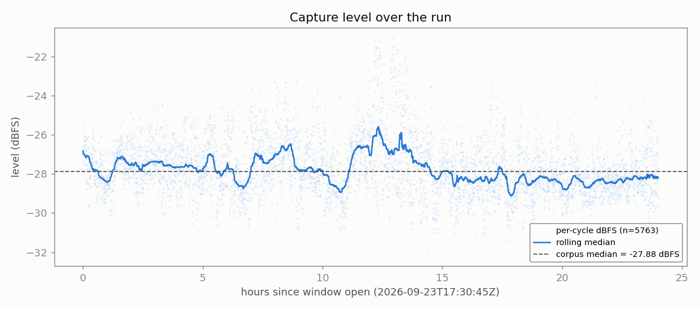
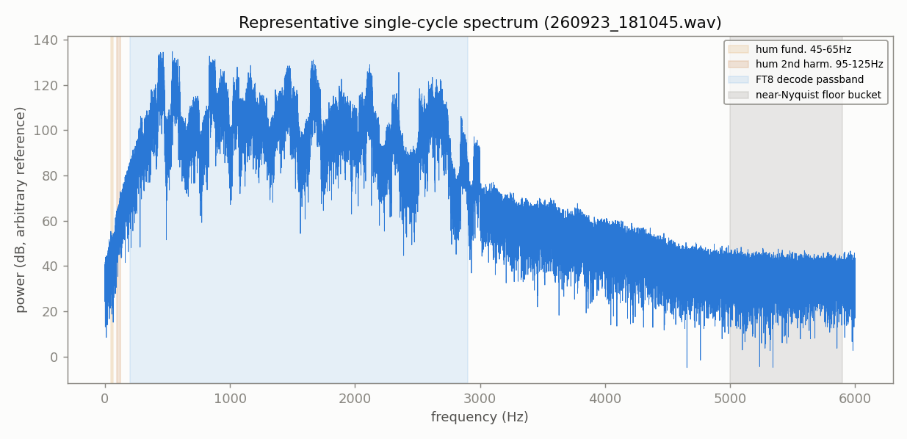
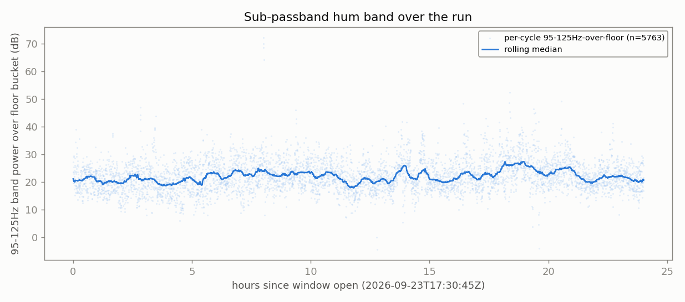
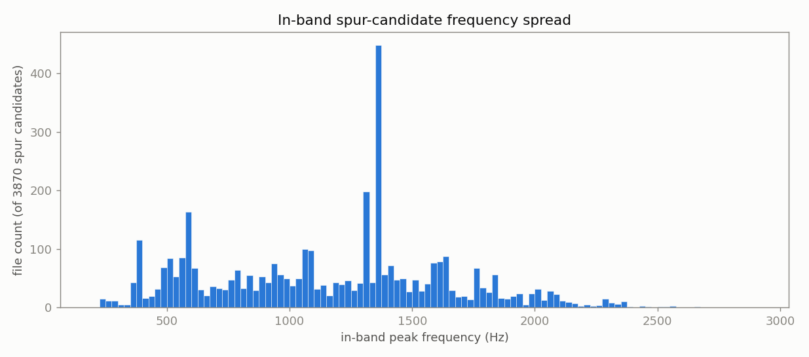
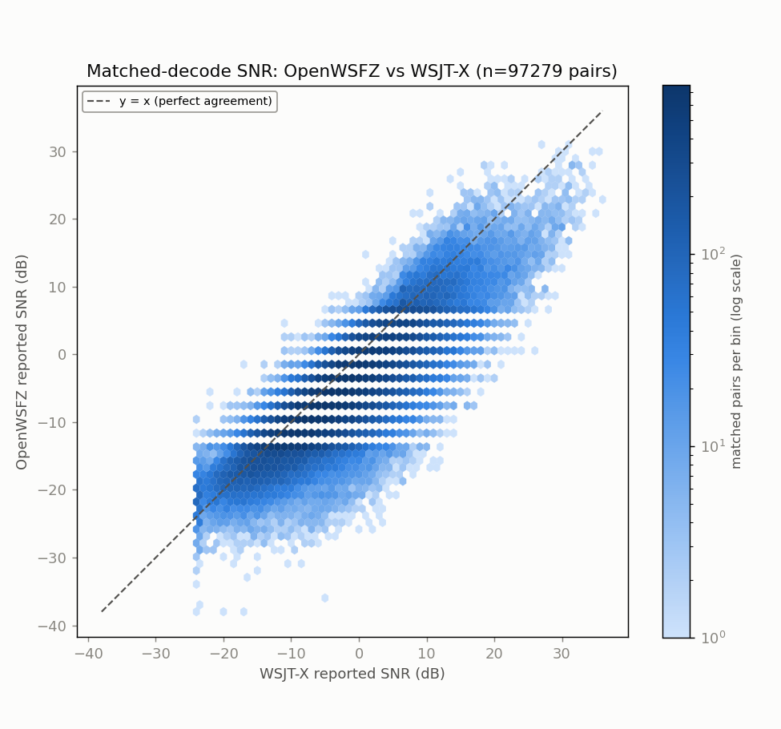
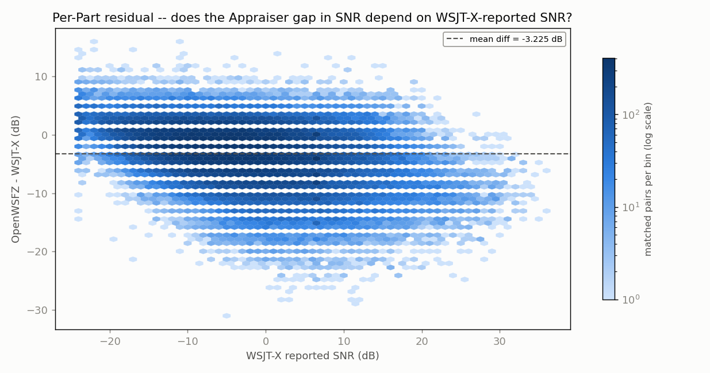
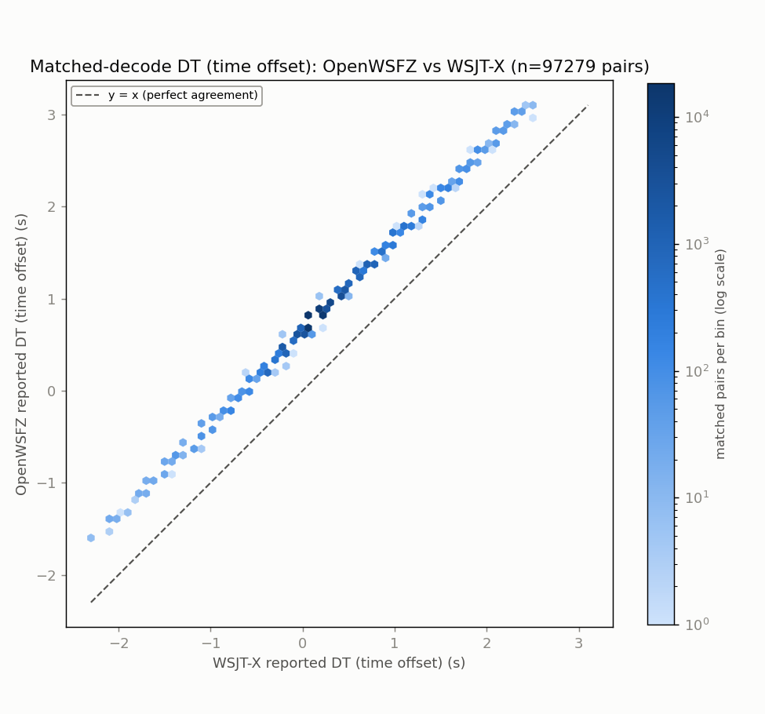
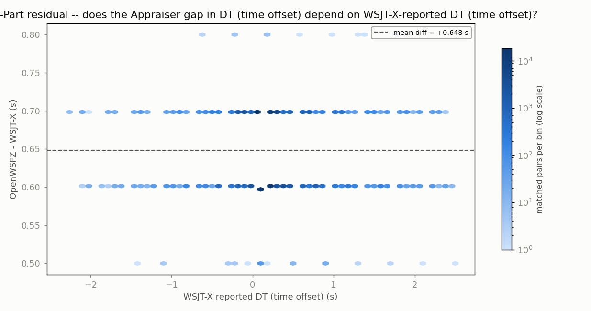
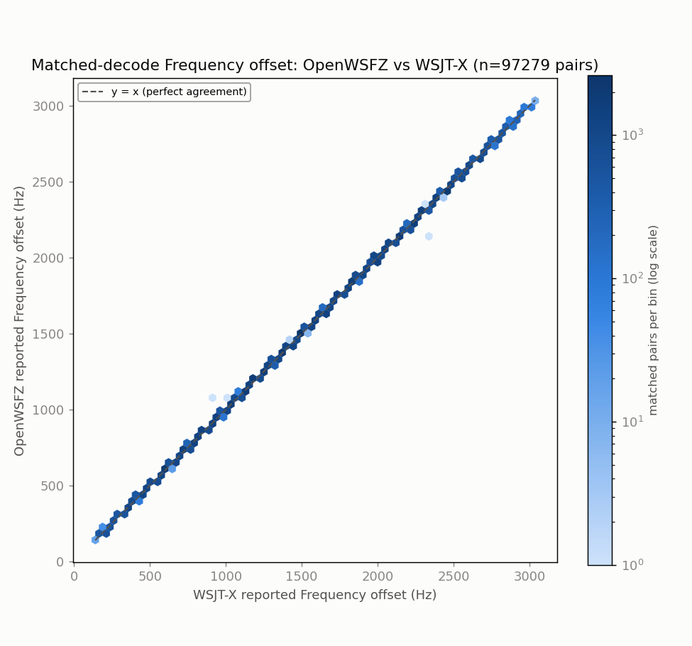
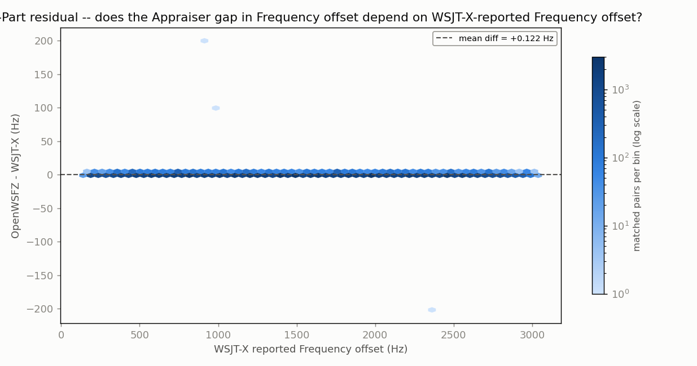

# 24h endurance run -- FINAL REPORT

**Run:** `20260923_1730_endurance_run` -- 40m, direct USB Audio CODEC (Voicemeeter/CABLE bypassed for this arm)
**Window (UTC):** `2026-09-23T17:30:55Z` -> `2026-09-24T17:30:55Z` (24.0h)
**Build:** `decoding_improvement`@`84cac11919e5`, shim `20260054`, daemon v0.50, DLL SHA256 `38a21f84…589a1cba`, `osd_nhard_max=40`
**Purpose (Captain, 2026-09-24):** A/B probe -- does reading the same physical `Microphone (2- USB Audio CODEC )` device directly (no Voicemeeter routing) change anything, as a precondition check before this could ever become the default. **Gated on issues #187 (stale-GUID auto-restart never re-resolves) and #188 (watchdog/status blind without a WebSocket client) being resolved -- this stays experimental regardless of today's result.**
**Generated:** 2026-09-24T17:39:29Z (`date -u`, HK-017)

---

## 1. Run completion & health

- `state.json` / `HANDOFF.md`: phase `DONE`. `events.jsonl`: `daemon_start` -> `window_open` -> `daemon_stop` ("window end") -> `gathered` (exit 0). **Zero restart or problem events for the full 24h** -- `supervisor.log` shows exactly one PRECHECK (`all_pass: true`, 11/11) and one WINDOW OPEN line between start and teardown.
- HK-019 orphan check: clean (`supervisor.log`: "HK-019 orphan check: clean").
- No WebSocket client was attached at any point this run (checked the daemon logs directly), so the in-process `AudioWatchdog`/`DataFlowMonitor` genuinely never ticked -- #188's blind spot was live here. It didn't matter: the supervisor's own independent check (newest `cycle-audio/` WAV mtime, polled every 30s, 3-strike/60s staleness gate) never fired either, and is corroborated directly by this report's own spectrum scan below (zero dropouts, format-consistent through all 5763 files). No evidence a #187-class stale-GUID stall occurred.
- Decode counts: OpenWSFZ 97,954; WSJT-X (reference) 159,265; matched 97,279.

## 2. Spectrum anomaly scan (run BEFORE reading the ANOVA report, per instruction)

**Method:** every one of the 5,763 15s/12kHz mono cycle WAVs in `owsfz/wav/` read in full (no subsampling) -- peak/clip/DC/RMS, FFT-based band powers (FT8 passband 200-2900 Hz, sub-passband hum bands 45-65/95-125 Hz, near-Nyquist floor bucket 5000-5900 Hz per the existing `gap-census-a` convention), and an in-band peak-to-local-median spur check. Script: `spectrum_scan.py` (this directory); full per-file results + summary: `spectrum_scan_summary.json` (this directory).

| Check | Result |
|---|---|
| Files read / errors | 5,763 / 5,763 ok, **0 errors** |
| Format consistency | `fs=12000` and `nframes=180000` on every single file -- 100% consistent |
| Clipping (samples >= 32760) | **0 files** |
| Dropouts (dBFS > 20dB below corpus median) | **0 files** |
| Saturation/hot spikes (> 20dB above median, non-clipped) | **0 files** |
| Level stability | median **-27.88 dBFS**, MAD **0.87 dB**, full range -32.16 to -21.07 dBFS across the whole 24h -- no gain steps, no drift |
| Sub-passband hum bands (45-65/95-125 Hz) | elevated ~20-25 dB over the near-Nyquist floor bucket, **constant across all 24 hourly bins** (median 18.9-26.0 dB, no time-correlated onset) |
| In-band (200-2900 Hz) narrowband peaks >40dB over local median | present in 3,870/5,763 files (67%); one frequency (1375 Hz) stands out visually -- run down below, resolved as a real station, not an artifact |

### Level over the run

No gain steps, no dropouts, no drift -- the rolling median never leaves a ~3.5 dB band around the corpus median for the entire 24h.

### Representative single-cycle spectrum

Shows where the analysis bands actually sit: the sub-passband hum bands are a thin sliver hard against 0 Hz, well separated from the FT8 decode passband (200-2900 Hz) where essentially all the signal energy lives, and the near-Nyquist floor bucket (5000-5900 Hz) sits on the noise tail past the passband.

### Sub-passband hum -- checked against a control, not just flagged

A fixed low-frequency line 20+ dB over the noise floor is the classic ground-loop/hum signature you'd expect from removing Voicemeeter's isolation, so this was worth running down rather than just noting.

1. **Same-band control run.** Sampled 26 files spread across the immediately preceding 40m endurance run (`20260922_2056`, same radio, same band, **Voicemeeter Out B1 routing** -- the standing chain) and ran the identical hum-band-over-floor measurement: median **23.17 dB**, i.e. statistically the same magnitude as this run's 20-25 dB (see the reference line above). **The elevation predates the chain change -- it is not attributable to bypassing Voicemeeter.**
2. **Peak-frequency character.** Fine-resolution FFT on 15 files spread across the run shows the sub-passband peak wandering **120-130 Hz** (one outlier at 47 Hz) rather than locking to a discrete 100 Hz or 120 Hz mains harmonic. True ground-loop hum is razor-stable at the mains frequency; this wanders by 10 Hz between files, which reads as the chain's ordinary low-frequency noise shape (or a roll-off skirt), not a coherent hum tone.

Also irrelevant to decoding either way: both hum bands sit well below the 200-2900 Hz range FT8 content and OpenWSFZ's own decode passband occupy (see the annotated spectrum above).

### In-band spurs -- checked, resolved, not flagged

A >40dB-over-local-median peak in the FT8 band is exactly what a strong, correctly-decoded station's tone looks like, so this detector cannot by design separate legitimate signal from a true interferer -- which is why the one visually prominent bar (1375 Hz, 427/3,870 spur-flagged files by the scan's 5Hz binning) was run down against `owsfz/ALL.TXT` rather than left as a caveat. **NFR-021: no callsign or message text is reproduced here -- aggregate counts only.**

- **1,656 decode lines** within +/-3 Hz of 1375 Hz across the 24h window (this is the wider cross-reference tolerance the standing tooling now uses; the scan's own 5Hz-binned count above them was narrower).
- **352 distinct message texts**, SNR range -29 to +27 dB -- real propagation-driven variance, not a fixed synthetic tone.
- **One message accounts for 66.7% of hits (the calling station's own repeated CQ)**, with the remainder split across many genuine two-way exchanges (different correspondent callsigns replying, working, and signing off).
- **Conclusion: one real, very active station parked on a fixed self-chosen audio offset for much of the day, not a hardware spur or decoder artifact.** Confirmed, not just inferred -- no residual caveat on this bar.

Every other bar in the histogram is smaller still and spread across the whole passband -- consistent with ordinary band traffic, no evidence of a persistent fixed-frequency interferer.

**Verdict: no spectral anomaly attributable to the direct-USB-CODEC routing change.** Capture-chain swap is clean at the audio-capture level -- no clipping, no dropouts, no gain steps, no format breakage; the sub-passband hum signature predates the change (control-checked); and the one visually prominent in-band peak is a real, confirmed station, not an artifact.

## 3. HK-036 Section 4 read (historical trend)

Full table: `anova_report.md` Section 4 (regenerated this session with `--hours 24.0` after the first pass silently omitted this run's own row -- caught before reading, not after).

Only two historical rows are directly comparable (live WSJT-X reference, 40m, `nhard`=40, same build/shim -- per the standing rule, never pool against the pre-2026-09-12 `nhard`=60 40m rows or against 20m rows):

| Date | Hours | Radio chain | Matched % of ref | OWS-only % | SNR gap (dB) | DT gap (s) |
|---|---:|---|---:|---:|---:|---:|
| 2026-09-22 | 12.0 | Yaesu FT-991A -> Voicemeeter Out B1 | 59.8 | 0.8 | -2.824 | +0.6548 |
| 2026-09-23/24 (this run) | 24.0 | FT-991A -> USB Audio CODEC, **direct** | 61.1 | 0.7 | -3.225 | +0.6484 |

**Did anything change?**
- DT gap, matched %, and OWS-only % all sit within the range this pair already established -- no material movement.
- **SNR gap moved from -2.824 dB to -3.225 dB (~0.4 dB more negative for OpenWSFZ relative to WSJT-X)** -- the largest single-step SNR-gap move in the `nhard`=40 series so far, and it lands on exactly the row that differs by capture chain.
- **Not concluding causation from this alone.** Only two comparable rows exist (n=2), the run lengths differ (12h vs 24h), and the two windows cover different day/night propagation mixes on 40m. A single ~0.4dB step is not distinguishable from ordinary run-to-run band-condition variance with this little data -- flagging it, not ruling on it.

### This run's own ANOVA charts (matched decodes, OpenWSFZ vs live WSJT-X, n=97,279 pairs)

**SNR (dB)** -- Appraiser means: OpenWSFZ -5.770 dB, WSJT-X -2.544 dB.

**DT / time offset (s)** -- Appraiser means: OpenWSFZ 0.8487 s, WSJT-X 0.2003 s.

**Frequency offset (Hz)** -- Appraiser means: OpenWSFZ 1510.9 Hz, WSJT-X 1510.8 Hz.

Full ANOVA tables (SS/df/MS/F/P) for all three responses, the grid-alignment gate, and the structural caveat about the confounded interaction/residual term (n=1 per cell) are in `anova_report.md` -- not duplicated here.

## 4. Overall verdict

- **Data quality: clean.** Nothing in the spectrum scan or the run-health check gives grounds to distrust this run's decode figures.
- **The experiment's actual question -- "is there a difference" -- has one candidate signal:** the SNR-gap shift, unconfirmed pending a second same-chain data point.
- **Adoption gate unchanged:** #187 and #188 remain open, so direct-CODEC routing stays experimental regardless of today's result, per the Captain's own condition.
- **Recommendation (not actioned, HK-004):** a second 40m `nhard`=40 leg on one chain or the other would turn the SNR-gap observation from "flagged" into either "confirmed" or "noise" -- your call on which chain to repeat.

## Files in this directory

- `anova_report.md` / `.html` -- the standard ANOVA report (regenerated with `--hours 24.0`, `--radio-chain` set explicitly so Section 4 records the chain deviation)
- `anova_report_{snr,dt,freq_hz}_{scatter,residual}.png` -- the 6 ANOVA charts, embedded above
- `spectrum_scan.py` -- the anomaly-scan script (full corpus, no subsampling)
- `spectrum_scan_summary.json` -- the scan's summary statistics (per-file rows omitted here for size; full JSON is in this session's scratchpad if needed again)
- `spectrum_scan_level_timeseries.png`, `spectrum_scan_hum_timeseries.png`, `spectrum_scan_spur_histogram.png`, `spectrum_scan_example_spectrum.png` -- the 4 spectral charts, embedded above
- `owsfz/`, `wsjt-x/` -- gathered decode logs and WAVs
