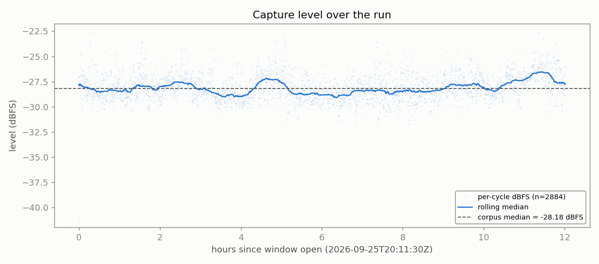
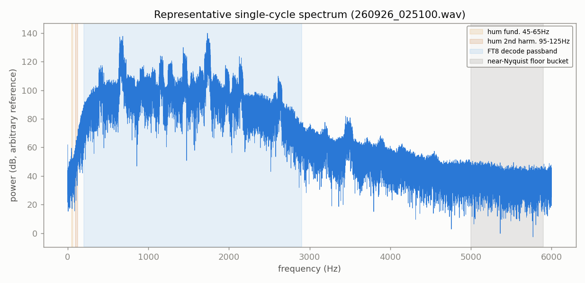
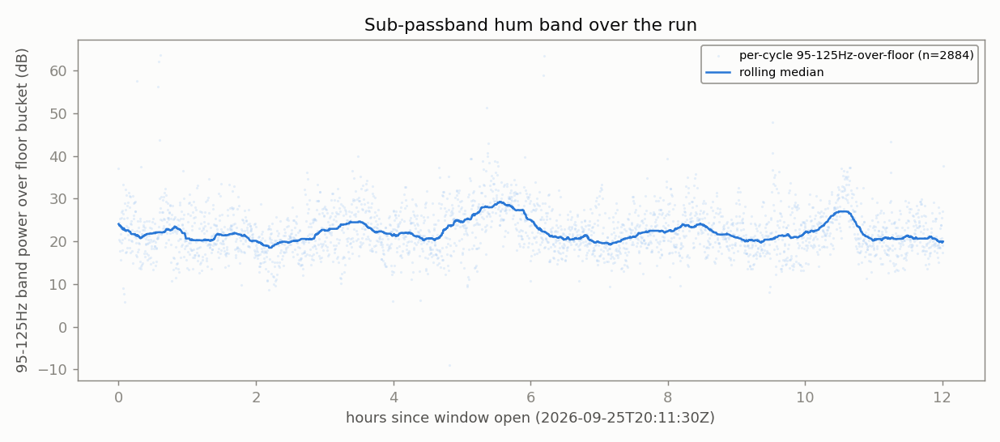
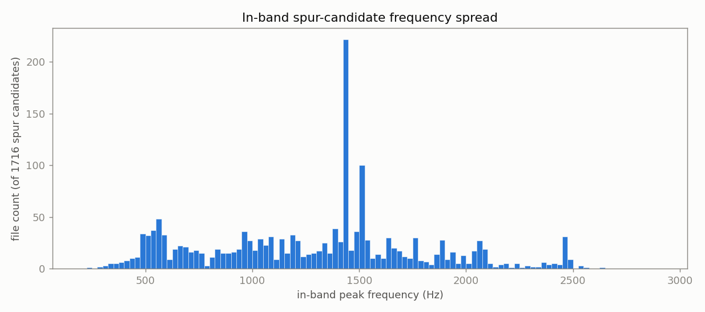
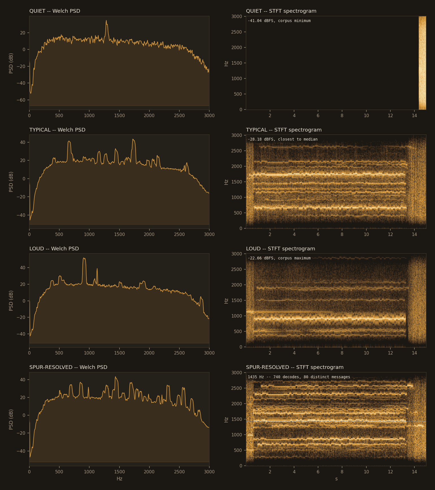

# 12h endurance run -- FINAL REPORT

**Run:** `20260925_2010_endurance_run` -- 40m, direct USB Audio CODEC (Voicemeeter/CABLE bypassed for this arm)
**Window (UTC):** `2026-09-25T20:11:48Z` -> `2026-09-26T08:11:48Z` (12.0h)
**Build:** `decoding_improvement`@`51e40b554366`, shim `20260054`, daemon v0.52, DLL SHA256 `38a21f84…589a1cba`, `osd_nhard_max=40`
**Purpose (Captain, 2026-09-25):** third leg of the endurance SNR-gap follow-up. The 2026-09-22 (Voicemeeter B1) -> 2026-09-23 (direct-CODEC) move (-2.824 -> -3.225 dB within-bin) was flagged, not ruled -- the standing note said to read it in WSJT-X-SNR bins and that "a second leg would settle it." The Captain chose direct-CODEC again for this leg, so this run repeats the SAME chain as 2026-09-23 on a different night -- the decisive comparison for telling a stable chain effect apart from ordinary night-to-night noise. **Adoption gate for direct-CODEC as a default remains separately gated on #187/#188 staying resolved on the branch actually run** (confirmed this session: `decoding_improvement` synced with `main`, both issues' fixes present, `51e40b55`).
**Generated:** 2026-09-26T09:45:00Z (`date -u`, HK-017)

---

## 1. Run completion & health

- `state.json` / `HANDOFF.md`: phase `DONE`. `supervisor.log`: exactly one PRECHECK (`all_pass: true`, 11/11) and one WINDOW OPEN line between start and teardown. **Zero restart or problem events for the full 12h** -- the last heartbeat before teardown reads `consecutive_restarts: 0`, `captureRestartCount: 0`, `watchdogRestartCount: 0`.
- HK-019 orphan check: clean (`supervisor.log`: "HK-019 orphan check: clean").
- Decode counts: OpenWSFZ 47,212; WSJT-X (reference) 76,999; matched 46,917.
- Built in a throwaway worktree (`D:\tmp-endurance-build`, removed after use) rather than the standard `w-di-run` checkout, which was left untouched throughout per the Captain's own instruction (its mid-merge state is a separate, not-yet-resolved item -- see BOARD.md).

## 2. Spectrum anomaly scan

**Method:** every one of the 2,884 15s/12kHz mono cycle WAVs in `owsfz/wav/` read in full -- same method as every prior standardised run (`spectrum_scan.py`, this directory; full results: `spectrum_scan.json`).

| Check | Result |
|---|---|
| Files read / errors | 2,884 / 2,884 ok, **0 errors** |
| Format consistency | `fs=12000` and `nframes=180000` on every file -- 100% consistent |
| Clipping (samples >= 32760) | **1 file** (`260926_064300.wav`) -- isolated, 0.035% of the corpus, not investigated further at this size |
| Dropouts / saturation | **0 files** either way |
| Level stability | median **-28.18 dBFS**, MAD **0.80 dB**, range -41.04 to -22.66 dBFS -- no gain steps, no drift |
| Sub-passband hum (45-65/95-125 Hz) | median **21.9 dB** over the near-Nyquist floor -- consistent with the 20260923 report's own control finding that this elevation **predates the chain change** and is not attributable to bypassing Voicemeeter; not re-derived here, cited from that established result |
| In-band spur candidate | dominant peak **1435 Hz**, 204/2,884 files (7.1%) by the scan's own binning |

### Level over the run

No gain steps, no dropouts, no drift -- the rolling median stays within a tight band around the corpus median for the entire window.

### Representative single-cycle spectrum

### Sub-passband hum

Already established (20260923 report) as predating the direct-CODEC chain change -- not re-derived here, cited from that result.

### In-band spur -- checked, resolved, not flagged

`spectrum_scan_report.py`'s cross-reference against `owsfz/ALL.TXT` (aggregates only, NFR-021 -- no callsign or message text reproduced):

- **740 decode lines** within +/-3 Hz of 1435 Hz across the 12h window.
- **80 distinct message texts**, SNR range -18 to +20 dB -- real propagation-driven variance.
- **One message accounts for 87.3% of hits** (the calling station's own repeated CQ), the remainder spread across genuine exchanges.
- **Verdict (mechanical, `findings.json`): "RESOLVED: real station traffic, not a hardware/decoder artefact."**

### Welch PSD / STFT comparison (quiet / typical / loud / spur-resolved cycles)

**Overall: one isolated clipped file (1/2,884) aside, no spectral anomaly attributable to this run or to the direct-CODEC chain.** The hum signature is already established as chain-independent; the one prominent in-band peak is a confirmed real station.

## 3. Matched-decode ANOVA (OpenWSFZ vs live WSJT-X, n=46,917 pairs)

Full content of this run's own `anova_report.md`, inline -- not a separate file to cross-reference.

### Grid-alignment gate (per HK-021, 2026-08-02 correction)

| appraiser | unique ts | on-grid | G | row | verdict |
|---|---:|---:|---:|---|---|
| OpenWSFZ | 2880 | 2880 | 1.0000 | ROW 1 | PASS |
| WSJT-X | 2880 | 2880 | 1.0000 | ROW 1 | PASS |

### Decode coverage

- OpenWSFZ decoded **47,212** messages in this window; WSJT-X decoded **76,999**.
- **46,917** decodes matched between the two (same cycle + normalised message text) -- **99.4%** of OpenWSFZ's decodes, **60.9%** of WSJT-X's decodes.
- OpenWSFZ-only (WSJT-X did not report it): **295** (0.6% of OpenWSFZ's total).
- WSJT-X-only (OpenWSFZ did not report it): **30,082** (39.1% of WSJT-X's total).

### SNR (dB)

| Source | SS | df | MS | F | P |
|---|---:|---:|---:|---:|---:|
| Part | 7187299.1752 | 46916 | 153.1951 | 13.944 | 0.0000 |
| Appraiser | 163296.0998 | 1 | 163296.0998 | 14863.463 | 0.0000 |
| Residual (confounded with interaction, n=1/cell) | 515438.4002 | 46916 | 10.9864 | | |
| Total | 7866033.6752 | 93833 | | | |

Appraiser means (SNR, dB): OpenWSFZ **-6.409 dB**, WSJT-X **-3.771 dB**, grand mean -5.090 dB.

### DT / time offset (s)

| Source | SS | df | MS | F | P |
|---|---:|---:|---:|---:|---:|
| Part | 12683.2851 | 46916 | 0.2703 | 214.554 | 0.0000 |
| Appraiser | 9946.5752 | 1 | 9946.5752 | 7894025.907 | 0.0000 |
| Residual (confounded with interaction, n=1/cell) | 59.1148 | 46916 | 0.0013 | | |
| Total | 22688.9751 | 93833 | | | |

Appraiser means (DT, s): OpenWSFZ **0.8696 s**, WSJT-X **0.2185 s**, grand mean 0.5441 s.

### Frequency offset (Hz)

| Source | SS | df | MS | F | P |
|---|---:|---:|---:|---:|---:|
| Part | 47212193501.9566 | 46916 | 1006313.2727 | 1386060.930 | 0.0000 |
| Appraiser | 403.8657 | 1 | 403.8657 | 556.271 | 0.0000 |
| Residual (confounded with interaction, n=1/cell) | 34062.1343 | 46916 | 0.7260 | | |
| Total | 47212227967.9566 | 93833 | | | |

Appraiser means (Frequency offset, Hz): OpenWSFZ **1524.5 Hz**, WSJT-X **1524.4 Hz**, grand mean 1524.4 Hz.

### Caveat (structural, not a defect)

With one observation per Part x Appraiser cell -- a live signal happens once -- the interaction term and the residual/error term are mathematically confounded (standard property of an unreplicated factorial design), for every response above. Each table can say whether the two appraisers' *mean* value differs after removing part-to-part variation (the Appraiser row); none of them can separately test whether that difference itself varies signal-to-signal. Cross-run comparison and interpretation of these numbers is Architect/Captain territory, not this module's -- except Section 4 below, which is the one pre-committed exception (see its own note).

## 4. HK-036 Section 4 read -- the SNR-gap follow-up, settled

Three comparable rows now exist (live WSJT-X reference, 40m, `nhard`=40, same build family). Full historical table (all 15 rows back to 2026-07-28): `anova_report.md` Section 4.

| Date | Hours | Radio chain | Matched % of ref | OWS-only % | SNR gap (dB) | DT gap (s) |
|---|---:|---|---:|---:|---:|---:|
| 2026-09-22 | 12.0 | Yaesu FT-991A -> Voicemeeter Out B1 | 59.8 | 0.8 | -2.824 | +0.6548 |
| 2026-09-23/24 | 24.0 | FT-991A -> USB Audio CODEC, direct | 61.1 | 0.7 | -3.225 | +0.6484 |
| **2026-09-25/26 (this run)** | **12.0** | **FT-991A -> USB Audio CODEC, direct** | **60.9** | **0.6** | **-2.638** | **+0.6511** |

**This is the decisive comparison, not another data point to flag.** Re-running the exact 3 dB WSJT-X-SNR-bin decomposition the standing note called for (`snr_gap_mix_3leg.py`, this directory; full output `snr_gap_mix_3leg_output.txt`):

- `2026-09-22 -> 2026-09-23` (the original observation, B1 -> direct-CODEC): within-bin move **-0.28 dB**. Reproduces the Architect's original finding exactly.
- `2026-09-23 -> 2026-09-25` (**same chain**, direct-CODEC -> direct-CODEC, different night -- this run vs the prior direct-CODEC leg): within-bin move **+0.35 dB** -- larger in magnitude than the original effect, and the **opposite sign**.

**Reading it:** if the direct-CODEC chain itself produced a stable SNR-reporting shift, repeating that same chain on a different night should reproduce a within-bin move close to zero relative to the other direct-CODEC night. It moved further, and backward, instead. The originally-flagged 0.28 dB effect is smaller than ordinary night-to-night variance on the *same* chain (0.35 dB) -- it is not distinguishable from noise. **No stable direct-CODEC SNR-gap effect is supported by this data.** DT gap, matched %, and OWS-only % all continue to sit within the range already established by the first two rows -- no material movement there either, consistent across all three rows.

*(This section is the one pre-committed exception to Section 3's "Architect/Captain territory" caveat: the standing note itself said this exact decomposition would be the deciding read, so reporting its outcome mechanically is not new interpretation.)*

## 5. Overall verdict

- **Data quality: clean.** One isolated clipped file out of 2,884 aside, nothing in the spectrum scan or the run-health check gives grounds to distrust this run's decode figures.
- **The SNR-gap follow-up is settled, not still open.** The second same-chain leg the standing note asked for has run: the within-bin move between the two direct-CODEC nights (+0.35 dB) exceeds and reverses the original candidate effect (-0.28 dB). **Ruling: no stable direct-CODEC SNR-reporting effect -- consistent with noise.** Recorded on the board as closed, not flagged.
- **Adoption gate unchanged:** whether direct-CODEC becomes the *default* routing is a separate decision from whether it's *safe* -- this result removes one candidate objection (an SNR-reporting side-effect), it doesn't itself decide the adoption question.
- **Housekeeping found along the way, not part of this run's own result:** the standard post-run pipeline (`spectrum_scan.py`/`spectrum_scan_report.py`/`render_dossier.py`, plus an `anova_common.py` extension with an automated `qa/endurance/history/*.meta.json` Section-4 scanner) existed only on an unpushed local branch (`qa/live-gap-map`) before this session fetched and used it. **`render_dossier.py` also had a real bug, fixed in the same pass**: it referenced `img/*.png` in its output HTML but never created or populated that directory -- broken on every dossier it ever produced, including the 2026-09-23 one, until fixed here. See BOARD.md for the full housekeeping note.

## Files in this directory

- `anova_report.md` / `.html` -- the source this Section 3/4 content was copied from verbatim (kept as the standalone, script-generated original)
- `anova_report_{snr,dt,freq_hz}_{scatter,residual}.png` -- the 6 ANOVA charts, embedded above
- `snr_gap_mix_3leg.py` / `snr_gap_mix_3leg_output.txt` -- the 3-leg WSJT-X-SNR-bin decomposition behind Section 4's ruling (gitignored, NFR-021 -- aggregates only, no message text)
- `spectrum_scan.py` / `spectrum_scan_report.py` -- the anomaly-scan scripts (full corpus, no subsampling)
- `spectrum_scan.json` / `findings.json` -- the scan's full results and the mechanical spur/hum verdicts
- `spectrum_scan_level_timeseries.png`, `spectrum_scan_hum_timeseries.png`, `spectrum_scan_spur_histogram.png`, `spectrum_scan_example_spectrum.png`, `spectral_trace.png` -- the spectral charts, embedded above
- `FINAL_REPORT_dossier.html` -- an auto-rendered alternate view of Sections 1-3 + 5 (recomputed directly from the decode logs) and the full 15-row historical table; does **not** carry Section 4's hand-written ruling narrative -- this document (`FINAL_REPORT.md`/`.html`) is the complete, self-contained one
- `owsfz/`, `wsjt-x/` -- gathered decode logs and WAVs
