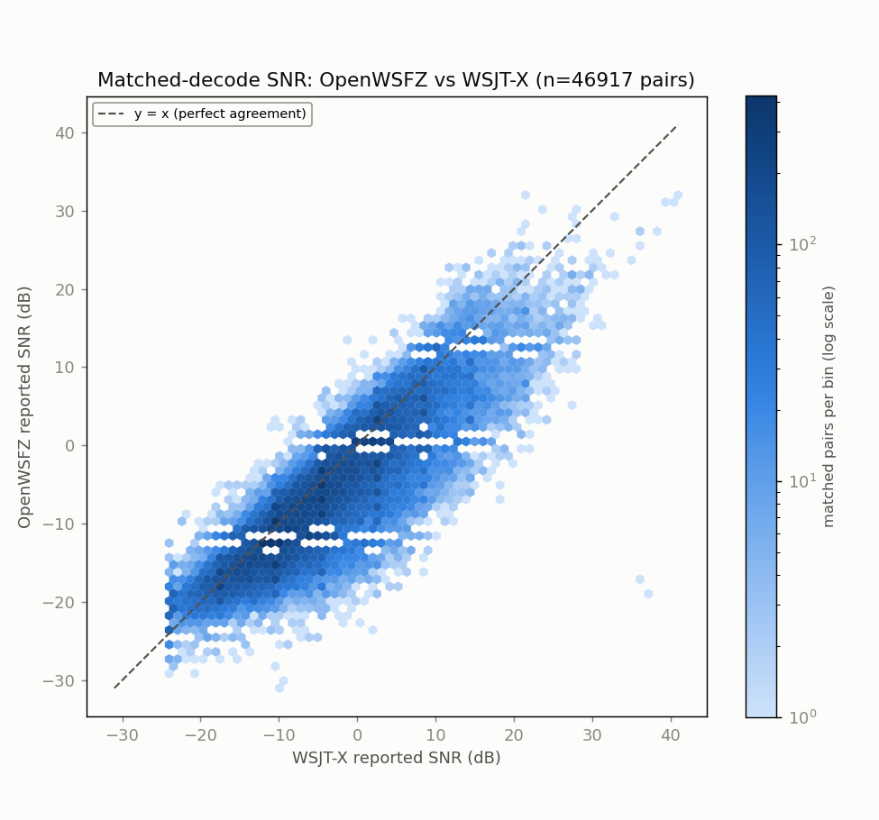
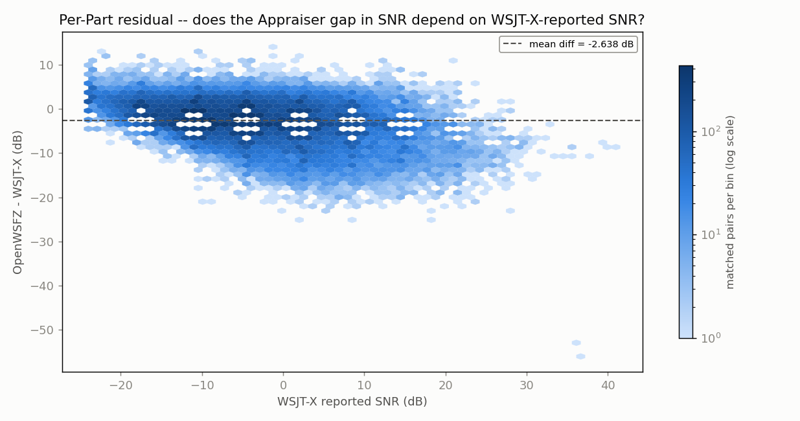
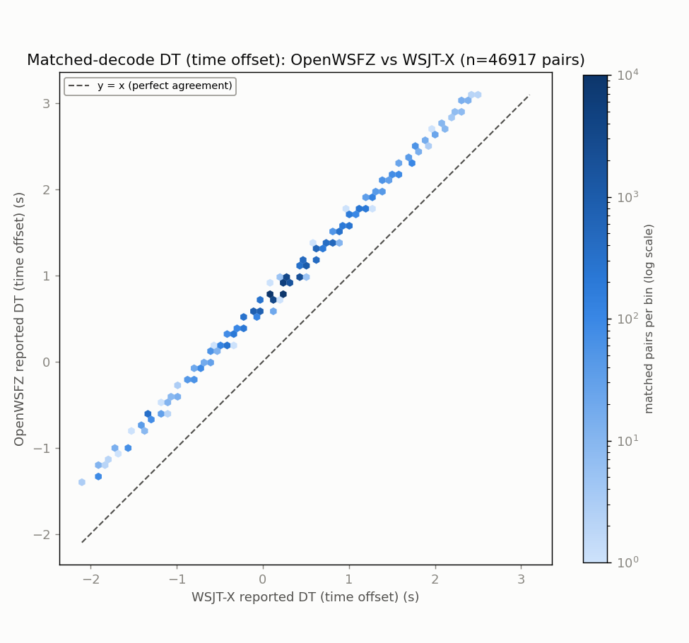
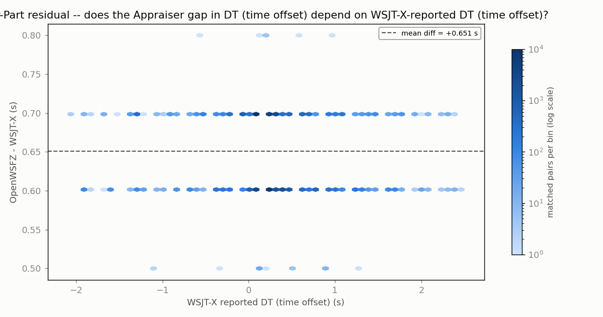
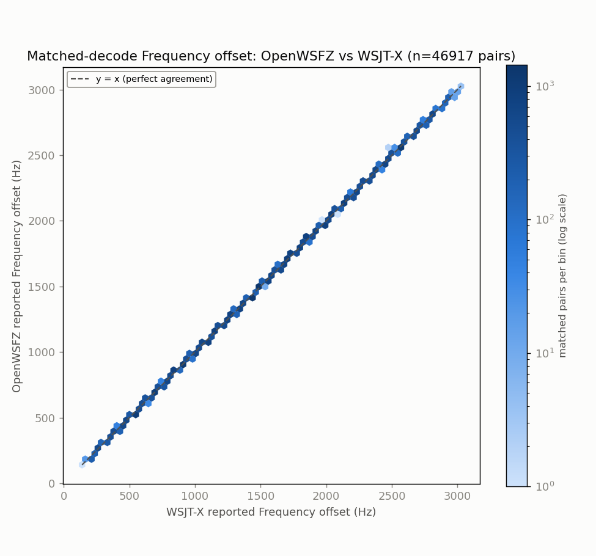
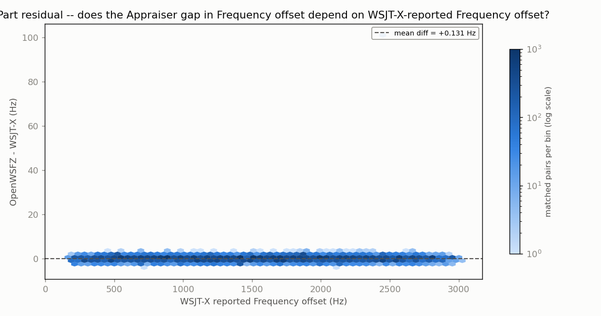

## Grid-alignment gate (per HK-021, 2026-08-02 correction)

| appraiser | unique ts | on-grid | G | row | verdict |
|---|---:|---:|---:|---|---|
| OpenWSFZ | 2880 | 2880 | 1.0000 | ROW 1 | PASS |
| WSJT-X | 2880 | 2880 | 1.0000 | ROW 1 | PASS |

# Endurance-session ANOVA -- matched-decode metrics (OpenWSFZ vs WSJT-X)

**Run:** 20260925_2010 12h 40m direct-CODEC  
**Generated:** 2026-09-26T09:15:42Z (`date -u`, HK-017)  
**Design:** two-way ANOVA without replication (randomized complete block design) -- Part (matched decode instance) x Appraiser (OpenWSFZ, WSJT-X), run separately for each paired numeric response below (SNR, DT, frequency offset) over the identical matched Parts. See anova_common.py's module docstring for why this design applies to single-pass live data, and not the replicated design in `qa/rr-study/harness/anova_compute.py`.

Both appraisers' decode logs come from the same live session already on disk -- OpenWSFZ's own ALL.TXT and the real WSJT-X application's own ALL.TXT, both listening to the same physical radio feed throughout. No re-decoding was performed (contrast endurance_anova_jt9.py, used when there is no live third-party log to read).

- OpenWSFZ decodes in window: **47212**
- WSJT-X decodes in window: **76999**
- Matched pairs (Parts, shared across every response below): **46917**

## Decode coverage

- OpenWSFZ decoded **47212** messages in this window; WSJT-X decoded **76999**.
- **46917** decodes matched between the two (same cycle + normalised message text) -- **99.4%** of OpenWSFZ's decodes, **60.9%** of WSJT-X's decodes.
- OpenWSFZ-only (WSJT-X did not report it): **295** (0.6% of OpenWSFZ's total).
- WSJT-X-only (OpenWSFZ did not report it): **30082** (39.1% of WSJT-X's total).

## SNR (dB)

| Source | SS | df | MS | F | P |
|---|---:|---:|---:|---:|---:|
| Part | 7187299.1752 | 46916 | 153.1951 | 13.944 | 0.0000 |
| Appraiser | 163296.0998 | 1 | 163296.0998 | 14863.463 | 0.0000 |
| Residual (confounded with interaction, n=1/cell) | 515438.4002 | 46916 | 10.9864 | | |
| Total | 7866033.6752 | 93833 | | | |

Appraiser means (SNR, dB): OpenWSFZ -6.409 dB, WSJT-X -3.771 dB, grand mean -5.090 dB.

## DT (time offset) (s)

| Source | SS | df | MS | F | P |
|---|---:|---:|---:|---:|---:|
| Part | 12683.2851 | 46916 | 0.2703 | 214.554 | 0.0000 |
| Appraiser | 9946.5752 | 1 | 9946.5752 | 7894025.907 | 0.0000 |
| Residual (confounded with interaction, n=1/cell) | 59.1148 | 46916 | 0.0013 | | |
| Total | 22688.9751 | 93833 | | | |

Appraiser means (DT (time offset), s): OpenWSFZ 0.8696 s, WSJT-X 0.2185 s, grand mean 0.5441 s.

## Frequency offset (Hz)

| Source | SS | df | MS | F | P |
|---|---:|---:|---:|---:|---:|
| Part | 47212193501.9566 | 46916 | 1006313.2727 | 1386060.930 | 0.0000 |
| Appraiser | 403.8657 | 1 | 403.8657 | 556.271 | 0.0000 |
| Residual (confounded with interaction, n=1/cell) | 34062.1343 | 46916 | 0.7260 | | |
| Total | 47212227967.9566 | 93833 | | | |

Appraiser means (Frequency offset, Hz): OpenWSFZ 1524.5 Hz, WSJT-X 1524.4 Hz, grand mean 1524.4 Hz.

## Caveat (structural, not a defect)

With one observation per Part x Appraiser cell -- a live signal happens once -- the interaction term and the residual/error term are mathematically confounded (standard property of an unreplicated factorial design), for every response above. Each table can say whether the two appraisers' *mean* value differs after removing part-to-part variation (the Appraiser row); none of them can separately test whether that difference itself varies signal-to-signal.

Cross-run comparison and interpretation of these numbers is Architect/Captain territory, not this module's.

## Section 4 -- Historical trend: every standardised endurance run to date

15 run(s). `G` is the grid-alignment gate (the lower of the two appraisers' where both are known; ROW 1 PASS >= 0.99). `Ref.` is the second appraiser: live WSJT-X on the same feed, an offline `jt9 -d 3` re-decode, or n/a for a comparison that wasn't against a reference decoder at all (e.g. OpenWSFZ vs OpenWSFZ) -- **offline and n/a rows are marked non-comparable** (HK-031: `jt9 -d 3` offline is not a valid reference decoder) and must not be pooled or compared against live-WSJT-X rows. **Never pool `nhard` 60 and `nhard` 40 runs together.** `Matched %` and `OWS-only %` are each source report's own stated decode-coverage figures (matched as a share of the reference's own decodes; OpenWSFZ-only as a share of OpenWSFZ's own decodes), not recomputed here. **`nhard` backfilled 2026-09-25** (QA request, Captain-approved 2026-09-23) **for every pre-`2026-09-12` row with decoder activity**: the code default was 60 from its introduction (`bb3790c9`, 2026-06-24) until the `NHARD40-DEFAULT` migration (`f91b9b8f`, 2026-09-12) -- see footnote 1. **`SNR gap`/`DT gap` now show `mean ± SD`, backfilled the same session**: for this 2-appraiser unreplicated RCBD design, the paired-difference SD satisfies `SD(d) = sqrt(2 x MS_residual)` (each source report's own ANOVA table's residual SS/df) -- independently verified against the 2026-09-22 row's own raw matched pairs (direct SD of OWS-WSJT-X = 0.050123 s vs `sqrt(2 x MS_res)` = 0.050123 s, exact to float precision). `not recorded` only where a source report has no residual row (zero-decode or missing-source rows). `Source` cites the file(s) every other field in that row was read from, repo-relative. Footnote numbering runs in table order, first-needed.

| Date | Band | Hours | DLL SHA (short) | Build branch | Build commit (short) | Shim | nhard | Ref. | Radio chain | G | Matched pairs | Matched % of ref | OWS-only % | SNR gap (dB) | DT gap (s) | Source |
|---|---|---:|---|---|---|---:|---:|---|---|---:|---:|---:|---:|---:|---:|---|
| 2026-07-28 | 10m | 9.6 | not recorded | not recorded | not recorded | not recorded | 601 | offline `jt9 -d 3`2 | not recorded | not recorded | 5781 | 68.9 | 10.8 | -14.780 ± 10.738 | +0.6662 ± 0.0475 | `qa/endurance/2026-07-28-031fb37/anova_report_10m.md` |
| 2026-07-28 | 20m | 4.8 | not recorded | not recorded | not recorded | not recorded | 601 | offline `jt9 -d 3`3 | Voicemeeter-fed second receiver | not recorded | 24658 | 48.4 | 3.3 | -6.250 ± 5.055 | +0.6543 ± 0.0499 | `qa/endurance/2026-07-28-031fb37/anova_report_20m.md` |
| 2026-07-28/29 | 20m(originally 80m) | not recorded | not recorded | not recorded | not recorded | not recorded | 601 | n/a (no audio archived, zero decodes)4 | not recorded | not recorded | 0 | not recorded | not recorded | not recorded | not recorded | `qa/endurance/2026-07-29-489135a/anova_report_20m_no_audio.md` |
| 2026-07-28/29 | 40m | not recorded | not recorded | not recorded | not recorded | not recorded | 601 | offline `jt9 -d 3`5 | not recorded | not recorded | 42668 | 60.2 | 3.5 | -10.419 ± 9.003 | -0.2733 ± 0.57676 | `qa/endurance/2026-07-29-489135a/anova_report_40m.md` |
| 2026-07-29 | 20m | not recorded | not recorded | not recorded | not recorded | not recorded | 601 | offline `jt9 -d 3`7 | SDR Uno / Voicemeeter B1 | not recorded | 24201 | 48.9 | 8.2 | -5.602 ± 5.985 | +0.6541 ± 0.0500 | `qa/endurance/2026-07-29-5016363/anova_report_20m.md`, `qa/endurance/2026-07-29-5016363/CONTAMINATION-NOTE.md` |
| 2026-07-29 | 80m | not recorded | not recorded | not recorded | not recorded | not recorded | 601 | offline `jt9 -d 3`8,9 | SDR Uno / Voicemeeter B1 | not recorded | 8290 | 84.2 | 8.1 | -8.037 ± 8.851 | +0.6675 ± 0.0469 | `qa/endurance/2026-07-29-5016363/anova_report_80m.md`, `qa/endurance/2026-07-29-5016363/CONTAMINATION-NOTE.md` |
| 2026-07-29/30 | 10m | not recorded | not recorded | not recorded | not recorded | not recorded | 601 | offline `jt9 -d 3`10 | SDR Uno / Voicemeeter B1 | not recorded | 9177 | 72.3 | 7.0 | -3.195 ± 3.477 | +0.6503 ± 0.0501 | `qa/endurance/2026-07-29-5016363/anova_report_10m.md` |
| 2026-07-29/30 | 40m | 24.0 | not recorded | not recorded | not recorded | not recorded | 601 | live WSJT-X | not recorded | not recorded | 52736 | 47.8 | 4.2 | -12.498 ± 9.059 | -0.6410 ± 0.66566 | `qa/endurance/2026-07-29-5016363/anova_report_40m.md`, `qa/endurance/2026-07-29-5016363/CONTAMINATION-NOTE.md` |
| 2026-07-31/08-02 | 20m | 43.8 | not recorded | not recorded | not recorded | not recorded | 601 | n/a (OpenWSFZ-8080 vs OpenWSFZ-8081, same decoder both sides, hardware-chain comparison)11,12 | 8080: FT-991A; 8081: SDR Uno -> Voicemeeter B1 (split antenna) | 0.3472 | 62775 | not recorded | not recorded | -3.467 ± 5.574 | -0.4903 ± 0.3767 | `qa/endurance/2026-08-02-multiday-20m-anova/anova_report_8080_vs_8081.md`, `qa/endurance/2026-08-02-multiday-20m-anova/table_a_8080_vs_8081_grid_snapped.md` |
| 2026-07-31/08-02 | 20m | 43.8 | not recorded | not recorded | not recorded | not recorded | 601 | live WSJT-X13 | FT-991A | 0.3472 | 64275 | 18.1 | 65.2 | -5.431 ± 7.504 | +0.1093 ± 0.2468 | `qa/endurance/2026-08-02-multiday-20m-anova/anova_report_8080_vs_wsjtx.md`, `qa/endurance/2026-08-02-multiday-20m-anova/table_a_8080_vs_wsjtx_grid_snapped.md` |
| 2026-07-31/08-02 | 20m | 43.8 | not recorded | not recorded | not recorded | not recorded | 601 | live WSJT-X | OpenWSFZ-8081: SDR Uno -> Voicemeeter B1; WSJT-X: separate FT-991A instance (cross-hardware, split-antenna feed, NOT the same receiver) | 0.9984 | 201834 | 56.9 | 5.0 | -1.789 ± 5.823 | +0.5635 ± 0.2175 | `qa/endurance/2026-08-02-multiday-20m-anova/anova_report_8081_vs_wsjtx.md`, `qa/endurance/2026-08-02-multiday-20m-anova/table_a_8080_vs_8081_grid_snapped.md` |
| 2026-09-21 | 20m | 24.0 | 38a21f84… | not recorded14 | not recorded | 20260054 | 40 | live WSJT-X | Yaesu FT-991A -> Voicemeeter Out B1 | 1.0000 | 76961 | 60.0 | 1.3 | -2.663 ± not recorded | +0.6533 ± not recorded | `2026-09-21-84cac119/anova_report_20m.md` |
| 2026-09-22 | 40m | 12.0 | 38a21f84… | decoding_improvement | 84cac119… | 20260054 | 40 | live WSJT-X | Yaesu FT-991A -> Voicemeeter Out B1 | 1.0000 | 55010 | 59.8 | 0.8 | -2.824 ± 4.766 | +0.6548 ± 0.0501 | `artefacts/20260922_2056_endurance_run-gathered/anova_report.md` |
| 2026-09-23 | 40m | 24.0 | 38a21f84… | decoding_improvement | 84cac119… | 20260054 | 40 | live WSJT-X | FT-991A -> Microphone (2- USB Audio CODEC), DIRECT (Voicemeeter/CABLE out of the loop for this arm) | 1.0000 | 97279 | 61.1 | 0.7 | -3.225 ± 4.793 | +0.6484 ± 0.0502 | `artefacts/20260923_1730_endurance_run-gathered/anova_report.md` |
| **2026-09-25** | **40m** | **12.0** | **38a21f84…** | **decoding_improvement** | **51e40b55…** | **20260054** | **40** | **live WSJT-X** | **FT-991A -> Microphone (2- USB Audio CODEC), DIRECT (Voicemeeter/CABLE out of the loop for this arm)** | **1.0000** | **46917** | **60.9** | **0.6** | **-2.638 ± 4.688** | **+0.6511 ± 0.0502**15 | **`artefacts/20260925_2010_endurance_run-gathered/anova_report.md`** |

1. **`nhard`=60 backfilled for every pre-`2026-09-12` row above with decoder activity** (QA request, Captain-approved 2026-09-23; confirmed and footnoted 2026-09-25). The code default was 60 from its introduction (`bb3790c9`, 2026-06-24, docstring: "OSD maximum Hamming-distance gate (default 60...)") until the `NHARD40-DEFAULT` migration changed it to 40 (`f91b9b8f`, 2026-09-12) -- every row this marks falls inside that window. No per-run `config.json` survives to check for a manual override, so this is confirmed via code default, not a captured runtime value; if a future find shows one of these specific runs was overridden, correct that row in place (HK-022).
2. non-comparable reference (offline `jt9 -d 3`) -- 2026-07-28 10m
3. non-comparable reference (offline `jt9 -d 3`) -- 2026-07-28 20m
4. non-comparable reference (n/a (no audio archived, zero decodes)) -- 2026-07-28/29 20m(originally 80m)
5. non-comparable reference (offline `jt9 -d 3`) -- 2026-07-28/29 40m
6. **July 40m DT-gap sign flip -- descriptive only, no cause established** (QA finding, Captain-approved ask 2026-09-23; footnoted 2026-09-25). This row and the 2026-07-29/30 40m row below both show a negative DT gap (-0.2733 s here, -0.6410 s there) where every other comparable row reads positive (~+0.65 s). The sign convention (OWS - ref) is consistent across every source report checked. The reference side is stable: WSJT-X's own 40m mean DT was 0.2480 s in July vs 0.2487 s in the 2026-09-22 row above -- unchanged. OpenWSFZ's own side moved (-0.393 s -> +0.904 s across these two July rows). The same July build (`5016363`) read +0.654 s on 20m the same day (see the 2026-07-29 20m row above) -- pointing at the July capture chain or clock, not the decoder, but no cause is established.
7. non-comparable reference (offline `jt9 -d 3`) -- 2026-07-29 20m
8. non-comparable reference (offline `jt9 -d 3`) -- 2026-07-29 80m
9. drift/audio-contaminated: audio-leak contamination (other Windows-app audio bleeding into the Voicemeeter B1 bus), ~60% of sampled cycles elevated in the 21:18-23:07:30Z portion of this window -- see CONTAMINATION-NOTE.md's own timeline; report's own title flags it explicitly -- 2026-07-29 80m
10. non-comparable reference (offline `jt9 -d 3`) -- 2026-07-29/30 10m
11. non-comparable reference (n/a (OpenWSFZ-8080 vs OpenWSFZ-8081, same decoder both sides, hardware-chain comparison)) -- 2026-07-31/08-02 20m
12. drift/audio-contaminated: 8080's cycle-clock drifts off the FT8 15s grid at ~0.18s/h; the 62,775 matched pairs here are the +0s (on-grid) stratum only, 33.9% of the run's OpenWSFZ-8080 decodes -- see report banner and table_a_8080_vs_8081_grid_snapped.md -- 2026-07-31/08-02 20m
13. drift/audio-contaminated: 8080's cycle-clock drifts off the FT8 15s grid at ~0.18s/h; the 64,275 matched pairs here are the +0s (on-grid) stratum only, 34.8% of the run -- see report banner and table_a_8080_vs_wsjtx_grid_snapped.md -- 2026-07-31/08-02 20m
14. **Build branch/commit not recorded, and NOT guessed -- recorded instead as a DLL identity match** (QA request, Captain-approved 2026-09-23; fixed 2026-09-25). This row's DLL SHA-256 (`38a21f84…`) is identical to the 2026-09-22 row below, so this is the same binary, whatever branch built it -- stated as that fact, not as an inferred branch name. The same missing-source-file gap (this run's own per-metric ANOVA report is not present in this worktree -- gitignored data does not travel between worktrees) also leaves this row's SD cells "not recorded"; unlike the pre-9/12 rows above, this is a genuine data gap, not a residual-free report.
15. **SNR-gap follow-up, second same-chain leg (Captain-directed, 2026-09-25) -- mechanical result of the pre-committed read, no new interpretation added.** The standing note on the 2026-09-22->2026-09-23 SNR-gap move (-2.824 -> -3.225 dB) said it should be "read in these same [WSJT-X] SNR bins, not by the raw mean," and that "a second leg would settle it." This row is that second leg -- same chain (direct-CODEC) as 2026-09-23, different night. Re-running the identical 3 dB-bin decomposition (`snr_gap_mix_3leg.py`, this directory) across all three rows: raw move 2026-09-22->2026-09-23 was -0.402 dB (within-bin -0.278/-0.287 dB depending on which run's SNR mix is held fixed -- reproduces the original Architect finding exactly). The SAME decomposition applied 2026-09-23->2026-09-25 (same chain, both direct-CODEC) gives a raw move of **+0.587 dB**, within-bin **+0.354/+0.347 dB** -- **larger in magnitude than the original candidate effect, and the opposite sign.** If the direct-CODEC chain itself produced a stable SNR-reporting shift, repeating that same chain on a different night should reproduce a within-bin move close to zero relative to the other direct-CODEC night, not one bigger than, and opposite to, the original B1-vs-direct move. It does not. Read plainly: the originally-flagged effect size (~0.28 dB within-bin) is smaller than ordinary night-to-night variance on the SAME chain (~0.35 dB), so it is not distinguishable from noise, and this data does not support a stable direct-CODEC chain effect on the SNR gap. Full numeric output: `snr_gap_mix_3leg_output.txt`, this directory.

**Descriptive only.** No trend line and no "build effect" reading is drawn here -- interpretation across runs is Architect/Captain territory, same as every other cross-run comparison this module produces. Footnote 15 above is the one exception this session: it reports the outcome of a decomposition the standing note itself pre-committed to as the deciding read ("a second leg would settle it"), not a new interpretive claim.

