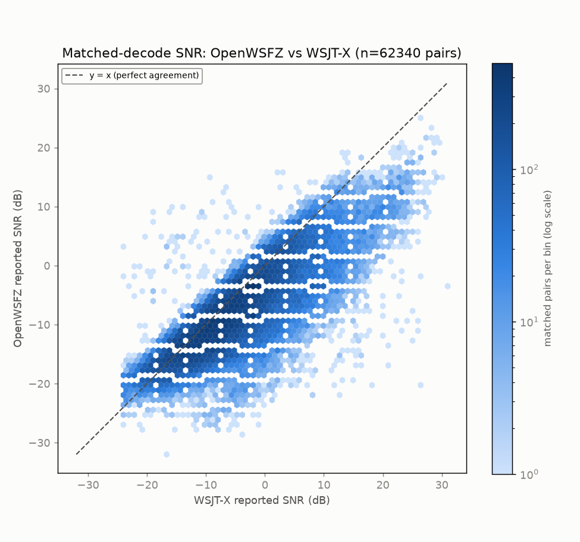
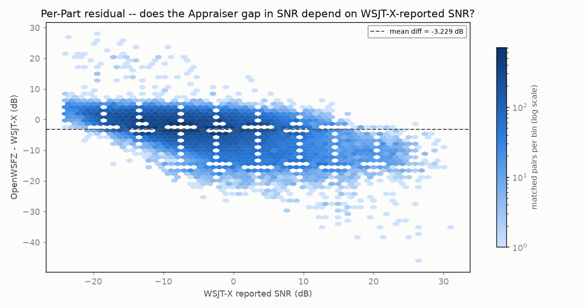
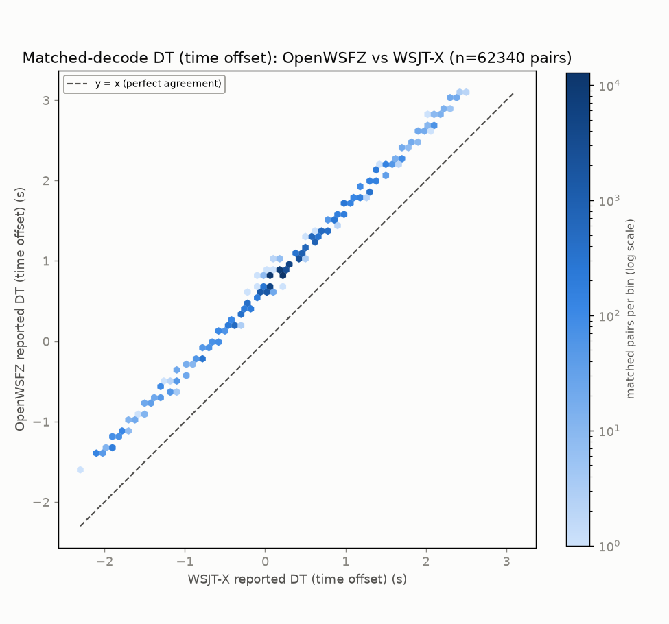
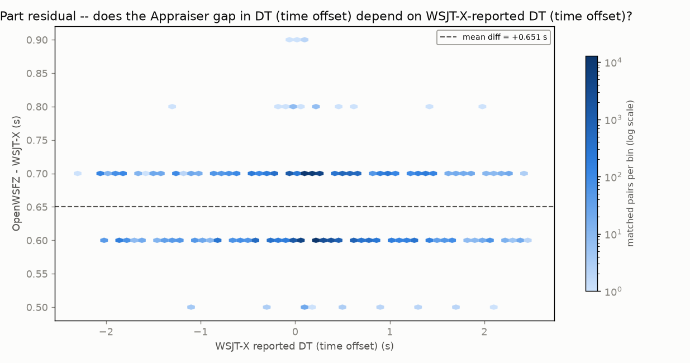
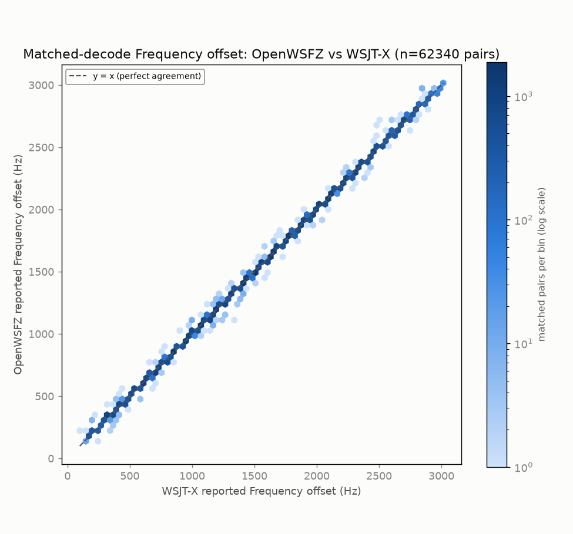
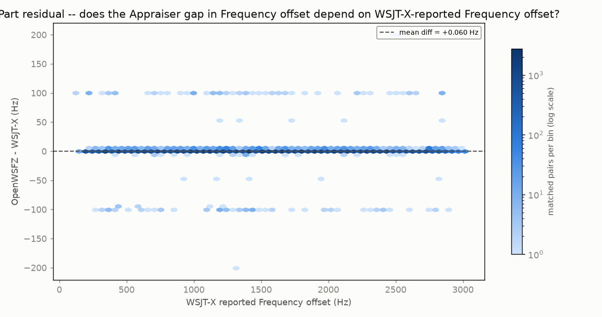

## Grid-alignment gate (per HK-021, 2026-08-02 correction)

| appraiser | unique ts | on-grid | G | row | verdict |
|---|---:|---:|---:|---|---|
| OpenWSFZ | 3630 | 3630 | 1.0000 | ROW 1 | PASS |
| WSJT-X | 3628 | 3628 | 1.0000 | ROW 1 | PASS |

# Endurance-session ANOVA -- matched-decode metrics (OpenWSFZ vs WSJT-X)

**Run:** D:/Projects/claude/OpenWSFZ/artefacts/20261009_1752_endurance_run-gathered/owsfz/ALL.TXT vs D:/Projects/claude/OpenWSFZ/artefacts/20261009_1752_endurance_run-gathered/wsjt-x/ALL.TXT  
**Generated:** 2026-10-10T09:18:56Z (`date -u`, HK-017)  
**Design:** two-way ANOVA without replication (randomized complete block design) -- Part (matched decode instance) x Appraiser (OpenWSFZ, WSJT-X), run separately for each paired numeric response below (SNR, DT, frequency offset) over the identical matched Parts. See anova_common.py's module docstring for why this design applies to single-pass live data, and not the replicated design in `qa/rr-study/harness/anova_compute.py`.

Both appraisers' decode logs come from the same live session already on disk -- OpenWSFZ's own ALL.TXT and the real WSJT-X application's own ALL.TXT, both listening to the same physical radio feed throughout. No re-decoding was performed (contrast endurance_anova_jt9.py, used when there is no live third-party log to read).

- OpenWSFZ decodes in window: **62617**
- WSJT-X decodes in window: **93611**
- Matched pairs (Parts, shared across every response below): **62340**

## Decode coverage

- OpenWSFZ decoded **62617** messages in this window; WSJT-X decoded **93611**.
- **62340** decodes matched between the two (same cycle + normalised message text) -- **99.6%** of OpenWSFZ's decodes, **66.6%** of WSJT-X's decodes.
- OpenWSFZ-only (WSJT-X did not report it): **277** (0.4% of OpenWSFZ's total).
- WSJT-X-only (OpenWSFZ did not report it): **31271** (33.4% of WSJT-X's total).

## SNR (dB)

| Source | SS | df | MS | F | P |
|---|---:|---:|---:|---:|---:|
| Part | 7081112.9543 | 62339 | 113.5904 | 9.726 | 0.0000 |
| Appraiser | 325079.8069 | 1 | 325079.8069 | 27835.456 | 0.0000 |
| Residual (confounded with interaction, n=1/cell) | 728033.6931 | 62339 | 11.6786 | | |
| Total | 8134226.4543 | 124679 | | | |

Appraiser means (SNR, dB): OpenWSFZ -7.861 dB, WSJT-X -4.632 dB, grand mean -6.246 dB.

## DT (time offset) (s)

| Source | SS | df | MS | F | P |
|---|---:|---:|---:|---:|---:|
| Part | 20087.4069 | 62339 | 0.3222 | 255.412 | 0.0000 |
| Appraiser | 13200.0879 | 1 | 13200.0879 | 10462950.896 | 0.0000 |
| Residual (confounded with interaction, n=1/cell) | 78.6471 | 62339 | 0.0013 | | |
| Total | 33366.1419 | 124679 | | | |

Appraiser means (DT (time offset), s): OpenWSFZ 0.8480 s, WSJT-X 0.1972 s, grand mean 0.5226 s.

## Frequency offset (Hz)

| Source | SS | df | MS | F | P |
|---|---:|---:|---:|---:|---:|
| Part | 60945347309.0396 | 62339 | 977643.9678 | 60814.629 | 0.0000 |
| Appraiser | 111.0510 | 1 | 111.0510 | 6.908 | 0.0086 |
| Residual (confounded with interaction, n=1/cell) | 1002149.4490 | 62339 | 16.0758 | | |
| Total | 60946349569.5396 | 124679 | | | |

Appraiser means (Frequency offset, Hz): OpenWSFZ 1484.2 Hz, WSJT-X 1484.1 Hz, grand mean 1484.2 Hz.

## Caveat (structural, not a defect)

With one observation per Part x Appraiser cell -- a live signal happens once -- the interaction term and the residual/error term are mathematically confounded (standard property of an unreplicated factorial design), for every response above. Each table can say whether the two appraisers' *mean* value differs after removing part-to-part variation (the Appraiser row); none of them can separately test whether that difference itself varies signal-to-signal.

Cross-run comparison and interpretation of these numbers is Architect/Captain territory, not this module's.

## Section 4 -- Historical trend: every standardised endurance run to date

6 run(s). `G` is the grid-alignment gate (the lower of the two appraisers' where both are known; ROW 1 PASS >= 0.99). `Ref.` is the second appraiser: live WSJT-X on the same feed, an offline `jt9 -d 3` re-decode, or n/a for a comparison that wasn't against a reference decoder at all (e.g. OpenWSFZ vs OpenWSFZ) -- **offline and n/a rows are marked non-comparable** (HK-031: `jt9 -d 3` offline is not a valid reference decoder) and must not be pooled or compared against live-WSJT-X rows. **Never pool `nhard` 60 and `nhard` 40 runs together.** `Matched %` and `OWS-only %` are each source report's own stated decode-coverage figures (matched as a share of the reference's own decodes; OpenWSFZ-only as a share of OpenWSFZ's own decodes), not recomputed here. `DT gap` has no `+/- SD` column: none of the pre-standardisation reports computed a standalone SD of the DT offset (only appraiser means), and deriving one now from raw logs would be new analysis, not backfill -- it is left out rather than invented. `Source` cites the file(s) every other field in that row was read from, repo-relative. Footnote numbering runs in table order, first-needed.

**Table A -- measurements**

| Date | Band | Hours | Shim | nhard | Ref. | G | Matched pairs | Matched % of ref | OWS-only % | SNR gap (dB) | DT gap (s) |
|---|---|---:|---:|---:|---|---:|---:|---:|---:|---:|---:|
| 2026-09-22 | 40m | 12.0 | 20260054 | 40 | live WSJT-X | 1.0000 | 55010 | 59.8 | 0.8 | -2.824 | +0.6548 |
| 2026-09-23 | 40m | 24.0 | 20260054 | 40 | live WSJT-X | 1.0000 | 97279 | 61.1 | 0.7 | -3.225 | +0.6484 |
| 2026-09-25 | 40m | 12.0 | 20260054 | 40 | live WSJT-X | 1.0000 | 46917 | 60.9 | 0.6 | -2.638 | +0.6511 |
| 2026-09-30 | 40m | 17.9 | 20260056 | 40 | live WSJT-X | 1.0000 | 94307 | 72.8 | 1.1 | -1.546 | +0.6611 |
| 2026-10-04 | 40m | 12.9 | 20260058 | ? | live WSJT-X | 1.0000 | 68387 | 70.3 | 1.1 | -2.280 | +0.6588 |
| 2026-10-09 | 40m | 15.1 | 20260061 | 24 | live WSJT-X | 1.0000 | 62340 | 66.6 | 0.4 | -3.229 | +0.6508 |

**Table B -- build, radio chain and source (same row order as Table A)**

| Date | Band | DLL SHA (short) | Build branch | Build commit (short) | Radio chain | Source |
|---|---|---|---|---|---|---|
| 2026-09-22 | 40m | 38a21f84… | decoding_improvement | 84cac119… | Yaesu FT-991A -> Voicemeeter Out B1 | `artefacts/20260922_2056_endurance_run-gathered/anova_report.md` |
| 2026-09-23 | 40m | 38a21f84… | decoding_improvement | 84cac119… | FT-991A -> Microphone (2- USB Audio CODEC), DIRECT (Voicemeeter/CABLE out of the loop for this arm) | `artefacts/20260923_1730_endurance_run-gathered/anova_report.md` |
| 2026-09-25 | 40m | 38a21f84… | decoding_improvement | 51e40b55… | FT-991A -> Microphone (2- USB Audio CODEC), DIRECT (Voicemeeter/CABLE out of the loop for this arm) | `artefacts/20260925_2010_endurance_run-gathered/anova_report.md` |
| 2026-09-30 | 40m | ee00d118… | feat/sub-feas-two-stage-publish | 247ac391… | Yaesu FT-991A -> Voicemeeter Out B1 [SUB-FEAS flag ON, 8 workers: NOT poolable with flag-OFF rows] | `artefacts/20260930_1930_endurance_run-gathered/anova_report.md` |
| 2026-10-04 | 40m | 2fa6d993… | HEAD | 040613d9… | FT-991A -> Stereo Input 1 (USB 2 Audio CODEC) -> Voicemeeter B1 -> OpenWSFZ + WSJT-X [SUB-FEAS flag ON, 8 workers, early decode ON; nhard 40 per config.json (arm_config recorded null): NOT poolable with flag-OFF rows] | `../../artefacts/20261004_1634_endurance_run-gathered/anova_report.md` |
| 2026-10-09 | 40m | a14fe354… | HEAD | 421e3ce2… | FT-991A direct USB CODEC (Microphone (2- USB Audio CODEC)), no Voicemeeter | `../../artefacts/20261009_1752_endurance_run-gathered/anova_report.md` |

**Descriptive only.** No trend line and no "build effect" reading is drawn here -- interpretation across runs is Architect/Captain territory, same as every other cross-run comparison this module produces.

