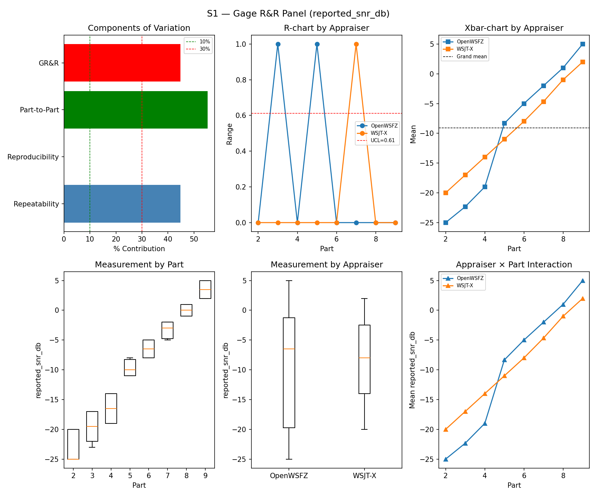
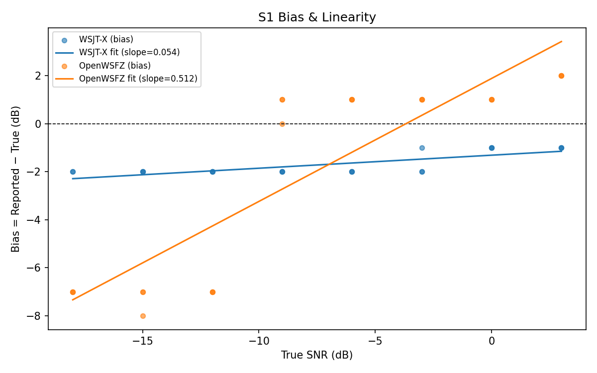
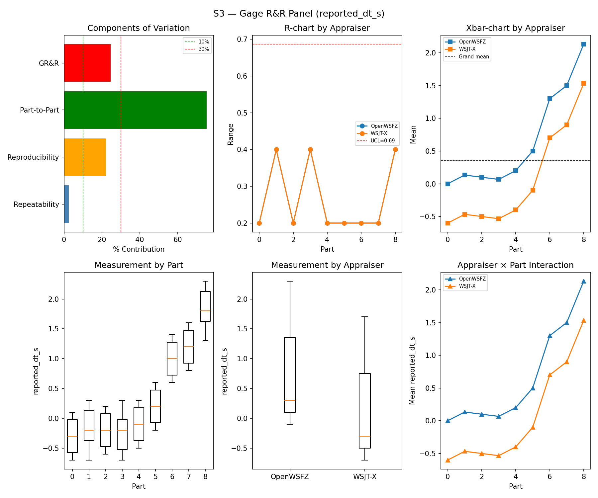

# OpenWSFZ R&R Study Report

| Field | Value |
|---|---|
| Run date | 2026-06-06 |
| OpenWSFZ SHA | `46d7f6a3e2ed338cc3f4b76f07b17c66d218119b` |
| WSJT-X version | WSJT-X 2.7.0 (binary date 2025-02-04) |

## S1 — reported_snr_db

### Variance Components

| Component | σ² | %Contribution |
|---|---|---|
| Repeatability | 70.96 | 44.79% |
| Reproducibility | 0.00 | 0.00% |
| Part-to-Part | 87.47 | 55.21% |
| Total GR&R | 70.96 | 44.79% |
| Total | 158.43 | 100.00% |

### Study Metrics

| Metric | Value | Verdict |
|---|---|---|
| %Tolerance (GR&R) | 1263.60% | FAIL |
| %Study Var (GR&R) | 66.93% | — |
| ndc | 1 | FAIL |

### Bias & Linearity (S1)

| Appraiser | Mean Bias (dB) | Slope | Intercept | R² | Verdict |
|---|---|---|---|---|---|
| WSJT-X | -1.70 | 0.054 | -1.313 | 0.616 | PASS |
| OpenWSFZ | -1.96 | 0.512 | 1.881 | 0.768 | PASS |

## S2 — reported_freq_hz

### Variance Components

| Component | σ² | %Contribution |
|---|---|---|
| Repeatability | 0.15 | 0.00% |
| Reproducibility | 0.40 | 0.00% |
| Part-to-Part | 652845.67 | 100.00% |
| Total GR&R | 0.55 | 0.00% |
| Total | 652846.22 | 100.00% |

### Study Metrics

| Metric | Value | Verdict |
|---|---|---|
| %Tolerance (GR&R) | 55.62% | PASS |
| %Study Var (GR&R) | 0.09% | — |
| ndc | 1536 | PASS |

## S3 — reported_dt_s

### Variance Components

| Component | σ² | %Contribution |
|---|---|---|
| Repeatability | 0.02 | 2.59% |
| Reproducibility | 0.18 | 22.12% |
| Part-to-Part | 0.61 | 75.29% |
| Total GR&R | 0.20 | 24.71% |
| Total | 0.81 | 100.00% |

### Study Metrics

| Metric | Value | Verdict |
|---|---|---|
| %Tolerance (GR&R) | 672.68% | MARGINAL |
| %Study Var (GR&R) | 49.71% | — |
| ndc | 2 | MARGINAL |

## Attribute Agreement Analysis (S4/S5)

### Kappa

| Pair | κ | 95% CI | Verdict |
|---|---|---|---|
| OpenWSFZ_vs_truth | — | [—, —] | — |
| WSJT-X_vs_truth | — | [—, —] | — |
| between_appraisers | — | — | — |

### False-positive rate (S5)

| Appraiser | FP rate | Verdict |
|---|---|---|
| WSJT-X | 0.00% | PASS |
| OpenWSFZ | 0.00% | PASS |

## Summary

| Metric | Scope | Value | Verdict |
|---|---|---|---|
| %GR&R | S1 | 44.8% | FAIL |
| ndc | S1 | 1 | FAIL |
| %GR&R | S2 | 0.0% | PASS |
| ndc | S2 | 1536 | PASS |
| %GR&R | S3 | 24.7% | MARGINAL |
| ndc | S3 | 2 | MARGINAL |
| FP rate | S5/WSJT-X | 0.0% | PASS |
| FP rate | S5/OpenWSFZ | 0.0% | PASS |
| SNR bias | S1/WSJT-X | -1.70 dB | PASS |
| SNR bias | S1/OpenWSFZ | -1.96 dB | PASS |

**Overall verdict: FAIL**

### Defect Notices

- ❌ FAIL — %GR&R (S1) = 44.8% (threshold: < 10.0% Acceptable)
