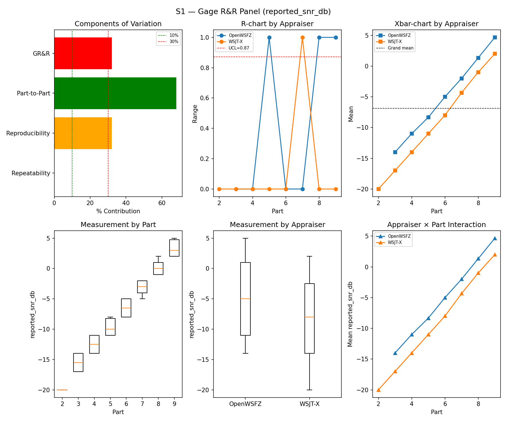
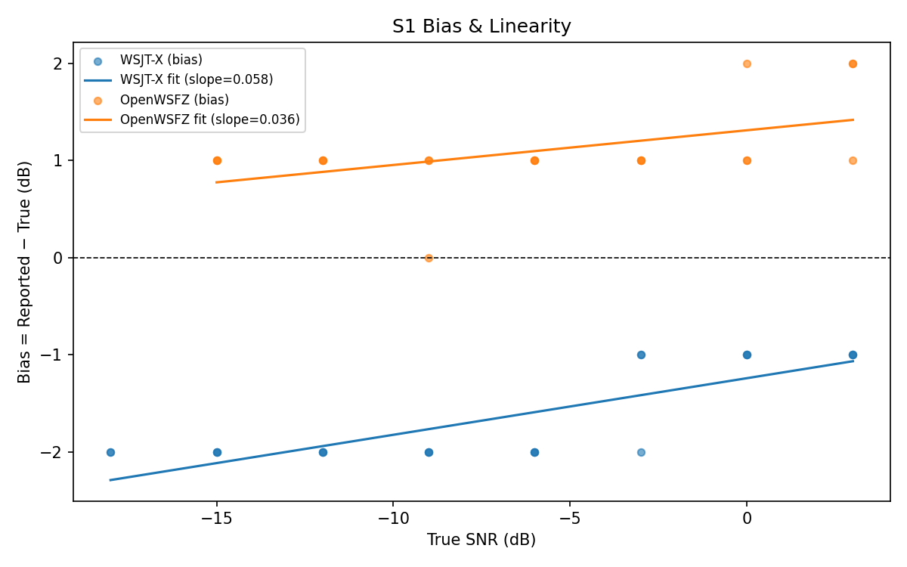
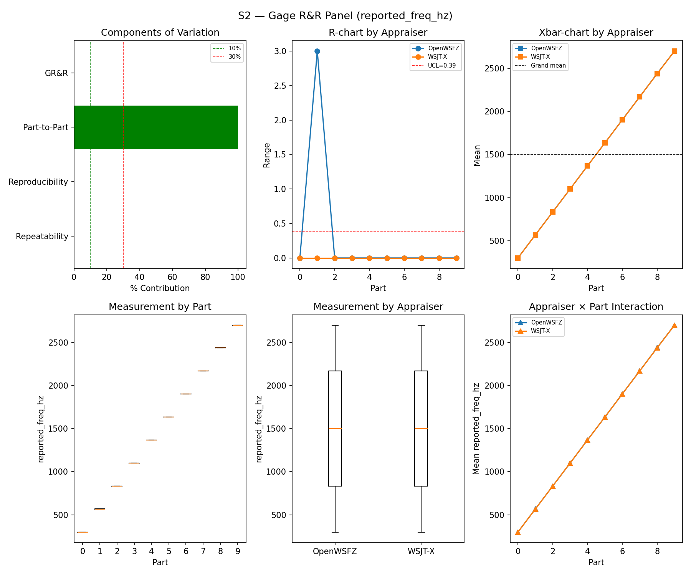
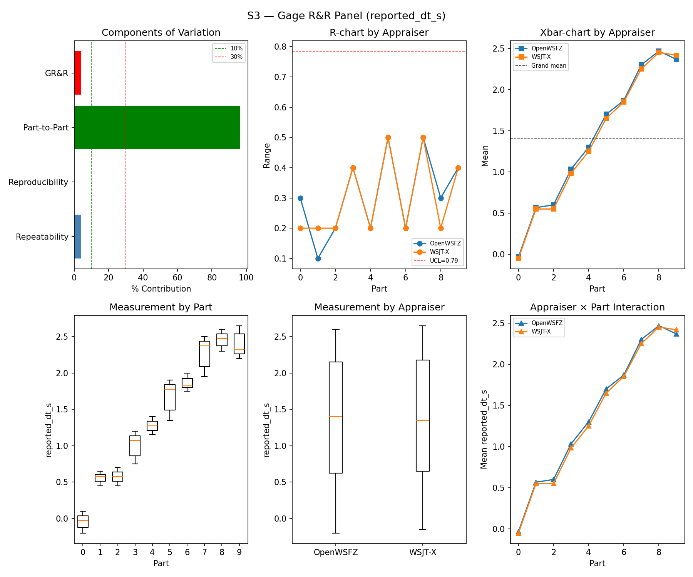
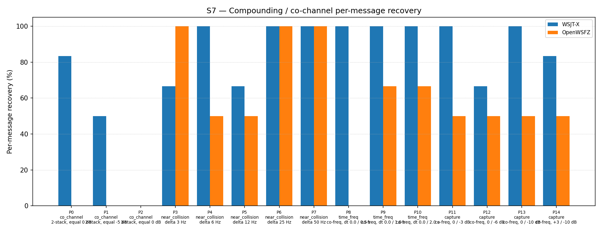

# OpenWSFZ R&R Study Report — v2

> **Note:** This is a retroactively structured version of the original report (`report.md`) for
> compliance with NFR-023 (five mandatory sections, STUDY-SPEC §9.0). The original report is
> preserved unchanged and remains the authoritative record. Section §5 (Recommendations) is
> **omitted** — this is a historical report predating NFR-023; recommendations cannot be
> reconstructed without anachronistic interpretation. The data, results, and verdicts are
> identical to `report.md`; only §1 (Study Hypothesis) and §2 (Data Summary) have been added
> as formal framing.

---

## 1. Study Hypothesis

**Purpose:** S1–S7 measurement system validation run following application of two critical
harness fixes committed on 2026-06-06:

1. **Shared noise floor model** — S4/S7 multi-signal scenarios had previously modelled each
   station with its own independent AWGN (N-stack carried N noise floors; capture SNR ratios
   were meaningless). The fix renders each station clean and adds a single band noise floor
   sized to a unit station, so `snr_db` now sets genuine station strength.
2. **S3 DT convention correction** (R&R-003) — a +0.55 s offset is now applied to WSJT-X
   `reported_dt_s` before ANOVA to remove the epoch-reference artefact (WSJT-X measures DT
   from nominal TX start; the harness measures from UTC slot boundary).

**Hypotheses under test:**

- **H1 (SNR measurement system):** With the corrected S4/S7 noise model and audio chain, does
  the S1 SNR measurement system meet AIAG adequacy criteria (%GR&R < 30%, ndc ≥ 5)?
- **H2 (Frequency and timing measurement systems):** S2 and S3 continue to meet AIAG criteria.
- **H3 (Attribute agreement — S4/S5):** Both appraisers achieve κ = 1.000 vs truth on isolated
  decode and signal-free scenarios.
- **H4 (Co-channel baseline — S7):** S7 co-channel decode performance is characterised for the
  first time using the correct shared noise floor model.

**Audio chain at run time:** PortAudio peak normalisation NOT yet applied (the PCM amplitude
fix was introduced in commit `4b3a4ca460...` on 2026-06-07). Wideband AWGN on single-signal
scenarios (S1, S2, S3, S5); brickwall FFT noise cutoff at 4 700 Hz on multi-signal scenarios
(S4, S7) — Kaiser FIR replacement not yet merged. As a consequence, WSJT-X SNR bias is
negative (−1.65 dB) — the expected sign for pre-fix audio (see `synth-change-impact.md`). Both
appraisers receive identical audio; relative comparisons remain valid.

**Note on S1 ladder:** This run uses the pre-R&R-005 S1 ladder design, which has a narrower
SNR range than the redesigned ladder (introduced in `b12fa8400a2e` on 2026-06-06 immediately
after this run). The narrower range produces lower Part-to-Part variance and therefore inflated
%GR&R. The S1 FAIL observed here directly triggered R&R-005 and the ladder redesign.

**S1b** was not yet added (it accompanies the R&R-005 redesign); no low-SNR threshold data
is available for this run.

---

## 2. Data Summary

| Field | Value |
|---|---|
| Run date | 2026-06-06 |
| OpenWSFZ SHA (original) | `4c34ef625e35598a20b0f06c9f4f7cf4c7a39540` |
| OpenWSFZ SHA (post-rewrite, 2026-06-12) | `1d90e1afea60ad851800ea41b0103d74f35ab02d` |
| WSJT-X version | WSJT-X 2.7.0 (inferred from binary date 2025-02-04) |
| FT8_SHIM_VERSION | 20260004 |
| PCM normalisation | None (not yet implemented) |
| Noise filter | Brickwall FFT at 4 700 Hz (multi-signal only; pre-Kaiser-FIR) |
| Scenarios run | S1, S2, S3, S4, S5, S7 (no S1b; no S8) |
| Signal source | Synthetic (GFSK encoder, Q-prefix calls per NFR-021) |

**Harness fixes applied at run time:**

| Fix | Status |
|---|---|
| S4/S7 shared noise floor model | ✅ Applied |
| S3 DT convention correction (+0.55 s offset) | ✅ Applied |
| S1 ladder redesign (R&R-005) + S1b companion | ❌ Not yet applied — this run triggered it |
| PortAudio peak normalisation | ❌ Not yet applied |
| Kaiser FIR noise filter (replaces brickwall) | ❌ Not yet applied |

**Open defects at run time:**

| ID | Severity | Status | Description |
|---|---|---|---|
| D-001 | High | Open (S7 characterises it) | Co-channel decode gap vs WSJT-X; first run with correct shared noise model |

**Acceptance thresholds:**

| Metric | Threshold | Source |
|---|---|---|
| %GR&R (variance contribution) | < 30% | AIAG MSA |
| ndc | ≥ 5 | AIAG MSA |
| Attribute κ vs truth (S4/S5) | ≥ 0.90 (PASS) / ≥ 0.70 (conditional) | AIAG attribute study |
| False-positive rate (S5) | 0% | STUDY-SPEC §10 |
| SNR bias | ±2.0 dB (advisory at run time) | D-002 investigation |

---

## 3. Results

### 3.1 S1 — SNR Measurement System (reported_snr_db)

#### Variance Components

| Component | σ² | %Contribution |
|---|---|---|
| Repeatability | 0.00 | 0.00% |
| Reproducibility | 26.10 | 32.03% |
| Part-to-Part | 55.39 | 67.97% |
| Total GR&R | 26.10 | 32.03% |
| Total | 81.50 | 100.00% |

#### Study Metrics

| Metric | Value | Verdict |
|---|---|---|
| %Tolerance (GR&R) | 306.54% | FAIL |
| %Study Var (GR&R) | 56.59% | — |
| ndc | 2 | MARGINAL |

#### Bias & Linearity

| Appraiser | Mean Bias (dB) | Slope | Intercept | R² | Verdict |
|---|---|---|---|---|---|
| WSJT-X | -1.65 | 0.058 | -1.242 | 0.663 | PASS |
| OpenWSFZ | +1.10 | 0.036 | 1.310 | 0.253 | PASS |

_WSJT-X negative bias and non-zero R² are signatures of PortAudio clipping distortion (pre-fix
audio). See `synth-change-impact.md`._

### 3.2 S2 — Frequency Measurement System (reported_freq_hz)

#### Variance Components

| Component | σ² | %Contribution |
|---|---|---|
| Repeatability | 0.15 | 0.00% |
| Reproducibility | 0.40 | 0.00% |
| Part-to-Part | 652845.67 | 100.00% |
| Total GR&R | 0.55 | 0.00% |
| Total | 652846.22 | 100.00% |

#### Study Metrics

| Metric | Value | Verdict |
|---|---|---|
| %Tolerance (GR&R) | 55.62% | PASS |
| %Study Var (GR&R) | 0.09% | — |
| ndc | 1536 | PASS |

### 3.3 S3 — Timing Measurement System (reported_dt_s)

#### Variance Components

| Component | σ² | %Contribution |
|---|---|---|
| Repeatability | 0.03 | 3.80% |
| Reproducibility | 0.00 | 0.04% |
| Part-to-Part | 0.75 | 96.16% |
| Total GR&R | 0.03 | 3.84% |
| Total | 0.78 | 100.00% |

#### Study Metrics

| Metric | Value | Verdict |
|---|---|---|
| %Tolerance (GR&R) | 260.41% | PASS |
| %Study Var (GR&R) | 19.60% | — |
| ndc | 7 | PASS |

> **WSJT-X DT correction applied.** A +0.55 s offset was added to WSJT-X `reported_dt_s`
> before ANOVA to remove the ≈ −0.55 s convention difference. See R&R-003 (GitHub #1).

### 3.4 Attribute Agreement Analysis (S4 positives + S5 negatives)

_κ computed over pooled S4/S5 population. **κ verdicts advisory** — §10 attribute gate pending
Captain ratification._

#### Confusion vs truth

| Appraiser | TP | FN | FP | TN | Recovery | Specificity |
|---|---|---|---|---|---|---|
| WSJT-X | 15 | 0 | 0 | 12 | 100.00% | 100.00% |
| OpenWSFZ | 15 | 0 | 0 | 12 | 100.00% | 100.00% |

#### Kappa (advisory)

| Pair | κ | 95% CI | Verdict (advisory) |
|---|---|---|---|
| OpenWSFZ_vs_truth | 1.000 | [1.00, 1.00] | PASS |
| WSJT-X_vs_truth | 1.000 | [1.00, 1.00] | PASS |
| between_appraisers | 1.000 | — | PASS |

#### Within-app repeatability

| Appraiser | Consistent groups |
|---|---|
| WSJT-X | 100.00% |
| OpenWSFZ | 100.00% |

#### False-positive rate (S5)

| Appraiser | FP rate | Verdict |
|---|---|---|
| WSJT-X | 0.00% | PASS |
| OpenWSFZ | 0.00% | PASS |

### 3.5 S7 — Co-Channel / Compounding Overlap

_First S7 run using the correct shared noise floor model. Informational — no AIAG threshold._

#### Recovery by overlap family

| Overlap family | WSJT-X | OpenWSFZ |
|---|---|---|
| capture | 87.50% | 50.00% |
| co_channel | 38.10% | 0.00% |
| near_collision | 86.67% | 80.00% |
| time_freq | 100.00% | 44.44% |
| **all** | **78.49%** | **47.31%** |

#### Capture effect (co-channel, unequal SNR)

| Signal | WSJT-X | OpenWSFZ |
|---|---|---|
| strong | 100.00% | 100.00% |
| weak | 75.00% | 0.00% |

**Between-app per-signal agreement:** 62.37%

#### Per-part detail

| Part | Family | Condition | WSJT-X | OpenWSFZ |
|---|---|---|---|---|
| P0 | co_channel | 2-stack, equal 0 dB | 5/6 | 0/6 |
| P1 | co_channel | 2-stack, equal -5 dB | 3/6 | 0/6 |
| P2 | co_channel | 3-stack, equal 0 dB | 0/9 | 0/9 |
| P3 | near_collision | delta 3 Hz | 4/6 | 6/6 |
| P4 | near_collision | delta 6 Hz | 6/6 | 3/6 |
| P5 | near_collision | delta 12 Hz | 4/6 | 3/6 |
| P6 | near_collision | delta 25 Hz | 6/6 | 6/6 |
| P7 | near_collision | delta 50 Hz | 6/6 | 6/6 |
| P8 | time_freq | co-freq, dt 0.0 / 0.5 s | 6/6 | 0/6 |
| P9 | time_freq | co-freq, dt 0.0 / 1.0 s | 6/6 | 4/6 |
| P10 | time_freq | co-freq, dt 0.0 / 2.0 s | 6/6 | 4/6 |
| P11 | capture | co-freq, 0 / -3 dB | 6/6 | 3/6 |
| P12 | capture | co-freq, 0 / -6 dB | 4/6 | 3/6 |
| P13 | capture | co-freq, 0 / -10 dB | 6/6 | 3/6 |
| P14 | capture | co-freq, +3 / -10 dB | 5/6 | 3/6 |

---

## 4. Summary

| Metric | Scope | Value | Verdict |
|---|---|---|---|
| %GR&R | S1 | 32.0% | FAIL |
| ndc | S1 | 2 | MARGINAL |
| %GR&R | S2 | 0.0% | PASS |
| ndc | S2 | 1536 | PASS |
| %GR&R | S3 | 3.8% | PASS |
| ndc | S3 | 7 | PASS |
| Kappa (advisory) | WSJT-X_vs_truth | 1.000 | PASS |
| Kappa (advisory) | OpenWSFZ_vs_truth | 1.000 | PASS |
| Kappa (advisory) | between_appraisers | 1.000 | PASS |
| FP rate | S5/WSJT-X | 0.0% | PASS |
| FP rate | S5/OpenWSFZ | 0.0% | PASS |
| SNR bias | S1/WSJT-X | -1.65 dB | PASS |
| SNR bias | S1/OpenWSFZ | +1.10 dB | PASS |

**Overall verdict: FAIL**

### Defect Notices

- ❌ FAIL — %GR&R (S1) = 32.0% (threshold: < 30%). Root cause: narrow pre-R&R-005 S1 ladder
  yields low Part-to-Part variance; clipping non-linearity inflates Reproducibility. This run
  directly motivated the S1 ladder redesign (R&R-005, commit `b12fa8400a2e`, 2026-06-06).
- ⚠️ Note — SNR bias values are distorted by PortAudio clipping (pre-fix audio). WSJT-X bias
  −1.65 dB (negative sign expected for pre-fix). Absolute SNR measurements are not reliable
  for this run; see `synth-change-impact.md`.
- ℹ️ Informational — Co-channel gap (S7): OpenWSFZ 47.31% vs WSJT-X 78.49%. D-001 baseline.

---

## 5. Recommendations

> **Omitted.** This study was conducted on 2026-06-06, predating NFR-023 (five-section report
> structure requirement, introduced 2026-06-11). Recommendations were not recorded at run time
> and cannot be accurately reconstructed without risk of anachronistic interpretation.
>
> For actions taken subsequent to this run, refer to:
> - **R&R-005 (S1 ladder redesign):** Applied immediately after this run in commit `b12fa8400a2e`
>   (2026-06-06). Resolved the %GR&R FAIL.
> - **PortAudio clipping fix:** Applied 2026-06-07 in the S1–S8 reference baseline run
>   (`e4a3982`). Resolved the sign-flip in WSJT-X SNR bias.
> - **D-001 (co-channel gap — open):** GitHub #3.
