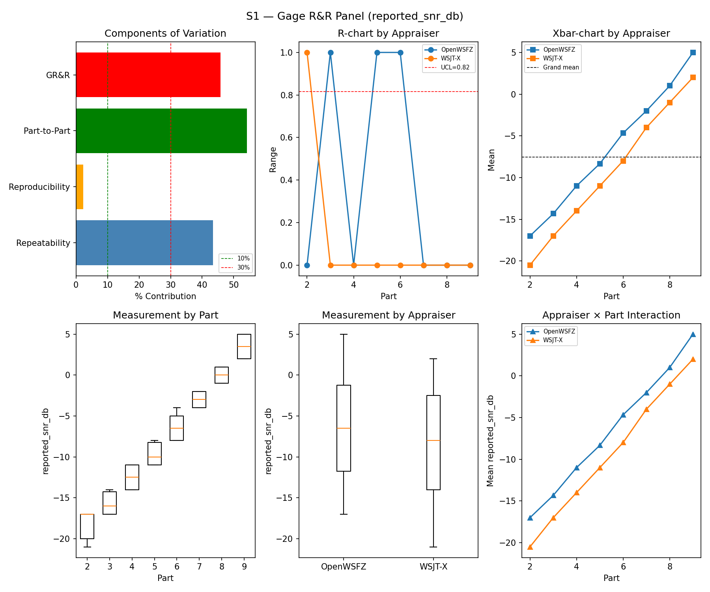
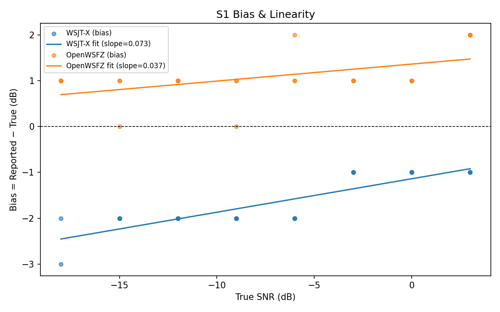
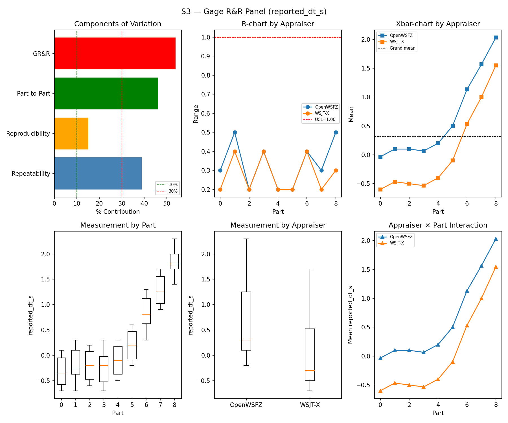

# OpenWSFZ R&R Study Report

| Field | Value |
|---|---|
| Run date | 2026-06-06 |
| OpenWSFZ SHA | `5b868ce6e54ec4daf2b1e6b2cadf3dbc936280eb` |
| WSJT-X version | WSJT-X 2.7.0 (inferred from binary date 2025-02-04) |

## S1 — reported_snr_db

### Variance Components

| Component | σ² | %Contribution |
|---|---|---|
| Repeatability | 47.37 | 43.50% |
| Reproducibility | 2.56 | 2.35% |
| Part-to-Part | 58.97 | 54.15% |
| Total GR&R | 49.92 | 45.85% |
| Total | 108.89 | 100.00% |

### Study Metrics

| Metric | Value | Verdict |
|---|---|---|
| %Tolerance (GR&R) | 1059.84% | FAIL |
| %Study Var (GR&R) | 67.71% | — |
| ndc | 1 | FAIL |

### Bias & Linearity (S1)

| Appraiser | Mean Bias (dB) | Slope | Intercept | R² | Verdict |
|---|---|---|---|---|---|
| WSJT-X | -1.65 | 0.073 | -1.138 | 0.752 | PASS |
| OpenWSFZ | +1.08 | 0.037 | 1.361 | 0.267 | PASS |

## S2 — reported_freq_hz

### Variance Components

| Component | σ² | %Contribution |
|---|---|---|
| Repeatability | 0.15 | 0.00% |
| Reproducibility | 0.37 | 0.00% |
| Part-to-Part | 652949.47 | 100.00% |
| Total GR&R | 0.52 | 0.00% |
| Total | 652949.99 | 100.00% |

### Study Metrics

| Metric | Value | Verdict |
|---|---|---|
| %Tolerance (GR&R) | 54.20% | PASS |
| %Study Var (GR&R) | 0.09% | — |
| ndc | 1576 | PASS |

## S3 — reported_dt_s

### Variance Components

| Component | σ² | %Contribution |
|---|---|---|
| Repeatability | 0.52 | 38.81% |
| Reproducibility | 0.20 | 15.05% |
| Part-to-Part | 0.61 | 46.14% |
| Total GR&R | 0.72 | 53.86% |
| Total | 1.33 | 100.00% |

### Study Metrics

| Metric | Value | Verdict |
|---|---|---|
| %Tolerance (GR&R) | 1270.38% | FAIL |
| %Study Var (GR&R) | 73.39% | — |
| ndc | 1 | FAIL |

## Attribute Agreement Analysis (S4/S5)

### Kappa

| Pair | κ | 95% CI | Verdict |
|---|---|---|---|
| OpenWSFZ_vs_truth | — | [—, —] | — |
| WSJT-X_vs_truth | — | [—, —] | — |
| between_appraisers | — | — | — |

### False-positive rate (S5)

| Appraiser | FP rate | Verdict |
|---|---|---|
| WSJT-X | 0.00% | PASS |
| OpenWSFZ | 0.00% | PASS |

## Summary

| Metric | Scope | Value | Verdict |
|---|---|---|---|
| %GR&R | S1 | 45.8% | FAIL |
| ndc | S1 | 1 | FAIL |
| %GR&R | S2 | 0.0% | PASS |
| ndc | S2 | 1576 | PASS |
| %GR&R | S3 | 53.9% | FAIL |
| ndc | S3 | 1 | FAIL |
| FP rate | S5/WSJT-X | 0.0% | PASS |
| FP rate | S5/OpenWSFZ | 0.0% | PASS |
| SNR bias | S1/WSJT-X | -1.65 dB | PASS |
| SNR bias | S1/OpenWSFZ | +1.08 dB | PASS |

**Overall verdict: FAIL**

### Defect Notices

- ❌ FAIL — %GR&R (S1) = 45.8% (threshold: < 10.0% Acceptable)
- ❌ FAIL — %GR&R (S3) = 53.9% (threshold: < 10.0% Acceptable)
