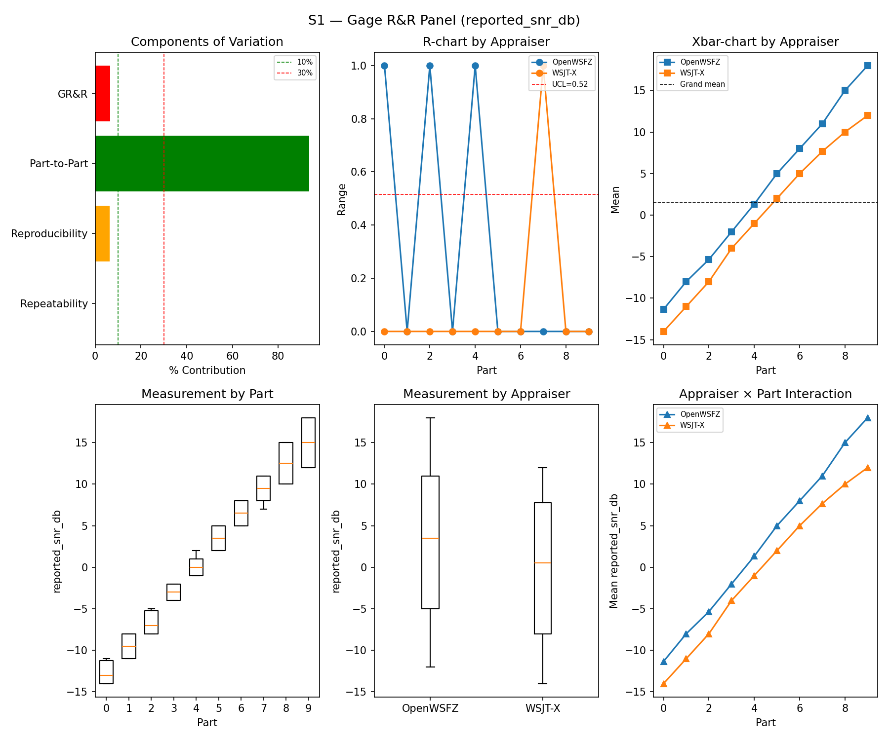
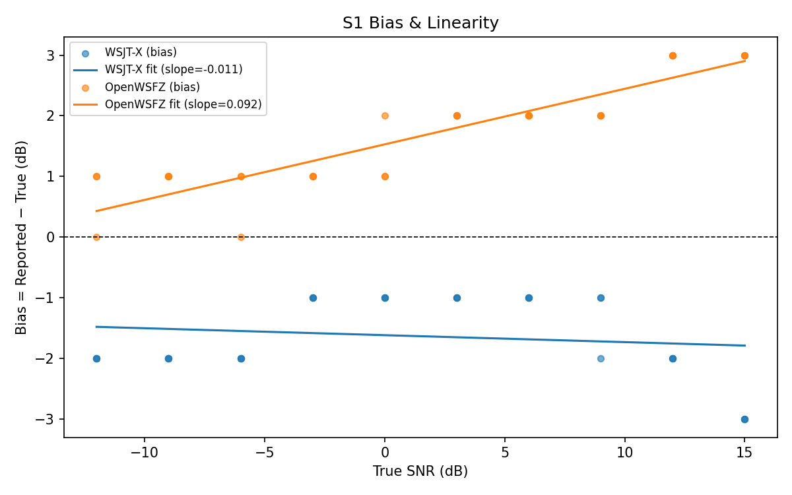
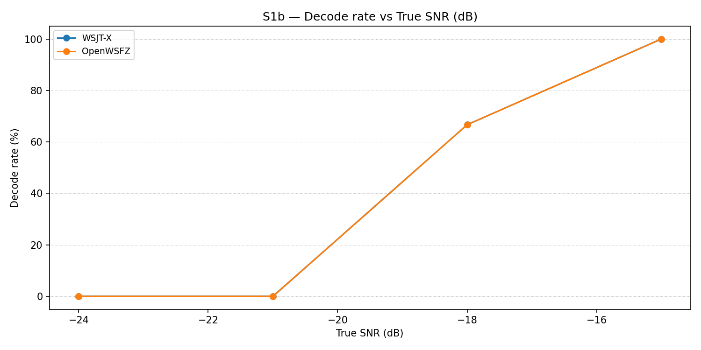
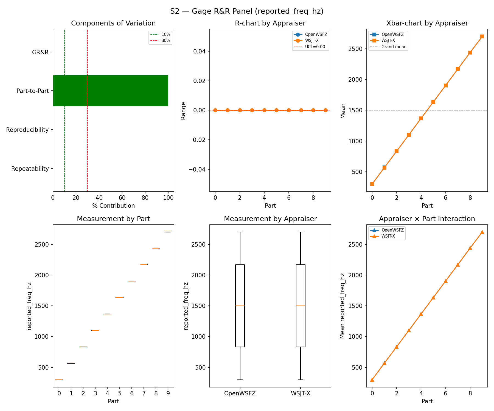
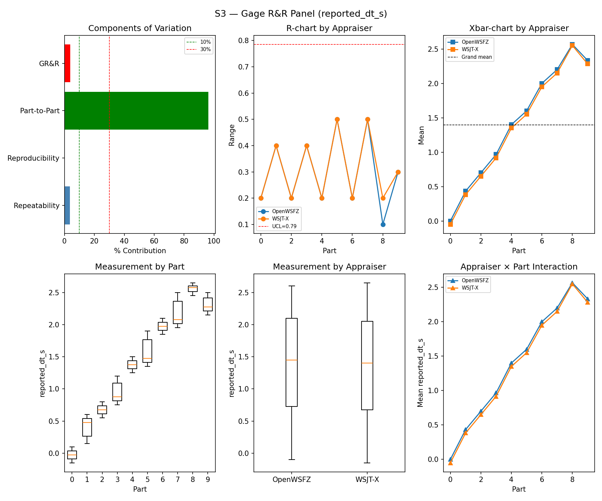
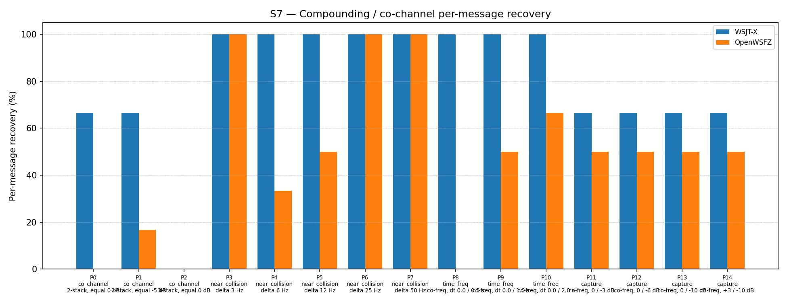

# OpenWSFZ R&R Study Report — v2

> **Note:** This is a retroactively structured version of the original report (`report.md`) for
> compliance with NFR-023 (five mandatory sections, STUDY-SPEC §9.0). The original report is
> preserved unchanged and remains the authoritative record. Section §5 (Recommendations) is
> **omitted** — this is a historical report predating NFR-023; recommendations cannot be
> reconstructed without anachronistic interpretation. The data, results, and verdicts are
> identical to `report.md`; only §1 (Study Hypothesis) and §2 (Data Summary) have been added
> as formal framing.

---

## 1. Study Hypothesis

**Purpose:** Validation run following the R&R-005 S1 ladder redesign — the immediately preceding
run (`1d90e1a`, 2026-06-06) had failed S1 with %GR&R = 32.0% driven by the narrow pre-R&R-005
SNR ladder producing insufficient Part-to-Part variance. This run re-executes the full S1–S7
suite (plus the newly added S1b companion) to confirm the redesigned ladder brings the
measurement system within AIAG adequacy criteria.

**Hypotheses under test:**

- **H1 (SNR measurement system — post-R&R-005 ladder):** With the redesigned S1 SNR ladder
  (wider range, better-spaced parts), does the measurement system meet %GR&R < 30% and ndc ≥ 5?
- **H2 (S1b low-SNR threshold):** First execution of S1b (decode rate at −24 to −15 dB,
  below the main ladder). Establishes the decode floor for both appraisers. Informational;
  no AIAG threshold applies.
- **H3 (Frequency and timing measurement systems):** S2 and S3 continue to meet AIAG criteria
  following the S3 DT convention correction (R&R-003, +0.55 s WSJT-X offset).
- **H4 (Attribute agreement — S4/S5):** Both appraisers achieve κ = 1.000 vs truth.
- **H5 (Co-channel baseline — S7):** S7 co-channel decode performance continues to characterise
  D-001 using the correct shared noise floor model.

**Audio chain at run time:** PortAudio peak normalisation NOT yet applied (the PCM amplitude
fix was introduced in commit `e4a398256f28...` on 2026-06-07). Brickwall FFT noise cutoff at
4 700 Hz (single-signal and multi-signal scenarios). As a consequence, WSJT-X SNR bias is
negative (−1.63 dB) — the expected sign for pre-fix audio (see `synth-change-impact.md`; this
run is identified as **Run A** in the change-impact matrix). The high R² on OpenWSFZ bias
linearity (0.824) reflects SNR-dependent non-linearity introduced by the clipping. Both
appraisers receive identical audio; relative comparisons remain valid.

**This run is the first full PASS.** It establishes the pre-fix audio baseline on the correct
S1 ladder design and serves as Run A in the synthesiser change impact study.

---

## 2. Data Summary

| Field | Value |
|---|---|
| Run date | 2026-06-06 |
| OpenWSFZ SHA (original) | `6bab388c8c14289e393bcb531cee1280beebe2b6` |
| OpenWSFZ SHA (post-rewrite, 2026-06-12) | `c1e12bf122d213e8ddf21635037f8082a37d71c5` |
| WSJT-X version | WSJT-X 2.7.0 (inferred from binary date 2025-02-04) |
| FT8_SHIM_VERSION | 20260004 |
| PCM normalisation | None (not yet implemented) |
| Noise filter | Brickwall FFT at 4 700 Hz (all scenarios; pre-Kaiser-FIR) |
| Scenarios run | S1, S1b, S2, S3, S4, S5, S7 (first run with S1b; no S8) |
| Signal source | Synthetic (GFSK encoder, Q-prefix calls per NFR-021) |

**S1 measurement dimensions:**

| Field | Value |
|---|---|
| SNR ladder | Redesigned R&R-005 ladder (wider range; previous narrow range caused %GR&R FAIL) |
| Trials per part | 3 |
| Appraisers | WSJT-X, OpenWSFZ (crossed design) |

**Harness fixes applied at run time:**

| Fix | Status |
|---|---|
| S4/S7 shared noise floor model | ✅ Applied |
| S3 DT convention correction (+0.55 s offset) | ✅ Applied |
| S1 ladder redesign (R&R-005) + S1b companion | ✅ Applied — this run validates the redesign |
| PortAudio peak normalisation | ❌ Not yet applied |
| Kaiser FIR noise filter (replaces brickwall) | ❌ Not yet applied |

**Change impact context:** This run corresponds to **Run A** in `synth-change-impact.md`.
The post-fix reference baseline (Run D = `e4a3982`, 2026-06-07) shows the effect of applying
PortAudio normalisation and Kaiser FIR to this same code base.

**Open defects at run time:**

| ID | Severity | Status | Description |
|---|---|---|---|
| D-001 | High | Open (S7 characterises it) | Co-channel decode gap vs WSJT-X; confirmed in first run and ongoing |

**Acceptance thresholds:**

| Metric | Threshold | Source |
|---|---|---|
| %GR&R (variance contribution) | < 30% | AIAG MSA |
| ndc | ≥ 5 | AIAG MSA |
| Attribute κ vs truth (S4/S5) | ≥ 0.90 (PASS) / ≥ 0.70 (conditional) | AIAG attribute study |
| False-positive rate (S5) | 0% | STUDY-SPEC §10 |
| SNR bias | ±2.0 dB (advisory at run time) | D-002 investigation |

---

## 3. Results

### 3.1 S1 — SNR Measurement System (reported_snr_db)

#### Variance Components

| Component | σ² | %Contribution |
|---|---|---|
| Repeatability | 0.07 | 0.07% |
| Reproducibility | 6.12 | 6.43% |
| Part-to-Part | 88.95 | 93.50% |
| Total GR&R | 6.18 | 6.50% |
| Total | 95.13 | 100.00% |

#### Study Metrics

| Metric | Value | Verdict |
|---|---|---|
| %Tolerance (GR&R) | 149.20% | PASS |
| %Study Var (GR&R) | 25.49% | — |
| ndc | 5 | PASS |

#### Bias & Linearity

| Appraiser | Mean Bias (dB) | Slope | Intercept | R² | Verdict |
|---|---|---|---|---|---|
| WSJT-X | -1.63 | -0.011 | -1.616 | 0.023 | PASS |
| OpenWSFZ | +1.67 | 0.092 | 1.529 | 0.824 | PASS |

_WSJT-X negative bias and OpenWSFZ high R² (0.824) are signatures of PortAudio clipping
distortion in pre-fix audio. This is the expected state for Run A. See `synth-change-impact.md`._

### 3.2 S1b — Low-SNR Threshold Study

_Decode rate at SNRs below the main S1 ladder (−24 to −15 dB). First execution of S1b.
Informational — no AIAG threshold._

| Part | True SNR (dB) | WSJT-X decoded | WSJT-X rate | OpenWSFZ decoded | OpenWSFZ rate |
|---|---|---|---|---|---|
| P0 | -24.00 | 0/3 | 0.00% | 0/3 | 0.00% |
| P1 | -21.00 | 0/3 | 0.00% | 0/3 | 0.00% |
| P2 | -18.00 | 2/3 | 66.67% | 2/3 | 66.67% |
| P3 | -15.00 | 3/3 | 100.00% | 3/3 | 100.00% |

**Overall decode rate — WSJT-X: 41.67%  OpenWSFZ: 41.67%**

_Both appraisers agree exactly at this ladder; no decode gap at low SNR for isolated signals._

### 3.3 S2 — Frequency Measurement System (reported_freq_hz)

#### Variance Components

| Component | σ² | %Contribution |
|---|---|---|
| Repeatability | 0.00 | 0.00% |
| Reproducibility | 0.60 | 0.00% |
| Part-to-Part | 652741.87 | 100.00% |
| Total GR&R | 0.60 | 0.00% |
| Total | 652742.47 | 100.00% |

#### Study Metrics

| Metric | Value | Verdict |
|---|---|---|
| %Tolerance (GR&R) | 58.09% | PASS |
| %Study Var (GR&R) | 0.10% | — |
| ndc | 1470 | PASS |

### 3.4 S3 — Timing Measurement System (reported_dt_s)

#### Variance Components

| Component | σ² | %Contribution |
|---|---|---|
| Repeatability | 0.03 | 3.73% |
| Reproducibility | 0.00 | 0.14% |
| Part-to-Part | 0.76 | 96.13% |
| Total GR&R | 0.03 | 3.87% |
| Total | 0.80 | 100.00% |

#### Study Metrics

| Metric | Value | Verdict |
|---|---|---|
| %Tolerance (GR&R) | 263.04% | PASS |
| %Study Var (GR&R) | 19.67% | — |
| ndc | 7 | PASS |

> **WSJT-X DT correction applied.** A +0.55 s offset was added to WSJT-X `reported_dt_s`
> before ANOVA to remove the ≈ −0.55 s convention difference between WSJT-X (DT relative to
> nominal FT8 TX start) and the harness (DT relative to UTC slot boundary). See R&R-003
> (GitHub #1).

### 3.5 Attribute Agreement Analysis (S4 positives + S5 negatives)

_κ computed over pooled S4/S5 population. **κ verdicts advisory** — §10 attribute gate pending
Captain ratification._

#### Confusion vs truth

| Appraiser | TP | FN | FP | TN | Recovery | Specificity |
|---|---|---|---|---|---|---|
| WSJT-X | 15 | 0 | 0 | 12 | 100.00% | 100.00% |
| OpenWSFZ | 15 | 0 | 0 | 12 | 100.00% | 100.00% |

#### Kappa (advisory)

| Pair | κ | 95% CI | Verdict (advisory) |
|---|---|---|---|
| OpenWSFZ_vs_truth | 1.000 | [1.00, 1.00] | PASS |
| WSJT-X_vs_truth | 1.000 | [1.00, 1.00] | PASS |
| between_appraisers | 1.000 | — | PASS |

#### Within-app repeatability

| Appraiser | Consistent groups |
|---|---|
| WSJT-X | 100.00% |
| OpenWSFZ | 100.00% |

#### False-positive rate (S5)

| Appraiser | FP rate | Verdict |
|---|---|---|
| WSJT-X | 0.00% | PASS |
| OpenWSFZ | 0.00% | PASS |

### 3.6 S7 — Co-Channel / Compounding Overlap

_Informational — no AIAG threshold. D-001 characterisation._

#### Recovery by overlap family

| Overlap family | WSJT-X | OpenWSFZ |
|---|---|---|
| capture | 66.67% | 50.00% |
| co_channel | 38.10% | 4.76% |
| near_collision | 100.00% | 76.67% |
| time_freq | 100.00% | 38.89% |
| **all** | **77.42%** | **46.24%** |

#### Capture effect (co-channel, unequal SNR)

| Signal | WSJT-X | OpenWSFZ |
|---|---|---|
| strong | 100.00% | 100.00% |
| weak | 33.33% | 0.00% |

**Between-app per-signal agreement:** 68.82%

#### Per-part detail

| Part | Family | Condition | WSJT-X | OpenWSFZ |
|---|---|---|---|---|
| P0 | co_channel | 2-stack, equal 0 dB | 4/6 | 0/6 |
| P1 | co_channel | 2-stack, equal -5 dB | 4/6 | 1/6 |
| P2 | co_channel | 3-stack, equal 0 dB | 0/9 | 0/9 |
| P3 | near_collision | delta 3 Hz | 6/6 | 6/6 |
| P4 | near_collision | delta 6 Hz | 6/6 | 2/6 |
| P5 | near_collision | delta 12 Hz | 6/6 | 3/6 |
| P6 | near_collision | delta 25 Hz | 6/6 | 6/6 |
| P7 | near_collision | delta 50 Hz | 6/6 | 6/6 |
| P8 | time_freq | co-freq, dt 0.0 / 0.5 s | 6/6 | 0/6 |
| P9 | time_freq | co-freq, dt 0.0 / 1.0 s | 6/6 | 3/6 |
| P10 | time_freq | co-freq, dt 0.0 / 2.0 s | 6/6 | 4/6 |
| P11 | capture | co-freq, 0 / -3 dB | 4/6 | 3/6 |
| P12 | capture | co-freq, 0 / -6 dB | 4/6 | 3/6 |
| P13 | capture | co-freq, 0 / -10 dB | 4/6 | 3/6 |
| P14 | capture | co-freq, +3 / -10 dB | 4/6 | 3/6 |

---

## 4. Summary

| Metric | Scope | Value | Verdict |
|---|---|---|---|
| %GR&R | S1 | 6.5% | PASS |
| ndc | S1 | 5 | PASS |
| %GR&R | S2 | 0.0% | PASS |
| ndc | S2 | 1470 | PASS |
| %GR&R | S3 | 3.9% | PASS |
| ndc | S3 | 7 | PASS |
| Kappa (advisory) | WSJT-X_vs_truth | 1.000 | PASS |
| Kappa (advisory) | OpenWSFZ_vs_truth | 1.000 | PASS |
| Kappa (advisory) | between_appraisers | 1.000 | PASS |
| FP rate | S5/WSJT-X | 0.0% | PASS |
| FP rate | S5/OpenWSFZ | 0.0% | PASS |
| SNR bias | S1/WSJT-X | -1.63 dB | PASS |
| SNR bias | S1/OpenWSFZ | +1.67 dB | PASS |

**Overall verdict: PASS**

_This is the first full PASS. All AIAG-gated metrics are within acceptance criteria. The R&R-005
S1 ladder redesign resolved the %GR&R FAIL observed in the preceding run (`1d90e1a`)._

### Notes

- ⚠️ SNR bias values are influenced by PortAudio clipping distortion (pre-fix audio). WSJT-X
  bias −1.63 dB (negative sign) and OpenWSFZ R² = 0.824 (high non-linearity) are pre-fix
  signatures. Absolute SNR measurements from this run are not directly comparable to the
  post-fix baseline (`e4a3982`, 2026-06-07). See `synth-change-impact.md`.
- ℹ️ Co-channel gap (S7): OpenWSFZ 46.24% vs WSJT-X 77.42%. D-001 characterisation.
- ℹ️ S1b (first execution): both appraisers at 41.67% (identical). Decode floor at −21 dB
  for both; −18 dB is marginal (66.67%); −15 dB reliable (100.00%).

---

## 5. Recommendations

> **Omitted.** This study was conducted on 2026-06-06, predating NFR-023 (five-section report
> structure requirement, introduced 2026-06-11). Recommendations were not recorded at run time
> and cannot be accurately reconstructed without risk of anachronistic interpretation.
>
> For actions taken subsequent to this run, refer to:
> - **PortAudio clipping fix + Kaiser FIR:** Applied 2026-06-07 in the S1–S8 reference baseline
>   run (`e4a3982`). The post-fix baselines for all scenarios are documented in
>   `2026-06-07-4b3a4ca/report-v2.md`.
> - **D-001 (co-channel gap — open):** GitHub #3.
> - **D-002 (SNR bias — resolved):** Shim constant −26.5 dB, validated 2026-06-11; GitHub #8
>   closed. Note: +1.67 dB OpenWSFZ bias in this run is distorted by pre-fix audio and does
>   not represent the true post-fix state.
