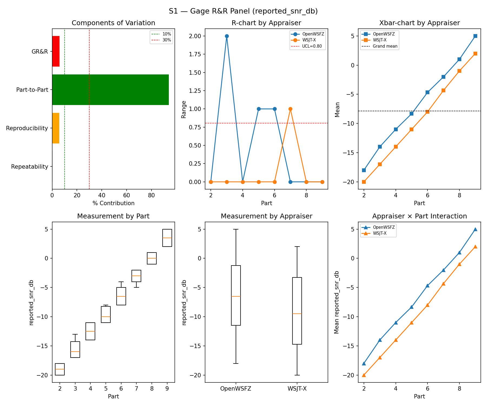
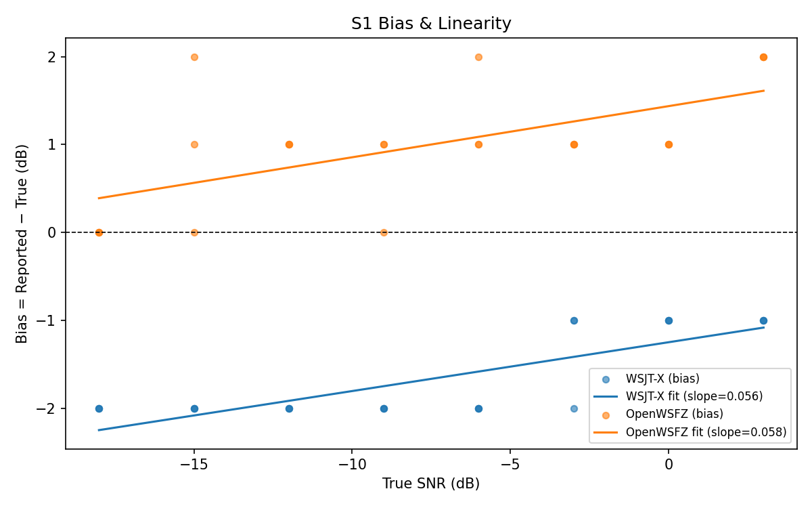
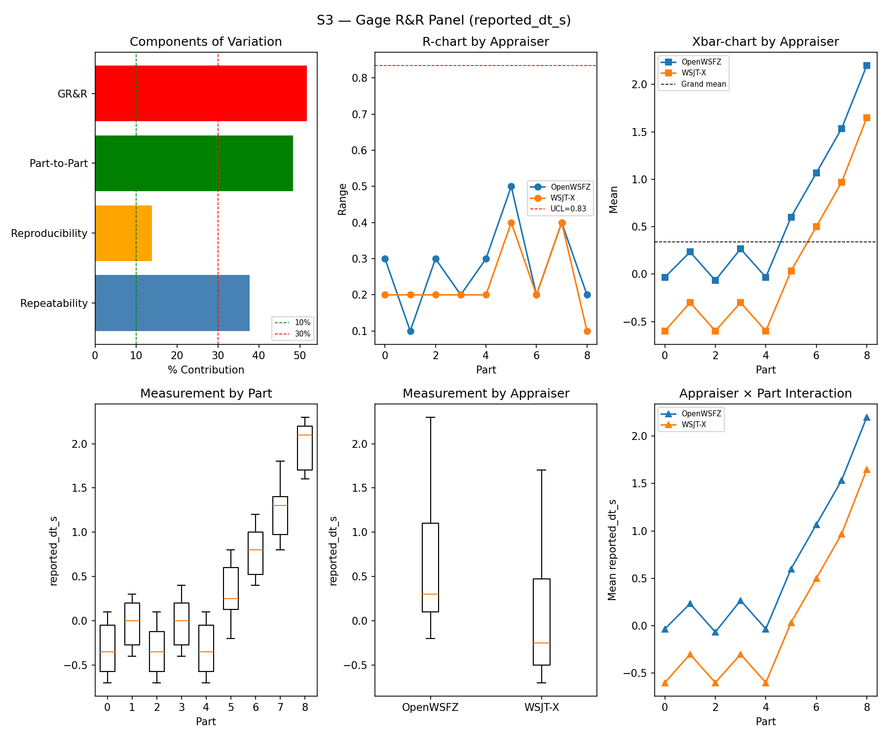

# OpenWSFZ R&R Study Report

| Field | Value |
|---|---|
| Run date | 2026-06-06 |
| OpenWSFZ SHA | `aa053a976a2b7ca5cd3ed31491129b66f0bec1bd` |
| WSJT-X version | WSJT-X 2.7.0 (inferred from binary date 2025-02-04) |

## S1 — reported_snr_db

### Variance Components

| Component | σ² | %Contribution |
|---|---|---|
| Repeatability | 0.12 | 0.20% |
| Reproducibility | 3.63 | 5.66% |
| Part-to-Part | 60.29 | 94.14% |
| Total GR&R | 3.75 | 5.86% |
| Total | 64.04 | 100.00% |

### Study Metrics

| Metric | Value | Verdict |
|---|---|---|
| %Tolerance (GR&R) | 290.47% | PASS |
| %Study Var (GR&R) | 24.20% | — |
| ndc | 5 | PASS |

### Bias & Linearity (S1)

| Appraiser | Mean Bias (dB) | Slope | Intercept | R² | Verdict |
|---|---|---|---|---|---|
| WSJT-X | -1.67 | 0.056 | -1.250 | 0.656 | PASS |
| OpenWSFZ | +1.00 | 0.058 | 1.437 | 0.384 | PASS |

## S2 — reported_freq_hz

### Variance Components

| Component | σ² | %Contribution |
|---|---|---|
| Repeatability | 0.15 | 0.00% |
| Reproducibility | 0.40 | 0.00% |
| Part-to-Part | 652845.67 | 100.00% |
| Total GR&R | 0.55 | 0.00% |
| Total | 652846.22 | 100.00% |

### Study Metrics

| Metric | Value | Verdict |
|---|---|---|
| %Tolerance (GR&R) | 55.62% | PASS |
| %Study Var (GR&R) | 0.09% | — |
| ndc | 1536 | PASS |

## S3 — reported_dt_s

### Variance Components

| Component | σ² | %Contribution |
|---|---|---|
| Repeatability | 0.52 | 37.74% |
| Reproducibility | 0.19 | 13.93% |
| Part-to-Part | 0.66 | 48.33% |
| Total GR&R | 0.71 | 51.67% |
| Total | 1.37 | 100.00% |

### Study Metrics

| Metric | Value | Verdict |
|---|---|---|
| %Tolerance (GR&R) | 1260.96% | FAIL |
| %Study Var (GR&R) | 71.88% | — |
| ndc | 1 | FAIL |

## Attribute Agreement Analysis (S4/S5)

### Kappa

| Pair | κ | 95% CI | Verdict |
|---|---|---|---|
| OpenWSFZ_vs_truth | — | [—, —] | — |
| WSJT-X_vs_truth | — | [—, —] | — |
| between_appraisers | — | — | — |

### False-positive rate (S5)

| Appraiser | FP rate | Verdict |
|---|---|---|
| WSJT-X | 0.00% | PASS |
| OpenWSFZ | 0.00% | PASS |

## Summary

| Metric | Scope | Value | Verdict |
|---|---|---|---|
| %GR&R | S1 | 5.9% | PASS |
| ndc | S1 | 5 | PASS |
| %GR&R | S2 | 0.0% | PASS |
| ndc | S2 | 1536 | PASS |
| %GR&R | S3 | 51.7% | FAIL |
| ndc | S3 | 1 | FAIL |
| FP rate | S5/WSJT-X | 0.0% | PASS |
| FP rate | S5/OpenWSFZ | 0.0% | PASS |
| SNR bias | S1/WSJT-X | -1.67 dB | PASS |
| SNR bias | S1/OpenWSFZ | +1.00 dB | PASS |

**Overall verdict: FAIL**

### Defect Notices

- ❌ FAIL — %GR&R (S3) = 51.7% (threshold: < 10.0% Acceptable)
