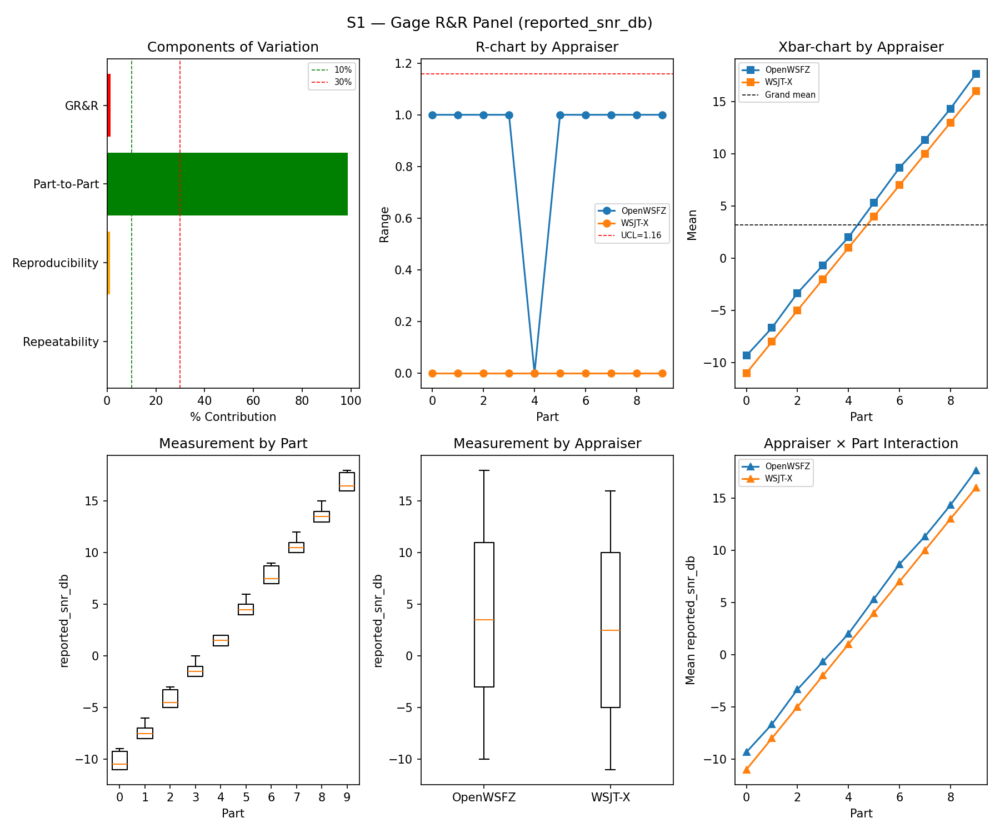
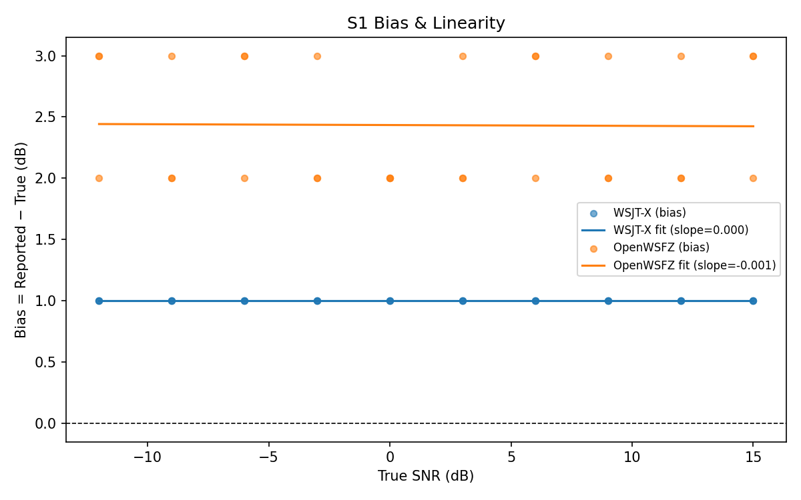
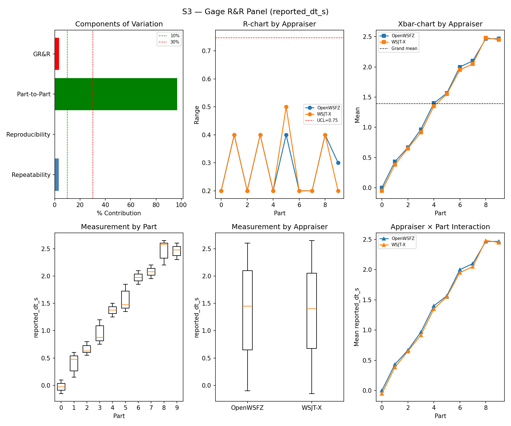
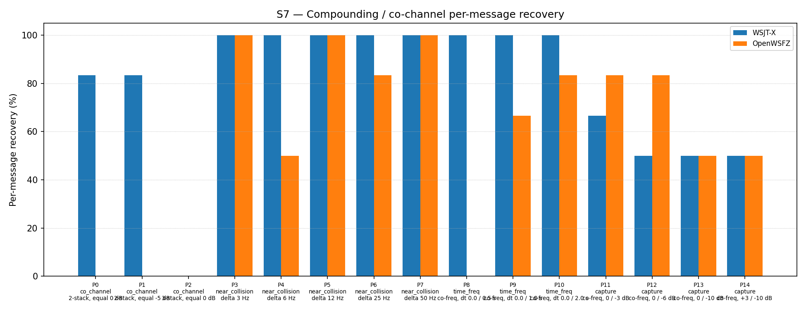
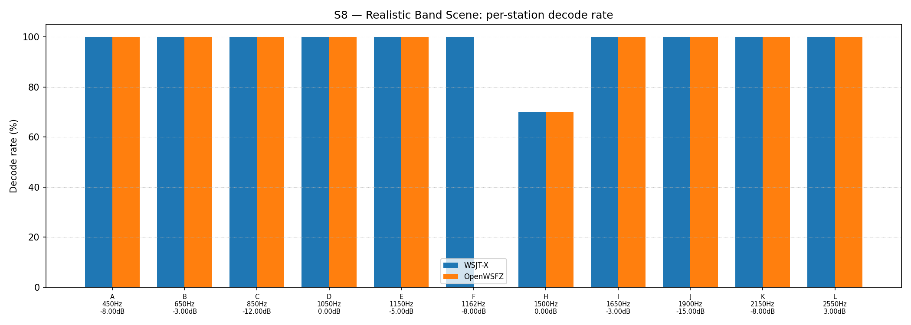

# OpenWSFZ R&R Study Report

| Field | Value |
|---|---|
| Run date | 2026-06-07 |
| OpenWSFZ SHA | `4b3a4ca460889010f9104ce0989f62485d28ff77` |
| WSJT-X version | WSJT-X 2.7.0 (inferred from binary date 2025-02-04) |

> **⚠️ Study integrity note — hardware interruption during S7**
>
> A hardware failure occurred partway through scenario S7 (co-channel compounding),
> specifically after part 3 trial 0 of 15 parts × 3 trials.  The following measures
> were taken to preserve the validity of all other results:
>
> - The 23 invalid S7 truth rows (parts 0–3 partial, all contaminated by the failure)
>   were removed from `truth.csv` before any matching was performed.
> - S7 was replayed in full from the beginning once the hardware was restored.
>   The fresh 93 truth rows carry new UTC timestamps; any stale S7 decode events
>   in the appraiser ALL.TXT files (timestamped before the resumption) do not match
>   any truth row and are ignored by the matcher.
> - All other scenarios (S8, S1, S1b, S2, S3, S4, S5) completed before the
>   interruption and were unaffected; their results are valid.
>
> The S7 results presented below are therefore from a complete, uncontaminated replay.
> The audio chain (synthesiser, VB-CABLE routing, WSJT-X and OpenWSFZ monitoring)
> was confirmed operational before the S7 replay began.

## S1 — reported_snr_db

### Variance Components

| Component | σ² | %Contribution |
|---|---|---|
| Repeatability | 0.15 | 0.18% |
| Reproducibility | 1.02 | 1.23% |
| Part-to-Part | 82.44 | 98.60% |
| Total GR&R | 1.17 | 1.40% |
| Total | 83.62 | 100.00% |

### Study Metrics

| Metric | Value | Verdict |
|---|---|---|
| %Tolerance (GR&R) | 65.03% | PASS |
| %Study Var (GR&R) | 11.85% | — |
| ndc | 11 | PASS |

### Bias & Linearity (S1)

| Appraiser | Mean Bias (dB) | Slope | Intercept | R² | Verdict |
|---|---|---|---|---|---|
| WSJT-X | +1.00 | 0.000 | 1.000 | 0.000 | PASS |
| OpenWSFZ | +2.43 | -0.001 | 2.434 | 0.000 | FAIL |

## S2 — reported_freq_hz

### Variance Components

| Component | σ² | %Contribution |
|---|---|---|
| Repeatability | 0.15 | 0.00% |
| Reproducibility | 0.40 | 0.00% |
| Part-to-Part | 652845.67 | 100.00% |
| Total GR&R | 0.55 | 0.00% |
| Total | 652846.22 | 100.00% |

### Study Metrics

| Metric | Value | Verdict |
|---|---|---|
| %Tolerance (GR&R) | 55.62% | PASS |
| %Study Var (GR&R) | 0.09% | — |
| ndc | 1536 | PASS |

## S3 — reported_dt_s

### Variance Components

| Component | σ² | %Contribution |
|---|---|---|
| Repeatability | 0.03 | 3.30% |
| Reproducibility | 0.00 | 0.07% |
| Part-to-Part | 0.76 | 96.64% |
| Total GR&R | 0.03 | 3.36% |
| Total | 0.79 | 100.00% |

### Study Metrics

| Metric | Value | Verdict |
|---|---|---|
| %Tolerance (GR&R) | 244.31% | PASS |
| %Study Var (GR&R) | 18.34% | — |
| ndc | 7 | PASS |

> **WSJT-X DT correction applied.** A +0.55 s offset was added to WSJT-X `reported_dt_s` before ANOVA to remove the ≈ −0.55 s convention difference between WSJT-X (DT relative to nominal FT8 TX start) and the harness (DT relative to UTC slot boundary). This correction removes the calibration artefact from SS_appraiser so %GR&R measures genuine app-to-app measurement disagreement. Raw reported values are preserved in the matched CSV. See scenario `wsjt_dt_correction_s` field and R&R-003 (GitHub #1).

## S1b — Low-SNR threshold study

_Decode rate (% of injected messages recovered) at SNRs excluded from the redesigned S1 ladder (−24 to −15 dB).  Companion to S1; separates 'does it decode at this SNR?' from 'how accurately does it measure SNR?'.  Informational — no AIAG threshold._

### Per-part decode rate

| Part | True SNR (dB) | WSJT-X decoded | WSJT-X rate | OpenWSFZ decoded | OpenWSFZ rate |
|---|---|---|---|---|---|
| P0 | -24.00 | 0/3 | 0.00% | 0/3 | 0.00% |
| P1 | -21.00 | 3/3 | 100.00% | 0/3 | 0.00% |
| P2 | -18.00 | 3/3 | 100.00% | 3/3 | 100.00% |
| P3 | -15.00 | 3/3 | 100.00% | 3/3 | 100.00% |

**Overall decode rate — WSJT-X: 75.00%  OpenWSFZ: 50.00%**

## Attribute Agreement Analysis (S4 positives + S5 negatives)

_κ is computed over a pooled population: S4 injected messages (truth = present) and S5 signal-free slots (truth = absent), so the truth vector has both classes. **κ verdicts below are advisory** — the §10 attribute gate is pending Captain ratification of this pooled method._

### Confusion vs truth

| Appraiser | TP | FN | FP | TN | Recovery | Specificity |
|---|---|---|---|---|---|---|
| WSJT-X | 15 | 0 | 0 | 12 | 100.00% | 100.00% |
| OpenWSFZ | 15 | 0 | 0 | 12 | 100.00% | 100.00% |

### Kappa (advisory)

| Pair | κ | 95% CI | Verdict (advisory) |
|---|---|---|---|
| OpenWSFZ_vs_truth | 1.000 | [1.00, 1.00] | PASS |
| WSJT-X_vs_truth | 1.000 | [1.00, 1.00] | PASS |
| between_appraisers | 1.000 | — | PASS |

### Within-app repeatability (decision consistency across trials)

| Appraiser | Consistent groups |
|---|---|
| WSJT-X | 100.00% |
| OpenWSFZ | 100.00% |

### False-positive rate (S5)

| Appraiser | FP rate | Verdict |
|---|---|---|
| WSJT-X | 0.00% | PASS |
| OpenWSFZ | 0.00% | PASS |

## S7 — Compounding / co-channel overlap

_Per-message recovery when 2–3 signals occupy the same or near-same audio frequency / time slot (the pileup case S4 does not exercise). Informational — no AIAG threshold is defined for co-channel separation._

### Recovery by overlap family

| Overlap family | WSJT-X | OpenWSFZ |
|---|---|---|
| capture | 54.17% | 66.67% |
| co_channel | 47.62% | 0.00% |
| near_collision | 100.00% | 86.67% |
| time_freq | 100.00% | 50.00% |
| **all** | **76.34%** | **54.84%** |

### Capture effect (co-channel, unequal SNR)

| Signal | WSJT-X | OpenWSFZ |
|---|---|---|
| strong | 100.00% | 100.00% |
| weak | 8.33% | 33.33% |

**Between-app per-signal agreement:** 72.04%

### Per-part detail

| Part | Family | Condition | WSJT-X | OpenWSFZ |
|---|---|---|---|---|
| P0 | co_channel | 2-stack, equal 0 dB | 5/6 | 0/6 |
| P1 | co_channel | 2-stack, equal -5 dB | 5/6 | 0/6 |
| P2 | co_channel | 3-stack, equal 0 dB | 0/9 | 0/9 |
| P3 | near_collision | delta 3 Hz | 6/6 | 6/6 |
| P4 | near_collision | delta 6 Hz | 6/6 | 3/6 |
| P5 | near_collision | delta 12 Hz | 6/6 | 6/6 |
| P6 | near_collision | delta 25 Hz | 6/6 | 5/6 |
| P7 | near_collision | delta 50 Hz | 6/6 | 6/6 |
| P8 | time_freq | co-freq, dt 0.0 / 0.5 s | 6/6 | 0/6 |
| P9 | time_freq | co-freq, dt 0.0 / 1.0 s | 6/6 | 4/6 |
| P10 | time_freq | co-freq, dt 0.0 / 2.0 s | 6/6 | 5/6 |
| P11 | capture | co-freq, 0 / -3 dB | 4/6 | 5/6 |
| P12 | capture | co-freq, 0 / -6 dB | 3/6 | 5/6 |
| P13 | capture | co-freq, 0 / -10 dB | 3/6 | 3/6 |
| P14 | capture | co-freq, +3 / -10 dB | 3/6 | 3/6 |

## S8 — Realistic Band Scene

_Holistic decode-rate benchmark: 12 simultaneous stations across 450–2550 Hz at realistic SNR spread (−15 to +3 dB), including a near-collision pair (E/F, 12 Hz apart) and a capture pair (G/H, co-frequency, 6 dB ratio). **Informational only — no PASS/FAIL gate.**_

### Overall decode rate

| Appraiser | Decoded | Injected | Rate |
|---|---|---|---|
| WSJT-X | 57 | 60 | 95.00% |
| OpenWSFZ | 52 | 60 | 86.67% |

**Between-appraiser delta (OpenWSFZ − WSJT-X): -8.3 pp**

### Per-station breakdown

| Stn | Freq (Hz) | SNR (dB) | WSJT-X decoded/total | OpenWSFZ decoded/total |
|---|---|---|---|---|
| A | 450 | -8.00 | 5/5 | 5/5 |
| B | 650 | -3.00 | 5/5 | 5/5 |
| C | 850 | -12.00 | 5/5 | 5/5 |
| D | 1050 | 0.00 | 5/5 | 5/5 |
| E | 1150 | -5.00 | 5/5 | 5/5 |
| F | 1162 | -8.00 | 5/5 | 0/5 |
| H | 1500 | 0.00 | 7/10 | 7/10 |
| I | 1650 | -3.00 | 5/5 | 5/5 |
| J | 1900 | -15.00 | 5/5 | 5/5 |
| K | 2150 | -8.00 | 5/5 | 5/5 |
| L | 2550 | 3.00 | 5/5 | 5/5 |

## Summary

| Metric | Scope | Value | Verdict |
|---|---|---|---|
| %GR&R | S1 | 1.4% | PASS |
| ndc | S1 | 11 | PASS |
| %GR&R | S2 | 0.0% | PASS |
| ndc | S2 | 1536 | PASS |
| %GR&R | S3 | 3.4% | PASS |
| ndc | S3 | 7 | PASS |
| Kappa (advisory) | WSJT-X_vs_truth | 1.000 | PASS |
| Kappa (advisory) | OpenWSFZ_vs_truth | 1.000 | PASS |
| Kappa (advisory) | between_appraisers | 1.000 | PASS |
| FP rate | S5/WSJT-X | 0.0% | PASS |
| FP rate | S5/OpenWSFZ | 0.0% | PASS |
| SNR bias | S1/WSJT-X | +1.00 dB | PASS |
| SNR bias | S1/OpenWSFZ | +2.43 dB | FAIL |

**Overall verdict: FAIL**

### Defect Notices

- ❌ FAIL — SNR bias (OpenWSFZ) = +2.43 dB (threshold: ≤ ±2.0 dB)
