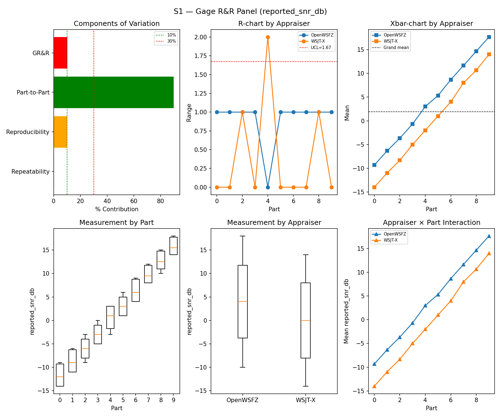
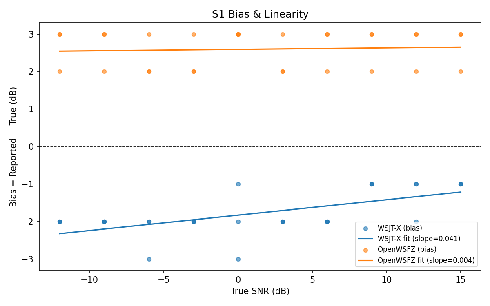
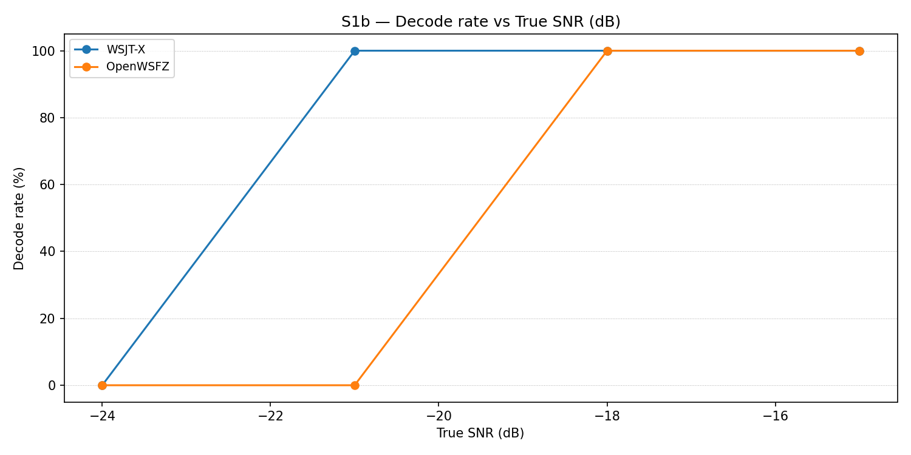

# OpenWSFZ R&R Study Report

| Field | Value |
|---|---|
| Run date | 2026-06-09 |
| OpenWSFZ SHA | `d509b08ade65e8bffb6e9dbe5f79182307a5a82c` |
| WSJT-X version | WSJT-X 2.7.0 (inferred from binary date 2025-02-04) |

## S1 — reported_snr_db

### Variance Components

| Component | σ² | %Contribution |
|---|---|---|
| Repeatability | 0.23 | 0.24% |
| Reproducibility | 9.55 | 9.94% |
| Part-to-Part | 86.25 | 89.81% |
| Total GR&R | 9.78 | 10.19% |
| Total | 96.04 | 100.00% |

### Study Metrics

| Metric | Value | Verdict |
|---|---|---|
| %Tolerance (GR&R) | 187.67% | MARGINAL |
| %Study Var (GR&R) | 31.92% | — |
| ndc | 4 | MARGINAL |

### Bias & Linearity (S1)

| Appraiser | Mean Bias (dB) | Slope | Intercept | R² | Verdict |
|---|---|---|---|---|---|
| WSJT-X | -1.77 | 0.041 | -1.828 | 0.401 | PASS |
| OpenWSFZ | +2.60 | 0.004 | 2.594 | 0.005 | FAIL |

## S1b — Low-SNR threshold study

_Decode rate (% of injected messages recovered) at SNRs excluded from the redesigned S1 ladder (−24 to −15 dB).  Companion to S1; separates 'does it decode at this SNR?' from 'how accurately does it measure SNR?'.  Informational — no AIAG threshold._

### Per-part decode rate

| Part | True SNR (dB) | WSJT-X decoded | WSJT-X rate | OpenWSFZ decoded | OpenWSFZ rate |
|---|---|---|---|---|---|
| P0 | -24.00 | 0/3 | 0.00% | 0/3 | 0.00% |
| P1 | -21.00 | 3/3 | 100.00% | 0/3 | 0.00% |
| P2 | -18.00 | 3/3 | 100.00% | 3/3 | 100.00% |
| P3 | -15.00 | 3/3 | 100.00% | 3/3 | 100.00% |

**Overall decode rate — WSJT-X: 75.00%  OpenWSFZ: 50.00%**

## Summary

| Metric | Scope | Value | Verdict |
|---|---|---|---|
| %GR&R | S1 | 10.2% | MARGINAL |
| ndc | S1 | 4 | MARGINAL |
| SNR bias | S1/WSJT-X | -1.77 dB | PASS |
| SNR bias | S1/OpenWSFZ | +2.60 dB | FAIL |

**Overall verdict: FAIL**

### Defect Notices

- ❌ FAIL — SNR bias (OpenWSFZ) = +2.60 dB (threshold: ≤ ±2.0 dB)
