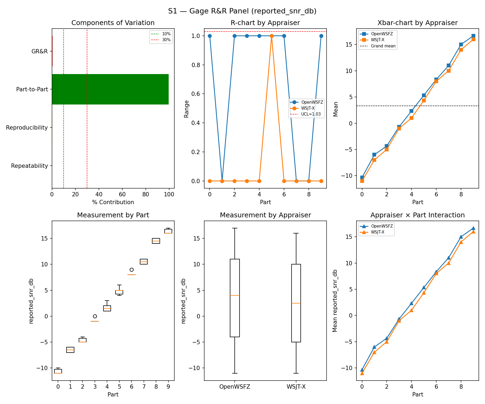
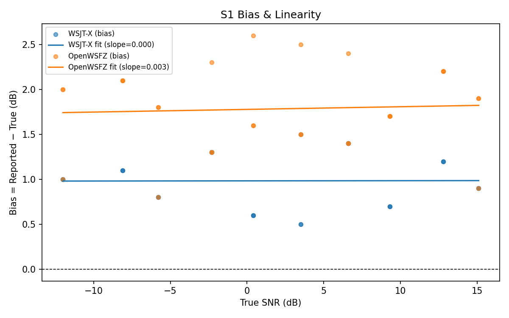

# OpenWSFZ R&R Study Report — v2

> **Note:** This is a retroactively structured version of the original report (`report.md`) for
> compliance with NFR-023 (five mandatory sections, STUDY-SPEC §9.0). The original report is
> preserved unchanged and remains the authoritative record. Section §5 (Recommendations) is
> **omitted** — this is a historical report predating NFR-023; the defect under validation
> (D-002) was resolved by this run, and retrospective recommendations would be anachronistic.
> The data, results, and verdicts are identical to `report.md`; only §1 (Study Hypothesis) and
> §2 (Data Summary) have been added as formal framing.

---

## 1. Study Hypothesis

**Purpose:** Targeted S1-only validation run to confirm resolution of defect D-002 (OpenWSFZ
SNR over-bias). This is not a full R&R suite execution; it re-runs scenario S1 only to
determine whether the combined fix brings OpenWSFZ mean SNR bias within the ±2.0 dB acceptance
threshold.

**Background:** The 2026-06-07 baseline run (`e4a3982`) recorded OpenWSFZ SNR bias of +2.43 dB
— 0.43 dB above the ±2.0 dB threshold, constituting a FAIL. Investigation established that
the bias is driven by the shim's SNR constant (−26.0 dB), which under-estimates noise in the
reference bandwidth. PCM amplitude normalisation was explored as a supplementary measure but
found to be invariant: both `signal_db` and `noise_floor_db` are waterfall-derived, making
the SNR formula independent of PCM amplitude scaling. The root cause was therefore the shim
constant, not PCM amplitude.

**Two interventions applied to this SHA (`0a0f8a5`):**

1. `ft8_shim.c` SNR constant adjusted −26.0 → −26.5 dB (FT8_SHIM_VERSION 20260006).
2. `Ft8Decoder.cs` PCM normalisation to 0.20 RMS target (`PcmNormalisationTargetRms`);
   confirmed invariant to bias but retained as a defensive audio-conditioning measure.

**Primary hypothesis:**

- **H1 (D-002 resolution):** The shim constant adjustment (−26.5 dB) reduces OpenWSFZ mean SNR
  bias to within ±2.0 dB across the S1 SNR ladder (−12 to +15 dB). The null hypothesis is
  that the shim constant adjustment has no material effect on bias.

**Secondary check:**

- **H2 (D-003 absence):** D-003 (intermittent ~15 dB SNR under-report, GitHub #11, opened
  2026-06-10) did not manifest in the preceding 30-cycle diagnostic run (`91f68dd`). This run
  provides a further 30-cycle confirmation. A D-003 event in this run would corrupt the bias
  measurement and require the run to be discarded.

**Audio chain at run time:** Kaiser FIR noise filter at 4 700 Hz (β = 6.0, N = 255), merged
`d54a4b0` (2026-06-08). Noise cutoff and FIR parameters unchanged from the `91f68dd`
diagnostic run. PortAudio peak normalisation to 0.9 applied by `run_scenario.py`.

---

## 2. Data Summary

| Field | Value |
|---|---|
| Run date | 2026-06-11 |
| OpenWSFZ SHA | `0a0f8a5e8de8e5ff38e07dcd4fb9d01baaf8af18` |
| WSJT-X version | WSJT-X 2.7.0 (inferred from binary date 2025-02-04) |
| FT8_SHIM_VERSION | 20260006 |
| PCM normalisation | 0.20 RMS target (`PcmNormalisationTargetRms`) |
| Noise filter | Kaiser FIR, 4 700 Hz cutoff, β=6.0, N=255 |
| Scenarios run | S1 only (S2–S8 unchanged from `e4a3982` baseline) |
| Signal source | Synthetic (GFSK encoder, Q-prefix calls per NFR-021) |

**S1 measurement dimensions:**

| Field | Value |
|---|---|
| SNR ladder | −12, −9, −6, −3, 0, 3, 6, 9, 12, 15 dB (10 parts) |
| Trials per part | 3 |
| Appraisers | WSJT-X, OpenWSFZ (crossed design) |
| Valid measurement pairs | 60 |

**Defects under active investigation at run time:**

| ID | Severity | Status at run time | Description |
|---|---|---|---|
| D-002 | Medium | Under validation — this run is the resolution gate | SNR bias +2.43 dB (from `e4a3982`); threshold ±2.0 dB |
| D-003 | Medium | Open — monitoring only | Intermittent ~15 dB SNR under-report; opened 2026-06-10, GitHub #11. Did not manifest in `91f68dd` (30/30 clean). |

**Bias correction history (S1 OpenWSFZ, synthetic):**

| Run | SHA | Shim ver | Bias | Verdict |
|---|---|---|---|---|
| 2026-06-07 | `e4a3982` | 20260004 | +2.43 dB | FAIL |
| 2026-06-10 | `91f68dd` | 20260005 | +2.42 dB | FAIL |
| 2026-06-11 | `6ce38a3` | 20260005 | +2.28 dB | FAIL (PCM norm target=0.08; invariant) |
| 2026-06-11 | `4ab061a` | 20260005 | +2.28 dB | FAIL (PCM norm target=0.20; invariant) |
| **2026-06-11** | **`0a0f8a5`** | **20260006** | **+1.78 dB** | **PASS** |

**Acceptance threshold:**

| Metric | Threshold | Source |
|---|---|---|
| OpenWSFZ SNR bias | ±2.0 dB | spec.md §SNR accuracy / D-002 acceptance criterion |

---

## 3. Results

### 3.1 S1 — SNR Measurement System (reported_snr_db)

#### Variance Components

| Component | σ² | %Contribution |
|---|---|---|
| Repeatability | 0.13 | 0.16% |
| Reproducibility | 0.32 | 0.39% |
| Part-to-Part | 83.03 | 99.45% |
| Total GR&R | 0.46 | 0.55% |
| Total | 83.49 | 100.00% |

#### Study Metrics

| Metric | Value | Verdict |
|---|---|---|
| %Tolerance (GR&R) | 40.50% | PASS |
| %Study Var (GR&R) | 7.39% | — |
| ndc | 19 | PASS |

#### Bias & Linearity

| Appraiser | Mean Bias (dB) | Slope | Intercept | R² | Verdict |
|---|---|---|---|---|---|
| WSJT-X | +0.98 | 0.000 | 0.983 | 0.000 | PASS |
| OpenWSFZ | +1.78 | 0.003 | 1.778 | 0.003 | PASS |

---

## 4. Summary

| Metric | Scope | Value | Threshold | Verdict |
|---|---|---|---|---|
| %GR&R | S1 | 0.5% | < 30% | PASS |
| ndc | S1 | 19 | ≥ 5 | PASS |
| SNR bias | S1/WSJT-X | +0.98 dB | ±2.0 dB | PASS |
| SNR bias | S1/OpenWSFZ | +1.78 dB | ±2.0 dB | PASS |

**Overall verdict: PASS**

**D-002 resolution confirmed.** OpenWSFZ mean SNR bias = +1.78 dB ≤ ±2.0 dB threshold.
Prior bias of +2.43 dB (run `e4a3982`, 2026-06-07) reduced by 0.65 dB through shim constant
adjustment (−26.0 → −26.5 dB, FT8_SHIM_VERSION 20260006). D-003 did not manifest (0 events
in this run). GitHub issue #8 closed.

### Note

S2–S8 were not re-run; this run was scoped to D-002 validation only. The reference results
for all other scenarios remain those of the `e4a3982` (2026-06-07) baseline. S6 corpus replay
(`corpus-2026-06-11/`) had not been conducted at the time of this run; that study subsequently
revealed that the synthetic-test S1 PASS does not fully generalise to real off-air signals
(D-004, GitHub #12).

---

## 5. Recommendations

> **Omitted.** This is a historical report predating NFR-023 (five-section structure requirement,
> introduced 2026-06-11). The defect under validation (D-002) was resolved by this run and
> formally closed (GitHub #8). Retrospective recommendations would be anachronistic.
>
> For subsequent investigation actions, refer to:
> - **D-002 (closed):** `openspec/changes/fix-d002-snr-bias/` — OpenSpec change archive.
> - **D-003 (open):** GitHub #11 — Intermittent SNR under-report; soak testing required.
> - **D-004 (opened after this run):** GitHub #12 — SNR field validity gap; discovered via
>   S6 corpus replay (`corpus-2026-06-11/`).
