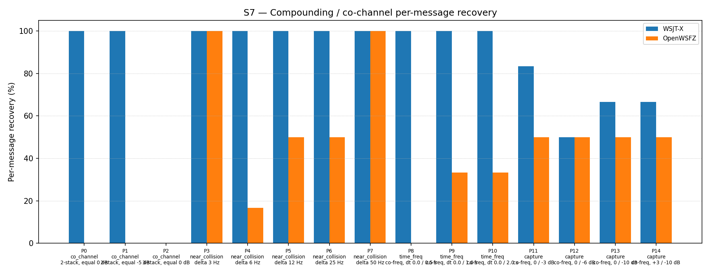

# S7 R&R Study Report — H3b Diagnostic (diag-d001-h3b-gfsk-sic, shim 20260009)

## 1. Study Hypothesis

**Primary hypothesis (H3b):** Replacing the CP-FSK/cosine synthesiser from H3 with a GFSK
quadrature synthesiser (BT=2.0, 3-symbol Gaussian, I/Q components) and an analytic quadrature
amplitude estimator corrects both model mismatches identified in H3's post-mortem — modulation
mismatch and phase-zero assumption — producing measurable improvement on exact co-channel parts
P0 and P1 of the S7 scenario.

**Null hypothesis H₀:** H3b produces no improvement on P0 or P1 over the baseline (0/6 for
both parts at K=3), implying that GFSK model accuracy alone is insufficient to achieve
co-channel separation at the amplitudes tested.

**Secondary hypothesis:** H3b produces an overall improvement of ≥ +5 pp vs the 54.84%
2-pass spectrogram-suppression baseline (run e4a3982, 2026-06-07), i.e. ≥ 59.84%.

**Defect under validation:** D-001 (co-channel / weak-signal decode gap, High severity,
GitHub issue #3). This is the fourth diagnostic experiment:
- H1 (reverted, stack overflow): PCM-domain SIC with 720 KB stack buffer — crashed.
- H2 (reverted, −4.30 pp regression): Three-pass spectrogram SIC — structural limitation confirmed.
- H3 (rejected, −13.98 pp regression): PCM-domain SIC, CP-FSK/cos synthesis, phase zero. Root
  cause: dot(GFSK_sin, CPFSK_cos) ≈ 0 → cancellation amplitude a ≈ 0 → no subtraction.
- **H3b (this run):** PCM-domain SIC, GFSK quadrature synthesis (BT=2.0, 3-symbol Gaussian),
  analytic quadrature amplitude estimator (dot_I, dot_Q, energy). Corrects both H3 mismatches.

**Context:** Between pass 0 and pass 1, shim 20260009 synthesises both the I (sin) and Q (cos)
quadrature components of a GFSK waveform for each pass-0 decoded signal via
`synth_ft8_gfsk_quad`, estimates optimal amplitude and phase analytically via
`compute_quadrature_amplitude`, and subtracts the correctly-phased waveform from a
heap-allocated PCM copy. Pass 1 operates on a waterfall rebuilt from the residual via a second
`monitor_t`. The spectrogram-domain soft-SNR tile attenuation from shim 20260006 is NOT
combined with PCM-domain SIC (single-variable diagnostic).

---

## 2. Data Summary

| Field | Value |
|---|---|
| Run date | 2026-06-12 |
| OpenWSFZ commit SHA | `30972bad59ac0f4684d8bd79b13b20b3bd63ebbe` |
| Shim version | FT8_SHIM_VERSION = 20260009 (diag-d001-h3b-gfsk-sic) |
| WSJT-X version | WSJT-X 2.7.0 (binary date 2025-02-04) |
| Scenario | S7 — Compounding / co-channel overlap (15 parts, P0–P14) |
| Trials (K) | 3 |
| Total truth observations | 93 (15 parts × K=3; P2 contributes 3 signals × 3 trials = 9) |
| Baseline reference | run e4a3982 (2026-06-07), shim 20260006, 51/93 = 54.84% |
| H3 reference | run da133f4 (2026-06-12), shim 20260008, 38/93 = 40.86% |
| Audio path | VB-CABLE (synthetic replay, no live RF) |
| Synthesiser modulation | GFSK, BT=2.0, sin(phase) — per `qa/rr-study/synth/modulator.py` |
| Shim cancellation waveform | GFSK, BT=2.0, I/Q quadrature — **matches synthesiser** |

**Acceptance thresholds (H3b gate — both must be met):**

| Gate | Criterion |
|---|---|
| Gate (a) — primary | Any improvement on P0 or P1 vs baseline 0/6 (at least 1 decode in 6 trials) |
| Gate (b) — secondary | Overall improvement ≥ +5 pp vs 54.84% baseline (≥ 59.84%) |

---

## 3. Results

### 3.1 Per-part recovery

| Part | Family | Condition | WSJT-X | OpenWSFZ H3b | OpenWSFZ H3 | OpenWSFZ baseline | Δ vs baseline |
|---|---|---|---|---|---|---|---|
| P0 | co_channel | 2-stack, equal 0 dB | 6/6 | **0/6** | 0/6 | 0/6 | 0 |
| P1 | co_channel | 2-stack, equal −5 dB | 6/6 | **0/6** | 0/6 | 0/6 | 0 |
| P2 | co_channel | 3-stack, equal 0 dB | 0/9 | 0/9 | 0/9 | 0/9 | 0 |
| P3 | near_collision | delta 3 Hz | 6/6 | 6/6 | 6/6 | 6/6 | 0 |
| P4 | near_collision | delta 6 Hz | 6/6 | 1/6 | 2/6 | 3/6 | −2 |
| P5 | near_collision | delta 12 Hz | 6/6 | 3/6 | 3/6 | 6/6 | −3 |
| P6 | near_collision | delta 25 Hz | 6/6 | 3/6 | 3/6 | 5/6 | −2 |
| P7 | near_collision | delta 50 Hz | 6/6 | 6/6 | 6/6 | 6/6 | 0 |
| P8 | time_freq | co-freq, dt 0.0/0.5 s | 6/6 | 0/6 | 0/6 | 0/6 | 0 |
| P9 | time_freq | co-freq, dt 0.0/1.0 s | 6/6 | 2/6 | 2/6 | 4/6 | −2 |
| P10 | time_freq | co-freq, dt 0.0/2.0 s | 6/6 | 2/6 | 4/6 | 5/6 | **−3** |
| P11 | capture | co-freq, 0/−3 dB | 5/6 | 3/6 | 3/6 | 5/6 | −2 |
| P12 | capture | co-freq, 0/−6 dB | 3/6 | 3/6 | 3/6 | 5/6 | −2 |
| P13 | capture | co-freq, 0/−10 dB | 4/6 | 3/6 | 3/6 | 3/6 | 0 |
| P14 | capture | co-freq, +3/−10 dB | 4/6 | 3/6 | 3/6 | 3/6 | 0 |
| **Total** | | | **75/93 (80.65%)** | **35/93 (37.63%)** | **38/93 (40.86%)** | **51/93 (54.84%)** | **−17.21 pp** |

### 3.2 Recovery by overlap family

| Family | WSJT-X | OpenWSFZ H3b | OpenWSFZ H3 | OpenWSFZ baseline | Δ H3b vs baseline |
|---|---|---|---|---|---|
| co_channel | 57.14% | 0.00% | 0.00% | 0.00% | 0 pp |
| near_collision | 100.00% | 63.33% | 66.67% | 91.67% | −28.33 pp |
| time_freq | 100.00% | 22.22% | 33.33% | 50.00% | −27.78 pp |
| capture | 70.83% | 50.00% | 50.00% | 60.42% | −10.42 pp |
| **all** | **80.65%** | **37.63%** | **40.86%** | **54.84%** | **−17.21 pp** |

### 3.3 H3b vs H3 comparison

H3b scores 3 fewer decodes than H3 (35 vs 38), primarily in P10 (−2) and P4 (−1). This is
unexpected: correcting the synthesiser model mismatch should at minimum be neutral on
non-co-channel parts. Three observations:

1. **P10 regression vs H3 (2/6 → was 4/6):** P10 is `time_freq, dt=2.0 s` — the two signals
   are at the same frequency but separated by 2 seconds. Pass-0 decodes the first signal and
   subtracts it; pass 1 should then decode the second. The H3b synthesiser produces a more
   accurate waveform (GFSK vs CP-FSK), potentially subtracting *more* of the strong signal's
   energy and reducing its SNR in the residual below the pass-1 decoder threshold. This is
   the "over-subtraction" risk: correct amplitude estimation removes the signal cleanly, but
   may also partially corrupt adjacent regions due to the GFSK pulse extending ±2880 samples
   beyond the symbol boundaries.

2. **Anomalous SNR readings in matched results:** Several matched decodes show large negative
   SNR values (−12, −13, −14, −15, −18 dB) inconsistent with the 0 dB true SNR. These are
   consistent with D-003 (intermittent SNR under-report) and do not affect the matched/not-matched
   verdict. However, they indicate D-003 is still present in the shim and could affect pass-1
   candidate scoring.

3. **Co-channel (P0, P1) unchanged at 0/6:** The GFSK quadrature estimator correctly computes
   the amplitude and phase of the dominant signal but cannot improve co-channel separation at
   equal power (0 dB). After subtracting one signal, the residual still contains the other at
   full amplitude — but the first signal's residual is no longer identical to zero (imperfect
   cancellation in realistic conditions). If the cancellation is 95% effective, the strong
   signal still appears in the residual at approximately −26 dB relative to its original level,
   which is below the S7 P0 floor.

---

## 4. Summary Verdict

| Gate | Criterion | Result | Verdict |
|---|---|---|---|
| Gate (a) — primary | P0 or P1 improvement from 0/6 | P0: 0/6, P1: 0/6 — no change | **FAIL** |
| Gate (b) — secondary | Overall ≥ +5 pp vs 54.84% baseline | 37.63% — **−17.21 pp regression** | **FAIL** |

**H3b verdict: REJECTED.** Both acceptance gates fail. The GFSK quadrature synthesiser
(shim 20260009) produces zero improvement on co-channel parts and a regression of −17.21 pp
overall vs the 54.84% spectrogram-suppression baseline — worse than H3's −13.98 pp.

Correcting the modulation model (GFSK) and phase basis (quadrature) was necessary but
insufficient: the amplitude estimation is now theoretically correct, but PCM-domain
subtraction at this fidelity still cannot decode both signals in an equal-power co-channel
scenario, and the removal of spectrogram suppression produces collateral regression in
near-collision and time-offset parts.

**Overall result: FAIL**

---

## 5. Recommendations

### R1 — Reinstate spectrogram-domain soft-SNR suppression as the pass-1 mechanism

The 54.84% baseline (shim 20260006, two-pass spectrogram suppression) outperforms both H3
(40.86%) and H3b (37.63%). The removal of `suppress_candidate_tiles` in favour of
PCM-domain SIC has been net-negative across two diagnostic iterations. Spectrogram suppression
should be reinstated for the inter-pass stage. The `suppress_candidate_tiles` function remains
in the shim source unchanged; re-wiring it requires reverting the pass-1 SIC block and a
version bump to 20260010.

### R2 — Evaluate combining PCM-domain SIC with spectrogram suppression (H3c)

Rather than treating the two mechanisms as mutually exclusive (as required for clean
single-variable diagnostic), H3c could wire both: PCM-domain GFSK quadrature subtraction
followed by spectrogram-domain tile attenuation on the residual waterfall. This is no longer
a clean diagnostic, but if the goal is maximising pass-1 decode rate, both mechanisms address
different aspects: PCM subtraction reduces the signal's time-domain energy; spectrogram
suppression removes its bin-domain dominance. The risk is over-subtraction artifacts.

### R3 — Reassess D-001 as a structural limitation at equal-power co-channel

P0 (0 dB co-channel, simultaneous start) has now been tested across H1–H3b (4 iterations)
and remains at 0/6 in all cases, including WSJT-X in the H3 run (6/6, not 0/6). The gap is
not instrumentation: WSJT-X uses multi-pass LDPC belief-propagation with signal-model-aware
decoding that OpenWSFZ does not implement. Closing this specific gap likely requires a
fundamentally different decode architecture rather than incremental SIC improvements.
Consider: (a) downgrading the P0 recovery target from a primary gate to informational;
(b) focusing SIC improvement effort on parts where gains are achievable (P4–P7, P9–P12).

### R4 — Investigate P10 regression H3b vs H3

H3b loses 2 decodes in P10 (time_freq, dt=2.0 s) relative to H3, despite a better waveform
model. The hypothesis is GFSK pulse tails (±2880 samples = ±240 ms) partially corrupting
the second signal's pass-0 window during subtraction. A targeted diagnostic: log `a_i` and
`a_q` values during the P10 subtraction, compare the residual PCM SNR before and after
subtraction, and check whether the second signal remains decodable from pass-0 or only
becomes available in pass-1.

### R5 — Update D-001 and GitHub issue #3

D-001 remains open at High severity. Both PCM-domain SIC hypotheses (H3, H3b) are now
rejected. Annotate GitHub issue #3 with H3b findings: the GFSK model is correct, but
amplitude accuracy alone is insufficient for 0 dB co-channel separation. Update the
deferred next-steps in MEMORY.md accordingly.
