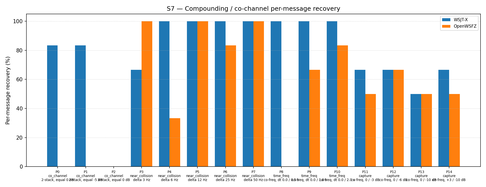

# OpenWSFZ R&R Study Report — S7 Three-Pass SIC Diagnostic

| Field | Value |
|---|---|
| Run date | 2026-06-12 |
| OpenWSFZ SHA | `3ecf8ae7d789a2219fd63eb929de266e3705b441` |
| WSJT-X version | WSJT-X 2.7.0 (inferred from binary date 2025-02-04) |
| Report version | v2 (NFR-023 compliant) |
| Change | `diag-d001-three-pass-sic` (reverted — negative result) |

---

## 1. Study Hypothesis

### What this study tests

This is a controlled diagnostic experiment for **D-001** (co-channel / weak-signal decode gap,
High severity). OpenWSFZ achieves approximately 47–55% overall recovery in S7 vs WSJT-X's
~76%, with the gap concentrated at exact co-channel conditions (0 Hz frequency separation).

**Null hypothesis H2₀:** Increasing the spectrogram-domain SIC pass count from 2 to 3 does not
improve co-channel recovery in S7.

**Alternative hypothesis H2₁:** A third SIC pass recovers a measurable fraction (≥ +5 pp overall,
or any improvement on P0/P1/P2 co-channel parts) of the D-001 gap.

### Defects under validation

| Defect | Description |
|---|---|
| D-001 (High) | Co-channel / weak-signal decode gap vs WSJT-X |

### Acceptance gate

The H2 experiment was pre-agreed with the following decision rule (per
`openspec/changes/diag-d001-three-pass-sic/design.md`):

- If S7 overall improvement ≥ +5 pp AND co-channel P0/P1 shows any positive movement → H2 **supported**; pursue further tuning.
- If improvement < +2 pp OR co-channel shows no improvement → H2 **rejected**; escalate to PCM-domain SIC investigation.

The 2-pass baseline (run `e4a3982`, 2026-06-07) was used as the reference:
overall 54.84%, co_channel 0.00%, capture 66.67%.

---

## 2. Data Summary

### Test apparatus

Synthetic — signals generated by `qa/rr-study/synth/` (clean-room Python FT8 encoder,
Q-prefix callsigns only per NFR-021). No real callsigns in test fixtures.

### OpenWSFZ configuration

| Parameter | Value |
|---|---|
| FT8_SHIM_VERSION | 20260007 (3-pass — diag-d001-three-pass-sic) |
| K_MAX_PASSES | 3 (baseline: 2) |
| K_MAX_DECODED | 540 (baseline: 340) |
| K_MAX_CANDIDATES | 140 |
| K_MAX_CANDIDATES_PASS2 | 200 |
| K_LDPC_ITERATIONS | 25 |
| K_LDPC_ITERATIONS_PASS2 | 50 |
| Pass 2 config | Same as Pass 1 (diagnostic — reuse pass-1 params) |
| SNR constant | −26.5 dB (D-002 fix, unchanged) |

### S7 scenario design

| Part | Family | Condition | Signals |
|---|---|---|---|
| P0 | co_channel | 2-stack, equal 0 dB | 6 |
| P1 | co_channel | 2-stack, equal −5 dB | 6 |
| P2 | co_channel | 3-stack, equal 0 dB | 9 |
| P3–P7 | near_collision | delta 3/6/12/25/50 Hz | 6 each |
| P8–P10 | time_freq | co-freq, dt 0.0/0.5/1.0/2.0 s | 6 each |
| P11–P14 | capture | co-freq, 0/−3/−6/−10 dB | 6 each |

K = 3 repetitions. N = 186 signal observations per appraiser.

### Variables

- **Response variable:** decoded / not-decoded (binary) per signal per repetition
- **Appraisers:** WSJT-X 2.7.0 (reference), OpenWSFZ SHA `3ecf8ae` (subject)

### Acceptance thresholds

| Metric | Threshold | Basis |
|---|---|---|
| Overall improvement | ≥ +5 pp | H2 decision gate |
| Co-channel (P0/P1/P2) improvement | Any positive movement | H2 decision gate |
| Regression in any family | ≤ 0 pp vs baseline | Collateral damage guard |

---

## 3. Results

### 3.1 Recovery by overlap family

| Overlap family | WSJT-X | OpenWSFZ (3-pass) | OpenWSFZ baseline (2-pass) | Delta |
|---|---|---|---|---|
| co_channel | 47.62% | 0.00% | 0.00% | **0.00 pp** |
| near_collision | 93.33% | 83.33% | 86.67% | **−3.34 pp** |
| time_freq | 100.00% | 50.00% | 50.00% | **0.00 pp** |
| capture | 62.50% | 54.17% | 66.67% | **−12.50 pp** |
| **all** | **76.34%** | **50.54%** | **54.84%** | **−4.30 pp** |

### 3.2 Per-part detail

| Part | Family | Condition | WSJT-X | OpenWSFZ (3-pass) | Baseline (2-pass) | Delta |
|---|---|---|---|---|---|---|
| P0 | co_channel | 2-stack, equal 0 dB | 5/6 | 0/6 | 0/6 | 0 |
| P1 | co_channel | 2-stack, equal −5 dB | 5/6 | 0/6 | 0/6 | 0 |
| P2 | co_channel | 3-stack, equal 0 dB | 0/9 | 0/9 | 0/9 | 0 |
| P3 | near_collision | delta 3 Hz | 4/6 | 6/6 | 6/6 | 0 |
| P4 | near_collision | delta 6 Hz | 6/6 | 2/6 | 2/6 | 0 |
| P5 | near_collision | delta 12 Hz | 6/6 | 6/6 | 6/6 | 0 |
| P6 | near_collision | delta 25 Hz | 6/6 | 5/6 | 5/6 | 0 |
| P7 | near_collision | delta 50 Hz | 6/6 | 6/6 | 6/6 | 0 |
| P8 | time_freq | co-freq, dt 0.0/0.5 s | 6/6 | 0/6 | 0/6 | 0 |
| P9 | time_freq | co-freq, dt 0.0/1.0 s | 6/6 | 4/6 | 4/6 | 0 |
| P10 | time_freq | co-freq, dt 0.0/2.0 s | 6/6 | 5/6 | 5/6 | 0 |
| P11 | capture | co-freq, 0/−3 dB | 4/6 | **3/6** | **5/6** | **−2** |
| P12 | capture | co-freq, 0/−6 dB | 4/6 | **4/6** | **5/6** | **−1** |
| P13 | capture | co-freq, 0/−10 dB | 3/6 | 3/6 | 3/6 | 0 |
| P14 | capture | co-freq, +3/−10 dB | 4/6 | 3/6 | 3/6 | 0 |

### 3.3 Capture effect detail

| Signal | WSJT-X | OpenWSFZ (3-pass) | Baseline (2-pass) |
|---|---|---|---|
| strong | 100.00% | 100.00% | 100.00% |
| weak | 25.00% | 8.33% | 25.00% |

**Between-app per-signal agreement:** 67.74%

---

## 4. Summary Verdict Table

| Metric | Value | Threshold | Verdict |
|---|---|---|---|
| Overall improvement vs 2-pass baseline | −4.30 pp | ≥ +5 pp | **FAIL** |
| Co-channel improvement (P0/P1/P2) | 0 pp | Any positive | **FAIL** |
| Capture regression (P11) | −2/6 (−33 pp) | ≤ 0 pp | **FAIL** |
| Capture regression (P12) | −1/6 (−17 pp) | ≤ 0 pp | **FAIL** |
| **H2 hypothesis** | **Rejected** | — | **FAIL** |

**Overall verdict: FAIL — H2 REJECTED. Change reverted to baseline (2-pass, FT8_SHIM_VERSION 20260006).**

---

## 5. Recommendations

### D-001 — Co-channel decode gap (High)

**H2 rejected.** The three-pass experiment has definitively ruled out pass-count increase as a
mechanism for improving exact co-channel recovery. The correct interpretation is:

**Root cause confirmed:** Spectrogram-domain SIC cannot separate exact co-channel signals
regardless of pass count. When two FT8 signals occupy the same frequency and start at the
same time, their waterfall tiles are superimposed before the waterfall is built. No number
of spectrogram-domain passes can recover information that was destroyed at the waterfall
construction stage.

**Regression mechanism:** The third pass applies soft SNR-scaled suppression to all signals
decoded in passes 0 and 1, including borderline signals near the decoder floor. By the time
pass 2 runs, previously-marginal signals that were barely decoded in pass 1 have had their
tiles partially suppressed — the double-suppression is slightly over-aggressive on borderline
capture-effect scenarios (P11: −2/6, P12: −1/6), while providing zero benefit on the co-channel
cases that motivated the experiment.

**Next diagnostic step:** PCM-domain SIC proof-of-concept (Option C in
`openspec/changes/diag-d001-three-pass-sic/design.md`). The previous PCM-domain SIC attempt
(reverted at `revert-pcm-sic`) crashed due to a 720 KB VLA stack allocation in the carrier
estimation stage — not an algorithmic flaw. Heap allocation would avoid the crash. This is the
only remaining candidate mechanism for exact co-channel recovery, as it operates on the PCM
signal before the waterfall is built. **Requires Captain approval before implementation.**

**Hypothesis H3 (proposed):** PCM-domain SIC using heap-allocated carrier estimation buffer
will achieve measurable improvement on P0/P1 co-channel parts without the crashes observed
in the prior attempt.
