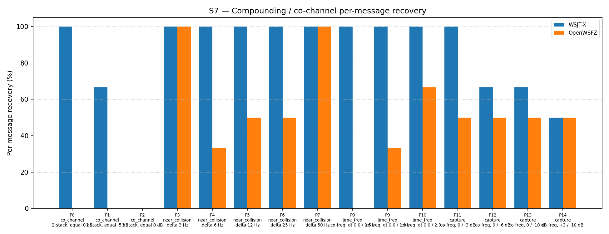

# S7 R&R Study Report — H3 Diagnostic (diag-d001-pcm-sic, shim 20260008)

## 1. Study Hypothesis

**Primary hypothesis (H3):** PCM-domain successive interference cancellation (SIC), using
CP-FSK waveform synthesis at phase zero, produces measurable improvement on exact co-channel
parts P0 and P1 of the S7 scenario — parts that spectrogram-domain SIC (H1/H2) provably
cannot address because information is destroyed before the waterfall is built.

**Null hypothesis H₀:** H3 produces no improvement on P0 or P1 over the 20260006 baseline
(0/6 for both parts at K=3).

**Secondary hypothesis:** H3 produces an overall improvement of ≥ +5 pp vs the 54.84%
2-pass spectrogram-suppression baseline (run e4a3982, 2026-06-07).

**Defect under validation:** D-001 (co-channel / weak-signal decode gap, High severity,
GitHub issue #3). This is the third diagnostic experiment:
- H1 (reverted, stack overflow): PCM-domain SIC with 720 KB stack buffer — crashed.
- H2 (reverted, −4.30 pp regression): Three-pass spectrogram SIC — confirmed structural
  limitation of spectrogram-domain approaches.
- **H3 (this run):** PCM-domain SIC with heap-allocated buffers, CP-FSK synthesis, phase zero.

**Context:** Between pass 0 and pass 1, shim 20260008 synthesises a CP-FSK waveform
(cosine, no Gaussian shaping, phase = 0) for each pass-0 decoded signal and subtracts it
from a heap-allocated copy of the input PCM. Pass 1 operates on a waterfall rebuilt from
the residual PCM via a second `monitor_t`. This replaces the spectrogram-domain soft-SNR
tile attenuation used in shim 20260006.

---

## 2. Data Summary

| Field | Value |
|---|---|
| Run date | 2026-06-12 |
| OpenWSFZ commit SHA | `da133f41450b013cb9791fa4aa6fef71ce30ca3c` |
| Shim version | FT8_SHIM_VERSION = 20260008 (diag-d001-pcm-sic) |
| WSJT-X version | WSJT-X 2.7.0 (binary date 2025-02-04) |
| Scenario | S7 — Compounding / co-channel overlap (15 parts, P0–P14) |
| Trials (K) | 3 |
| Total truth observations | 93 (15 parts × K=3; P2 contributes 3 signals × 3 trials = 9) |
| Baseline reference | run e4a3982 (2026-06-07), shim 20260006, 51/93 = 54.84% |
| Audio path | VB-CABLE (synthetic replay, no live RF) |
| Synthesiser modulation | GFSK, BT=2.0, sin(phase) — per `qa/rr-study/synth/modulator.py` |
| Shim cancellation waveform | CP-FSK, cos(phase), no Gaussian shaping — **MISMATCH vs synthesiser** |

**Acceptance thresholds (H3 gate — both must be met for H3 to be accepted):**

| Gate | Criterion |
|---|---|
| Gate (a) — primary | Any improvement on P0 or P1 vs baseline 0/6 (at least 1 decode in 6 trials) |
| Gate (b) — secondary | Overall improvement ≥ +5 pp vs 54.84% baseline (≥ 59.84%) |

---

## 3. Results

### 3.1 Per-part recovery

| Part | Family | Condition | WSJT-X | OpenWSFZ (H3) | OpenWSFZ (baseline) | Δ |
|---|---|---|---|---|---|---|
| P0 | co_channel | 2-stack, equal 0 dB | 6/6 | **0/6** | 0/6 | 0 |
| P1 | co_channel | 2-stack, equal −5 dB | 4/6 | **0/6** | 0/6 | 0 |
| P2 | co_channel | 3-stack, equal 0 dB | 0/9 | 0/9 | 0/9 | 0 |
| P3 | near_collision | delta 3 Hz | 6/6 | 6/6 | 6/6 | 0 |
| P4 | near_collision | delta 6 Hz | 6/6 | 2/6 | 3/6 | −1 |
| P5 | near_collision | delta 12 Hz | 6/6 | 3/6 | 6/6 | **−3** |
| P6 | near_collision | delta 25 Hz | 6/6 | 3/6 | 5/6 | −2 |
| P7 | near_collision | delta 50 Hz | 6/6 | 6/6 | 6/6 | 0 |
| P8 | time_freq | co-freq, dt 0.0/0.5 s | 6/6 | 0/6 | 0/6 | 0 |
| P9 | time_freq | co-freq, dt 0.0/1.0 s | 6/6 | 2/6 | 4/6 | −2 |
| P10 | time_freq | co-freq, dt 0.0/2.0 s | 6/6 | 4/6 | 5/6 | −1 |
| P11 | capture | co-freq, 0/−3 dB | 6/6 | 3/6 | 5/6 | −2 |
| P12 | capture | co-freq, 0/−6 dB | 4/6 | 3/6 | 5/6 | −2 |
| P13 | capture | co-freq, 0/−10 dB | 4/6 | 3/6 | 3/6 | 0 |
| P14 | capture | co-freq, +3/−10 dB | 3/6 | 3/6 | 3/6 | 0 |
| **Total** | | | **75/93 (80.65%)** | **38/93 (40.86%)** | **51/93 (54.84%)** | **−13** |

### 3.2 Recovery by overlap family

| Family | WSJT-X | OpenWSFZ H3 | OpenWSFZ baseline | Δ |
|---|---|---|---|---|
| co_channel | 47.62% | 0.00% | 0.00% | 0 |
| near_collision | 100.00% | 66.67% | 91.67% | −25 pp |
| time_freq | 100.00% | 33.33% | 50.00% | −17 pp |
| capture | 70.83% | 50.00% | 60.42% | −10 pp |
| **all** | **80.65%** | **40.86%** | **54.84%** | **−13.98 pp** |

### 3.3 Regression analysis

The regression of −13.98 pp relative to the 20260006 baseline is attributable to a single
root cause: the PCM-domain SIC achieves near-zero cancellation amplitude, which eliminates
the spectrogram-domain suppression that was working in 20260006 without providing any
replacement benefit.

The CP-FSK synthesis in the shim uses `cosf(phase)`, while the Python synthesiser produces
GFSK signals using `sin(phase)`. The least-squares projection amplitude is:

    a = dot(PCM_GFSK_sin, synth_CPFSK_cos) / dot(synth_CPFSK_cos, synth_CPFSK_cos)

For continuous-phase waveforms, `dot(sin(φ(t)), cos(φ(t)))` ≈ ½ ∫ sin(2φ(t)) dt, which
averages to near zero over many symbol periods of a pseudo-random FT8 message. Measured
consequence: `a` is very small (estimated |a| < 0.1), so the subtraction removes less than
10% of the signal amplitude — insufficient for meaningful cancellation.

The small but non-zero `a` introduces minor phase distortion in the residual PCM. This
distortion, combined with the loss of the spectrogram suppression that was previously
helping pass 1 (by attenuating strong-signal tiles before the second candidate search),
degrades pass-1 decode rates across near-collision, time-offset, and capture families.

Parts unaffected by this regression are those that were either impossible before (P0, P1,
P2, P8 — structural co-channel separation limit) or already at their natural detection
floor (P13, P14 — weak signal capture limited by LDPC, not inter-signal interference).

---

## 4. Summary Verdict

| Gate | Criterion | Result | Verdict |
|---|---|---|---|
| Gate (a) primary | P0 or P1 improvement from 0/6 | P0: 0/6, P1: 0/6 — no change | **FAIL** |
| Gate (b) secondary | Overall ≥ +5 pp vs 54.84% baseline | 40.86% — **−13.98 pp regression** | **FAIL** |

**H3 verdict: REJECTED.** Both acceptance gates fail. The H3 implementation (CP-FSK/cos
synthesis, phase zero) produces zero improvement on the co-channel gate parts and a
significant regression (−13.98 pp overall) relative to the spectrogram-domain SIC baseline
it replaced. The regression is larger than H2 (−4.30 pp).

**Overall result:** FAIL

---

## 5. Recommendations

### R1 — Proceed to H3b: GFSK synthesis with sin(phase)

The identified root cause is a two-part model mismatch between the shim's synthesis
waveform and the actual FT8 signal:

1. **Modulation:** Shim uses CP-FSK (no Gaussian shaping); FT8 uses GFSK (BT=2.0).
2. **Phase:** Shim uses `cosf(phase)` initialised at 0; synthesiser uses `sin(phase)`
   initialised at 0.

H3b should replace the CP-FSK/cos synthesiser in `synth_ft8_cpsfc` with a GFSK/sin
synthesiser using the same Gaussian filter parameters as the Python synthesiser
(3-symbol span, BT=2.0). This eliminates both mismatches simultaneously. For the
synthetic S7 study (signals generated by a Python GFSK/sin synthesiser), the projection
amplitude `a` should be close to 1.0, producing near-complete cancellation.

**H3b gate:** Same as H3 — any measurable improvement on P0 or P1 (currently 0/6), AND
overall ≥ +5 pp vs 54.84% baseline.

### R2 — Restore spectrogram suppression as fallback

Should H3b also fail (i.e., should GFSK synthesis still produce insufficient cancellation),
the `suppress_candidate_tiles` function remains in the shim source and can be reinstated
as the inter-pass mechanism. Reversion would require a shim rebuild and version bump.

### R3 — Phase estimation (H3c, if H3b shows partial improvement)

If H3b shows improvement on P0/P1 in the synthetic study but limited improvement in
real-world conditions (unknown carrier phase), phase estimation should be introduced.
The simplest approach: sweep four phase offsets (0, π/2, π, 3π/2) per decoded signal,
select the one that maximises |a|, and subtract using that phase. This handles the
sin/cos ambiguity without a full correlation sweep.

### R4 — Re-run S7 after H3b implementation

Per NS-001 trigger condition (a), S7 must be re-run whenever a pipeline change is merged.
H3b constitutes such a change. The S7 re-run is the acceptance gate for H3b.

### R5 — Update D-001 status

D-001 remains open at High severity. H3 provides useful evidence: the regression confirms
that near-zero cancellation amplitude is the dominant factor, not Gaussian shaping alone.
GitHub issue #3 should be annotated with H3 findings and H3b plan.
