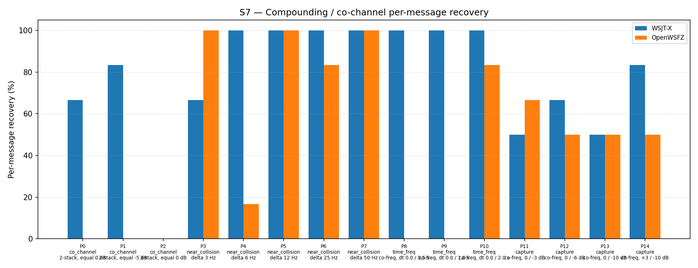

# OpenWSFZ R&R Study Report

| Field | Value |
|---|---|
| Run date | 2026-06-13 |
| OpenWSFZ SHA | `5f0422fa904b3adbc49151e7c0875933d3aa047a` |
| WSJT-X version | WSJT-X 2.7.0 (inferred from binary date 2025-02-04) |

## S7 — Compounding / co-channel overlap

_Per-message recovery when 2–3 signals occupy the same or near-same audio frequency / time slot (the pileup case S4 does not exercise). Informational — no AIAG threshold is defined for co-channel separation._

### Recovery by overlap family

| Overlap family | WSJT-X | OpenWSFZ |
|---|---|---|
| capture | 62.50% | 54.17% |
| co_channel | 42.86% | 0.00% |
| near_collision | 93.33% | 80.00% |
| time_freq | 100.00% | 27.78% |
| **all** | **75.27%** | **45.16%** |

### Capture effect (co-channel, unequal SNR)

| Signal | WSJT-X | OpenWSFZ |
|---|---|---|
| strong | 100.00% | 100.00% |
| weak | 25.00% | 8.33% |

**Between-app per-signal agreement:** 63.44%

### Per-part detail

| Part | Family | Condition | WSJT-X | OpenWSFZ |
|---|---|---|---|---|
| P0 | co_channel | 2-stack, equal 0 dB | 4/6 | 0/6 |
| P1 | co_channel | 2-stack, equal -5 dB | 5/6 | 0/6 |
| P2 | co_channel | 3-stack, equal 0 dB | 0/9 | 0/9 |
| P3 | near_collision | delta 3 Hz | 4/6 | 6/6 |
| P4 | near_collision | delta 6 Hz | 6/6 | 1/6 |
| P5 | near_collision | delta 12 Hz | 6/6 | 6/6 |
| P6 | near_collision | delta 25 Hz | 6/6 | 5/6 |
| P7 | near_collision | delta 50 Hz | 6/6 | 6/6 |
| P8 | time_freq | co-freq, dt 0.0 / 0.5 s | 6/6 | 0/6 |
| P9 | time_freq | co-freq, dt 0.0 / 1.0 s | 6/6 | 0/6 |
| P10 | time_freq | co-freq, dt 0.0 / 2.0 s | 6/6 | 5/6 |
| P11 | capture | co-freq, 0 / -3 dB | 3/6 | 4/6 |
| P12 | capture | co-freq, 0 / -6 dB | 4/6 | 3/6 |
| P13 | capture | co-freq, 0 / -10 dB | 3/6 | 3/6 |
| P14 | capture | co-freq, +3 / -10 dB | 5/6 | 3/6 |

## Summary

| Metric | Scope | Value | Verdict |
|---|---|---|---|

**Overall verdict: PASS**
