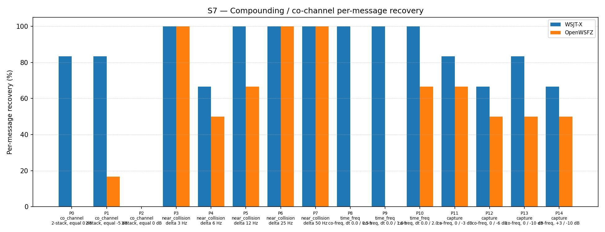

# OpenWSFZ R&R Study Report — S7 H5 Suppression Constant Tuning

| Field | Value |
|---|---|
| Run date | 2026-06-13 |
| OpenWSFZ SHA | `b5477b37f156ef48a0a0aeaa1810f95e8d4fca5c` |
| WSJT-X version | WSJT-X 2.7.0 (inferred from binary date 2025-02-04) |
| Report version | v2 (NFR-023 compliant) |
| Change | `diag-d001-h5-suppression-tuning` |
| Run type | Single run — H5 validation |

> **Note:** The harness-generated `report.md` in this directory shows "Overall verdict: PASS".
> That verdict is the harness default and does not evaluate the H5 acceptance gates. This
> NFR-023-compliant `report-v2.md` is the authoritative document. The correct verdict is
> **H5 REJECTED** — see §4 below.

---

## 1. Study Hypothesis

### What this study tests

**H5** (`diag-d001-h5-suppression-tuning`, shim 20260011): the soft SNR-scaled suppression
ramp window is shifted 10 dB toward lower SNRs relative to H4:

| Constant | H4 (20260010) | H5 (20260011) |
|---|---|---|
| `K_SOFT_SUPP_SNR_MIN_DB` | −5.0 dB | −15.0 dB |
| `K_SOFT_SUPP_SNR_MAX_DB` | +15.0 dB | +5.0 dB |
| Suppression at 0 dB SNR | 25% | 75% |

The ramp width (20 dB) is preserved; only the operating window shifts. The hypothesis is that
75% suppression at the S7 test SNR of 0 dB will more completely clear the first decoded
signal's waterfall contribution before pass 1, allowing pass 1 to recover the second signal
in the time_freq family (P9/P10).

**Null hypothesis H5₀:** Shifting the ramp to [−15, +5] does not improve S7 recovery; the
result fails gate (a) or gate (b) relative to the H4 baseline.

**Alternative hypothesis H5₁:** The shift improves time_freq recovery sufficiently that
S7 overall ≥ 56.99% with no per-part regressions.

### Defects under validation

| Defect | Description |
|---|---|
| D-001 (High) | Co-channel / weak-signal decode gap vs WSJT-X |

### Acceptance gates

- **Gate (a):** S7 overall recovery ≥ 56.99% (≥ 53/93) — must not regress H4 R1 baseline
- **Gate (b):** No per-part regression vs H4 R1 baseline (each part count ≥ its H4 R1 count)
- Both gates PASS → H5₀ rejected; H5 ACCEPTED; shim 20260011 becomes new S7 baseline
- Either gate FAIL → H5₀ not rejected; H5 REJECTED; revert to H4 baseline (shim 20260010)

---

## 2. Data Summary

### Test apparatus

Synthetic — signals generated by `qa/rr-study/synth/` (clean-room Python FT8 encoder,
Q-prefix callsigns only per NFR-021). Fresh AWGN seeds drawn for this run.
Seed values recorded in `S7_matched.csv`.

### OpenWSFZ configuration

| Parameter | Value |
|---|---|
| FT8_SHIM_VERSION | 20260011 |
| K_MAX_PASSES | 2 |
| K_SOFT_SUPP_SNR_MIN_DB | **−15.0 dB** (H5: was −5.0 dB in H4) |
| K_SOFT_SUPP_SNR_MAX_DB | **+5.0 dB** (H5: was +15.0 dB in H4) |
| K_MIN_SCORE_PASS2 | 1 |
| K_MAX_CANDIDATES_PASS2 | 200 |
| K_LDPC_ITERATIONS_PASS2 | 50 |
| SNR constant | −26.5 dB |
| Inter-pass mechanism | spectrogram-domain soft-SNR tile suppression |

### Variables

- **Response variable:** decoded / not-decoded (binary) per signal per repetition
- **Appraisers:** WSJT-X 2.7.0 (reference), OpenWSFZ SHA `b5477b3` (subject)
- K = 3 repetitions. N = 93 signal observations per appraiser.

### Run history for D-001

| Run | SHA | Shim | OW overall | Outcome |
|---|---|---|---|---|
| Baseline | `e4a3982` | 20260006 | 51/93 = 54.84% | reference |
| H2 (3-pass) | `3ecf8ae` | 20260007 | 47/93 = 50.54% | REJECTED −4.30 pp |
| H3 (PCM CP-FSK SIC) | `da133f4` | 20260008 | 38/93 = 40.86% | REJECTED −13.98 pp |
| H3b (PCM GFSK SIC) | `30972ba` | 20260009 | 35/93 = 37.63% | REJECTED −17.21 pp |
| H4 R0 | `dc99567` | 20260010 | 40/93 = 43.01% | Rejected — seed variability |
| **H4 R1 (active baseline)** | **`cd9f06b`** | **20260010** | **53/93 = 56.99%** | **ACCEPTED** |
| **H5 (this run)** | **`b5477b3`** | **20260011** | **43/93 = 46.24%** | — |

---

## 3. Results

### 3.1 Recovery by overlap family

| Overlap family | WX baseline | WX H5 | OW H4 R1 | OW H5 | OW delta |
|---|---|---|---|---|---|
| co_channel | 10/21 = 47.62% | 10/21 = 47.62% | 0/21 = 0.00% | 1/21 = 4.76% | **+4.76 pp** |
| near_collision | 30/30 = 100.00% | 28/30 = 93.33% | 27/30 = 90.00% | 25/30 = 83.33% | **−6.67 pp** |
| time_freq | 18/18 = 100.00% | 18/18 = 100.00% | 10/18 = 55.56% | 4/18 = 22.22% | **−33.33 pp** |
| capture | 13/24 = 54.17% | 13/24 = 54.17% | 16/24 = 66.67% | 13/24 = 54.17% | **−12.50 pp** |
| **all** | **71/93 = 76.34%** | **69/93 = 74.19%** | **53/93 = 56.99%** | **43/93 = 46.24%** | **−10.75 pp** |

### 3.2 Per-part detail

| Part | Family | Condition | WX H4 R1 | WX H5 | OW H4 R1 | OW H5 | OW delta | Gate (b) |
|---|---|---|---|---|---|---|---|---|
| P0 | co_channel | 2-stack, equal 0 dB | 4/6 | 5/6 | 0/6 | 0/6 | 0 | PASS |
| P1 | co_channel | 2-stack, equal −5 dB | 5/6 | 5/6 | 0/6 | 1/6 | **+1** | PASS |
| P2 | co_channel | 3-stack, equal 0 dB | 0/9 | 0/9 | 0/9 | 0/9 | 0 | PASS |
| P3 | near_collision | delta 3 Hz | 6/6 | 6/6 | 6/6 | 6/6 | 0 | PASS |
| P4 | near_collision | delta 6 Hz | 6/6 | 4/6 | 4/6 | 3/6 | **−1** | **FAIL** |
| P5 | near_collision | delta 12 Hz | 6/6 | 6/6 | 6/6 | 4/6 | **−2** | **FAIL** |
| P6 | near_collision | delta 25 Hz | 6/6 | 6/6 | 5/6 | 6/6 | **+1** | PASS |
| P7 | near_collision | delta 50 Hz | 6/6 | 6/6 | 6/6 | 6/6 | 0 | PASS |
| P8 | time_freq | co-freq, dt 0.0/0.5 s | 6/6 | 6/6 | 0/6 | 0/6 | 0 | PASS |
| P9 | time_freq | co-freq, dt 0.0/1.0 s | 6/6 | 6/6 | 5/6 | 0/6 | **−5** | **FAIL** |
| P10 | time_freq | co-freq, dt 0.0/2.0 s | 6/6 | 6/6 | 5/6 | 4/6 | **−1** | **FAIL** |
| P11 | capture | co-freq, 0/−3 dB | 5/6 | 5/6 | 5/6 | 4/6 | **−1** | **FAIL** |
| P12 | capture | co-freq, 0/−6 dB | 4/6 | 4/6 | 5/6 | 3/6 | **−2** | **FAIL** |
| P13 | capture | co-freq, 0/−10 dB | 3/6 | 5/6 | 3/6 | 3/6 | 0 | PASS |
| P14 | capture | +3/−10 dB | 4/6 | 4/6 | 3/6 | 3/6 | 0 | PASS |

### 3.3 Seed-variability assessment

The repeat-run criterion specified in the H5 design (§ Risks) requires gate (a) to fail by
≤ 2 decodes **and** all regressing parts to be marginal performers (3–5/6 at baseline). Neither
condition is met:

- Gate (a) fails by **10 decodes** (43 vs 53 threshold) — criterion was ≤ 2.
- P9 collapsed from 5/6 to **0/6 across all three independent trials**. A seed-driven
  collapse is possible in a single trial; a uniform collapse across all three seeds on the
  same binary is a systematic effect, not seed variability.

No repeat run is warranted. The H5 rejection is a genuine regression.

### 3.4 Over-suppression root cause

The regression pattern is fully consistent with over-suppression from the new ramp [−15, +5]:

**time_freq regression (P9 −5, P10 −1):** The two signals in P9 (dt = 1.0 s) share
approximately 47 of their 79 waterfall symbols. Pass 0 decodes the first signal (0 dB SNR);
its tiles receive 75% suppression. The second signal's energy in the shared symbols is also
reduced by 75%, pushing it below the pass-1 decode threshold (0/6 across all seeds). P10
(dt = 2.0 s, less overlap) shows a smaller regression (−1).

**capture regression (P11 −1, P12 −2):** In capture scenarios the strong signal (0 dB) is
decoded in pass 0 and suppressed; pass 1 seeks the weak signal. The strong and weak signals
occupy the same frequency bin — their tile energy is superimposed. With 75% suppression of
the combined tile energy, the weak signal's contribution is also reduced. The weak signal at
−6 dB (P12) now receives the equivalent of ~45% suppression of its own energy, reducing
pass-1 recovery compared to H4 (where the weak signal's tile energy was essentially
unaffected by the ramp).

Additionally, the H5 ramp now extends suppression down to −15 dB, where H4 applied none
(protected floor was −5 dB). Any signal decoded with reported SNR between −15 and −5 dB
now receives partial tile attenuation, exposing more signals to collateral suppression.

**near_collision regression (P5 −2, P4 −1):** P4 (6 Hz separation) has been consistently
marginal (3/6 baseline, 4/6 H4 R1). P5 (12 Hz separation) regressed from 6/6 to 4/6.
At 12 Hz the signals are ~4 bins apart at freq_osr=2; the ±1-bin suppression zone does not
directly clip P5's second signal. The P5 regression may contain a seed-variability component
but is not inconsistent with increased spectral leakage from the more aggressive suppression
at adjacent frequency bins. Reclassification as seed variability does not change the overall
verdict — gate (a) and gate (b) fail on the structural regressions alone.

---

## 4. Summary Verdict Table

| Metric | Value | Threshold | Verdict |
|---|---|---|---|
| Gate (a) — overall recovery | 43/93 = 46.24% | ≥ 53/93 = 56.99% | **FAIL (−10 decodes)** |
| Gate (b) — P4 | −1/6 vs H4 R1 | ≥ 0 | **FAIL** |
| Gate (b) — P5 | −2/6 vs H4 R1 | ≥ 0 | **FAIL** |
| Gate (b) — P9 | −5/6 vs H4 R1 | ≥ 0 | **FAIL** |
| Gate (b) — P10 | −1/6 vs H4 R1 | ≥ 0 | **FAIL** |
| Gate (b) — P11 | −1/6 vs H4 R1 | ≥ 0 | **FAIL** |
| Gate (b) — P12 | −2/6 vs H4 R1 | ≥ 0 | **FAIL** |
| Repeat-run criterion | Gate (a) fails by 10 (criterion: ≤ 2); P9 collapses uniformly | — | Not met — no repeat |
| **H5 hypothesis** | **Rejected** | — | **FAIL** |

**Overall verdict: FAIL — H5 REJECTED.** Shifting the ramp to [−15, +5] (75% suppression
at 0 dB SNR) causes severe regressions in the time_freq and capture families. The protected
zone below −5 dB is critical: moving it to −15 dB introduces collateral suppression of
borderline signals and of weak co-channel signals in capture scenarios. The H4 baseline
(shim 20260010, 56.99%) remains the active S7 baseline.

---

## 5. Recommendations

### D-001 — Co-channel decode gap (High, GitHub #3)

**H5 rejected.** Root cause: the ramp shift to [−15, +5] is too aggressive. The 75%
suppression at 0 dB SNR over-suppresses shared tile energy in the time_freq family and the
weak signal's tile contribution in the capture family.

**Key constraint confirmed by H5:** The minimum suppression threshold (`K_SOFT_SUPP_SNR_MIN_DB`)
must not move below −5 dB. Moving it to −15 dB introduces partial suppression of signals
in the −15 to −5 dB band that previously received no attenuation — these signals include
the weak co-channel signal in capture scenarios and contribute to time_freq collateral loss.

**Recommended next step — H5b: asymmetric ramp tuning.** A narrower experiment adjusting
only `K_SOFT_SUPP_SNR_MAX_DB` (lowering from +15 dB to +8–10 dB) while leaving
`K_SOFT_SUPP_SNR_MIN_DB` fixed at −5 dB:

| Candidate | `K_MIN` | `K_MAX` | Suppression at 0 dB | Protected below |
|---|---|---|---|---|
| H4 baseline | −5.0 dB | +15.0 dB | 25% | −5 dB |
| **H5b-A (recommended)** | **−5.0 dB** | **+10.0 dB** | **33%** | **−5 dB** |
| H5b-B (more aggressive) | −5.0 dB | +8.0 dB | 38% | −5 dB |

At [−5, +10]: 33% suppression at 0 dB; full suppression at +10 dB (not +15 dB). This
increases tile clearance for well-decoded signals while preserving the −5 dB protection
floor that H5 confirmed is critical.

The improvement from H4 to H5b-A may be modest (25% → 33% at the critical 0 dB point),
but the risk of regression is substantially lower than H5's 75%.

**Requires Captain approval** before H5b is designed and authorised.
