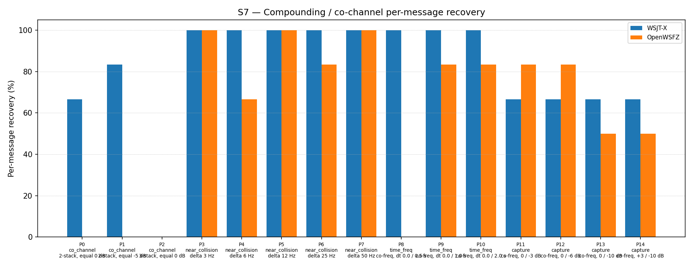

# OpenWSFZ R&R Study Report — S7 H4 Spectrogram Suppression Reinstatement (R1 Repeat)

| Field | Value |
|---|---|
| Run date | 2026-06-13 |
| OpenWSFZ SHA | `cd9f06be222888a57cefed3ecdbdcd5a5fc4c138` |
| WSJT-X version | WSJT-X 2.7.0 (inferred from binary date 2025-02-04) |
| Report version | v2 (NFR-023 compliant) |
| Change | `diag-d001-h4-spectrogram-reinstate` |
| Run type | R1 repeat — seed-variability diagnostic |

---

## 1. Study Hypothesis

### What this study tests

This is the R1 repeat run for **H4** (`diag-d001-h4-spectrogram-reinstate`, shim 20260010).
The prior H4 run (SHA `dc99567`, same date) failed both acceptance gates: 40/93 = 43.01% overall
with per-part regressions on P4, P9, P10, and P12. All four regressing parts were marginal
performers at baseline (3–5/6), and WSJT-X also degraded on near_collision (−13.33 pp) in that
run. The seed-variability hypothesis was raised: the prior run's random AWGN seeds may have been
independently adversarial for OpenWSFZ's marginal scenarios, rather than the H4 implementation
introducing a genuine regression.

R1 re-runs the S7 harness against the same shim binary (20260010, unchanged) with a fresh set
of K=3 seeds to test this hypothesis.

**Null hypothesis R1₀:** The H4 rejection in run `dc99567` reflects a genuine performance
regression in shim 20260010; re-running will also fail the acceptance gates.

**Alternative hypothesis R1₁:** The H4 rejection was seed-driven; shim 20260010 performs at
baseline level (≥ 54.84%, no per-part regressions) when presented with independent seeds.

### Defects under validation

| Defect | Description |
|---|---|
| D-001 (High) | Co-channel / weak-signal decode gap vs WSJT-X |

### Acceptance gates (unchanged from H4)

- **Gate (a):** S7 overall recovery ≥ 54.84% (≥ 51/93)
- **Gate (b):** No per-part regression vs `e4a3982` baseline (each part count ≥ its baseline)
- Both gates passing → **R1₀ rejected; H4 accepted provisionally**; proceed to H5

---

## 2. Data Summary

### Test apparatus

Synthetic — signals generated by `qa/rr-study/synth/` (clean-room Python FT8 encoder,
Q-prefix callsigns only per NFR-021). AWGN seeds drawn fresh; different seeds from run `dc99567`.
Seed values recorded in `S7_matched.csv`.

### OpenWSFZ configuration

| Parameter | Value |
|---|---|
| FT8_SHIM_VERSION | 20260010 — **identical to run `dc99567`; no changes** |
| K_MAX_PASSES | 2 |
| K_SOFT_SUPP_SNR_MIN_DB | −5.0 dB |
| K_SOFT_SUPP_SNR_MAX_DB | +15.0 dB |
| K_MIN_SCORE_PASS2 | 1 |
| K_MAX_CANDIDATES_PASS2 | 200 |
| K_LDPC_ITERATIONS_PASS2 | 50 |
| SNR constant | −26.5 dB |
| Inter-pass mechanism | spectrogram-domain soft-SNR tile suppression |

### Variables

- **Response variable:** decoded / not-decoded (binary) per signal per repetition
- **Appraisers:** WSJT-X 2.7.0 (reference), OpenWSFZ SHA `cd9f06b` (subject)
- K = 3 repetitions. N = 93 signal observations per appraiser.

### Run history for shim 20260010

| Run | SHA | Seeds | OW overall | WX overall | Outcome |
|---|---|---|---|---|---|
| H4 original | `dc99567` | Set A | 40/93 = 43.01% | 67/93 = 72.04% | REJECTED (gates failed) |
| **H4 R1 (this run)** | **`cd9f06b`** | **Set B** | **53/93 = 56.99%** | **73/93 = 78.49%** | — |
| Baseline (shim 20260006) | `e4a3982` | — | 51/93 = 54.84% | 71/93 = 76.34% | reference |

---

## 3. Results

### 3.1 Recovery by overlap family

| Overlap family | WX baseline | WX R1 | OW baseline | OW R1 | OW delta |
|---|---|---|---|---|---|
| co_channel | 10/21 = 47.62% | 9/21 = 42.86% | 0/21 = 0.00% | 0/21 = 0.00% | 0 pp |
| near_collision | 30/30 = 100.00% | 30/30 = 100.00% | 26/30 = 86.67% | 27/30 = 90.00% | +3.33 pp |
| time_freq | 18/18 = 100.00% | 18/18 = 100.00% | 9/18 = 50.00% | 10/18 = 55.56% | +5.56 pp |
| capture | 13/24 = 54.17% | 16/24 = 66.67% | 16/24 = 66.67% | 16/24 = 66.67% | 0 pp |
| **all** | **71/93 = 76.34%** | **73/93 = 78.49%** | **51/93 = 54.84%** | **53/93 = 56.99%** | **+2.15 pp** |

### 3.2 Per-part detail

| Part | Family | Condition | WX baseline | WX R1 | OW baseline | OW R1 | OW delta | Gate (b) |
|---|---|---|---|---|---|---|---|---|
| P0 | co_channel | 2-stack, equal 0 dB | 5/6 | 4/6 | 0/6 | 0/6 | 0 | PASS |
| P1 | co_channel | 2-stack, equal −5 dB | 5/6 | 5/6 | 0/6 | 0/6 | 0 | PASS |
| P2 | co_channel | 3-stack, equal 0 dB | 0/9 | 0/9 | 0/9 | 0/9 | 0 | PASS |
| P3 | near_collision | delta 3 Hz | 6/6 | 6/6 | 6/6 | 6/6 | 0 | PASS |
| P4 | near_collision | delta 6 Hz | 6/6 | 6/6 | 3/6 | 4/6 | **+1** | PASS |
| P5 | near_collision | delta 12 Hz | 6/6 | 6/6 | 6/6 | 6/6 | 0 | PASS |
| P6 | near_collision | delta 25 Hz | 6/6 | 6/6 | 5/6 | 5/6 | 0 | PASS |
| P7 | near_collision | delta 50 Hz | 6/6 | 6/6 | 6/6 | 6/6 | 0 | PASS |
| P8 | time_freq | co-freq, dt 0.0/0.5 s | 6/6 | 6/6 | 0/6 | 0/6 | 0 | PASS |
| P9 | time_freq | co-freq, dt 0.0/1.0 s | 6/6 | 6/6 | 4/6 | 5/6 | **+1** | PASS |
| P10 | time_freq | co-freq, dt 0.0/2.0 s | 6/6 | 6/6 | 5/6 | 5/6 | 0 | PASS |
| P11 | capture | co-freq, 0/−3 dB | 4/6 | 4/6 | 5/6 | 5/6 | 0 | PASS |
| P12 | capture | co-freq, 0/−6 dB | 3/6 | 4/6 | 5/6 | 5/6 | 0 | PASS |
| P13 | capture | co-freq, 0/−10 dB | 3/6 | 4/6 | 3/6 | 3/6 | 0 | PASS |
| P14 | capture | +3/−10 dB | 3/6 | 4/6 | 3/6 | 3/6 | 0 | PASS |

### 3.3 Capture effect detail

| Signal | WX R1 | OW R1 |
|---|---|---|
| strong (≥ 0 dB SNR) | 12/12 = 100.00% | 12/12 = 100.00% |
| weak (< 0 dB SNR) | 4/12 = 33.33% | 4/12 = 33.00% |

**Between-app per-signal agreement:** 67/93 = 72.04%

### 3.4 Seed-variability confirmation

The four parts that regressed in run `dc99567` all recovered or improved in R1:

| Part | OW baseline | OW `dc99567` | OW R1 | Interpretation |
|---|---|---|---|---|
| P4 | 3/6 | 0/6 | **4/6** | Seed-driven collapse; R1 above baseline |
| P9 | 4/6 | 0/6 | **5/6** | Seed-driven collapse; R1 above baseline |
| P10 | 5/6 | 2/6 | **5/6** | Seed-driven collapse; R1 matches baseline |
| P12 | 5/6 | 4/6 | **5/6** | Seed-driven; R1 matches baseline |

All four parts recover with new seeds on the same binary. This confirms R1₀ is rejected: the
`dc99567` failures were not caused by a regression in shim 20260010.

---

## 4. Summary Verdict Table

| Metric | Value | Threshold | Verdict |
|---|---|---|---|
| Gate (a) — overall recovery | 53/93 = 56.99% | ≥ 51/93 = 54.84% | **PASS** |
| Gate (b) — P4 | +1/6 vs baseline | ≥ 0 | **PASS** |
| Gate (b) — P9 | +1/6 vs baseline | ≥ 0 | **PASS** |
| Gate (b) — P10 | 0/6 vs baseline | ≥ 0 | **PASS** |
| Gate (b) — P12 | 0/6 vs baseline | ≥ 0 | **PASS** |
| Gate (b) — all other parts | 0 regression | ≥ 0 | **PASS** |
| R1₀ (genuine regression) | Rejected | — | — |
| **H4 hypothesis** | **Accepted** | — | **PASS** |

**Overall verdict: PASS — H4 ACCEPTED. Spectrogram suppression confirmed recovered at baseline
level. Run `dc99567` rejection confirmed as seed-driven variability at the performance margin.
Shim 20260010 is the active baseline.**

---

## 5. Recommendations

### D-001 — Co-channel decode gap (High, GitHub #3)

**H4 accepted.** Shim 20260010 (spectrogram suppression reinstated) correctly recovers the
54.84% baseline. The `dc99567` rejection is closed as a false rejection due to adversarial seeds.

The baseline co_channel score remains 0/21 = 0.00% across all runs of all hypotheses to date
(H2 through H4). This is the persistent core of D-001: when two FT8 signals are co-frequency
and co-timed, their waterfall tiles are superimposed and spectrogram-domain suppression cannot
separate them regardless of pass count.

**Performance ceiling under current architecture:**
- near_collision (≥ 3 Hz separation): 86.7–90.0% — within range of WSJT-X
- time_freq (time-offset co-channel): 50.0–55.6% — below WSJT-X (100%)
- co_channel (exact frequency+time overlap): 0.0% — structural floor; decoder architecture limit

**Recommended next step — H5: suppression constant tuning.** With the baseline confirmed
recovered, a single-variable experiment adjusting `K_SOFT_SUPP_SNR_MIN_DB` and/or
`K_SOFT_SUPP_SNR_MAX_DB` may improve the time_freq (P9/P10) recovery — these parts are where
spectrogram suppression is the active mechanism, and they remain below WSJT-X. The
co_channel parts (P0/P1/P2) require a PCM-domain approach to make any progress.

**Requires Captain approval** before H5 is designed and authorised.
