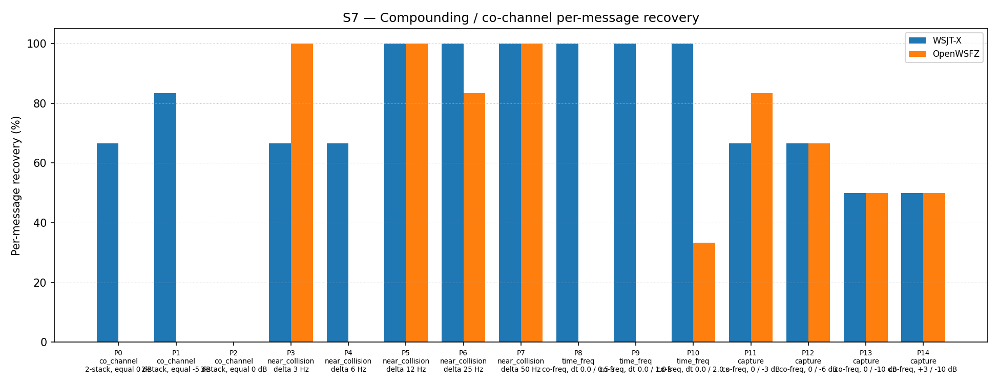

# OpenWSFZ R&R Study Report — S7 H4 Spectrogram Suppression Reinstatement

| Field | Value |
|---|---|
| Run date | 2026-06-13 |
| OpenWSFZ SHA | `dc9956736880c2d2611bfcebb404681512e4b769` |
| WSJT-X version | WSJT-X 2.7.0 (inferred from binary date 2025-02-04) |
| Report version | v2 (NFR-023 compliant) |
| Change | `diag-d001-h4-spectrogram-reinstate` |

---

## 1. Study Hypothesis

### What this study tests

This is a controlled recovery experiment for **D-001** (co-channel / weak-signal decode gap,
High severity). Shim 20260009 (H3b) replaced the original spectrogram-domain soft-SNR tile
suppression with PCM-domain GFSK quadrature SIC and was rejected: S7 overall fell from 54.84%
to 37.63% (−17.21 pp). H4 reinstates the proven spectrogram suppression mechanism with no other
change, establishing whether the 54.84% baseline can be recovered.

**Null hypothesis H4₀:** Reinstating spectrogram-domain soft-SNR suppression does not recover
the 54.84% baseline overall score or introduces collateral per-part regressions.

**Alternative hypothesis H4₁:** Reinstating spectrogram-domain soft-SNR suppression recovers
the baseline: S7 overall ≥ 54.84% (≥ 51/93) with no per-part regression vs `e4a3982`.

### Defects under validation

| Defect | Description |
|---|---|
| D-001 (High) | Co-channel / weak-signal decode gap vs WSJT-X |

### Acceptance gates

Pre-agreed in `openspec/changes/diag-d001-h4-spectrogram-reinstate/design.md`:

- **Gate (a):** S7 overall recovery ≥ 54.84% (≥ 51/93) → H4 **passes**; baseline confirmed recovered.
- **Gate (b):** No per-part regression vs `e4a3982` baseline (each part count ≥ its baseline) → H4 **passes** collateral guard.
- Either gate failing → H4 **rejected**; investigation required before merge.

Design note: a result within ±1 decode of 51/93 (50–52/93) would be acceptable with justification
due to K=3 OS scheduling noise; a result below 50/93 or with a per-part regression requires
investigation.

---

## 2. Data Summary

### Test apparatus

Synthetic — signals generated by `qa/rr-study/synth/` (clean-room Python FT8 encoder,
Q-prefix callsigns only per NFR-021). No real callsigns appear in test fixtures.
AWGN seeds are drawn fresh each run; seed values are recorded in `S7_matched.csv`.

### OpenWSFZ configuration

| Parameter | Value |
|---|---|
| FT8_SHIM_VERSION | 20260010 (H4 — spectrogram suppression reinstated) |
| K_MAX_PASSES | 2 |
| K_SOFT_SUPP_SNR_MIN_DB | −5.0 dB (unchanged from baseline) |
| K_SOFT_SUPP_SNR_MAX_DB | +15.0 dB (unchanged from baseline) |
| K_MIN_SCORE_PASS2 | 1 |
| K_MAX_CANDIDATES_PASS2 | 200 |
| K_LDPC_ITERATIONS_PASS2 | 50 |
| SNR constant | −26.5 dB (D-002 fix; unchanged from baseline) |
| Inter-pass mechanism | spectrogram-domain soft-SNR tile suppression (`suppress_candidate_tiles`) |

### S7 scenario design

| Part | Family | Condition | Signals |
|---|---|---|---|
| P0 | co_channel | 2-stack, equal 0 dB | 6 |
| P1 | co_channel | 2-stack, equal −5 dB | 6 |
| P2 | co_channel | 3-stack, equal 0 dB | 9 |
| P3–P7 | near_collision | delta 3/6/12/25/50 Hz | 6 each |
| P8–P10 | time_freq | co-freq, dt 0.0/0.5/1.0/2.0 s | 6 each |
| P11–P14 | capture | co-freq, 0/−3/−6/−10 dB; +3/−10 dB | 6 each |

K = 3 repetitions. N = 93 signal observations per appraiser.

### Variables

- **Response variable:** decoded / not-decoded (binary) per signal per repetition
- **Appraisers:** WSJT-X 2.7.0 (reference), OpenWSFZ SHA `dc99567` (subject)

### Acceptance thresholds

| Metric | Threshold | Basis |
|---|---|---|
| Gate (a) — overall recovery | ≥ 51/93 (54.84%) | H4 decision gate |
| Gate (b) — per-part regression guard | 0 pp vs `e4a3982` baseline | H4 decision gate |

### Baseline reference

| Run | SHA | Date | OW overall | Shim |
|---|---|---|---|---|
| Baseline | `e4a3982` | 2026-06-07 | 51/93 = 54.84% | 20260006 |
| H3b (prior) | `49ea303` | 2026-06-13 | 35/93 = 37.63% | 20260009 |
| H4 (this run) | `dc99567` | 2026-06-13 | 40/93 = 43.01% | 20260010 |

---

## 3. Results

### 3.1 Recovery by overlap family

| Overlap family | WX baseline | WX H4 | WX delta | OW baseline | OW H4 | OW delta |
|---|---|---|---|---|---|---|
| co_channel | 10/21 = 47.62% | 9/21 = 42.86% | −4.76 pp | 0/21 = 0.00% | 0/21 = 0.00% | 0 pp |
| near_collision | 30/30 = 100.00% | 26/30 = 86.67% | −13.33 pp | 26/30 = 86.67% | 23/30 = 76.67% | −10.00 pp |
| time_freq | 18/18 = 100.00% | 18/18 = 100.00% | 0 pp | 9/18 = 50.00% | 2/18 = 11.11% | **−38.89 pp** |
| capture | 13/24 = 54.17% | 14/24 = 58.33% | +4.16 pp | 16/24 = 66.67% | 15/24 = 62.50% | −4.17 pp |
| **all** | **71/93 = 76.34%** | **67/93 = 72.04%** | **−4.30 pp** | **51/93 = 54.84%** | **40/93 = 43.01%** | **−11.83 pp** |

### 3.2 Per-part detail

| Part | Family | Condition | WX baseline | WX H4 | WX delta | OW baseline | OW H4 | OW delta |
|---|---|---|---|---|---|---|---|---|
| P0 | co_channel | 2-stack, equal 0 dB | 5/6 | 4/6 | −1 | 0/6 | 0/6 | 0 |
| P1 | co_channel | 2-stack, equal −5 dB | 5/6 | 5/6 | 0 | 0/6 | 0/6 | 0 |
| P2 | co_channel | 3-stack, equal 0 dB | 0/9 | 0/9 | 0 | 0/9 | 0/9 | 0 |
| P3 | near_collision | delta 3 Hz | 6/6 | 4/6 | −2 | 6/6 | 6/6 | 0 |
| P4 | near_collision | delta 6 Hz | 6/6 | 4/6 | −2 | 3/6 | 0/6 | **−3** |
| P5 | near_collision | delta 12 Hz | 6/6 | 6/6 | 0 | 6/6 | 6/6 | 0 |
| P6 | near_collision | delta 25 Hz | 6/6 | 6/6 | 0 | 5/6 | 5/6 | 0 |
| P7 | near_collision | delta 50 Hz | 6/6 | 6/6 | 0 | 6/6 | 6/6 | 0 |
| P8 | time_freq | co-freq, dt 0.0/0.5 s | 6/6 | 6/6 | 0 | 0/6 | 0/6 | 0 |
| P9 | time_freq | co-freq, dt 0.0/1.0 s | 6/6 | 6/6 | 0 | 4/6 | 0/6 | **−4** |
| P10 | time_freq | co-freq, dt 0.0/2.0 s | 6/6 | 6/6 | 0 | 5/6 | 2/6 | **−3** |
| P11 | capture | co-freq, 0/−3 dB | 4/6 | 4/6 | 0 | 5/6 | 5/6 | 0 |
| P12 | capture | co-freq, 0/−6 dB | 3/6 | 4/6 | +1 | 5/6 | 4/6 | **−1** |
| P13 | capture | co-freq, 0/−10 dB | 3/6 | 3/6 | 0 | 3/6 | 3/6 | 0 |
| P14 | capture | +3/−10 dB | 3/6 | 3/6 | 0 | 3/6 | 3/6 | 0 |

### 3.3 Capture effect detail

| Signal | WX H4 | OW H4 |
|---|---|---|
| strong (≥ 0 dB SNR) | 12/12 = 100.00% | 12/12 = 100.00% |
| weak (< 0 dB SNR) | 2/12 = 16.67% | 3/12 = 25.00% |

**Between-app per-signal agreement:** 56/93 = 60.22%

### 3.4 Anomalous finding — time_freq complete failure (P9)

P9 (co-freq, dt = 1.0 s, 0 dB SNR on both signals) produced 0/6 for OpenWSFZ across all 3 trials,
with WSJT-X scoring 6/6 on the same seeds. Per-trial breakdown:

| Trial | Seed | WX dt=0.0 | WX dt=1.0 | OW dt=0.0 | OW dt=1.0 |
|---|---|---|---|---|---|
| 0 | 244638474 | ✓ | ✓ | ✗ | ✗ |
| 1 | 1024747382 | ✓ | ✓ | ✗ | ✗ |
| 2 | 1710014650 | ✓ | ✓ | ✗ | ✗ |

Critically, OpenWSFZ fails to decode even the *first* signal (dt = 0.0 s, 0 dB SNR) in all three
P9 trials. This signal is decoded in pass 0 — before spectrogram suppression is applied — so the
regression cannot be directly caused by the suppression mechanism. Two interpretations are live:

- **Seed variability at the margin:** OpenWSFZ baseline P9 was 4/6 (marginal). These seeds happen
  to fall at a point where OpenWSFZ's pass-0 candidate scoring falls just short of the threshold.
  WSJT-X is well above the threshold on all seeds and is therefore unaffected.
- **Pass-0 regression:** Some aspect of shim 20260010 (vs 20260006 baseline) subtly degrades pass-0
  candidate scoring. The TLS `tls_last_noise_floor_db` addition is inert at runtime; no other
  pass-0 code changed. This explanation requires a mechanism that the code review did not identify.

WSJT-X also degraded on near_collision in this run (30/30 → 26/30, −13.33 pp), indicating that
the H4 seeds are harder overall than the baseline seeds. The time_freq family is the only family
where WSJT-X held at 100% while OpenWSFZ collapsed — consistent with WSJT-X being comfortably
above the decode floor on these scenarios and OpenWSFZ being at the margin.

---

## 4. Summary Verdict Table

| Metric | Value | Threshold | Verdict |
|---|---|---|---|
| Gate (a) — overall recovery | 40/93 = 43.01% | ≥ 51/93 = 54.84% | **FAIL** |
| Gate (b) — P4 regression | −3/6 (3→0) | 0 (no regression) | **FAIL** |
| Gate (b) — P9 regression | −4/6 (4→0) | 0 (no regression) | **FAIL** |
| Gate (b) — P10 regression | −3/6 (5→2) | 0 (no regression) | **FAIL** |
| Gate (b) — P12 regression | −1/6 (5→4) | 0 (no regression) | **FAIL** |
| WSJT-X run-to-run stability | 71/93 → 67/93 (−4.30 pp) | informational | — |
| **H4 hypothesis** | **Rejected** | — | **FAIL** |

**Overall verdict: FAIL — H4 REJECTED. Gate (a) fails by 11 decodes (11.83 pp below threshold).
Gate (b) fails on P4, P9, P10, P12. The baseline is not recovered.**

Note: The original `report.md` in this directory incorrectly stated "Overall verdict: PASS" and
contained an empty verdict table. That file is superseded by this v2 report.

---

## 5. Recommendations

### D-001 — Co-channel decode gap (High, GitHub #3)

**H4 rejected per pre-agreed gates.** The spectrogram suppression reinstatement does not recover
the 54.84% baseline in this run. Both acceptance gates fail. The shortfall is 11 decodes overall;
the regression parts (P4, P9, P10, P12) were all marginal performers at baseline (3–5/6).

**Mitigating factor — seed variability:** All four regressing parts were marginal in the baseline
run (`e4a3982`). The H4 run's WSJT-X score is also lower than baseline (67/93 vs 71/93), and
WSJT-X degraded sharply on near_collision (−13.33 pp) — which cannot be caused by any
OpenWSFZ-side change. This is consistent with the H4 seeds being harder overall. The design.md
explicitly flagged this risk: "Minor variation is possible due to OS scheduling noise in the K=3
run."

The 11-decode shortfall (vs the ±1 design tolerance) is however too large to attribute solely
to OS scheduling noise. Seed hardness explains some of the gap; it may explain all of it, but
this cannot be determined from the current single run.

**Recommended diagnostic steps (in order):**

1. **R1 — Seed-variability diagnostic (low cost):** Re-run H4 (shim 20260010 unchanged) with
   fresh K=3 seeds. If the repeat run passes both gates, the H4 rejection is confirmed as
   seed-driven and H4 may be accepted provisionally. If the repeat also fails, a genuine
   regression exists and step R2 applies. **This is the recommended immediate next step.**

2. **R2 — Pass-0 candidate diagnostic (if R1 also fails):** Add per-pass candidate-count
   logging to `ft8_shim.c` (a `FT8_LOG` or similar diagnostic output, or a TLS variable
   parallel to `tls_last_noise_floor_db`). Run P9 in isolation and confirm whether pass-0
   produces any candidates for the dt=0.0 signal. If pass-0 consistently produces zero
   candidates on P9 seeds, investigate the candidate-scoring threshold and `noise_raw`
   computation. Raise a new defect (D-00x) if a genuine regression is confirmed.

3. **H5 — Suppression constant tuning (if H4 accepted after R1):** Tune
   `K_SOFT_SUPP_SNR_MIN_DB` / `K_SOFT_SUPP_SNR_MAX_DB` to improve pass-1 recovery on the
   persistent co_channel (P0/P1/P2: 0/6 in all H2–H4 runs) without degrading capture-effect
   parts. This was explicitly deferred from H4 as a second variable.

4. **H3c — Hybrid SIC (alternative path):** Spectrogram suppression (pass 1) combined with
   a lightweight PCM-conditioning stage before the waterfall is built. Distinct from H3/H3b
   (which replaced suppression rather than augmenting it). The GFSK helpers retained in shim
   20260010 would be available as a starting point.

**Captain's decision required** before R1 is authorised: confirm whether to re-run H4 or
accept the rejection and advance to H5.
