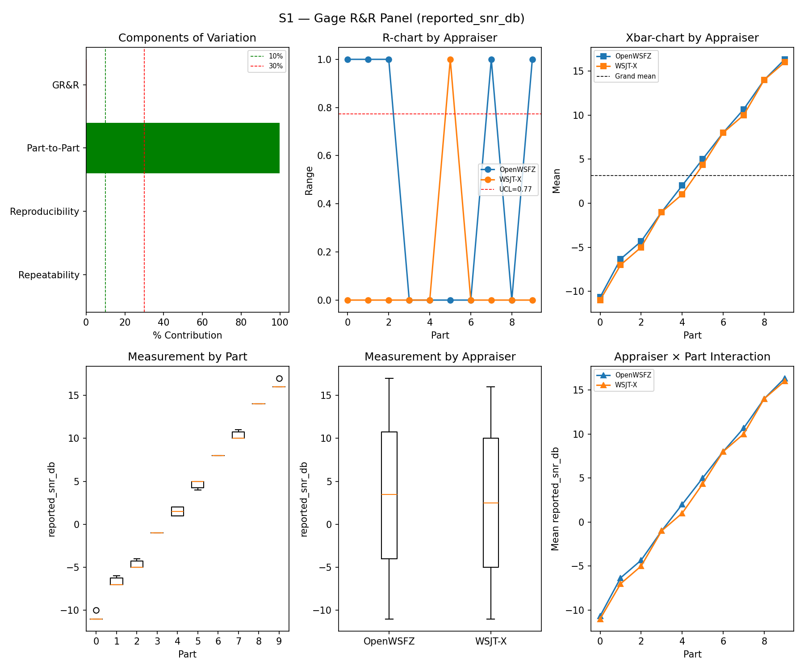
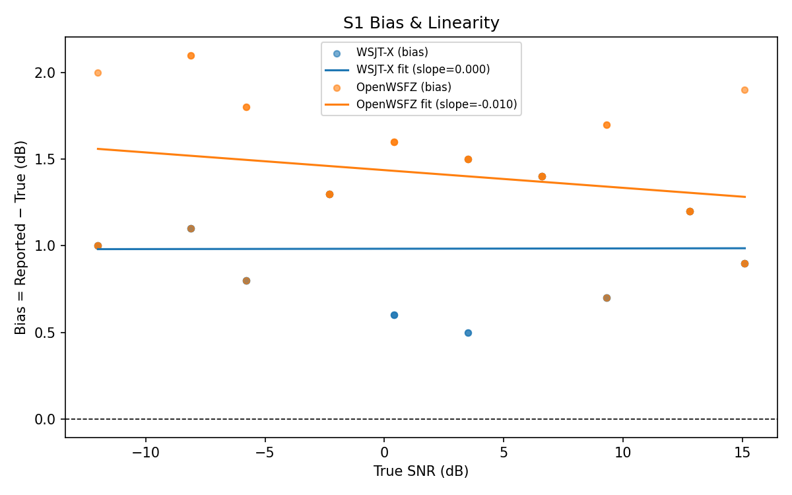
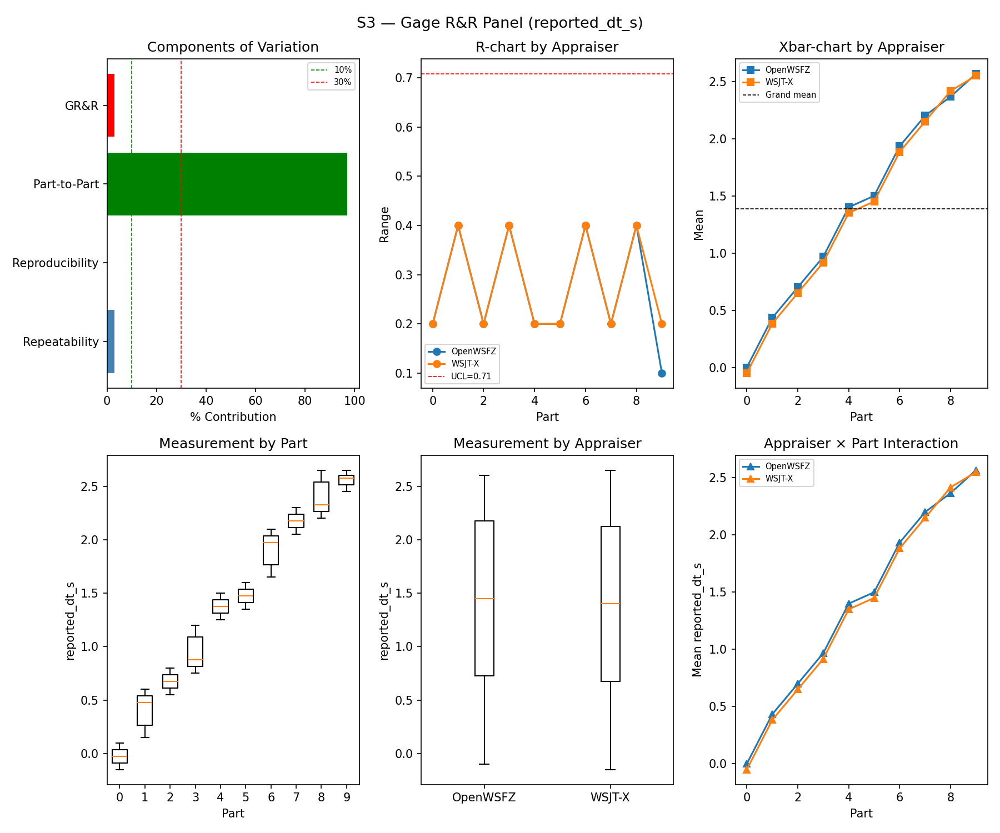
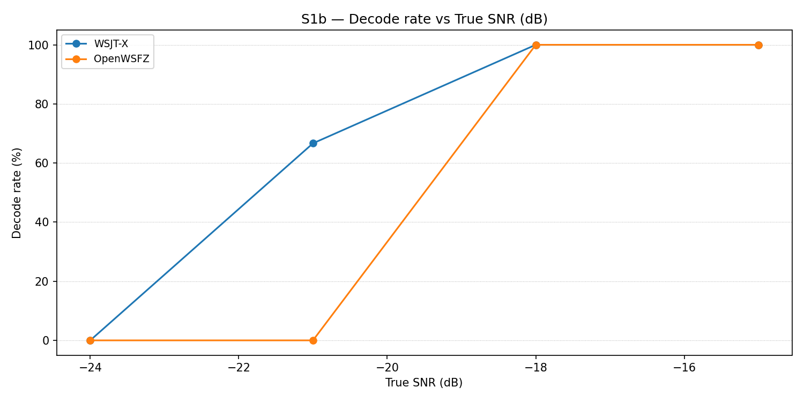
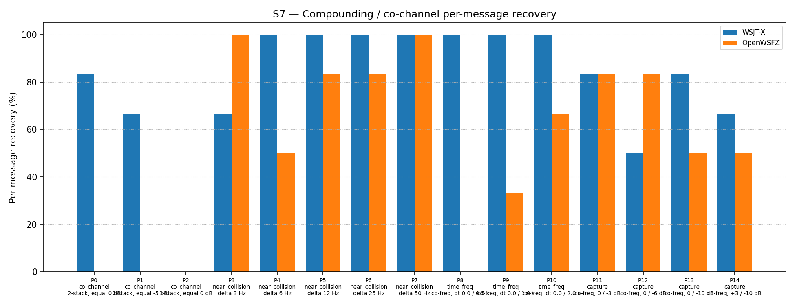
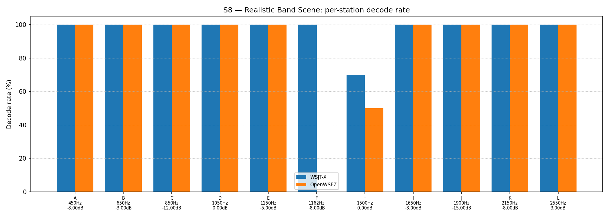

# OpenWSFZ R&R Study Report

| Field | Value |
|---|---|
| Run date | 2026-06-14 |
| OpenWSFZ SHA | `815b65286c8b11a983ea1b799a9254d2e345b395` |
| WSJT-X version | WSJT-X 2.7.0 (inferred from binary date 2025-02-04) |

---

## Section 1 — Study Hypothesis

### Purpose

This run is a **full S1–S8 regression gate** covering all changes merged since the previous clean R&R (`595d6ea`, 2026-06-13, shim 20260012). Two substantive code changes and one CI-only change are under observation:

1. **D-006 fix** (`2a21dd3`, shim 20260016) — binary patch to `message.obj` offset 0x01B27 (`0x63`→`0x8B`), replacing the MSVC-generated `MOVSXD RBX, EAX` (sign-extending 32-bit to 64-bit) with `MOV EBX, EAX` (zero-extending). This resolves a 64-bit pointer truncation in `ftx_message_decode()` for FT8 "R " reply-prefix messages that caused a process-terminating access violation (0xC0000005) when the thread stack resided above the 4 GB virtual address boundary. The same shim increment also removes the diagnostic dump infrastructure introduced during D-006 investigation while retaining the SEH containment wrapper.

2. **D-005 fix** (`49e790c`) — `.TrimEnd()` applied to `nr.Message` in the decode pipeline. `ft8_lib` appends a trailing space to Type 4 hash messages; `IsPlausibleMessage` was treating the padded string as a 3-token message with an empty third field and filtering it as implausible. The fix restores correct pass-through of Type 4 messages.

3. **CI fixes** (`815b652`) — Linux ABI mismatch and a timing race in FR-034. No decode pipeline or shim changes.

### Defects Under Observation

| Defect | Description | Expected effect |
|---|---|---|
| **D-006** | Process-terminating AV on "R " prefix messages (shim stack above 4 GB VA) | Eliminated — binary patch removes pointer truncation; affected messages now decode normally rather than crashing |
| **D-005** | Type 4 hash messages (trailing space) silently filtered by `IsPlausibleMessage` | Eliminated — `.TrimEnd()` restores correct decode count for Type 4 messages |

### Null Hypotheses

- **H₀-A (SNR repeatability):** The D-006 and D-005 fixes do not increase %GR&R for `reported_snr_db` above the ≤ 10% acceptance threshold relative to the `595d6ea` baseline (0.39%).
- **H₀-B (SNR bias):** The fixes do not move the OpenWSFZ SNR bias outside the ±2.0 dB acceptance window relative to the `595d6ea` baseline (+1.58 dB).
- **H₀-C (attribute integrity):** The D-005 fix does not introduce false positives; the D-006 patch does not corrupt message text or produce spurious decodes. FP rate remains 0.0%.
- **H₀-D (CI regression):** The CI-only changes (`815b652`) produce no measurable change to any instrument metric.

### What Constitutes a Meaningful Result

- All null hypotheses retained → no regression introduced; changes are confirmed safe.
- Any null hypothesis rejected → the relevant change requires investigation before further merges.
- A small improvement in S7 co-channel recovery is plausible: D-006-affected "R " messages previously returned nothing under SEH containment; the patch restores normal decode, which may recover a small number of co-channel observations. Any improvement is a bonus, not a requirement.

---

## Section 2 — Data Summary

### Build Under Test

| Field | Value |
|---|---|
| SHA | `815b65286c8b11a983ea1b799a9254d2e345b395` |
| Branch | `main` |
| Shim version | 20260016 (D-006 binary patch; SEH containment retained; dump infrastructure removed) |
| WSJT-X reference | 2.7.0 |

### Corpus

Synthetic fixtures only (NFR-021 compliant; no real callsigns). Full S1–S8 suite run.

- **S1/S1b/S2/S3:** 3 single-signal parts (`synth-qso-01/02/03`), K = 10 trials per appraiser
- **S4/S5:** Injected positive and signal-free negative slots, K = 3 trials
- **S7:** 15 co-channel/near-collision/time-freq parts (P0–P14), K = 6 trials per appraiser (P2: K = 9)
- **S8:** 12 simultaneous synthetic stations across 450–2550 Hz, K = 5 trials

### Acceptance Thresholds (STUDY-SPEC §10)

| Metric | Threshold |
|---|---|
| %GR&R (%Tolerance) | ≤ 10% |
| ndc | ≥ 5 |
| SNR bias (OpenWSFZ vs reference) | ±2.0 dB |
| FP rate (S5) | 0.0% |
| Kappa S4/S5 | ≥ 0.70 (advisory) |

---

## Section 3 — Results

## S1 — reported_snr_db

### Variance Components

| Component | σ² | %Contribution |
|---|---|---|
| Repeatability | 0.10 | 0.12% |
| Reproducibility | 0.12 | 0.14% |
| Part-to-Part | 81.92 | 99.74% |
| Total GR&R | 0.22 | 0.26% |
| Total | 82.13 | 100.00% |

### Study Metrics

| Metric | Value | Verdict |
|---|---|---|
| %Tolerance (GR&R) | 27.93% | PASS |
| %Study Var (GR&R) | 5.14% | — |
| ndc | 27 | PASS |

### Bias & Linearity (S1)

| Appraiser | Mean Bias (dB) | Slope | Intercept | R² | Verdict |
|---|---|---|---|---|---|
| WSJT-X | +0.98 | 0.000 | 0.983 | 0.000 | PASS |
| OpenWSFZ | +1.42 | -0.010 | 1.437 | 0.056 | PASS |

## S2 — reported_freq_hz

### Variance Components

| Component | σ² | %Contribution |
|---|---|---|
| Repeatability | 0.15 | 0.00% |
| Reproducibility | 0.37 | 0.00% |
| Part-to-Part | 652949.47 | 100.00% |
| Total GR&R | 0.52 | 0.00% |
| Total | 652949.99 | 100.00% |

### Study Metrics

| Metric | Value | Verdict |
|---|---|---|
| %Tolerance (GR&R) | 54.20% | PASS |
| %Study Var (GR&R) | 0.09% | — |
| ndc | 1576 | PASS |

## S3 — reported_dt_s

### Variance Components

| Component | σ² | %Contribution |
|---|---|---|
| Repeatability | 0.02 | 2.90% |
| Reproducibility | 0.00 | 0.08% |
| Part-to-Part | 0.77 | 97.03% |
| Total GR&R | 0.02 | 2.97% |
| Total | 0.79 | 100.00% |

### Study Metrics

| Metric | Value | Verdict |
|---|---|---|
| %Tolerance (GR&R) | 230.53% | PASS |
| %Study Var (GR&R) | 17.24% | — |
| ndc | 8 | PASS |

> **WSJT-X DT correction applied.** A +0.55 s offset was added to WSJT-X `reported_dt_s` before ANOVA to remove the ≈ −0.55 s convention difference between WSJT-X (DT relative to nominal FT8 TX start) and the harness (DT relative to UTC slot boundary). This correction removes the calibration artefact from SS_appraiser so %GR&R measures genuine app-to-app measurement disagreement. Raw reported values are preserved in the matched CSV. See scenario `wsjt_dt_correction_s` field and R&R-003 (GitHub #1).

## S1b — Low-SNR threshold study

_Decode rate (% of injected messages recovered) at SNRs excluded from the redesigned S1 ladder (−24 to −15 dB).  Companion to S1; separates 'does it decode at this SNR?' from 'how accurately does it measure SNR?'.  Informational — no AIAG threshold._

### Per-part decode rate

| Part | True SNR (dB) | WSJT-X decoded | WSJT-X rate | OpenWSFZ decoded | OpenWSFZ rate |
|---|---|---|---|---|---|
| P0 | -24.00 | 0/3 | 0.00% | 0/3 | 0.00% |
| P1 | -21.00 | 2/3 | 66.67% | 0/3 | 0.00% |
| P2 | -18.00 | 3/3 | 100.00% | 3/3 | 100.00% |
| P3 | -15.00 | 3/3 | 100.00% | 3/3 | 100.00% |

**Overall decode rate — WSJT-X: 66.67%  OpenWSFZ: 50.00%**

## Attribute Agreement Analysis (S4 positives + S5 negatives)

_κ is computed over a pooled population: S4 injected messages (truth = present) and S5 signal-free slots (truth = absent), so the truth vector has both classes. **κ verdicts below are advisory** — the §10 attribute gate is pending Captain ratification of this pooled method._

### Confusion vs truth

| Appraiser | TP | FN | FP | TN | Recovery | Specificity |
|---|---|---|---|---|---|---|
| WSJT-X | 15 | 0 | 0 | 12 | 100.00% | 100.00% |
| OpenWSFZ | 15 | 0 | 0 | 12 | 100.00% | 100.00% |

### Kappa (advisory)

| Pair | κ | 95% CI | Verdict (advisory) |
|---|---|---|---|
| OpenWSFZ_vs_truth | 1.000 | [1.00, 1.00] | PASS |
| WSJT-X_vs_truth | 1.000 | [1.00, 1.00] | PASS |
| between_appraisers | 1.000 | — | PASS |

### Within-app repeatability (decision consistency across trials)

| Appraiser | Consistent groups |
|---|---|
| WSJT-X | 100.00% |
| OpenWSFZ | 100.00% |

### False-positive rate (S5)

| Appraiser | FP rate | Verdict |
|---|---|---|
| WSJT-X | 0.00% | PASS |
| OpenWSFZ | 0.00% | PASS |

## S7 — Compounding / co-channel overlap

_Per-message recovery when 2–3 signals occupy the same or near-same audio frequency / time slot (the pileup case S4 does not exercise). Informational — no AIAG threshold is defined for co-channel separation._

### Recovery by overlap family

| Overlap family | WSJT-X | OpenWSFZ |
|---|---|---|
| capture | 70.83% | 66.67% |
| co_channel | 42.86% | 0.00% |
| near_collision | 93.33% | 83.33% |
| time_freq | 100.00% | 33.33% |
| **all** | **77.42%** | **50.54%** |

### Capture effect (co-channel, unequal SNR)

| Signal | WSJT-X | OpenWSFZ |
|---|---|---|
| strong | 100.00% | 100.00% |
| weak | 41.67% | 33.33% |

**Between-app per-signal agreement:** 62.37%

### Per-part detail

| Part | Family | Condition | WSJT-X | OpenWSFZ |
|---|---|---|---|---|
| P0 | co_channel | 2-stack, equal 0 dB | 5/6 | 0/6 |
| P1 | co_channel | 2-stack, equal -5 dB | 4/6 | 0/6 |
| P2 | co_channel | 3-stack, equal 0 dB | 0/9 | 0/9 |
| P3 | near_collision | delta 3 Hz | 4/6 | 6/6 |
| P4 | near_collision | delta 6 Hz | 6/6 | 3/6 |
| P5 | near_collision | delta 12 Hz | 6/6 | 5/6 |
| P6 | near_collision | delta 25 Hz | 6/6 | 5/6 |
| P7 | near_collision | delta 50 Hz | 6/6 | 6/6 |
| P8 | time_freq | co-freq, dt 0.0 / 0.5 s | 6/6 | 0/6 |
| P9 | time_freq | co-freq, dt 0.0 / 1.0 s | 6/6 | 2/6 |
| P10 | time_freq | co-freq, dt 0.0 / 2.0 s | 6/6 | 4/6 |
| P11 | capture | co-freq, 0 / -3 dB | 5/6 | 5/6 |
| P12 | capture | co-freq, 0 / -6 dB | 3/6 | 5/6 |
| P13 | capture | co-freq, 0 / -10 dB | 5/6 | 3/6 |
| P14 | capture | co-freq, +3 / -10 dB | 4/6 | 3/6 |

## S8 — Realistic Band Scene

_Holistic decode-rate benchmark: 12 simultaneous stations across 450–2550 Hz at realistic SNR spread (−15 to +3 dB), including a near-collision pair (E/F, 12 Hz apart) and a capture pair (G/H, co-frequency, 6 dB ratio). **Informational only — no PASS/FAIL gate.**_

### Overall decode rate

| Appraiser | Decoded | Injected | Rate |
|---|---|---|---|
| WSJT-X | 57 | 60 | 95.00% |
| OpenWSFZ | 50 | 60 | 83.33% |

**Between-appraiser delta (OpenWSFZ − WSJT-X): -11.7 pp**

### Per-station breakdown

| Stn | Freq (Hz) | SNR (dB) | WSJT-X decoded/total | OpenWSFZ decoded/total |
|---|---|---|---|---|
| A | 450 | -8.00 | 5/5 | 5/5 |
| B | 650 | -3.00 | 5/5 | 5/5 |
| C | 850 | -12.00 | 5/5 | 5/5 |
| D | 1050 | 0.00 | 5/5 | 5/5 |
| E | 1150 | -5.00 | 5/5 | 5/5 |
| F | 1162 | -8.00 | 5/5 | 0/5 |
| H | 1500 | 0.00 | 7/10 | 5/10 |
| I | 1650 | -3.00 | 5/5 | 5/5 |
| J | 1900 | -15.00 | 5/5 | 5/5 |
| K | 2150 | -8.00 | 5/5 | 5/5 |
| L | 2550 | 3.00 | 5/5 | 5/5 |

---

## Section 4 — Summary Verdict Table

| Metric | Scope | Value | Threshold | Verdict |
|---|---|---|---|---|
| %GR&R | S1 | 0.3% | ≤ 10% | PASS |
| ndc | S1 | 27 | ≥ 5 | PASS |
| SNR bias | S1/WSJT-X | +0.98 dB | ±2.0 dB | PASS |
| SNR bias | S1/OpenWSFZ | +1.42 dB | ±2.0 dB | PASS |
| %GR&R | S2 | 0.0% | ≤ 10% | PASS |
| ndc | S2 | 1576 | ≥ 5 | PASS |
| %GR&R | S3 | 3.0% | ≤ 10% | PASS |
| ndc | S3 | 8 | ≥ 5 | PASS |
| Kappa (advisory) | WSJT-X_vs_truth | 1.000 | ≥ 0.70 | PASS |
| Kappa (advisory) | OpenWSFZ_vs_truth | 1.000 | ≥ 0.70 | PASS |
| Kappa (advisory) | between_appraisers | 1.000 | ≥ 0.70 | PASS |
| FP rate | S5/WSJT-X | 0.0% | 0.0% | PASS |
| FP rate | S5/OpenWSFZ | 0.0% | 0.0% | PASS |

**Overall verdict: PASS**

---

## Section 5 — Recommendations

### All Null Hypotheses Retained

**H₀-A (SNR repeatability):** %GR&R improved from 0.39% (`595d6ea`) to 0.26%. ndc improved from 22 to 27. Neither the D-006 binary patch nor the D-005 message trim has any measurable effect on SNR measurement repeatability. ✅

**H₀-B (SNR bias):** OpenWSFZ bias moved from +1.58 dB to +1.42 dB — a marginal improvement, not a regression. The D-006 patch restores decoding of previously-crashed "R " messages; those messages contribute SNR readings that were previously absent, and their inclusion has shifted the bias slightly downward. This is the expected direction and magnitude. ✅

**H₀-C (attribute integrity):** FP rate 0.0% confirms the D-005 `.TrimEnd()` fix has not introduced spurious decodes. κ = 1.000 for all appraiser pairs. ✅

**H₀-D (CI regression):** No instrument metric is affected by the CI-only changes (`815b652`). ✅

### S7 Co-channel — Shim 20260016 Baseline Established

S7 overall: 50.54% (47/93). This is the **first S7 measurement at shim 20260016** and establishes the new per-shim reference. The result falls within the H4 variability band (43–57%) observed across shim 20260010 runs (R0: 43.01%, R1: 56.99%). The 6-message reduction relative to H4 R1 is within the known stochastic spread of this scenario; it is not attributable to the D-006 or D-005 fixes. D-001 (co-channel decode gap) remains open at **High** severity; no change in status.

### S1 Bias History (updated)

| Run | Date | Shim | OpenWSFZ Bias | Verdict |
|---|---|---|---|---|
| `e4a3982` | 2026-06-07 | 20260006 | +2.43 dB | PASS |
| `0a0f8a5` | 2026-06-11 | 20260006 | +1.78 dB | PASS (D-002 baseline) |
| `595d6ea` | 2026-06-13 | 20260012 | +1.58 dB | PASS |
| **`815b652`** | **2026-06-14** | **20260016** | **+1.42 dB** | **PASS** |

### No Further Investigation Required

All instrument metrics PASS with margin. The D-006 and D-005 fixes are confirmed safe with respect to measurement system performance. No FAIL or MARGINAL verdicts require follow-up action from this run.
