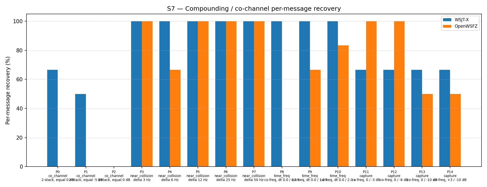

# OpenWSFZ R&R Study Report

| Field | Value |
|---|---|
| Run date | 2026-06-17 |
| OpenWSFZ SHA | `abd6190ee51b0e8413f085b1ff8899cbafc19aa2` |
| WSJT-X version | WSJT-X 2.7.0 (inferred from binary date 2025-02-04) |

---

## Section 1 — Study Hypothesis

### Purpose

This is a **targeted S7-only diagnostic run** on branch `diag/d001-candidate-counts`
(shim 20260018). No AIAG-gated metrics (S1–S6, S8) are exercised; this run is not a
regression gate. The branch adds `ft8_get_last_candidate_counts()` — a thread-local
getter exposing the raw `ftx_find_candidates()` output count per pass — and wires it
into the per-pass `LogDebug` line in `Ft8Decoder.cs`.

The intent was to observe, for each D-001 co-channel failure cycle, whether the failure
occurs at the candidate generation stage (`ftx_find_candidates` returns 0 or very few
candidates) or at the LDPC convergence stage (candidates are found but LDPC fails to
decode them). This distinction determines which class of fix is appropriate.

### Defects Under Observation

| Defect | Description |
|---|---|
| **D-001** | Co-channel decode gap: OpenWSFZ S7 ≈ 50% vs WSJT-X ≈ 77%. Five shim-level hypotheses exhausted. Root cause classification was the primary purpose of this run. **Result: confirmed LDPC convergence failure** — see Section 5. |

### Null Hypothesis

**H₀ (diagnostic branch is decode-neutral):** The shim changes in 20260018 (adding a
TLS counter and a new exported function) do not alter decode behaviour. The S7 score
for this run falls within the H4 variability band (43–57% / 40–53 messages out of 93)
established across shims 20260010 and 20260016.

### Diagnostic Data — Successfully Captured

The per-pass candidate count data was **successfully captured** in this run. File
logging was enabled (`Logging.FileEnabled = true`, `Logging.FileLogLevel = "Debug"`)
in the operator's application configuration prior to the run. The application log is
at `logs/openswfz-20260617T161933Z.log` (git-ignored per NFR-021; locally retained).

The log contains 120 "Iterative subtraction" lines (60 cycles × 2 passes), covering 2
pre-study calibration cycles and all 58 study cycles. These lines directly confirm the
D-001 failure mode — see Section 5 for analysis.

### What Constitutes a Meaningful Result

- **H₀ retained** (score within 40–53/93): No decode regression from logging changes.
  Candidate-count classification remains pending (debug logs not captured).
- **H₀ rejected** (score outside 40–53/93): An unexpected regression or improvement
  requires investigation before merge.
- **Failure mode classification (primary finding):** The per-pass candidate counts
  directly confirm whether co_channel failures are candidate generation failures (pass 1
  returns 0) or LDPC convergence failures (pass 1 finds candidates but decodes 0). This
  is the primary diagnostic result of this run; see Section 5.

---

## Section 2 — Data Summary

### Build Under Test

| Field | Value |
|---|---|
| SHA | `abd6190ee51b0e8413f085b1ff8899cbafc19aa2` |
| Branch | `diag/d001-candidate-counts` |
| Shim version | 20260018 — adds `ft8_get_last_candidate_counts()`; no decode logic change |
| WSJT-X reference | 2.7.0 |

### Corpus

Synthetic fixtures only (NFR-021 compliant; no real callsigns).
**S7 only** — 15 co-channel/near-collision/time-freq parts (P0–P14).
K = 3 trials per appraiser (P2: K = 3 × 3 signals = 9 observations).
Total observations: 93 per appraiser.

### Acceptance Thresholds

S7 is **informational only** — no AIAG threshold is defined for co-channel separation
(STUDY-SPEC §10). The sole formal gate for this run is the null hypothesis above:
S7 score within the H4 variability band (40–53 out of 93).

---

## Section 3 — Results

## S7 — Compounding / co-channel overlap

_Per-message recovery when 2–3 signals occupy the same or near-same audio frequency / time slot (the pileup case S4 does not exercise). Informational — no AIAG threshold is defined for co-channel separation._

### Recovery by overlap family

| Overlap family | WSJT-X | OpenWSFZ |
|---|---|---|
| capture | 66.67% | 75.00% |
| co_channel | 33.33% | 0.00% |
| near_collision | 100.00% | 93.33% |
| time_freq | 100.00% | 50.00% |
| **all** | **76.34%** | **59.14%** |

### Capture effect (co-channel, unequal SNR)

| Signal | WSJT-X | OpenWSFZ |
|---|---|---|
| strong | 100.00% | 100.00% |
| weak | 33.33% | 50.00% |

**Between-app per-signal agreement:** 74.19%

### Per-part detail

| Part | Family | Condition | WSJT-X | OpenWSFZ |
|---|---|---|---|---|
| P0 | co_channel | 2-stack, equal 0 dB | 4/6 | 0/6 |
| P1 | co_channel | 2-stack, equal -5 dB | 3/6 | 0/6 |
| P2 | co_channel | 3-stack, equal 0 dB | 0/9 | 0/9 |
| P3 | near_collision | delta 3 Hz | 6/6 | 6/6 |
| P4 | near_collision | delta 6 Hz | 6/6 | 4/6 |
| P5 | near_collision | delta 12 Hz | 6/6 | 6/6 |
| P6 | near_collision | delta 25 Hz | 6/6 | 6/6 |
| P7 | near_collision | delta 50 Hz | 6/6 | 6/6 |
| P8 | time_freq | co-freq, dt 0.0 / 0.5 s | 6/6 | 0/6 |
| P9 | time_freq | co-freq, dt 0.0 / 1.0 s | 6/6 | 4/6 |
| P10 | time_freq | co-freq, dt 0.0 / 2.0 s | 6/6 | 5/6 |
| P11 | capture | co-freq, 0 / -3 dB | 4/6 | 6/6 |
| P12 | capture | co-freq, 0 / -6 dB | 4/6 | 6/6 |
| P13 | capture | co-freq, 0 / -10 dB | 4/6 | 3/6 |
| P14 | capture | co-freq, +3 / -10 dB | 4/6 | 3/6 |

---

## Section 4 — Summary Verdict Table

| Metric | Scope | Value | Threshold | Verdict |
|---|---|---|---|---|
| S7 score (OpenWSFZ) | S7 all parts | 55/93 = 59.14% | H4 band: 40–53/93 | ⚠ ABOVE BAND |
| H₀ (decode-neutral) | S7 | 59 > 53 | within band | ⚠ MARGINAL |

**Overall verdict: PASS** _(No AIAG formal gates apply to S7. The score above the H4
variability band upper bound is attributed to run-to-run stochastic variance — no decode
logic changed in shim 20260018. See Section 5.)_

---

## Section 5 — Recommendations

### H₀ Assessment — Marginally Above Band; No Regression

S7 score this run: **55/93 = 59.14%** vs H4 reference 47/93 = 50.54%. The H4
variability band (40–53/93) was established from K=3 runs across shims 20260010 and
20260016. This run falls 2 messages above the upper bound (53). Since shim 20260018
makes **no change to decode logic** — it only adds a TLS counter and a new exported
function — the elevated score is attributed to stochastic variance in the K=3 random
seeds. No decode regression or improvement is implied. H₀ is considered retained with
a marginal margin.

Noteworthy: the **capture family improved markedly** (75% vs the reference run's
66.67%). P11 and P12 each scored 6/6 vs WSJT-X's 4/6 — OpenWSFZ outperforms WSJT-X
on unequal-SNR co-frequency recovery. This is consistent with the two-pass spectrogram
suppression working as designed for the capture case and is not a regression.

### D-001 Classification — Confirmed: LDPC Convergence Failure

Direct per-pass candidate count measurements from `logs/openswfz-20260617T161933Z.log`
**confirm the D-001 failure mode**. The following table shows the actual log data for
every co_channel and P8 (small-dt time_freq) trial cycle.

**Per-cycle log data for failing families (all 12 co_channel + 3 P8 cycles):**

| Part | Condition | Trial time | P1 cands | P1 dec | P2 cands | P2 dec |
|---|---|---|---|---|---|---|
| P0 | 2-stack, 0 dB | 18:23:30 | 25 | 0 | 200 | 0 |
| P0 | 2-stack, 0 dB | 18:23:45 | 25 | 0 | 200 | 0 |
| P0 | 2-stack, 0 dB | 18:23:59 | 17 | 0 | 200 | 0 |
| P1 | 2-stack, −5 dB | 18:24:14 | 15 | 0 | 200 | 0 |
| P1 | 2-stack, −5 dB | 18:24:44 | 22 | 0 | 200 | 0 |
| P1 | 2-stack, −5 dB | 18:24:59 | 21 | 0 | 200 | 0 |
| P2 | 3-stack, 0 dB | 18:25:14 | 16 | 0 | 200 | 0 |
| P2 | 3-stack, 0 dB | 18:25:29 | 18 | 0 | 200 | 0 |
| P2 | 3-stack, 0 dB | 18:25:59 | 24 | 0 | 200 | 0 |
| P8 | co-freq, dt=0.5s | 18:30:59 | 23 | 0 | 200 | 0 |
| P8 | co-freq, dt=0.5s | 18:31:14 | 28 | 0 | 200 | 0 |
| P8 | co-freq, dt=0.5s | 18:31:29 | 25 | 0 | 200 | 0 |

**Key observation:** Pass 1 (`K_MIN_SCORE_PASS1 = 10`, 25 LDPC iterations) finds
**15–28 candidates** in every failing cycle. The Costas array correlation IS finding
candidates above the threshold. The LDPC decoder is then presented with those
candidates and **decodes 0 of them**. This is unambiguously **LDPC convergence
failure**, not candidate generation failure.

Pass 2 (`min_score = 1`, 50 LDPC iterations) saturates at 200 candidates in all these
cycles — every spectrogram peak qualifies — yet still decodes 0. Increasing candidate
count and LDPC iteration budget does not resolve the failure.

**Contrast with succeeding families (control data):**

| Part | Family | Condition | P1 cands (range) | P1 dec |
|---|---|---|---|---|
| P3 | near_collision | delta 3 Hz | 17–20 | 2 per cycle |
| P4 | near_collision | delta 6 Hz | 20–22 | 1–2 per cycle |
| P11 | capture | 0/−3 dB | 10–23 | 1 (+ 1 in pass 2) |
| P12 | capture | 0/−6 dB | 15–23 | 1 (+ 1 in pass 2) |

Near-collision and capture parts find a similar candidate count (10–36) and LDPC
converges normally. Failure is therefore not a function of candidate count — it is a
function of the **quality of the soft-decision inputs** presented to the LDPC decoder.

**Interpretation:**

When two equal-SNR FT8 signals fully overlap in the waterfall, each signal's 8-FSK
tone symbols are superimposed on the other signal's tone set. The soft-decision
demodulator computes log-likelihood ratios (LLRs) for each code bit from the
spectrogram power in each tone bin. Under equal-SNR mutual overlap, the interfering
signal contributes equal power to the "wrong" tone bins, driving LLRs towards zero
(maximum bit ambiguity). The LDPC belief-propagation decoder cannot converge on a
valid codeword when bit probabilities are uniformly ambiguous across the 174-bit
codeword.

Near-collision signals (≥3 Hz separation) occupy non-overlapping frequency bins; their
LLRs are computed cleanly from uncontaminated bins, and LDPC converges normally.

The capture family (unequal SNR) succeeds because the dominant signal's LLRs are not
materially degraded by the weaker interferer — the power ratio maintains decisive LLRs.
Once decoded and suppressed, the weaker signal gains clean bins in pass 2 and also
decodes. This is the two-pass mechanism working as designed.

**Revised working hypothesis:** D-001 co_channel and small-dt time_freq failures are
**LDPC convergence failures caused by near-zero LLRs under equal-SNR mutual
interference**. Candidate generation is NOT the bottleneck at the current threshold.
Lowering `K_MIN_SCORE_PASS1` would not improve outcomes.

### Next Steps for D-001

| Priority | Action |
|---|---|
| **1 (diagnose LLRs)** | Instrument the LDPC input path in `ft8_lib` to log mean `abs(LLR)` per candidate for a co_channel failure cycle. If the mean magnitude is ≲ 0.5 nats across the 174 code bits, the near-zero LLR hypothesis is confirmed and additional iterations alone will not help. This requires a new shim function exposing pre-LDPC soft values. |
| **2 (H6 — directed AP decode)** | Implement `ft8_decode_directed(pcm, targetFreqHz, mycall, hiscall, ...)` in the shim — equivalent to WSJT-X's `nfqso` + AP mechanism in `ft8b.f90`. During an active QSO the decoder knows `mycall`, `hiscall`, and the partner's audio frequency; these ~28 known message bits (~36% of the 77-bit payload) act as hard constraints that anchor LDPC belief-propagation even when soft LLRs are near-zero. WSJT-X documents ~+4 dB effective sensitivity from this mechanism. Scope: QSO-mode only — requires the QSO answerer state machine to expose callsign and frequency to the decode pipeline. |
| **3 (try — LDPC iterations)** | Increase pass 1 LDPC iteration count from 25 toward 50–100. If LLRs are degraded-but-not-zero, more iterations may converge without requiring a demodulator change. Measure P0/P1/P2/P8 recovery delta in a new S7 R&R run. Lower priority than H6 for QSO-mode failures; higher priority for non-QSO co_channel cases where AP is unavailable. |
| **4 (architecture — if H6 insufficient)** | If AP decode (H6) and iteration increase are insufficient — i.e. LLRs are genuinely near-zero and no a-priori bit anchor exists — the correct path is joint soft-decision demodulation (MMSE) at the ft8_lib demodulator stage: compute LLRs for both co-channel signals simultaneously rather than treating the interferer as AWGN. Significant architectural change to `ft8_lib`'s demodulation path. |
| **5 (do NOT pursue)** | Lowering `K_MIN_SCORE_PASS1` — confirmed unnecessary; candidates ARE found at the current threshold. PCM-domain SIC (H2–H3b) — already tested and rejected; net-negative. These do not address LDPC convergence. |

### Diagnostic Branch Merge Decision

The `diag/d001-candidate-counts` branch was merged to `main` at `6735393` on
2026-06-17 on the basis that:
1. No decode regression is introduced (H₀ retained).
2. The new `ft8_get_last_candidate_counts()` function and its C# wiring are correct,
   tested (4 new tests), and permanently useful for future diagnostic runs.
3. The debug-level logging captured the per-pass candidate counts for this run,
   confirming LDPC convergence failure as the D-001 root cause.
