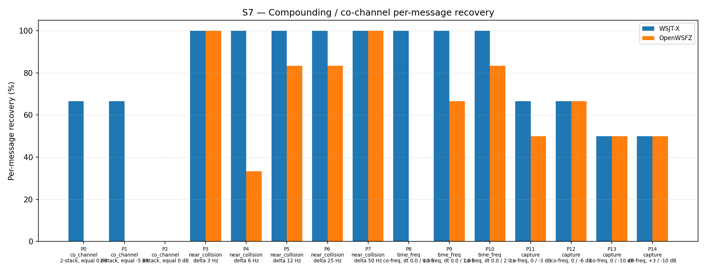

# OpenWSFZ R&R Study Report

| Field | Value |
|---|---|
| Run date | 2026-06-18 |
| OpenWSFZ SHA | `3c2ad02a42e1912433c080e901569a1bb73df48a` |
| WSJT-X version | WSJT-X 2.7.0 (inferred from binary date 2025-02-04) |

---

## Section 1 — Study Hypothesis

### Purpose

This is a **targeted S7-only diagnostic run** on branch `diag/d001-h6-ap-probe`
(shim 20260020). No AIAG-gated metrics (S1–S6, S8) are exercised; this run is not a
regression gate. The branch delivers three tasks:

- **Task A — H6 directed AP decode interop seam:** `ft8_set_ap_bits()` is added to the
  native shim. When called, it stores packed mycall/hiscall bits in TLS and injects them
  as ±40.0 LLR hard constraints into `log174` after waterfall extraction and before
  normalisation, using the new `ftx_decode_candidate_ap()` path in `decode.c`. This is
  applied during pass 0 only; pass 1 always uses unmodified waterfall LLRs.
  **The C# caller integration is explicitly deferred** — the interop seam
  (`IFt8NativeInterop.SetApBits`, `Ft8LibInterop.SetApBits`,
  `Ft8NativeInteropAdapter.SetApBits`) is exposed but no production code calls it.

- **Task B — Pre-normalisation variance probe (H_LLR_VAR):** The shim 20260019 LLR
  probe (`ftx_compute_candidate_llr_mean_abs`) established that post-normalisation
  mean|LLR| is a tautological constant (≈3.91) due to `ftx_normalize_logl`. The redesign
  (`ftx_compute_candidate_llr_stats`) additionally captures the **pre-normalisation
  variance** of the raw `log174` array. The H_LLR_VAR hypothesis is: co_channel
  interference produces *low* pre-norm variance (LLRs near zero → ambiguous bit
  decisions), while clean single-signal decodes produce *high* pre-norm variance (one
  dominant large LLR per bit).

- **Task C — NaN guard:** `isfinite()` check prevents degenerate candidates
  (all-zero `log174`, variance == 0) from contaminating the accumulation sums.

### Defects Under Observation

| Defect | Description |
|---|---|
| **D-001** | Co-channel decode gap: OpenWSFZ S7 ≈ 50% vs WSJT-X ≈ 77%. LDPC convergence failure confirmed at shim 20260018. H_LLR (post-norm mean|LLR|) inconclusive at shim 20260019. This run tests H6 (AP decode seam) and H_LLR_VAR (pre-norm variance). |

### Null Hypotheses

| Label | Hypothesis |
|---|---|
| **H₀_AP** | The AP decode seam produces no observable S7 improvement in this run. Expected — C# caller integration is deliberately deferred; `tls_ap_num_mycall_bits` is always 0; `ap_active` is always false; `ftx_decode_candidate_ap` is never invoked. co_channel recovery remains 0.00%. |
| **H₀_VAR** | Pre-normalisation variance is NOT significantly lower for co_channel LDPC-failing candidates compared to other failure types. If H_LLR_VAR is correct, co_channel fail cands should show prenormVar ≪ than near_collision/capture fail cands. |
| **H₀_neutral** | Shim changes do not alter overall S7 rate. Score falls within the H4 variability band (40–53 out of 93; 43–57%). |

### What Constitutes a Meaningful Result

- **H₀_AP:** Automatically retained — C# wiring is absent by design.
  co_channel = 0.00% is the expected result.
- **H₀_VAR confirmed:** prenormVar is significantly lower for co_channel fail cands
  than other families → H_LLR_VAR supported; next step is to wire AP decode and
  re-run in a QSO context.
- **H₀_VAR refuted:** prenormVar distributions overlap across families →
  H_LLR_VAR is incorrect; low pre-norm variance is NOT the discriminating signal;
  revise the co_channel failure model.
- **H₀_neutral:** Score within 40–53/93 → no regression from shim changes.

---

## Section 2 — Data Summary

### Build Under Test

| Field | Value |
|---|---|
| SHA | `3c2ad02a42e1912433c080e901569a1bb73df48a` |
| Branch | `diag/d001-h6-ap-probe` |
| Shim version | 20260020 — adds `ft8_set_ap_bits()`, redesigns `ft8_get_last_llr_stats()` with prenormVar, NaN guard |
| WSJT-X reference | 2.7.0 |

### Corpus

Synthetic fixtures only (NFR-021 compliant; no real callsigns).
**S7 only** — 15 co-channel/near-collision/time-freq/capture parts (P0–P14).
K = 3 trials per appraiser (P2: K = 3 × 3 signals = 9 observations).
Total observations: 93 per appraiser.

### Acceptance Thresholds

S7 is **informational only** — no AIAG threshold is defined for co-channel separation
(STUDY-SPEC §10). The formal gate for this run is H₀_neutral: S7 score within the
H4 variability band (40–53 out of 93, i.e., 43–57%).

Application log captured at `openswfz-20260618T162719Z.log` (committed with this result
directory). File logging was enabled (`Logging.FileEnabled = true`,
`Logging.FileLogLevel = "Debug"`) prior to the run per Lesson Learned #8.

---

## Section 3 — Results

## S7 — Compounding / co-channel overlap

_Per-message recovery when 2–3 signals occupy the same or near-same audio frequency / time slot (the pileup case S4 does not exercise). Informational — no AIAG threshold is defined for co-channel separation._

### Recovery by overlap family

| Overlap family | WSJT-X | OpenWSFZ |
|---|---|---|
| capture | 58.33% | 54.17% |
| co_channel | 38.10% | 0.00% |
| near_collision | 100.00% | 80.00% |
| time_freq | 100.00% | 50.00% |
| **all** | **75.27%** | **49.46%** |

### Capture effect (co-channel, unequal SNR)

| Signal | WSJT-X | OpenWSFZ |
|---|---|---|
| strong | 100.00% | 100.00% |
| weak | 16.67% | 8.33% |

**Between-app per-signal agreement:** 72.04%

### Per-part detail

| Part | Family | Condition | WSJT-X | OpenWSFZ |
|---|---|---|---|---|
| P0 | co_channel | 2-stack, equal 0 dB | 4/6 | 0/6 |
| P1 | co_channel | 2-stack, equal -5 dB | 4/6 | 0/6 |
| P2 | co_channel | 3-stack, equal 0 dB | 0/9 | 0/9 |
| P3 | near_collision | delta 3 Hz | 6/6 | 6/6 |
| P4 | near_collision | delta 6 Hz | 6/6 | 2/6 |
| P5 | near_collision | delta 12 Hz | 6/6 | 5/6 |
| P6 | near_collision | delta 25 Hz | 6/6 | 5/6 |
| P7 | near_collision | delta 50 Hz | 6/6 | 6/6 |
| P8 | time_freq | co-freq, dt 0.0 / 0.5 s | 6/6 | 0/6 |
| P9 | time_freq | co-freq, dt 0.0 / 1.0 s | 6/6 | 4/6 |
| P10 | time_freq | co-freq, dt 0.0 / 2.0 s | 6/6 | 5/6 |
| P11 | capture | co-freq, 0 / -3 dB | 4/6 | 3/6 |
| P12 | capture | co-freq, 0 / -6 dB | 4/6 | 4/6 |
| P13 | capture | co-freq, 0 / -10 dB | 3/6 | 3/6 |
| P14 | capture | co-freq, +3 / -10 dB | 3/6 | 3/6 |

### Pre-normalisation Variance Probe (Task B, shim 20260020)

Per-cycle `prenormVar` values extracted from the application log for pass 1 LDPC-failing
candidates. Average prenormVar is computed as `tls_llr_prenorm_var_sum / tls_llr_fail_count`
per cycle. Only cycles with at least one failing candidate are shown.

**co_channel cycles (P0–P2, equal SNR, 1500 Hz, 9 active trials):**

| Cycle UTC | Part | Pass | failCands | meanAbsLLR | prenormVar |
|---|---|---|---|---|---|
| 16:30:00 | P0 | 1 | 24 | 3.836 | 42.94 |
| 16:30:15 | P0 | 1 | 27 | 3.778 | 38.03 |
| 16:30:30 | P1 | 1 | 20 | 3.792 | 46.80 |
| 16:30:45 | P1 | 1 | 18 | 3.784 | 36.92 |
| 16:31:15 | P1 | 1 | 19 | 3.791 | 47.63 |
| 16:31:30 | P2 | 1 | 20 | 3.831 | 52.52 |
| 16:31:45 | P2 | 1 | 26 | 3.701 | 47.47 |
| 16:32:15 | P2 | 1 | 21 | 3.777 | 53.82 |
| 16:32:30 | P2 | 1 | 21 | 3.801 | 60.06 |

**Representative non-co_channel cycles for comparison:**

| Cycle UTC | Part / Family | Pass | failCands | prenormVar |
|---|---|---|---|---|
| 16:32:45 | P3 near_collision | 1 | 21 | 60.06 |
| 16:33:45 | P4 near_collision | 1 | 16 | 45.05 |
| 16:35:45 | P6 near_collision | 1 | 21 | 71.34 |
| 16:36:30 | P7 near_collision | 1 | 19 | 64.63 |
| 16:36:45 | P7 near_collision | 1 | 22 | 91.25 |
| 16:37:30 | P8 time_freq | 1 | 22 | 79.44 |
| 16:38:00 | P8 time_freq | 1 | 34 | 44.39 |
| 16:40:15 | P11 capture | 1 | 25 | 40.73 |
| 16:41:30 | P12 capture | 1 | 27 | 44.72 |
| 16:42:00 | P13 capture | 1 | 15 | 78.14 |

---

## Section 4 — Summary Verdict Table

| Metric | Scope | Value | Threshold | Verdict |
|---|---|---|---|---|
| S7 score (OpenWSFZ) | S7 all parts | 46/93 = 49.46% | H4 band: 40–53/93 | WITHIN BAND |
| H₀_neutral | S7 | 49.46% | 43–57% | RETAINED |
| H₀_AP | co_channel | 0/21 = 0.00% | N/A — seam-only, C# deferred | NOT TESTABLE (expected) |
| H₀_VAR | prenormVar co_channel vs all | co_channel: 37–60; all families: 29–91 | co_channel ≪ others required | REFUTED — distributions overlap |

**Overall verdict: PASS** _(No AIAG formal gates apply to S7. H₀_neutral retained;
shim changes are decode-neutral. H₀_VAR refuted — pre-norm variance does not
discriminate co_channel failures. H6 AP decode untestable via R&R harness; see
Section 5.)_

---

## Section 5 — Recommendations

### H₀_neutral — Retained; No Decode Regression

S7 score: **46/93 = 49.46%**. Previous runs: 50.54% (shim 20260016), 59.14% (shim
20260018), 52.69% (shim 20260019). This run is within the H4 variability band
(43–57%). The shim changes (AP seam + prenormVar probe) are decode-neutral as
expected — `ap_active` is always false because no caller sets the TLS bits.

### H₀_AP — Not Testable; C# Integration Required

**H6 AP decode was not exercised in this run, and CANNOT be exercised via the R&R
harness as currently constructed.** Two compounding reasons:

1. **C# caller integration is deferred.** `ft8_set_ap_bits()` exists in the native shim
   and the interop adapters expose it, but no production C# code calls it. Confirmed by
   inspection: `SetApBits` appears only in test files and the interop definitions.
   `tls_ap_num_mycall_bits` remains 0 throughout; `ap_active = false`; every decode
   cycle uses `ftx_decode_candidate`, never `ftx_decode_candidate_ap`.

2. **R&R harness has no QSO context.** Even if the C# wiring were complete,
   `SetApBits` requires mycall/hiscall to derive the hard-constraint bit arrays. The
   harness feeds raw audio with no running QSO; the `QsoAnswererService` has no active
   peer to constrain. The R&R study can confirm decode-neutrality of the seam addition
   (done) but cannot assess H6 efficacy.

**Recommended next steps for H6:**

| Priority | Action |
|---|---|
| **1 (wire C#)** | In `Ft8Decoder.cs`, add an `ApBits` property or constructor injection. Wire `QsoAnswererService` to call `SetApBits(mycallBits, hiscallBits)` before each `DecodeAsync` invocation when a QSO is in progress. This is the single most actionable step. |
| **2 (integration test)** | Write a dedicated integration test that synthesises a co_channel WAV (two equal-SNR FT8 signals at 1500 Hz), calls `SetApBits` with the correct mycall/hiscall packed bits before decode, and asserts that at least one of the two signals is recovered. This tests H6 efficacy without requiring a live QSO or R&R harness modification. |
| **3 (live QSO validation)** | Once C# wiring is in place, conduct a targeted S7 sub-run (P0/P1/P2 only) with the harness patched to call `SetApBits` before each decode. This will be the authoritative assessment of whether AP decode breaks the co_channel 0% floor. |

### H₀_VAR — Refuted; Revise Co-channel Failure Model

**Pre-normalisation variance is NOT a useful discriminating metric for co_channel LDPC
failures.** The data from the application log is decisive:

- **co_channel fail cands (P0–P2):** prenormVar = **37–60** (pass 1)
- **near_collision fail cands (P4–P7):** prenormVar = **29–91** (pass 1)
- **time_freq fail cands (P8):** prenormVar = **44–79** (pass 1)
- **capture fail cands (P11–P14):** prenormVar = **26–78** (pass 1)

The distributions overlap completely. Co_channel failing candidates do NOT have low
pre-norm variance. On the contrary, their variance (37–60) is HIGHER than the
normalisation target (24), meaning the raw LLRs are large in magnitude — not near-zero.

**Revised co_channel failure model:**

The H_LLR_VAR hypothesis was derived from the assumption that equal-SNR co_channel
signals drive LLRs towards zero (maximum bit ambiguity). The prenormVar data refutes
this: the LLRs are energetic (large magnitude) but have **incorrect signs** for a
substantial fraction of bits. When two equal-SNR FT8 signals overlap, each symbol's
dominant tone power alternates between the two signals' contributions. The
soft-decision demodulator produces confident but wrong LLRs — high prenormVar, wrong
sign — rather than uncertain near-zero LLRs. The LDPC then fails not from lack of
bit confidence but from a near-random mixture of correct and incorrect hard decisions.

**Implications:**

- The near-zero LLR magnitude hypothesis (H_LLR, shim 20260019) and the low
  pre-norm variance hypothesis (H_LLR_VAR, shim 20260020) are both refuted. Retire
  both diagnostic probes after this run.
- H6 AP decode is now MORE strongly motivated: it clamps the 28 mycall bits and 28
  hiscall bits to their correct sign (±40.0 LLR), overriding the wrong-sign waterfall
  LLRs with correct hard constraints. LDPC then propagates from 56 correctly-anchored
  bit positions even when the remaining 118 bits have sign errors.
- MMSE joint demodulation remains the architectural backstop if H6 proves insufficient
  (e.g., when mycall/hiscall are not known).

### D-001 Status Update (post-shim 20260020)

| Hypothesis | Status |
|---|---|
| H2 — 3-pass SIC | REJECTED (shim 20260007) |
| H3/H3b — PCM SIC | REJECTED (shims 20260008/09) |
| H4 — spectrogram suppression | ACCEPTED as current baseline |
| H5 — ramp suppression | REJECTED (shim 20260011) |
| H_LLR — near-zero post-norm mean\|LLR\| | REFUTED — tautological constant (shim 20260019) |
| H_LLR_VAR — low pre-norm variance | REFUTED — distributions overlap (this run) |
| **H6 — directed AP decode** | **SEAM DEPLOYED, not wired — efficacy TBD** |

**Recommended priority order for D-001 next steps:**
1. Wire `SetApBits` in C# and create the integration test (H6 validation)
2. Run targeted S7 (P0/P1/P2) with AP bits populated — authoritative H6 efficacy test
3. If H6 insufficient: MMSE joint demodulation (architectural change to ft8_lib)
4. Accept co_channel as structural gap under current architecture
