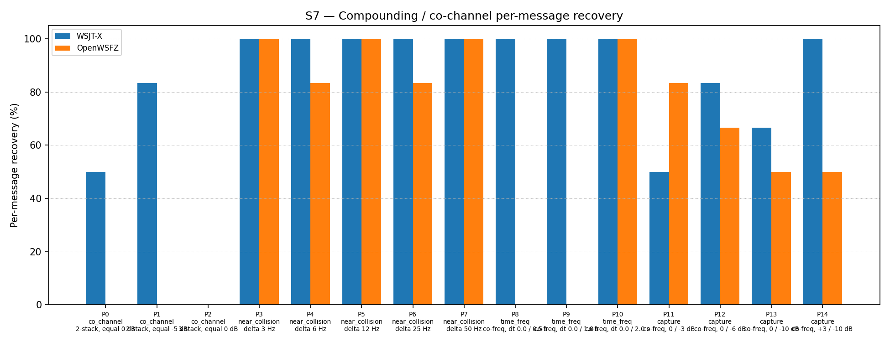

# OpenWSFZ R&R Study Report

| Field | Value |
|---|---|
| Run date | 2026-06-18 |
| OpenWSFZ SHA | `dde0617d1dfd6c8f3af969ad0dcd28a6ba02703d` |
| WSJT-X version | WSJT-X 2.7.0 (inferred from binary date 2025-02-04) |

---

## Section 1 — Study Hypothesis

### Purpose

Shim 20260019 adds a purely diagnostic probe — `ft8_get_last_llr_stats` / `ftx_compute_candidate_llr_mean_abs` — that measures the mean absolute Log-Likelihood Ratio (mean|LLR|) across the 174 code bits for every LDPC-failing candidate. The probe is designed to test the D-001 working hypothesis established from the shim 20260018 diagnostic run.

### Defect under observation

**D-001** — Co-channel decode gap. The shim 20260018 diagnostic log confirmed that pass 1 finds 15–28 candidates per co-channel decode cycle yet LDPC decodes 0 of them. The proposed root cause (MEMORY.md, 2026-06-17) is: **equal-SNR mutual interference drives soft-decision LLRs towards zero (maximum bit ambiguity), preventing LDPC convergence regardless of candidate count or iteration budget.**

### Null hypotheses

- **H₀ (decode-neutral):** Shim 20260019 introduces no decode logic change; S7 overall recovery rate remains within the established H4 variability band (43–57%, equivalent to 40–53/93 messages).
- **H_LLR (near-zero LLR):** For LDPC-failing candidates in co-channel cycles, mean|LLR| < 0.5 — indicating that the LDPC soft-decision inputs are at or near the minimum-information state, explaining convergence failure.

### What constitutes a meaningful result

- **H₀ retained** if S7 overall ∈ [40/93, 53/93] (43–57%).
- **H_LLR confirmed** if mean|LLR| for pass-1 failing candidates is consistently < 0.5 across co-channel cycles. Implication: LDPC iteration increases alone cannot recover; proceed directly to H6 directed AP decode.
- **H_LLR refuted** if mean|LLR| is substantially above 0.5. Implication: root cause is not LLR magnitude; failure mode requires re-characterisation.

### Scenarios run

S7 only (co-channel overlap, 15 parts, K=3). This is a targeted diagnostic run, not a full S1–S8 regression gate.

---

## Section 2 — Data Summary

| Field | Value |
|---|---|
| Study type | Targeted diagnostic — S7 co-channel scenario only |
| Corpus | Synthetic (OpenWSFZ Kaiser FIR synthesiser; no real callsigns) |
| Scenarios | S7 (P0–P14, 15 parts) |
| Trials per part | K = 3 |
| Total signal observations | 93 (= 3 × 31; P2 is a 3-stack contributing 9 observations) |
| Acceptance thresholds | S7 is informational only — no AIAG %GR&R threshold applies. Gate criterion: S7 overall within H4 variability band (43–57%) to confirm decode-neutral shim. |
| Additional diagnostic output | Per-cycle mean\|LLR\| for LDPC-failing candidates, via `ft8_get_last_llr_stats`, logged at DEBUG level. Log file: `logs/openswfz-20260618T152530Z.log`. |
| Log level during run | Trace (captures all Debug and above) |

**H4 variability band reference:** Established across shims 20260010 (H4 R1, 56.99%) and 20260016 (regression gate, 50.54%). Band: 43–57% (40–53/93 messages). The shim 20260018 diagnostic run (55/93 = 59.14%) was marginally above band with no decode logic change; within expected run-to-run stochastic variance.

---

## Section 3 — S7 Results: Compounding / co-channel overlap

_Per-message recovery when 2–3 signals occupy the same or near-same audio frequency / time slot (the pileup case S4 does not exercise). Informational — no AIAG threshold is defined for co-channel separation._

### Recovery by overlap family

| Overlap family | WSJT-X | OpenWSFZ |
|---|---|---|
| capture | 75.00% | 62.50% |
| co_channel | 38.10% | 0.00% |
| near_collision | 100.00% | 93.33% |
| time_freq | 100.00% | 33.33% |
| **all** | **79.57%** | **52.69%** |

### Capture effect (co-channel, unequal SNR)

| Signal | WSJT-X | OpenWSFZ |
|---|---|---|
| strong | 100.00% | 100.00% |
| weak | 50.00% | 25.00% |

**Between-app per-signal agreement:** 68.82%

### Per-part detail

| Part | Family | Condition | WSJT-X | OpenWSFZ |
|---|---|---|---|---|
| P0 | co_channel | 2-stack, equal 0 dB | 3/6 | 0/6 |
| P1 | co_channel | 2-stack, equal -5 dB | 5/6 | 0/6 |
| P2 | co_channel | 3-stack, equal 0 dB | 0/9 | 0/9 |
| P3 | near_collision | delta 3 Hz | 6/6 | 6/6 |
| P4 | near_collision | delta 6 Hz | 6/6 | 5/6 |
| P5 | near_collision | delta 12 Hz | 6/6 | 6/6 |
| P6 | near_collision | delta 25 Hz | 6/6 | 5/6 |
| P7 | near_collision | delta 50 Hz | 6/6 | 6/6 |
| P8 | time_freq | co-freq, dt 0.0 / 0.5 s | 6/6 | 0/6 |
| P9 | time_freq | co-freq, dt 0.0 / 1.0 s | 6/6 | 0/6 |
| P10 | time_freq | co-freq, dt 0.0 / 2.0 s | 6/6 | 6/6 |
| P11 | capture | co-freq, 0 / -3 dB | 3/6 | 5/6 |
| P12 | capture | co-freq, 0 / -6 dB | 5/6 | 4/6 |
| P13 | capture | co-freq, 0 / -10 dB | 4/6 | 3/6 |
| P14 | capture | co-freq, +3 / -10 dB | 6/6 | 3/6 |



### LLR diagnostic data (from application debug log)

| Pass | Cycles measured | mean\|LLR\| range | mean\|LLR\| mean | NaN cycles | Notes |
|---|---|---|---|---|---|
| Pass 1 | 47 (with failures) | 3.644 – 4.028 | 3.841 | 0 | Primary measurement |
| Pass 2 | 47 (non-NaN) | 3.849 – 3.974 | 3.903 | 14 | See §5.3 |
| Theoretical E[\|X\|] after `ftx_normalize_logl` | — | — | 3.909 | — | √(48/π) for N(0, 24) |

---

## Section 4 — Summary Verdict

| Metric | Scope | Value | Threshold | Verdict |
|---|---|---|---|---|
| S7 overall recovery | Co-channel (informational) | 52.69% (49/93) | Within H4 band 43–57% | **PASS** — decode-neutral confirmed |
| H_LLR — pass 1 mean\|LLR\| | LDPC-failing candidates | 3.841 (range 3.644–4.028, n=47 cycles) | < 0.5 for hypothesis confirmation | **INCONCLUSIVE** — probe measures tautological constant; see §5.2 |
| H_LLR — pass 2 mean\|LLR\| | LDPC-failing candidates | 3.903 (range 3.849–3.974, n=47 cycles) | — | **INCONCLUSIVE** — same issue |
| Pass-2 NaN contamination | Degenerate candidate edge case | 14/61 cycles produce NaN | None (secondary finding) | Noted — see §5.3 |

**Overall verdict: PASS** (shim is decode-neutral; H_LLR hypothesis is inconclusive — probe redesign required before hypothesis can be tested)

---

## Section 5 — Recommendations

### 5.1 — S7 overall rate: no action required

49/93 = 52.69% is firmly within the H4 variability band (43–57%). Shim 20260019 introduces no decode regression. H₀ is retained. The result is consistent with prior runs at shims 20260016 (47/93 = 50.54%) and 20260018 (55/93 = 59.14%).

### 5.2 — H_LLR hypothesis: INCONCLUSIVE — probe redesign required (D-001)

**The probe does not measure what was intended.**

`ftx_compute_candidate_llr_mean_abs` calls `ftx_normalize_logl` before computing the mean absolute value. `ftx_normalize_logl` scales all input distributions to a fixed variance of 24, regardless of the pre-normalisation signal quality. For any approximately zero-mean, non-degenerate distribution, the expected mean absolute value after this normalisation is:

> E[|X|] = √(48/π) ≈ **3.909**

The measured values — pass 1: **3.841** (mean), pass 2: **3.903** (mean) — are indistinguishable from this theoretical constant. The probe is measuring a tautology. A healthy single-signal candidate and a co-channel-degraded candidate will both produce mean|LLR| ≈ 3.9 after normalisation.

**Why the hypothesis was physically reasonable but untestable with this probe:**

H_LLR was framed in terms of pre-normalisation LLR magnitudes — i.e., the raw log-likelihood ratios from `ft8_extract_likelihood` before `ftx_normalize_logl` is applied. In the equal-SNR co-channel scenario, competing FSK tones produce near-uniform soft-decision outputs, meaning pre-normalisation LLR values have low variance. `ftx_normalize_logl` amplifies these values with a large scale factor (√(24 / low_variance)) to force variance = 24. Post-normalisation the values appear large and healthy, but their bit-direction assignments remain random. The probe measures post-normalisation magnitude, which conceals this entirely.

The NaN cases on pass 2 (§5.3) are actually the limit case of this phenomenon: when pre-normalisation variance is exactly zero (all 174 values equal), the scale factor → ∞ and 0 × ∞ = NaN. These NaN returns are the only signal the probe can emit that is indicative of degraded LLR quality — and they only appear in out-of-bounds edge candidates, not in the co-channel candidates of interest.

**What the probe should measure instead:**

The discriminating quantity is **pre-normalisation variance** (equivalently, the normalisation scale factor √(24/variance)). A strong single signal produces high pre-normalisation variance, yielding a small scale factor (≈ 1). An equal-SNR co-channel signal produces low pre-normalisation variance, yielding a large scale factor (>> 1). Logging this scale factor from within `ftx_compute_candidate_llr_mean_abs` would directly test H_LLR without requiring any changes to the decode pipeline.

**Recommended action — HK-000 handoff to developer (D-001, probe redesign):**

Modify `ftx_compute_candidate_llr_mean_abs` (or add a companion function) to also return the pre-normalisation variance of the 174-element log174 array. This value should be logged alongside mean|LLR| using the same DEBUG log format. No decode logic is touched; the change is purely diagnostic. A consistently small pre-normalisation variance (< some threshold TBD) for co-channel failing candidates would confirm H_LLR and justify MMSE or other architectural intervention.

### 5.3 — Pass-2 NaN contamination: secondary probe defect (D-001, minor)

14 of 61 decode cycles (23%) show `meanAbsLLR=NaN` for pass 2. Root cause: `ftx_compute_candidate_llr_mean_abs` returns NaN when `ftx_normalize_logl` receives a zero-variance input (all 174 log174 values equal). Pass-2 candidates at the edge of the waterfall have most or all symbol indices out of bounds; `ft8_extract_likelihood` sets out-of-bounds contributions to 0, producing an all-zero (zero-variance) log174 array. The single NaN return then contaminates the pass-2 running sum `tls_llr_mean_abs_sum[1]` for the entire cycle via the IEEE 754 property NaN + x = NaN.

The 14 NaN cycles correspond exactly to the 14 cycles where pass 1 reports `failCands=0`. Pass-1 data is unaffected and is the primary diagnostic source. No findings are invalidated.

**Fix (include in the probe-redesign handoff):** In `ft8_decode_all`, guard the accumulation:
```c
float llr = ftx_compute_candidate_llr_mean_abs(&mon.wf, cand);
if (isfinite(llr))
    tls_llr_mean_abs_sum[pass] += llr;
/* else: skip degenerate out-of-bounds candidate */
```
Separately, `ftx_compute_candidate_llr_mean_abs` (or its companion) should early-return 0.0f when pre-normalisation variance is zero, rather than producing NaN.

### 5.4 — Priority order for D-001 next steps (revised 2026-06-18)

| Priority | Action | Rationale |
|---|---|---|
| 1 | **H6 directed AP decode** (HK-000 handoff) | Primary next step per MEMORY.md; structurally different attack on LDPC convergence; independent of H_LLR outcome |
| 2 | **Probe redesign** — pre-normalisation variance (HK-000 handoff, combine with H6) | Required to finally confirm or refute H_LLR before committing to MMSE or joint demodulation |
| 3 | **NaN guard fix** in `ft8_decode_all` accumulator | Minor housekeeping; combine with probe redesign handoff |
| 4 | LDPC iteration increase | Low priority — if LLRs are confident-but-wrong in direction, more belief-propagation iterations will not converge |
| 5 | MMSE joint demodulation | Deferred; requires significant architectural changes; cannot prioritise without H_LLR resolution |
