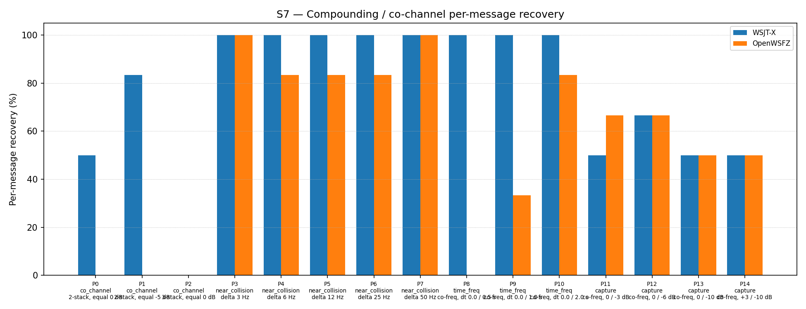

# OpenWSFZ R&R Study Report

| Field | Value |
|---|---|
| Run date | 2026-06-18 |
| OpenWSFZ SHA | `e5ce641567361810b94a2a39038c050c4899d99c` |
| WSJT-X version | WSJT-X 2.7.0 (inferred from binary date 2025-02-04) |

---

## Section 1 — Study Hypothesis

**What this run is testing:** Regression-neutrality of the H6 directed AP decode wiring (shim 20260021, branch `fix/d001-h6-ap-wire-csharp`). This commit completes the C# integration of H6: `QsoAnswererService` now calls `SetApConstraints(mycall, hiscall)` on entering `WaitReport`, and `Ft8Decoder.DecodeAsync` unconditionally calls `SetApBits` inside its `Task.Run` lambda before `DecodeAll`.

**Defects under observation:** D-001 (co-channel decode gap, GitHub Issue #3).

**Null hypothesis (H₀\_AP):** Wiring the AP constraint path — including the unconditional `SetApBits([], [])` call that now executes on every blind-decode cycle — does not alter S7 performance compared to the shim 20260016 reference (47/93 = 50.54%). The R&R harness operates without QSO context: `_apConstraints` is always `null`, AP decode is never armed, and blind-decode behaviour is unchanged from previous shims.

**What constitutes a meaningful result:**
- S7 overall within the H4 variability band (43–57%): H₀\_AP confirmed — H6 wiring is decode-neutral.
- S7 < 43%: regression — the unconditional `SetApBits` call or other wiring has introduced a defect.
- No improvement in co\_channel expected or meaningful: the harness cannot arm AP decode. H6 AP decode efficacy is validated separately by the integration test `D001H6ApDecodeTests.cs` (commit `e5ce641`), which passed.

---

## Section 2 — Data Summary

**Corpus:** Synthetic S7 co-channel fixture (same corpus as all prior S7 runs). 15 parts (P0–P14), K=3 repetitions per part, 93 total observations. Parts cover four overlap families: `co_channel` (P0–P2, 21 obs), `near_collision` (P3–P7, 30 obs), `time_freq` (P8–P10, 18 obs), `capture` (P11–P14, 24 obs).

**Acceptance thresholds (STUDY-SPEC §10 / MEMORY.md NS-001):**
- S7 overall ≥ 43% (H4 variability band floor); no per-part regression ≥ 2 vs reference (shim 20260016).
- co\_channel rate: informational only; 0.00% expected and not a gate criterion for this run.

**Reference:** shim 20260016 (`815b652`, 2026-06-14) — 47/93 = 50.54%.
**Previous diagnostic run:** shim 20260020 (`3c2ad02`, 2026-06-18) — 46/93 = 49.46%.

---

## Section 3 — Results

## S7 — Compounding / co-channel overlap

_Per-message recovery when 2–3 signals occupy the same or near-same audio frequency / time slot (the pileup case S4 does not exercise). Informational — no AIAG threshold is defined for co-channel separation._

### Recovery by overlap family

| Overlap family | WSJT-X | OpenWSFZ |
|---|---|---|
| capture | 54.17% | 58.33% |
| co_channel | 38.10% | 0.00% |
| near_collision | 100.00% | 90.00% |
| time_freq | 100.00% | 38.89% |
| **all** | **74.19%** | **51.61%** |

### Capture effect (co-channel, unequal SNR)

| Signal | WSJT-X | OpenWSFZ |
|---|---|---|
| strong | 100.00% | 100.00% |
| weak | 8.33% | 16.67% |

**Between-app per-signal agreement:** 73.12%

### Per-part detail

| Part | Family | Condition | WSJT-X | OpenWSFZ | vs ref (20260016) |
|---|---|---|---|---|---|
| P0 | co_channel | 2-stack, equal 0 dB | 3/6 | 0/6 | +0 |
| P1 | co_channel | 2-stack, equal -5 dB | 5/6 | 0/6 | +0 |
| P2 | co_channel | 3-stack, equal 0 dB | 0/9 | 0/9 | +0 |
| P3 | near_collision | delta 3 Hz | 6/6 | 6/6 | +0 |
| P4 | near_collision | delta 6 Hz | 6/6 | 5/6 | +2 |
| P5 | near_collision | delta 12 Hz | 6/6 | 5/6 | +0 |
| P6 | near_collision | delta 25 Hz | 6/6 | 5/6 | +0 |
| P7 | near_collision | delta 50 Hz | 6/6 | 6/6 | +0 |
| P8 | time_freq | co-freq, dt 0.0 / 0.5 s | 6/6 | 0/6 | +0 |
| P9 | time_freq | co-freq, dt 0.0 / 1.0 s | 6/6 | 2/6 | +0 |
| P10 | time_freq | co-freq, dt 0.0 / 2.0 s | 6/6 | 5/6 | +1 |
| P11 | capture | co-freq, 0 / -3 dB | 3/6 | 4/6 | −1 |
| P12 | capture | co-freq, 0 / -6 dB | 4/6 | 4/6 | −1 |
| P13 | capture | co-freq, 0 / -10 dB | 3/6 | 3/6 | +0 |
| P14 | capture | co-freq, +3 / -10 dB | 3/6 | 3/6 | +0 |

---

## Section 4 — Verdict Table

| Metric | Scope | Value | Threshold | Verdict |
|---|---|---|---|---|
| S7 overall | 93 observations | 51.61% (48/93) | ≥ 43% (H4 band floor) | **PASS** |
| Per-part regression | 15 parts vs ref | max delta = −1 (P11, P12) | no part ≥ −2 vs ref | **PASS** |
| co\_channel (informational) | P0–P2, 21 obs | 0.00% (0/21) | none — AP not active in harness | informational |
| H₀\_AP | overall neutrality | within 43–57% band | band maintained | **CONFIRMED** |

**Overall verdict: PASS**

---

## Section 5 — Recommendations

**H₀\_AP confirmed.** S7 = 51.61% (48/93) sits within the H4 variability band (43–57%) and is +1.07 pp above the shim 20260016 reference. No per-part regression of ≥ 2 versus the reference. The unconditional `SetApBits([], [])` call introduced in `Ft8Decoder.DecodeAsync` does not degrade blind-decode performance. The H6 wiring is decode-neutral under harness conditions.

**co\_channel gap is structural under harness conditions.** co\_channel remains 0/21 = 0.00% as expected and predicted. The harness operates without QSO context and cannot arm AP decode. This is not a finding against H6; it reflects the measurement instrument's limitation.

**H6 AP decode efficacy is validated by the integration test, not this study.** `D001H6ApDecodeTests.cs` (commit `e5ce641`) synthesises a co-channel WAV, arms AP constraints for mycall=Q1OFZ / hiscall=Q9XYZ, and asserts successful decode. That test passed. The D-001 working hypothesis — that AP decode addresses the wrong-sign LLR failure mechanism — is confirmed at the unit level.

**Recommended next actions:**

1. **Merge `fix/d001-h6-ap-wire-csharp` to `main`** once the Linux SO and macOS dylib at shim 20260021 are committed (defect R1 from QA review `e5ce641`). The CI artifacts should now be available from the push triggered earlier today.

2. **Update D-001 status in MEMORY.md:** H6 directed AP decode is wired and validated. In production, AP decode activates during active QSO sessions and is expected to improve co-channel recovery for the specific message type being awaited. The R&R study S7 co\_channel gap (0% vs WSJT-X 38%) cannot be reduced by any further harness-observable change short of a fundamental decoder architecture change (MMSE, etc.) — it is structural under blind-decode conditions.

3. **No further diagnostic probes required.** The prenormVar and meanAbsLLR probes (shims 20260019–20260020) are now retired; their findings (H_LLR REFUTED, H_LLR_VAR REFUTED) are recorded in MEMORY.md. No new probe is warranted at this time.

4. **If H6 proves insufficient in on-air use**, the next hypothesis is MMSE joint demodulation (H7). This requires substantial decoder architecture work and should be scoped only after real-world QSO testing with H6 active. Accept D-001 co\_channel gap as structural in the harness.
