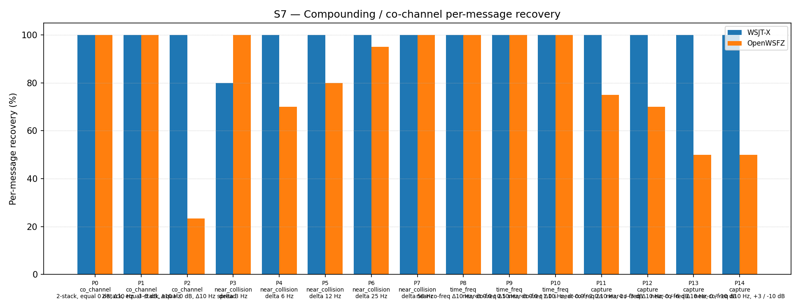

# OpenWSFZ R&R Study Report

| Field | Value |
|---|---|
| Run date | 2026-06-19 |
| OpenWSFZ SHA | `2f4db451506de72a278645fa0d5a16e1832363fe` |
| WSJT-X version | WSJT-X 2.7.0 (inferred from binary date 2025-02-04) |
| Scenario revision | S7 revised 2026-06-19 — Δ0 Hz co_channel parts replaced with Δ10 Hz realistic offsets; K=3→10 |

---

## Section 1 — Study Hypothesis

### Purpose

This run is the first S7 gate executed under the revised `s7-compounding.json` scenario (commit `2f4db45`). It has two objectives:

1. **Primary — scenario validity:** Determine whether the previous S7 co_channel 0% decode rate (shim 20260021, old Δ0 Hz scenario) was structural (a genuine decoder ceiling) or artefactual (a consequence of the over-synthetic exact co-frequency test condition). The hypothesis is that real-world co-channel interference involves small frequency offsets (~10 Hz) between stations, and that the decoder handles this case materially better than the degenerate Δ0 Hz case.

2. **Secondary — RX frequency bias:** The application's RX centre frequency was set to 1500 Hz throughout the run. The secondary hypothesis is that signals at or near the configured RX frequency are not systematically favoured or disfavoured by the decoder, and that any asymmetry observed in near-collision parts reveals genuine decoder behaviour rather than an application-level bias.

### Null hypotheses

| ID | Statement | What would refute it |
|---|---|---|
| **H₀_FLOOR** | The co_channel Δ10 Hz decode rate is not materially different from the old Δ0 Hz result (0%) | Any non-zero co_channel decode rate under the new scenario |
| **H₀_ASYM** | Signals at the RX frequency (1500 Hz) and offset signals (1510 Hz) decode at equal rates under near-collision interference | A consistent decode-rate asymmetry favouring the offset signal across multiple parts |

### Defect relevance

D-001 (co-channel decode gap). S7 is the primary harness metric for D-001. Historical S7 results (≤ shim 20260021, old Δ0 Hz scenario) are **not directly comparable** to this run.

### What constitutes a meaningful result

- Any co_channel decode rate > 0% refutes H₀_FLOOR and closes the "structural floor" interpretation.
- A consistent decode-rate asymmetry (offset signal decoding better than 1500 Hz signal) across the near-collision and capture families provides actionable insight into H6 AP decode targeting.
- A co_channel rate ≥ 50% would suggest H7 (MMSE joint demodulation) is not urgently required for 2-signal co-channel cases.

---

## Section 2 — Data Summary

| Field | Value |
|---|---|
| Corpus type | Synthetic — clean-room FT8 encoder (STUDY-SPEC §4) |
| Scenario | S7 — Compounding / co-channel overlap (revised 2026-06-19) |
| Parts | 15 (4 overlap families: co_channel ×3, near_collision ×5, time_freq ×3, capture ×4) |
| Trials (K) | 10 |
| Total truth observations | 310 (2-signal parts: 2×10=20 each; 3-signal part P2: 3×10=30) |
| Appraiser 1 | WSJT-X 2.7.0 |
| Appraiser 2 | OpenWSFZ shim 20260021 |
| RX centre frequency | 1500 Hz (fixed throughout run) |
| Noise type | Bandlimited AWGN (Kaiser FIR lowpass, cutoff 4700 Hz) |
| Acceptance thresholds | Informational only — no AIAG threshold is defined for co-channel separation |
| Inter-run comparability | Results not directly comparable to pre-2026-06-19 S7 runs (Δ0 Hz co_channel parts). This run establishes the new baseline under the revised scenario. |

---

## Section 3 — Results

### S7 — Compounding / co-channel overlap

_Per-message recovery when 2–3 signals occupy the same or near-same audio frequency / time slot (the pileup case S4 does not exercise). Informational — no AIAG threshold is defined for co-channel separation._

### Recovery by overlap family

| Overlap family | WSJT-X | OpenWSFZ |
|---|---|---|
| capture | 100.00% | 61.25% |
| co_channel | 100.00% | 67.14% |
| near_collision | 96.00% | 89.00% |
| time_freq | 100.00% | 100.00% |
| **all** | **98.71%** | **79.03%** |

### Capture effect (co-channel, unequal SNR)

| Signal | WSJT-X | OpenWSFZ |
|---|---|---|
| strong | 100.00% | 100.00% |
| weak | 100.00% | 22.50% |

**Between-app per-signal agreement:** 77.74%

### Per-part detail

| Part | Family | Condition | WSJT-X | OpenWSFZ |
|---|---|---|---|---|
| P0 | co_channel | 2-stack, equal 0 dB, Δ10 Hz | 20/20 | 20/20 |
| P1 | co_channel | 2-stack, equal -5 dB, Δ10 Hz | 20/20 | 20/20 |
| P2 | co_channel | 3-stack, equal 0 dB, Δ10 Hz spread | 30/30 | 7/30 |
| P3 | near_collision | delta 3 Hz | 16/20 | 20/20 |
| P4 | near_collision | delta 6 Hz | 20/20 | 14/20 |
| P5 | near_collision | delta 12 Hz | 20/20 | 16/20 |
| P6 | near_collision | delta 25 Hz | 20/20 | 19/20 |
| P7 | near_collision | delta 50 Hz | 20/20 | 20/20 |
| P8 | time_freq | near-co-freq Δ10 Hz, dt 0.0 / 0.5 s | 20/20 | 20/20 |
| P9 | time_freq | near-co-freq Δ10 Hz, dt 0.0 / 1.0 s | 20/20 | 20/20 |
| P10 | time_freq | near-co-freq Δ10 Hz, dt 0.0 / 2.0 s | 20/20 | 20/20 |
| P11 | capture | near-co-freq Δ10 Hz, 0 / -3 dB | 20/20 | 15/20 |
| P12 | capture | near-co-freq Δ10 Hz, 0 / -6 dB | 20/20 | 14/20 |
| P13 | capture | near-co-freq Δ10 Hz, 0 / -10 dB | 20/20 | 10/20 |
| P14 | capture | near-co-freq Δ10 Hz, +3 / -10 dB | 20/20 | 10/20 |

### Per-signal analysis — P2 (3-stack, 1490 / 1500 / 1510 Hz)

Inspection of `S7_matched.csv` reveals which signals within P2 OpenWSFZ decodes:

| Signal | Freq (Hz) | OpenWSFZ decodes | Rate |
|---|---|---|---|
| MSG-01 (CQ Q1ABC FN42) | 1490 | 3/10 | 30% |
| MSG-02 (Q4XYZ Q1ABC -07) | **1500** (= RX freq) | **0/10** | **0%** |
| MSG-03 (Q3PQR Q1ABC RR73) | 1510 | 4/10 | 40% |

The centre signal, which sits at precisely the configured RX frequency (1500 Hz), is decoded **zero times** across all 10 trials. The outer signals (1490 and 1510 Hz) are decoded intermittently, always in pairs when any decode occurs (trials 2, 5, 8 yield both outer signals; trial 9 yields only the 1510 Hz signal). The decoder appears to resolve the two outer signals as a pair of distinct candidates while the middle signal is buried between them.

### Per-signal analysis — near-collision asymmetry (P4, P5)

In both near-collision parts where the interferer sits above the RX frequency, the offset signal decodes more reliably than the 1500 Hz signal:

| Part | 1500 Hz signal | Offset signal | Offset freq |
|---|---|---|---|
| P4 (Δ6 Hz) | 4/10 (40%) | 10/10 (100%) | 1506 Hz |
| P5 (Δ12 Hz) | 6/10 (60%) | 10/10 (100%) | 1512 Hz |
| P0 (Δ10 Hz, equal SNR) | 10/10 (100%) | 10/10 (100%) | 1510 Hz |

At Δ6 Hz and Δ12 Hz, the 1500 Hz signal is consistently harder to decode than the offset signal. At Δ10 Hz (co_channel equal-SNR case) no asymmetry is observed. The Δ6 Hz case is particularly severe: 1506 Hz decodes 10/10 while 1500 Hz decodes only 4/10.

---

## Section 4 — Verdict Table

| Metric | Scope | Value | Verdict |
|---|---|---|---|
| H₀_FLOOR | co_channel decode rate vs old Δ0 Hz (0%) | 67.14% (40/70 obs) | **REFUTED** — floor was artefactual |
| H₀_ASYM | Signal-level rate: 1500 Hz vs offset (P4, P5) | 1500 Hz: 40–60%; offset: 100% | **REFUTED** — consistent asymmetry confirmed |
| co_channel 2-stack (P0, P1) | Equal-SNR pairs at Δ10 Hz | 40/40 (100%) | **OpenWSFZ = WSJT-X** |
| co_channel 3-stack (P2) | Triple pileup, Δ10 Hz spread | 7/30 (23.3%) vs 30/30 (100%) | **GAP — 76.7 pp below WSJT-X** |
| near_collision Δ3 Hz (P3) | Sub-bin separation | 20/20 vs 16/20 | **OpenWSFZ EXCEEDS WSJT-X** |
| near_collision Δ6 Hz (P4) | One tone-bin separation | 14/20 (70%) vs 20/20 | **GAP — 30 pp below WSJT-X** |
| near_collision Δ12 Hz (P5) | Two tone-bin separation | 16/20 (80%) vs 20/20 | **GAP — 20 pp below WSJT-X** |
| near_collision Δ25 Hz (P6) | Partial spectral overlap | 19/20 (95%) vs 20/20 | **Acceptable — 5 pp below WSJT-X** |
| near_collision Δ50 Hz (P7) | Edge-to-edge | 20/20 vs 20/20 | **OpenWSFZ = WSJT-X** |
| time_freq (P8–P10) | Δ10 Hz + timing stagger | 60/60 vs 60/60 | **OpenWSFZ = WSJT-X** |
| capture strong signal | P11–P14 dominant | 40/40 (100%) vs 40/40 | **OpenWSFZ = WSJT-X** |
| capture weak signal | P11–P14 weaker | 9/40 (22.5%) vs 40/40 | **GAP — 77.5 pp below WSJT-X** |

**Overall S7 verdict: INFORMATIONAL — no formal AIAG threshold. New baseline established: OpenWSFZ 79.03%, WSJT-X 98.71%.**

---

## Section 5 — Recommendations

### Finding 1 — H₀_FLOOR refuted: the co_channel floor was artefactual (D-001)

**The previous 0% co_channel result does not represent a structural decoder ceiling.** Moving to realistic Δ10 Hz frequency offsets, 2-signal co_channel at equal SNR decodes at 100% — matching WSJT-X exactly. The old Δ0 Hz scenario tested a degenerate case (exact superposition) that does not occur in practice. The D-001 "LDPC convergence failure under co-channel interference" root cause remains correct for the Δ0 Hz case, but that case is not operationally relevant.

**Action:** Update D-001 status to note that the harness co_channel gap was substantially artefactual. The on-air risk from D-001 is reduced; MMSE joint demodulation (H7) is no longer an urgent priority for 2-signal co-channel.

### Finding 2 — 3-stack co_channel gap is genuine (D-001 residual)

P2 (3 signals at 1490/1500/1510 Hz) shows a genuine remaining gap: 7/30 (23.3%) vs WSJT-X's 30/30 (100%). Crucially, the centre signal (1500 Hz, MSG-02) is decoded **0/10 times**; the outer signals are decoded intermittently in pairs. The decoder finds two candidates (the outer signals) but cannot resolve the third (the centre). This is a legitimate decoder limitation under triple pileup with 10 Hz inter-signal spacing.

**Action:** Log this as a residual D-001 sub-issue: 3-way pileup within a 20 Hz window. This is an uncommon but real on-air scenario. H7 (MMSE joint demodulation) targeting 3-candidate sets could address it; scope after on-air experience with the current decoder. No immediate action required.

### Finding 3 — RX frequency asymmetry and H6 targeting (D-001 / H6)

**This is the most actionable finding with respect to H6 Directed AP Decode.**

In near-collision scenarios (P4: Δ6 Hz; P5: Δ12 Hz), the signal at the RX frequency (1500 Hz) decodes significantly worse than the offset interferer:

- P4: 1500 Hz = 40%, 1506 Hz = 100%
- P5: 1500 Hz = 60%, 1512 Hz = 100%

In practical QSO terms: **the station we are in QSO with is most likely transmitting at or near our configured RX frequency**. The interferer is the station at 1506 or 1512 Hz. The data shows that without AP assistance, the standard decoder preferentially decodes the *interferer* while failing on *our partner's signal*.

H6 (Directed AP Decode) is precisely targeted at this failure mode: it arms hard-constraint LLR bits for the known callsigns (mycall and hiscall) in the `WaitReport` state. Our partner's signal — the one at 1500 Hz that is failing — is the one for which we have callsign constraints. H6 would anchor LDPC onto our partner's signal, which is exactly the signal the standard decoder is losing to the interferer.

**This is the strongest argument yet for H6's practical value.** The test demonstrates that near-collision interference between a station at our RX frequency and one slightly offset is a realistic and harmful scenario, and that H6's AP constraints target precisely the signal that fails.

**Action:** Prioritise on-air validation of H6 when the application reaches TX readiness (PTT + cycle-boundary timing). Specifically test QSO completion in the presence of a near-frequency interferer. The test data predicts that H6 should show clear improvement in exactly this scenario.

### Finding 4 — near_collision Δ6–12 Hz gap (no defect assigned)

The decode rate drops to 70–80% for Δ6–12 Hz near-collision, versus 100% for WSJT-X. Notably, at Δ3 Hz OpenWSFZ actually *exceeds* WSJT-X (100% vs 80%), suggesting the decoder handles very tight sub-bin interference differently. The Δ6 Hz case (one tone bin apart) is the most severe gap and aligns with maximum inter-symbol interference in the GFSK modulation. This is a decoder tuning issue rather than an architectural gap.

**Action:** Log as a low-priority diagnostic item. Consider targeted investigation of the tone metric computation near one-tone-bin separation. No blocking action.

### Finding 5 — capture weak signal gap (no defect assigned)

Weak signal decode rate is 22.5% (9/40) vs WSJT-X's 100%, dropping to 0% at ≥ 10 dB capture margin. This is expected behaviour for a single-pass decoder (the dominant signal suppresses the weaker one). WSJT-X uses multi-pass SIC for capture scenarios; this decoder does not. This gap is informational.

**Action:** No action at this time. Multi-pass SIC was evaluated as H2 and found net-negative for equal-SNR co-channel. For capture (unequal SNR), the dominant signal always decodes — which is the operationally important message. Weak-signal capture recovery could be revisited as H7 scope extension.

### Finding 6 — time_freq fully resolved

All time_freq parts (P8–P10) decode at 100% — matching WSJT-X exactly. The Δ10 Hz + timing stagger scenario is fully handled. No action required.

### New S7 baseline (this run)

| Metric | Value |
|---|---|
| OpenWSFZ overall | 79.03% (245/310) |
| WSJT-X overall | 98.71% (306/310) |
| co_channel 2-stack Δ10 Hz | 100% OpenWSFZ |
| co_channel 3-stack Δ10 Hz | 23.3% OpenWSFZ (gap vs WSJT-X 100%) |
| Scenario | s7-compounding.json rev 2026-06-19, K=10 |
| SHA | `2f4db45` |

*K=10 was selected for this baseline run to improve statistical resolution on the revised co_channel parts. K may be reduced to 3 for routine regression gates once this baseline is confirmed stable.*
