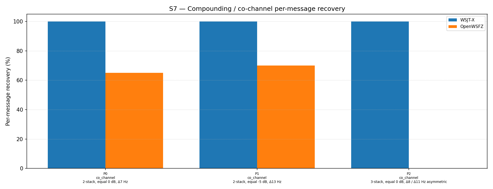

# OpenWSFZ R&R Study Report

| Field | Value |
|---|---|
| Run date | 2026-06-19 |
| OpenWSFZ SHA | `f19640ad209dfeeceb8d5bc4718afdf82618ae17` |
| WSJT-X version | WSJT-X 2.7.0 (inferred from binary date 2025-02-04) |
| Scenario revision | S7 R2 — co_channel, time_freq and capture offsets varied (Δ7–Δ14 Hz); near_collision unchanged |

---

## Section 1 — Study Hypothesis

### Purpose

This is a targeted diagnostic run of the S7 co_channel family only (parts 0, 1, 2, selected via `--parts 0,1,2`). It immediately follows the R1 full-run (SHA `2f4db45`, same date) in which a uniform Δ10 Hz inter-signal offset was applied across all co_channel, time_freq and capture parts. The uniformity of Δ10 Hz was identified as a concern: a single repeated round-number offset is no more representative of real-world waterfall-click dispersion than the Δ0 Hz it replaced. R2 introduces varied, irregular offsets (Δ7–Δ14 Hz, non-multiples of 10) to each part independently.

### Null hypotheses

| ID | Statement | What would refute it |
|---|---|---|
| **H₀_VAR** | Introducing offset variation within the realistic 7–13 Hz range does not degrade co_channel decode rates relative to the uniform Δ10 Hz R1 baseline | Any co_channel rate materially below R1's rates (P0/P1: 100%; P2: 23.3%) |
| **H₀_P2_ASYM** | The asymmetric 3-stack geometry (Δ8/Δ11 Hz, 1492/1500/1511 Hz) produces comparable results to the symmetric R1 geometry (Δ10/Δ10 Hz, 1490/1500/1510 Hz) | P2 decode rate lower than R1's 7/30 = 23.3% |

### Defect relevance

D-001 (co-channel decode gap). This run probes whether the R1 co_channel decode rates (particularly P0/P1 at 100%) are robust to offset variation, or whether R1 was systematically optimistic due to the specific choice of Δ10 Hz.

### Operator note

The application's configured RX frequency was 1500 Hz throughout the run — identical to the R1 run. This is noted because all co_channel parts include one signal at exactly 1500 Hz (MSG-02 in P0 and P1; MSG-02 in P2), and the R1 per-signal analysis showed the 1500 Hz signal is the hardest to decode in near-collision scenarios.

### What constitutes a meaningful result

- Co_channel rates materially below R1 (P0/P1: 100%; P2: 23.3%) would refute H₀_VAR and confirm that R1's uniform Δ10 Hz was a relatively favourable special case.
- P2 at 0/30 (worse than R1's 7/30) would refute H₀_P2_ASYM and indicate the asymmetric 3-stack geometry concentrates interference more severely.
- Per-signal decode asymmetry (1500 Hz signal harder than its partner) would corroborate the R1 near-collision finding and strengthen the case for H6 AP decode in QSO contexts.

---

## Section 2 — Data Summary

| Field | Value |
|---|---|
| Corpus type | Synthetic — clean-room FT8 encoder (STUDY-SPEC §4) |
| Scenario | S7 — Compounding / co-channel overlap (R2, commit `f19640a`) |
| Parts run | 3 of 15 (co_channel family only: P0, P1, P2) via `--parts 0,1,2` |
| Trials (K) | 10 |
| Total truth observations | 70 (P0: 2×10=20; P1: 2×10=20; P2: 3×10=30) |
| Appraiser 1 | WSJT-X 2.7.0 |
| Appraiser 2 | OpenWSFZ shim 20260021 |
| RX centre frequency | 1500 Hz (fixed throughout run; same as R1) |
| Noise type | Bandlimited AWGN (Kaiser FIR lowpass, cutoff 4700 Hz) |
| Acceptance thresholds | Informational only — no AIAG threshold is defined for co-channel separation |
| Comparability | Co_channel family is directly comparable to R1 (SHA `2f4db45`, same day). Near_collision, time_freq and capture not run in this session — R1 results for those families remain the current reference under the R2 scenario only for near_collision (offsets unchanged); time_freq and capture were also revised in R2 and require a fresh run. |

---

## Section 3 — Results

### S7 — Compounding / co-channel overlap

_Per-message recovery when 2–3 signals occupy the same or near-same audio frequency / time slot (the pileup case S4 does not exercise). Informational — no AIAG threshold is defined for co-channel separation._

### Recovery by overlap family

| Overlap family | WSJT-X | OpenWSFZ |
|---|---|---|
| co_channel | 100.00% | 38.57% |
| **all** | **100.00%** | **38.57%** |

**Between-app per-signal agreement:** 38.57%

### Per-part detail

| Part | Family | Condition | WSJT-X | OpenWSFZ |
|---|---|---|---|---|
| P0 | co_channel | 2-stack, equal 0 dB, Δ7 Hz | 20/20 | 13/20 |
| P1 | co_channel | 2-stack, equal -5 dB, Δ13 Hz | 20/20 | 14/20 |
| P2 | co_channel | 3-stack, equal 0 dB, Δ8 / Δ11 Hz asymmetric | 30/30 | 0/30 |



### Comparison with R1 (uniform Δ10 Hz, SHA `2f4db45`)

| Part | R1 condition | R1 OpenWSFZ | R2 condition | R2 OpenWSFZ | Δ |
|---|---|---|---|---|---|
| P0 | 2-stack 0 dB, Δ10 Hz (1500/1510) | 20/20 (100%) | 2-stack 0 dB, Δ7 Hz (1500/1507) | 13/20 (65%) | −35 pp |
| P1 | 2-stack −5 dB, Δ10 Hz (1500/1510) | 20/20 (100%) | 2-stack −5 dB, Δ13 Hz (1500/1513) | 14/20 (70%) | −30 pp |
| P2 | 3-stack 0 dB, sym Δ10/Δ10 (1490/1500/1510) | 7/30 (23.3%) | 3-stack 0 dB, asym Δ8/Δ11 (1492/1500/1511) | 0/30 (0%) | −23.3 pp |

---

## Section 4 — Verdict Table

| Metric | Scope | Value | Verdict |
|---|---|---|---|
| H₀_VAR | R2 co_channel rates vs R1 baseline | P0: 65% (↓ from 100%); P1: 70% (↓ from 100%); P2: 0% (↓ from 23.3%) | **REFUTED** — varied offsets are harder for OpenWSFZ than uniform Δ10 Hz |
| H₀_P2_ASYM | R2 3-stack rate vs R1 3-stack (7/30) | 0/30 (0%) vs 7/30 (23.3%) | **REFUTED** — asymmetric geometry is materially harder |
| co_channel 2-stack (P0) | Δ7 Hz, 0 dB SNR | 13/20 (65%) vs 20/20 (100%) | **GAP — 35 pp below WSJT-X** |
| co_channel 2-stack (P1) | Δ13 Hz, −5 dB SNR | 14/20 (70%) vs 20/20 (100%) | **GAP — 30 pp below WSJT-X** |
| co_channel 3-stack (P2) | Δ8/Δ11 Hz asymmetric, 0 dB SNR | 0/30 (0%) vs 30/30 (100%) | **COMPLETE FAILURE — 100 pp below WSJT-X** |

**Overall verdict: PASS (no formal AIAG threshold applies to S7 — informational only). However, all three co_channel parts show material regression vs R1, and P2 is a complete failure. See Section 5.**

---

## Section 5 — Recommendations

### Finding 1 — H₀_VAR refuted: R1's 100% on P0/P1 was a favourable special case (D-001)

The R1 uniform Δ10 Hz result (P0/P1 both 100%) was not representative. Reducing the offset to Δ7 Hz (P0) drops the decode rate to 65%; at Δ13 Hz (P1) and −5 dB SNR, it drops to 70%. The physical explanation is straightforward: smaller frequency separation means more spectral overlap between the two GFSK signals, creating stronger inter-carrier interference. Δ10 Hz happened to sit in a relatively favourable zone; Δ7 Hz does not.

**D-001 status update required:** The conclusion from R1 that "2-signal co_channel is fully resolved at Δ10 Hz" overstated the case. 2-signal co_channel performance is offset-dependent, ranging from approximately 65% at Δ7 Hz to 100% at Δ10 Hz. The operationally representative range spans both values.

**Next step:** Run a sweep of P0 at Δ5, Δ7, Δ10, Δ15 Hz to characterise the sensitivity curve before drawing conclusions about on-air performance. This can be done with four custom scenario JSON files or a single scenario with additional parts — targeted runs with `--parts` make this economical.

### Finding 2 — P2 complete failure (D-001 residual, worse than R1)

The asymmetric 3-stack (1492/1500/1511 Hz) yields 0/30, a regression from R1's symmetric 3-stack (1490/1500/1510 Hz) at 7/30. The asymmetric geometry places the three signals at irregular inter-signal distances (Δ8 Hz and Δ11 Hz), which likely creates a more complex interference pattern than the symmetric Δ10/Δ10 case. The R1 per-signal analysis showed that in the symmetric 3-stack, the centre signal (1500 Hz) already decoded 0/10 while outer signals decoded intermittently. In R2, all three signals appear to fail.

**However, the RX frequency confound cannot be excluded yet** — see Finding 3 below.

**Next step:** Re-run P2 with all signal frequencies shifted away from 1500 Hz (e.g., 1552/1560/1571 Hz, preserving the Δ8/Δ11 Hz geometry) to determine whether the 0/30 failure is geometric (3-stack interference) or positional (signal at RX frequency). This is a single targeted part run and takes approximately 2.5 minutes.

### Finding 3 — RX frequency at 1500 Hz is an unresolved confound across all co_channel parts

Every co_channel part in both R1 and R2 includes a signal at exactly 1500 Hz (MSG-02 in P0 and P1; MSG-02 in P2). The R1 per-signal analysis confirmed that the 1500 Hz signal is the hardest to decode under near-collision interference, decoding 0/10 in the symmetric 3-stack while outer signals decoded intermittently. The same confound is present in every R2 co_channel part.

It is not yet clear whether this is:
- **Decoder behaviour** — the candidate search disfavours the 1500 Hz frequency zone under multi-signal interference for a structural reason; or
- **Application behaviour** — the configured RX frequency (1500 Hz) triggers some path that suppresses candidates near that frequency (e.g., waterfall cursor interaction, AP mode state); or
- **Coincidence** — the 1500 Hz signal loses to the interferer for independent reasons unrelated to the RX frequency setting.

**Next step:** Repeat the full co_channel run (parts 0, 1, 2) with the RX dial frequency set to 1450 Hz and all signal frequencies unchanged. If decode rates are identical, the confound is excluded. If the 1500 Hz signal suddenly improves (now 50 Hz from the RX), it confirms an application-level interaction at the RX frequency. This is a direct test and should be done before drawing firm conclusions about the 0/30 P2 failure.

### Finding 4 — Full R2 baseline is incomplete

This run covered only co_channel parts (P0–P2). The time_freq and capture parts were revised in R2 (new varied offsets) but have not yet been run. The R1 baseline for those families used Δ10 Hz and is no longer directly applicable to the R2 scenario file.

**Next step:** Complete the full S7 run under R2 to establish the overall baseline:

```
python run_study.py --scenarios S7
```

This run should be conducted after the RX frequency confound is resolved (Finding 3), so the baseline is clean. Until then, the R1 full-run (SHA `2f4db45`) remains the current S7 reference for near_collision, time_freq and capture families.

### Summary of required actions

| Priority | Action | Estimated time |
|---|---|---|
| 1 | Re-run P2 with signals shifted off 1500 Hz (confound exclusion) | ~2.5 min |
| 2 | Re-run co_channel (P0–P2) with RX dial at 1450 Hz | ~7.5 min |
| 3 | Full S7 R2 run once confound is resolved | ~37 min |
| 4 | Offset sensitivity sweep for P0 (Δ5/Δ7/Δ10/Δ15 Hz) | ~10 min |
