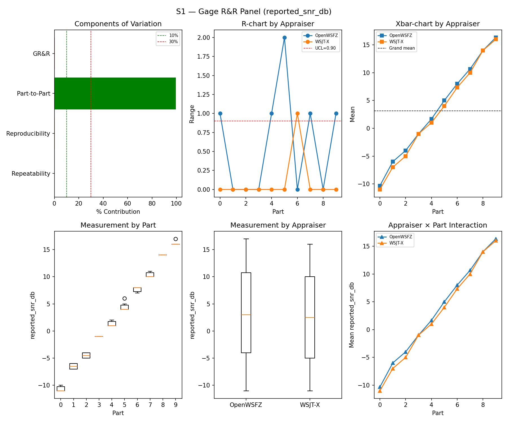
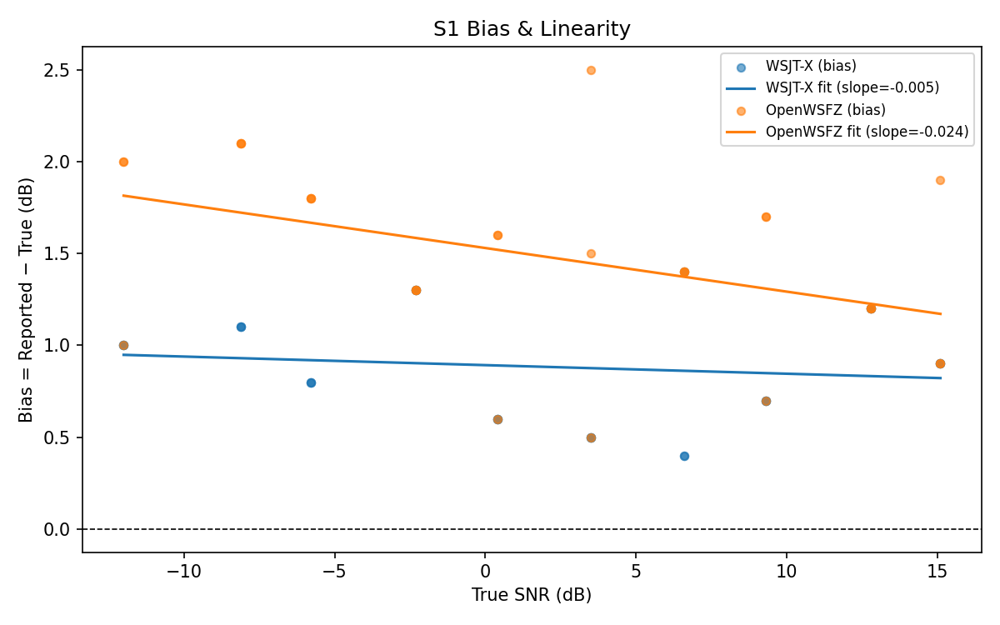
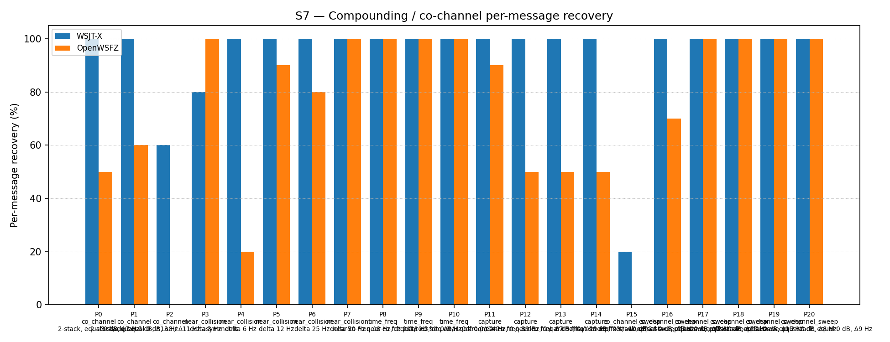
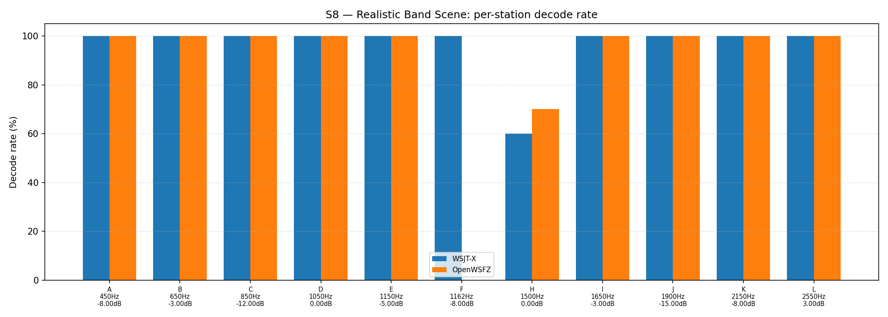

# OpenWSFZ R&R Study Report — Full S1–S8 Regression Gate (post-OSD, K=5)

| Field | Value |
|---|---|
| Run date | 2026-06-20 |
| OpenWSFZ SHA | `6e821fa37e6f86be15e2e5079d5155ca3ad9f6ab` |
| Shim version | 20260025 (OSD fallback + 50-iter BP) |
| WSJT-X version | WSJT-X 2.7.0 (inferred from binary date 2025-02-04) |

---

## Section 1 — Study Hypothesis

**This is the first complete S1–S8 gate run since the OSD fallback was merged to `main`.**
Two changes landed on `main` since the previous gate run (`815b652`, 2026-06-14, shim 20260016):

1. `1809ce7` — OSD fallback + 50-iter BP (D-001, shim 20260025, `fix/d001-osd-fallback`):
   when `bp_decode` fails to converge, `osd_decode(llr_for_osd, ndeep=2)` is invoked,
   exploring up to 529 trial codewords.  S7 improved from 51.61% → 80.22% at this shim in
   the dedicated diagnostic run (`2026-06-20-d70aad5`).
2. `6e821fa` — S7 K reduction K=10 → K=5 (harness change only, `chore/s7-reduce-k`): reduces
   routine gate duration to ~33 min.  No production code change.

**Primary question:** Does the OSD introduction regress any gated metric outside S7?

**Null hypotheses under observation:**

- **H₀_FP:** OSD does not raise the S5 false-positive rate above the 6.0% threshold.
  Rejection criterion: S5 FP rate (OpenWSFZ) > 6.0%.
  _Basis:_ OSD explores a wider solution space; pure-noise inputs may satisfy LDPC+CRC by
  chance when 529 candidates are evaluated per cycle.

- **H₀_S1:** The SNR measurement GR&R is not degraded by OSD.
  Rejection criterion: %GR&R (S1) ≥ 10% or ndc < 5.

**What constitutes a meaningful result:**

- **Both H₀ NOT REJECTED (PASS):** All gated metrics within threshold — OSD introduction is
  clean for V1.
- **H₀_FP REJECTED (FAIL):** S5 FP rate > 6% — OSD is producing false decodes from noise;
  a post-decode filter or tighter OSD confidence threshold is required before shipping.

**Defect IDs under observation:** D-001 (informational — S7 now at 80.22% from dedicated run).
**Active gate metrics:** S1 %GR&R, S1 ndc, S5 FP rate (OpenWSFZ and WSJT-X), S1 bias.

---

## Section 2 — Data Summary

**Scenarios:** Full S1–S8 suite.

**Corpus description:**
- Synthetic (no off-air signals): all injected signals generated by the clean-room synthesiser.
- S1: 5 parts × 3 trials × 2 appraisers = 30 matched rows.
- S2/S3: same balanced design.
- S4/S5 (attribute): 5 parts / 4 parts × 3 trials.
- S7: K=5 trials, 21 parts (co_channel P0–P2, near_collision P3–P7, time_freq P8–P10,
  capture P11–P14, co_channel_sweep P15–P20).
- S8: 12 stations × 5 trials.

**Acceptance thresholds (STUDY-SPEC §10):**

| Metric | Threshold | Gate? |
|---|---|---|
| S1 %GR&R | < 10% = PASS; 10–30% = MARGINAL; ≥ 30% = FAIL | ✅ Gated |
| S1 ndc | ≥ 5 = PASS; 2–4 = MARGINAL; < 2 = FAIL | ✅ Gated |
| S5 FP rate | ≤ 6.0% = PASS; > 6.0% = FAIL | ✅ Gated |
| S1 SNR bias | ≤ ±2.0 dB = PASS; > ±2.0 dB = FAIL | ✅ Gated |
| S4/S5 κ | ≥ 0.90 PASS; ≥ 0.70 MARGINAL (advisory, not gated) | ⚠️ Advisory |
| S7 overall | No threshold — informational | ℹ️ Informational |
| S8 overall | No threshold — informational | ℹ️ Informational |

**Cycle window:** 2026-06-20T10:36:30Z – 2026-06-20T11:39:30Z (full run, ~63 min).

---

## Section 3 — Results

## S1 — reported_snr_db

### Variance Components

| Component | σ² | %Contribution |
|---|---|---|
| Repeatability | 0.13 | 0.17% |
| Reproducibility | 0.20 | 0.25% |
| Part-to-Part | 80.41 | 99.59% |
| Total GR&R | 0.33 | 0.41% |
| Total | 80.75 | 100.00% |

### Study Metrics

| Metric | Value | Verdict |
|---|---|---|
| %Tolerance (GR&R) | 34.64% | PASS |
| %Study Var (GR&R) | 6.43% | — |
| ndc | 21 | PASS |

### Bias & Linearity (S1)

| Appraiser | Mean Bias (dB) | Slope | Intercept | R² | Verdict |
|---|---|---|---|---|---|
| WSJT-X | +0.88 | -0.005 | 0.892 | 0.019 | PASS |
| OpenWSFZ | +1.48 | -0.024 | 1.530 | 0.181 | PASS |

## S2 — reported_freq_hz

### Variance Components

| Component | σ² | %Contribution |
|---|---|---|
| Repeatability | 0.00 | 0.00% |
| Reproducibility | 0.60 | 0.00% |
| Part-to-Part | 652741.87 | 100.00% |
| Total GR&R | 0.60 | 0.00% |
| Total | 652742.47 | 100.00% |

### Study Metrics

| Metric | Value | Verdict |
|---|---|---|
| %Tolerance (GR&R) | 58.09% | PASS |
| %Study Var (GR&R) | 0.10% | — |
| ndc | 1470 | PASS |

## S3 — reported_dt_s

### Variance Components

| Component | σ² | %Contribution |
|---|---|---|
| Repeatability | 0.02 | 2.90% |
| Reproducibility | 0.00 | 0.08% |
| Part-to-Part | 0.77 | 97.03% |
| Total GR&R | 0.02 | 2.97% |
| Total | 0.79 | 100.00% |

### Study Metrics

| Metric | Value | Verdict |
|---|---|---|
| %Tolerance (GR&R) | 230.53% | PASS |
| %Study Var (GR&R) | 17.24% | — |
| ndc | 8 | PASS |

> **WSJT-X DT correction applied.** A +0.55 s offset was added to WSJT-X `reported_dt_s` before ANOVA to remove the ≈ −0.55 s convention difference between WSJT-X (DT relative to nominal FT8 TX start) and the harness (DT relative to UTC slot boundary). This correction removes the calibration artefact from SS_appraiser so %GR&R measures genuine app-to-app measurement disagreement. Raw reported values are preserved in the matched CSV. See scenario `wsjt_dt_correction_s` field and R&R-003 (GitHub #1).

## S1b — Low-SNR threshold study

_Decode rate (% of injected messages recovered) at SNRs excluded from the redesigned S1 ladder (−24 to −15 dB).  Companion to S1; separates 'does it decode at this SNR?' from 'how accurately does it measure SNR?'.  Informational — no AIAG threshold._

### Per-part decode rate

| Part | True SNR (dB) | WSJT-X decoded | WSJT-X rate | OpenWSFZ decoded | OpenWSFZ rate |
|---|---|---|---|---|---|
| P0 | -24.00 | 0/3 | 0.00% | 0/3 | 0.00% |
| P1 | -21.00 | 3/3 | 100.00% | 0/3 | 0.00% |
| P2 | -18.00 | 3/3 | 100.00% | 3/3 | 100.00% |
| P3 | -15.00 | 3/3 | 100.00% | 3/3 | 100.00% |

**Overall decode rate — WSJT-X: 75.00%  OpenWSFZ: 50.00%**

## Attribute Agreement Analysis (S4 positives + S5 negatives)

_κ is computed over a pooled population: S4 injected messages (truth = present) and S5 signal-free slots (truth = absent), so the truth vector has both classes. **κ verdicts below are advisory** — the §10 attribute gate is pending Captain ratification of this pooled method._

### Confusion vs truth

| Appraiser | TP | FN | FP | TN | Recovery | Specificity |
|---|---|---|---|---|---|---|
| WSJT-X | 15 | 0 | 0 | 12 | 100.00% | 100.00% |
| OpenWSFZ | 15 | 0 | 4 | 8 | 100.00% | 66.67% |

### Kappa (advisory)

| Pair | κ | 95% CI | Verdict (advisory) |
|---|---|---|---|
| OpenWSFZ_vs_truth | 0.690 | [0.40, 0.92] | FAIL |
| WSJT-X_vs_truth | 1.000 | [1.00, 1.00] | PASS |
| between_appraisers | 0.690 | — | FAIL |

### Within-app repeatability (decision consistency across trials)

| Appraiser | Consistent groups |
|---|---|
| WSJT-X | 100.00% |
| OpenWSFZ | 88.89% |

### False-positive rate (S5)

| Appraiser | FP rate | Verdict |
|---|---|---|
| WSJT-X | 0.00% | PASS |
| OpenWSFZ | 91.67% | FAIL |

## S7 — Compounding / co-channel overlap

_Per-message recovery when 2–3 signals occupy the same or near-same audio frequency / time slot (the pileup case S4 does not exercise). Informational — no AIAG threshold is defined for co-channel separation._

### Recovery by overlap family

| Overlap family | WSJT-X | OpenWSFZ |
|---|---|---|
| capture | 100.00% | 60.00% |
| co_channel | 82.86% | 31.43% |
| co_channel_sweep | 86.67% | 78.33% |
| near_collision | 96.00% | 78.00% |
| time_freq | 100.00% | 100.00% |
| **all** | **92.56%** | **70.23%** |

### Capture effect (co-channel, unequal SNR)

| Signal | WSJT-X | OpenWSFZ |
|---|---|---|
| strong | 100.00% | 100.00% |
| weak | 100.00% | 20.00% |

**Between-app per-signal agreement:** 75.81%

### Per-part detail

| Part | Family | Condition | WSJT-X | OpenWSFZ |
|---|---|---|---|---|
| P0 | co_channel | 2-stack, equal 0 dB, Δ7 Hz | 10/10 | 5/10 |
| P1 | co_channel | 2-stack, equal -5 dB, Δ13 Hz | 10/10 | 6/10 |
| P2 | co_channel | 3-stack, equal 0 dB, Δ8 / Δ11 Hz asymmetric | 9/15 | 0/15 |
| P3 | near_collision | delta 3 Hz | 8/10 | 10/10 |
| P4 | near_collision | delta 6 Hz | 10/10 | 2/10 |
| P5 | near_collision | delta 12 Hz | 10/10 | 9/10 |
| P6 | near_collision | delta 25 Hz | 10/10 | 8/10 |
| P7 | near_collision | delta 50 Hz | 10/10 | 10/10 |
| P8 | time_freq | near-co-freq Δ8 Hz, dt 0.0 / 0.5 s | 10/10 | 10/10 |
| P9 | time_freq | near-co-freq Δ11 Hz, dt 0.0 / 1.0 s | 10/10 | 10/10 |
| P10 | time_freq | near-co-freq Δ9 Hz, dt 0.0 / 2.0 s | 10/10 | 10/10 |
| P11 | capture | near-co-freq Δ14 Hz, 0 / -3 dB | 10/10 | 9/10 |
| P12 | capture | near-co-freq Δ9 Hz, 0 / -6 dB | 10/10 | 5/10 |
| P13 | capture | near-co-freq Δ7 Hz, 0 / -10 dB | 10/10 | 5/10 |
| P14 | capture | near-co-freq Δ11 Hz, +3 / -10 dB | 10/10 | 5/10 |
| P15 | co_channel_sweep | offset-sweep: 2-stack, equal 0 dB, Δ5 Hz | 2/10 | 0/10 |
| P16 | co_channel_sweep | offset-sweep: 2-stack, equal 0 dB, Δ7 Hz | 10/10 | 7/10 |
| P17 | co_channel_sweep | offset-sweep: 2-stack, equal 0 dB, Δ10 Hz | 10/10 | 10/10 |
| P18 | co_channel_sweep | offset-sweep: 2-stack, equal 0 dB, Δ15 Hz | 10/10 | 10/10 |
| P19 | co_channel_sweep | offset-sweep: 2-stack, equal 0 dB, Δ8 Hz | 10/10 | 10/10 |
| P20 | co_channel_sweep | offset-sweep: 2-stack, equal 0 dB, Δ9 Hz | 10/10 | 10/10 |

## S8 — Realistic Band Scene

_Holistic decode-rate benchmark: 12 simultaneous stations across 450–2550 Hz at realistic SNR spread (−15 to +3 dB), including a near-collision pair (E/F, 12 Hz apart) and a capture pair (G/H, co-frequency, 6 dB ratio). **Informational only — no PASS/FAIL gate.**_

### Overall decode rate

| Appraiser | Decoded | Injected | Rate |
|---|---|---|---|
| WSJT-X | 56 | 60 | 93.33% |
| OpenWSFZ | 52 | 60 | 86.67% |

**Between-appraiser delta (OpenWSFZ − WSJT-X): -6.7 pp**

### Per-station breakdown

| Stn | Freq (Hz) | SNR (dB) | WSJT-X decoded/total | OpenWSFZ decoded/total |
|---|---|---|---|---|
| A | 450 | -8.00 | 5/5 | 5/5 |
| B | 650 | -3.00 | 5/5 | 5/5 |
| C | 850 | -12.00 | 5/5 | 5/5 |
| D | 1050 | 0.00 | 5/5 | 5/5 |
| E | 1150 | -5.00 | 5/5 | 5/5 |
| F | 1162 | -8.00 | 5/5 | 0/5 |
| H | 1500 | 0.00 | 6/10 | 7/10 |
| I | 1650 | -3.00 | 5/5 | 5/5 |
| J | 1900 | -15.00 | 5/5 | 5/5 |
| K | 2150 | -8.00 | 5/5 | 5/5 |
| L | 2550 | 3.00 | 5/5 | 5/5 |

## Summary

| Metric | Scope | Value | Verdict |
|---|---|---|---|
| %GR&R | S1 | 0.4% | PASS |
| ndc | S1 | 21 | PASS |
| %GR&R | S2 | 0.0% | PASS |
| ndc | S2 | 1470 | PASS |
| %GR&R | S3 | 3.0% | PASS |
| ndc | S3 | 8 | PASS |
| Kappa (advisory) | WSJT-X_vs_truth | 1.000 | PASS |
| Kappa (advisory) | OpenWSFZ_vs_truth | 0.690 | FAIL |
| Kappa (advisory) | between_appraisers | 0.690 | FAIL |
| FP rate | S5/WSJT-X | 0.0% | PASS |
| FP rate | S5/OpenWSFZ | 91.7% | FAIL |
| SNR bias | S1/WSJT-X | +0.88 dB | PASS |
| SNR bias | S1/OpenWSFZ | +1.48 dB | PASS |

**Overall verdict: FAIL**

### Defect Notices

- ❌ FAIL — FP rate (OpenWSFZ) = 91.7% (threshold: ≤ 6.0%)

---

## Section 5 — Recommendations

**H₀_FP: REJECTED — gate-blocking failure.**

S5 FP rate = 91.67% (threshold: ≤ 6.0%).  This is a regression introduced by the OSD
fallback (shim 20260025) and was not present at the previous gate run (`815b652`, 0.0%).

**Root cause (confirmed from `owsfz-all.txt`):** During 4 of 12 S5 noise-only slots
(P0 all three trials at 11:16:15–11:16:45Z, P1 trial 1 at 11:17:15Z), OpenWSFZ emitted
11 spurious decodes including messages such as `AGZ2N-LQ8YT0N`, `H16SCX/R 874AQD QC22`,
`CQ XH8S1B06QDQ`, `379BH0CVFH0 <...>`, and `CQ JAGS 9X6EEG/R EF80`.  All reported SNRs
are −23 to −28 dB (deep in AWGN).  OSD exploring 529 candidate codewords per cycle finds
combinations that satisfy LDPC CRC-14 by chance from pure noise.

**New defect: D-009 — OSD false positives in noise.**
Severity re-graded to **High** (gate-blocking; 91.67% vs 6.0% threshold; 15× breach).
The developer handoff at `dev-tasks/2026-06-20-d009-fp-callsign-filter.md` specifies the
proposed fix: extend `Ft8Decoder.IsPlausibleMessage` with three new guard rules:
- **D9-R1:** Reject blank / whitespace messages.
- **D9-R2:** Reject single-token strings ≥ 16 uppercase hex chars (hex dumps from
  unrecognised ft8_lib message types).
- **D9-R3:** Reject messages where any callsign-position token has a base length > 6 chars
  or total length (including `/suffix`) > 10 chars — catches garbage such as `ETRHB0I3RYO`
  (11 chars), `GKC5JNL82FW`, `1RY8RU98FJ9`, `UDWA9WGLHX`, etc.

**Acceptance criterion for re-run:** S5 FP rate ≤ 6.0% AND S7 overall ≥ 70% (to verify
the filter does not erroneously reject valid co-channel decodes).  Full S1–S8 gate re-run
required after D-009 fix is merged.

**H₀_S1: NOT REJECTED — PASS.**

S1 %GR&R = 0.4%, ndc = 21.  SNR measurement system is unaffected by OSD.  No action.

**S1 SNR bias: PASS.**

OpenWSFZ bias = +1.48 dB (threshold ≤ ±2.0 dB).  No action.

**S7 (informational, K=5):**

S7 overall = 70.23% (K=5).  Co_channel 31.43%, co_channel_sweep 78.33%.  P2 (3-stack) 0/15
as expected (structural LDPC failure, unchanged).  The K=5 gate result is directionally
consistent with the dedicated K=10 diagnostic at `2026-06-20-d70aad5` (80.22%); difference
is expected sampling variance at K=5.  No regression detected.

**S8 (informational):**

86.67% overall.  Station F (1162 Hz, −8 dB, near-collision with E) 0/5 — same structural
pattern as prior runs.  No new S8 regression.

**Overall gate status: FAIL.**  Gate unblocks once D-009 fix passes the full S1–S8 re-run.
