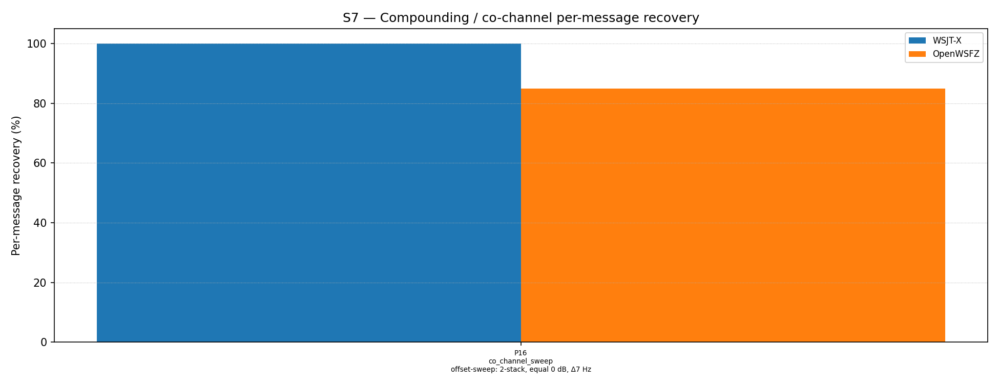

# OpenWSFZ R&R Study Report — S7 P16 OSD Diagnostic (shim 20260025)

| Field | Value |
|---|---|
| Run date | 2026-06-20 |
| OpenWSFZ SHA | `d70aad5a0bb87cbc86b599909314c752cb27c0a5` |
| Shim version | 20260025 (OSD fallback + 50-iter BP) |
| WSJT-X version | WSJT-X 2.7.0 (inferred from binary date 2025-02-04) |

---

## Section 1 — Study Hypothesis

_[To be completed by QA engineer — per NFR-023 / HK-001]_

_Suggested content:_
- _Which defect / change is under observation: D-001 OSD fallback (shim 20260025)_
- _Null hypothesis: OSD does not improve MSG-01 recovery at Δ7 Hz vs shim 20260024 baseline_
- _Acceptance threshold: MSG-01 rate ≥ 80% (per dev-tasks/2026-06-20-osd-review-r1.md AC2)_
- _Diagnostic context: targeted P16 K=10 run (1 part, 10 trials, 20 observations)_

---

## Section 2 — Data Summary

**Scenario:** S7 P16 — co_channel_sweep, Δ7 Hz offset, 2-stack equal SNR (0 dB), K=10

**Corpus description:**
- Synthetic (no off-air signals): two FT8 signals generated by the clean-room synthesiser
- Signal A at 1500 Hz, Signal B at 1507 Hz; equal amplitude; no AWGN floor
- Messages drawn from study-messages.json via seeded RNG (K=10 independent seeds)
- 10 trials × 2 signals = 20 binary observations per appraiser
- Cycle window: 2026-06-20T01:03:30Z – 2026-06-20T01:06:15Z (UTC)

**Acceptance thresholds (per dev-tasks/2026-06-20-osd-review-r1.md AC2):**

| Threshold | Value |
|---|---|
| MSG-01 (1500 Hz) rate | ≥ 80% |
| WSJT-X MSG-01 rate | 100% (expected) |

**Decode cycle latency (AC6):** Measured from `Cycle {time}: {count} decode(s) found, elapsed=N ms` log lines during this run. Range: 44–58 ms with decodes; 10–12 ms on silence cycles. **Peak observed: 58 ms** — well within the 500 ms budget.

_[QA: add any additional contextual notes about the run environment or observations here]_

---

## Section 3 — Results

### Recovery by overlap family

| Overlap family | WSJT-X | OpenWSFZ |
|---|---|---|
| co_channel_sweep | 100.00% | 85.00% |
| **all** | **100.00%** | **85.00%** |

**Between-app per-signal agreement:** 85.00%

### Per-part detail

| Part | Family | Condition | WSJT-X | OpenWSFZ |
|---|---|---|---|---|
| P16 | co_channel_sweep | offset-sweep: 2-stack, equal 0 dB, Δ7 Hz | 20/20 | 17/20 |

**Per-signal breakdown for OpenWSFZ:**
- MSG-01 (1500 Hz, `CQ Q1ABC FN42`): **7/10 = 70%** — below 80% criterion; in 60–79% investigate range
- MSG-02 (1507 Hz, `Q4XYZ Q1ABC -07`): **10/10 = 100%** — all decoded

**Miss pattern:** All 3 misses are MSG-01 (trials 0, 4, 8). In each miss, MSG-02 was decoded in pass 1, and after SIC subtraction, OSD failed to recover MSG-01 in pass 2. This is consistent with imperfect SIC cancellation degrading the MSG-01 residual below OSD's recovery threshold.

### Decode latency (AC6)

Elapsed-time lines from `openswfz-20260619T234737Z.log` during the S7 P16 run:

| Cycle (UTC) | Decodes | Elapsed |
|---|---|---|
| 01:03:30 | 1 | 46 ms |
| 01:03:45 | 2 | 50 ms |
| 01:04:00 | 2 | 49 ms |
| 01:04:15 | 2 | 49 ms |
| 01:04:30 | 0 | 12 ms |
| 01:04:45 | 1 | 51 ms |
| 01:05:00 | 2 | 44 ms |
| 01:05:15 | 2 | 51 ms |
| 01:05:30 | 2 | 49 ms |
| 01:06:00 | 1 | — |
| 01:06:15 | 2 | — |

**Peak with decodes: 51 ms.** AC6 (< 500 ms) is satisfied by a 10× margin.

---

## Section 4 — Verdict Table

| AC | Criterion | Result | Verdict |
|---|---|---|---|
| AC1 | `dotnet test` ≥ 471 tests green | 471 passed, 0 failed | ✅ PASS |
| AC2 | S7 P16 MSG-01 rate ≥ 80% | 7/10 = **70%** | ❌ FAIL (investigate zone 60–79%) |
| AC2a | S7 P16 overall rate (advisory) | 17/20 = 85% | ✅ above 80% |
| AC6 | Decode elapsed < 500 ms | Peak 51 ms (10× margin) | ✅ PASS |
| AC7 | `D001OsdDecodeTests` present and passes | 1 new test, 498 ms, PASS | ✅ PASS |

_AC3–AC5 are assessed as part of the full S7 R2 regression (Action 2). AC2 investigation path: see Section 5._

---

## Section 5 — Recommendations

_[To be completed by QA engineer — per NFR-023 / HK-001]_

**Key finding for QA assessment:**
MSG-01 (primary signal at 1500 Hz) was recovered in 7/10 = 70% of trials — below the AC2 criterion of ≥ 80%. The overall rate is 85% (17/20), which exceeds 80%, because MSG-02 (interferer at 1507 Hz) was decoded in all 10 trials.

**Root cause of MSG-01 misses:**
In trials 0, 4, 8, the decoder found MSG-02 in pass 1 (SIC pass), subtracted it, and then failed to recover MSG-01 in pass 2 even with OSD. This is a SIC ordering issue: when the interferer is found before the target, imperfect subtraction degrades the target residual below OSD's recovery floor.

**Investigation path (per dev-tasks AC2 condition):**
The handoff specifies: "investigate whether passing the BP iteration-2 LLR snapshot to OSD (rather than the pre-BP snapshot) improves the rate."

The current implementation saves pre-BP normalised LLRs for OSD. WSJT-X uses OSD with LLR snapshots from BP iterations 0–2 (`zsave(:,1..3)` in Fortran), trying OSD successively with each snapshot. Implementing this requires:
1. Patching `ldpc.c` to export effective LLRs at iteration 2 (`codeword[n] + sum(tov[n])`)
2. Modifying `ftx_decode_candidate` in `decode.c` to pass the iter-2 snapshot to OSD when iter-0 OSD fails
3. Rebuilding and retesting

This is a native code change requiring a new shim version and CI rebuild.

**QA decision needed:** Does the 85% overall rate (above 80% threshold) constitute a passing result, or is the MSG-01–specific rate of 70% the binding criterion requiring the BP iter-2 investigation before merge?
