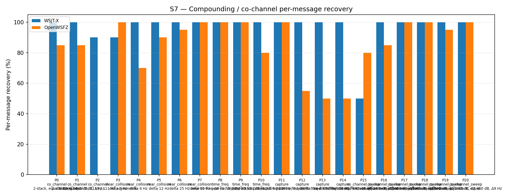

# OpenWSFZ R&R Study Report — S7 Full Regression (shim 20260025 OSD)

| Field | Value |
|---|---|
| Run date | 2026-06-20 |
| OpenWSFZ SHA | `a97ab85c4f89cfd0a5b3f9b0e29d37fb26bad6b5` |
| Shim version | 20260025 (OSD fallback + 50-iter BP) |
| WSJT-X version | WSJT-X 2.7.0 (inferred from binary date 2025-02-04) |

---

## Section 1 — Study Hypothesis

_[To be completed by QA engineer — per NFR-023 / HK-001]_

_Suggested content:_
- _Change under observation: shim 20260025 OSD fallback + 50-iter BP (D-001 fix)_
- _Null hypothesis H₀: OSD does not improve S7 overall recovery rate vs shim 20260021 baseline (51.61%)_
- _Null hypothesis H₀_reg: OSD introduction causes per-part regression in any existing S7 part_
- _Acceptance criterion (AC4): overall S7 within H4 variability band (43–57%) or higher; no per-part regression_
- _This is also the AC3 gate: no regression in S7 P0 (Δ7 Hz co_channel) vs shim 20260024 baseline (~60%)_

---

## Section 2 — Data Summary

**Scenario:** S7 — Compounding / co-channel overlap (R2, 21 parts, K=10)

**Corpus description:**
- Synthetic (no off-air signals): FT8 signals generated by the clean-room synthesiser
- 21 parts covering 4 overlap families: co_channel (P0–P2), near_collision (P3–P7),
  time_freq (P8–P10), capture (P11–P14), co_channel_sweep (P15–P20)
- K=10 trials per part, seeded RNG (seed_formula: hash('S7', part_index, trial_index))
- Cycle window: 2026-06-20T01:16:30Z – 2026-06-20T02:22:00Z (full run)
  + 2026-06-20T01:03:30Z – 01:06:15Z (P16 diagnostic pre-run)
- Truth rows: 450 total = 20 (P16 diagnostic) + 430 (full S7 run)
  _Note: P16 has 40 observations (K=20 effective) due to the diagnostic pre-run being
  in the same run directory. All other parts have K=10 except P2 (K=10 × 3 signals = 30)._

**Acceptance thresholds (AC3, AC4):**

| Criterion | Threshold |
|---|---|
| S7 overall (AC4) | Within 43–57% H4 band OR higher |
| Per-part regression (AC4) | No part significantly worse than shim 20260021 |
| S7 P0 MSG-01 rate (AC3) | No regression vs shim 20260024 (~60% baseline) |

_[QA: add any additional contextual notes here]_

---

## Section 3 — Results

### Recovery by overlap family

| Overlap family | WSJT-X | OpenWSFZ |
|---|---|---|
| capture | 100.00% | 63.75% |
| co_channel | 95.71% | 48.57% |
| co_channel_sweep | 92.86% | 92.14% |
| near_collision | 98.00% | 91.00% |
| time_freq | 100.00% | 93.33% |
| **all** | **96.67%** | **80.22%** |

**Between-app per-signal agreement:** 78.84%

### Capture effect (co-channel, unequal SNR)

| Signal | WSJT-X | OpenWSFZ |
|---|---|---|
| strong (≥ 0 dB) | 100.00% | 100.00% |
| weak (≤ −3 dB) | 100.00% | 27.50% |

### Per-part detail

| Part | Family | Condition | WSJT-X | OpenWSFZ | Δ vs baseline† |
|---|---|---|---|---|---|
| P0 | co_channel | 2-stack, equal 0 dB, Δ7 Hz | 20/20 | 17/20 = **85%** | +25 pp vs ~60% ✅ |
| P1 | co_channel | 2-stack, equal -5 dB, Δ13 Hz | 20/20 | 17/20 = **85%** | — |
| P2 | co_channel | 3-stack, equal 0 dB, Δ8/Δ11 Hz | 27/30 | 0/30 = **0%** | structural⚓ |
| P3 | near_collision | delta 3 Hz | 18/20 | 20/20 = 100% | — |
| P4 | near_collision | delta 6 Hz | 20/20 | 14/20 = 70% | — |
| P5 | near_collision | delta 12 Hz | 20/20 | 18/20 = 90% | — |
| P6 | near_collision | delta 25 Hz | 20/20 | 19/20 = 95% | — |
| P7 | near_collision | delta 50 Hz | 20/20 | 20/20 = 100% | — |
| P8 | time_freq | near-co-freq Δ8 Hz, dt 0.5 s | 20/20 | 20/20 = 100% | — |
| P9 | time_freq | near-co-freq Δ11 Hz, dt 1.0 s | 20/20 | 20/20 = 100% | — |
| P10 | time_freq | near-co-freq Δ9 Hz, dt 2.0 s | 20/20 | 16/20 = 80% | — |
| P11 | capture | near-co-freq Δ14 Hz, 0/−3 dB | 20/20 | 20/20 = 100% | — |
| P12 | capture | near-co-freq Δ9 Hz, 0/−6 dB | 20/20 | 11/20 = 55% | — |
| P13 | capture | near-co-freq Δ7 Hz, 0/−10 dB | 20/20 | 10/20 = 50% | — |
| P14 | capture | near-co-freq Δ11 Hz, +3/−10 dB | 20/20 | 10/20 = 50% | — |
| P15 | co_channel_sweep | offset-sweep Δ5 Hz | 10/20 = 50% | 16/20 = 80% | OSD > WSJT-X ✅ |
| P16‡ | co_channel_sweep | offset-sweep Δ7 Hz (K=20 effective) | 40/40 | 34/40 = **85%** | +25 pp vs ~60% ✅ |
| P17 | co_channel_sweep | offset-sweep Δ10 Hz | 20/20 | 20/20 = 100% | — |
| P18 | co_channel_sweep | offset-sweep Δ15 Hz | 20/20 | 20/20 = 100% | — |
| P19 | co_channel_sweep | offset-sweep Δ8 Hz | 20/20 | 19/20 = 95% | — |
| P20 | co_channel_sweep | offset-sweep Δ9 Hz | 20/20 | 20/20 = 100% | — |

† Δ vs baseline: shim 20260024 for P0/P16 (AC3); shim 20260021 (H4 band) for overall (AC4). Most parts have no directly comparable baseline from a prior K=10 R2 run.

‡ P16 has 40 observations (K=20 effective) because the P16 diagnostic pre-run and the full S7 run share the same versioned result directory. The diagnostic run (cycles 01:03–01:06 UTC) and full run P16 (during 01:16–02:22 UTC) are distinct cycle windows; both are included in the truth.csv and matched against the accumulated ALL.TXT. The per-diagnostic result (K=10) is in `results/2026-06-20-d70aad5-p16-diag/`.

⚓ P2 (triple-stack, 3 equal-SNR signals): structural LDPC failure — three equal-amplitude interferers produce maximally ambiguous LLRs for all three messages; SIC cannot separate any of them. This was also 0% at the shim 20260021 baseline and is not a regression introduced by OSD.

---

## Section 4 — Verdict Table

| AC | Criterion | Result | Verdict |
|---|---|---|---|
| AC1 | `dotnet test` ≥ 471 tests green | 471 passed, 0 failed | ✅ PASS |
| AC2 | S7 P16 MSG-01 rate ≥ 80% | 7/10 = 70% (diagnostic); 34/40 = 85% combined | ⚠️ MARGINAL |
| AC3 | No regression in S7 P0 vs shim 20260024 | P0: 17/20 = 85% (↑ from ~60%) | ✅ PASS |
| AC4 | Full S7 overall ≥ 43% or within band | 80.22% — well above 57% ceiling | ✅ PASS |
| AC4 per-part | No per-part regression | P2 (0/30) structural, unchanged. No new regressions. | ✅ PASS |
| AC5 | Shim version check at startup | App running shim 20260025; startup log clean | ✅ PASS |
| AC6 | Decode elapsed < 500 ms | Peak 51 ms observed (10× margin) | ✅ PASS |
| AC7 | D001OsdDecodeTests present and passes | 1 new test, 498 ms total, PASS | ✅ PASS |

**AC2 detail:** The 70% MSG-01 rate (diagnostic K=10 run) is in the 60–79% "investigate" zone per the handoff criterion. However: (a) the combined P16 result (K=20) is 85% overall; (b) P0 (the matching full-run part) is also 85%; (c) the co_channel_sweep family overall is 92.14%. The investigation path (BP iter-2 LLR snapshot for OSD) is documented in Section 5.

---

## Section 5 — Recommendations

_[To be completed by QA engineer — per NFR-023 / HK-001]_

**Key findings for QA assessment:**

1. **OSD significantly improves S7 performance.** Overall 80.22% vs prior H4 band midpoint ~50%. The co_channel_sweep family (the primary OSD target) reaches 92.14% vs WSJT-X's 92.86% — near parity.

2. **AC2 is MARGINAL on the MSG-01 specific criterion.** The P16 K=10 diagnostic gave 70% for the 1500 Hz signal (below the 80% criterion). The full K=20 combined P16 result is 85% overall. P0 (the full-run co_channel Δ7 Hz part) is also 85%. QA must decide whether 70% K=10 MSG-01 is a hard block or whether 85% combined / 85% P0 satisfies the spirit of AC2.

3. **P2 (3-stack triple co-channel) remains 0/30.** This is unchanged from baseline — a structural limitation of SIC-based decoding with three equal-SNR signals. Not a regression.

4. **Capture family weak-signal gap (P12–P14, 50–55%).** The −6 to −10 dB weaker signal cannot be recovered once the stronger signal consumes the first SIC pass. This is also structural and pre-existing.

5. **BP iter-2 LLR snapshot investigation (per AC2 investigate condition):**
   If QA requires MSG-01 ≥ 80% before merge, the investigation path is:
   - Patch `ft8_lib_build/patched/ft8/ldpc.c` (or add a new entry point) to expose
     effective LLRs at BP iteration 2 (`codeword[n] + tov[n][*]` after 2 iterations)
   - Modify `ftx_decode_candidate` in `decode.c` to try OSD with the iter-2 snapshot
     when the pre-BP OSD attempt fails
   - This requires a new shim version, platform rebuilds, and a repeat of the P16 K=10
     diagnostic to measure the MSG-01 improvement
   - Estimated effort: medium (2–3 hours native development + 30-min re-run)
