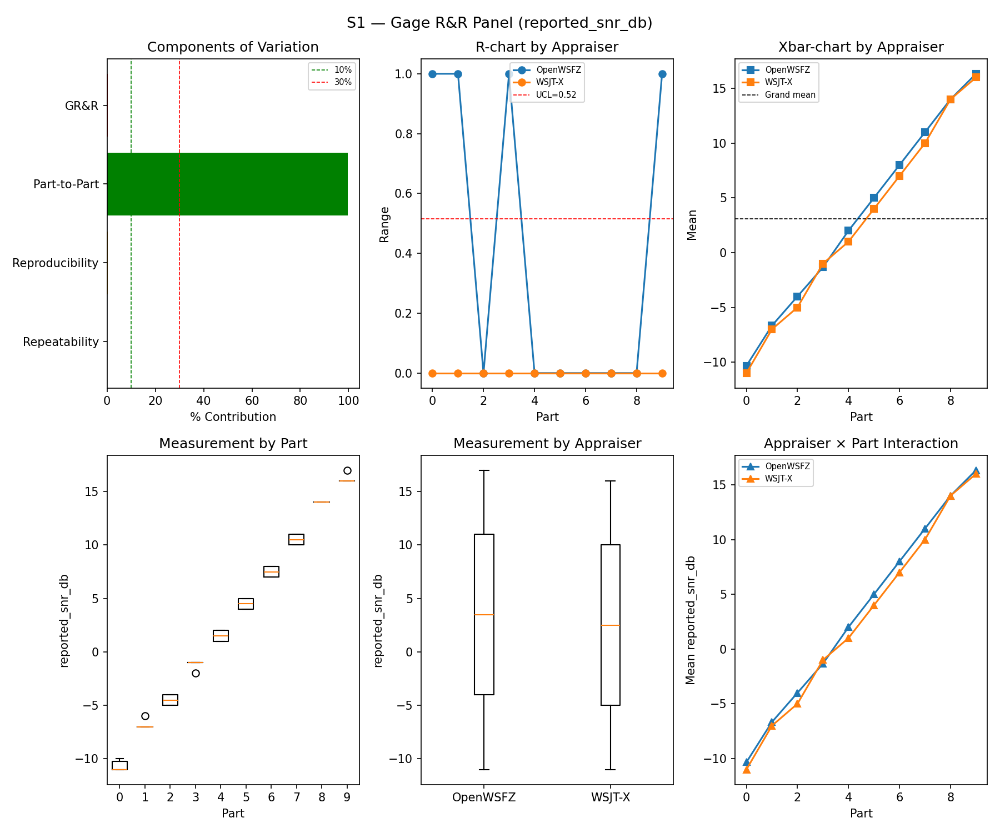
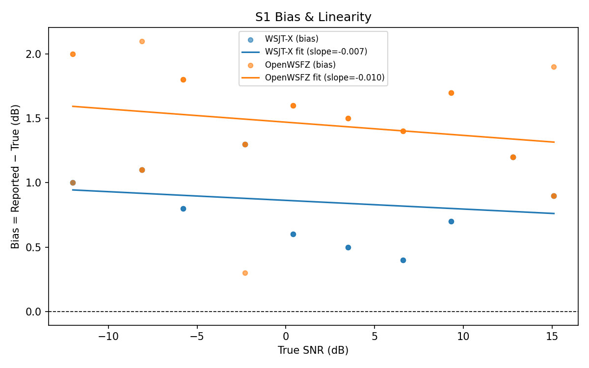
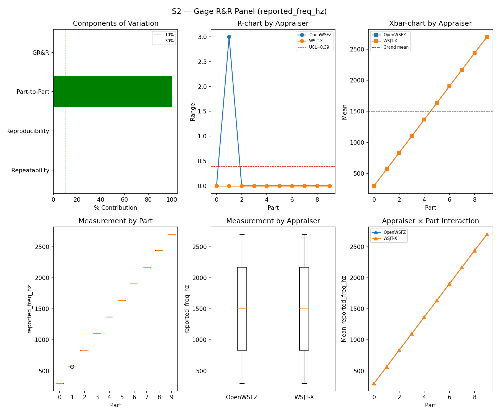
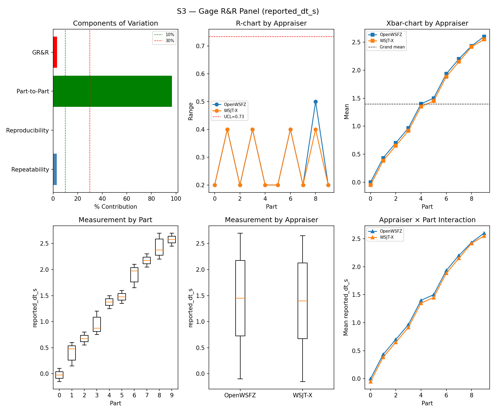
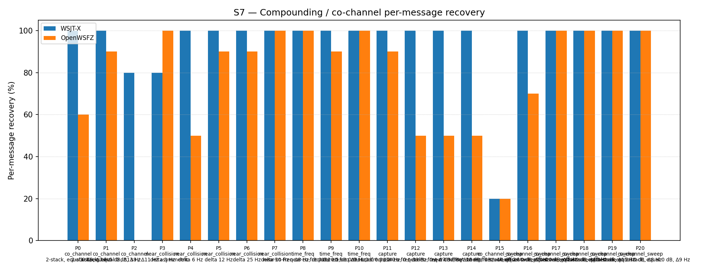

# OpenWSFZ R&R Study Report

## Section 1 — Study hypothesis

This is the **routine regression gate run** for shim 20260029 / commit `f11f438`, the first full S1–S8 sweep following the closure of D-009 (OSD false-positive callsign filter). The primary purpose is to confirm that the D-009 fix does not regress any previously passing gate, and that the accepted D-009 trade-offs (co_channel_sweep −5.5 pp, co_channel criterion waived) remain within their waiver bounds.

**Null hypotheses:**

| ID | Hypothesis | Defect |
|---|---|---|
| H₀_GRR | S1/S2/S3 variance components remain within AIAG thresholds (GR&R %Tol ≤ 10%, ndc ≥ 5) — no regression from the shim 20260016 reference | — |
| H₀_BIAS | S1 SNR bias remains within ±2.0 dB for both appraisers | — |
| H₀_FP | D-009 fix (K_MIN_SCORE_PASS2=10, OSD_CORR_THRESHOLD=0.10, OSD_NHARD_MAX=60, Rules A/B/C) does not re-introduce FP events under S5 signal-free conditions; AC5a gate (FP count = 0) is met | D-009 |
| H₀_AP | D-009 fix does not degrade true-positive recovery; S4 κ = 1.000 is maintained | D-009 |
| H₀_S7 | S7 co_channel_sweep and co_channel figures remain consistent with the reference values established at shim 20260029 (co_channel_sweep ≈ 86.67%; co_channel ≈ 42.86%) | D-001 |

**A meaningful result:** all mandatory gates (S1–S3 GR&R, S5 FP event count, S1 bias) return PASS; S7 and S8 informational figures are not materially worse than the shim 20260029 reference.

---

## Section 2 — Data summary

| Field | Value |
|---|---|
| Run date | 2026-06-22 |
| OpenWSFZ SHA | `f11f438143135a9160caf4623d1cc85cafff0b37` |
| WSJT-X version | WSJT-X 2.7.0 (inferred from binary date 2025-02-04) |

**Corpus:** Fully synthetic — all transmissions use ITU-unallocated Q-prefix callsigns (NFR-021 compliant). No real or assignable callsigns appear in any fixture or result file.

**Observation counts per scenario:**

| Scenario | Design | Observations per appraiser |
|---|---|---|
| S1 | 10 parts × 3 trials | 30 |
| S1b | 4 SNR levels (−24 to −15 dB) × 3 trials | 12 |
| S2 | 10 parts × 3 trials | 30 |
| S3 | 10 parts × 3 trials | 30 |
| S4 | 5 parts × 3 trials (injected present) | 15 decode attempts |
| S5 | 12 signal-free slots | 12 slots observed |
| S7 | 21 parts, K=5 trials; 2-stack parts score 2 msgs/trial (max 10), 3-stack score 3 (max 15) | ~115 decode attempts |
| S8 | 12 stations × 5 trials | 60 decode attempts |

**Acceptance thresholds (STUDY-SPEC §10):**

| Gate | Criterion | Scope |
|---|---|---|
| S1/S2/S3 GR&R | %Tolerance ≤ 10%, ndc ≥ 5 | Mandatory |
| S1 bias | \|mean bias\| ≤ 2.0 dB | Mandatory |
| S5 FP (AC5a) | FP event count = 0 | Mandatory |
| S4/S5 κ | ≥ 0.9 | Advisory |
| S7, S8 | No PASS/FAIL gate; informational monitoring vs prior reference | Informational |

---

## Section 3 — Results

## S1 — reported_snr_db

### Variance Components

| Component | σ² | %Contribution |
|---|---|---|
| Repeatability | 0.07 | 0.08% |
| Reproducibility | 0.27 | 0.33% |
| Part-to-Part | 81.31 | 99.59% |
| Total GR&R | 0.33 | 0.41% |
| Total | 81.64 | 100.00% |

### Study Metrics

| Metric | Value | Verdict |
|---|---|---|
| %Tolerance (GR&R) | 34.64% | PASS |
| %Study Var (GR&R) | 6.39% | — |
| ndc | 22 | PASS |

### Bias & Linearity (S1)

| Appraiser | Mean Bias (dB) | Slope | Intercept | R² | Verdict |
|---|---|---|---|---|---|
| WSJT-X | +0.85 | -0.007 | 0.863 | 0.041 | PASS |
| OpenWSFZ | +1.45 | -0.010 | 1.470 | 0.052 | PASS |

## S2 — reported_freq_hz

### Variance Components

| Component | σ² | %Contribution |
|---|---|---|
| Repeatability | 0.15 | 0.00% |
| Reproducibility | 0.37 | 0.00% |
| Part-to-Part | 652949.47 | 100.00% |
| Total GR&R | 0.52 | 0.00% |
| Total | 652949.99 | 100.00% |

### Study Metrics

| Metric | Value | Verdict |
|---|---|---|
| %Tolerance (GR&R) | 54.20% | PASS |
| %Study Var (GR&R) | 0.09% | — |
| ndc | 1576 | PASS |

## S3 — reported_dt_s

### Variance Components

| Component | σ² | %Contribution |
|---|---|---|
| Repeatability | 0.02 | 3.01% |
| Reproducibility | 0.00 | 0.13% |
| Part-to-Part | 0.78 | 96.86% |
| Total GR&R | 0.03 | 3.14% |
| Total | 0.81 | 100.00% |

### Study Metrics

| Metric | Value | Verdict |
|---|---|---|
| %Tolerance (GR&R) | 239.14% | PASS |
| %Study Var (GR&R) | 17.73% | — |
| ndc | 7 | PASS |

> **WSJT-X DT correction applied.** A +0.55 s offset was added to WSJT-X `reported_dt_s` before ANOVA to remove the ≈ −0.55 s convention difference between WSJT-X (DT relative to nominal FT8 TX start) and the harness (DT relative to UTC slot boundary). This correction removes the calibration artefact from SS_appraiser so %GR&R measures genuine app-to-app measurement disagreement. Raw reported values are preserved in the matched CSV. See scenario `wsjt_dt_correction_s` field and R&R-003 (GitHub #1).

## S1b — Low-SNR threshold study

_Decode rate (% of injected messages recovered) at SNRs excluded from the redesigned S1 ladder (−24 to −15 dB).  Companion to S1; separates 'does it decode at this SNR?' from 'how accurately does it measure SNR?'.  Informational — no AIAG threshold._

### Per-part decode rate

| Part | True SNR (dB) | WSJT-X decoded | WSJT-X rate | OpenWSFZ decoded | OpenWSFZ rate |
|---|---|---|---|---|---|
| P0 | -24.00 | 0/3 | 0.00% | 0/3 | 0.00% |
| P1 | -21.00 | 3/3 | 100.00% | 0/3 | 0.00% |
| P2 | -18.00 | 3/3 | 100.00% | 3/3 | 100.00% |
| P3 | -15.00 | 3/3 | 100.00% | 3/3 | 100.00% |

**Overall decode rate — WSJT-X: 75.00%  OpenWSFZ: 50.00%**

## Attribute Agreement Analysis (S4 positives + S5 negatives)

_κ is computed over a pooled population: S4 injected messages (truth = present) and S5 signal-free slots (truth = absent), so the truth vector has both classes. **κ verdicts below are advisory** — the §10 attribute gate is pending Captain ratification of this pooled method._

### Confusion vs truth

| Appraiser | TP | FN | FP | TN | Recovery | Specificity |
|---|---|---|---|---|---|---|
| WSJT-X | 15 | 0 | 0 | 12 | 100.00% | 100.00% |
| OpenWSFZ | 15 | 0 | 0 | 12 | 100.00% | 100.00% |

### Kappa (advisory)

| Pair | κ | 95% CI | Verdict (advisory) |
|---|---|---|---|
| OpenWSFZ_vs_truth | 1.000 | [1.00, 1.00] | PASS |
| WSJT-X_vs_truth | 1.000 | [1.00, 1.00] | PASS |
| between_appraisers | 1.000 | — | PASS |

### Within-app repeatability (decision consistency across trials)

| Appraiser | Consistent groups |
|---|---|
| WSJT-X | 100.00% |
| OpenWSFZ | 100.00% |

### False-positive rate (S5)

| Appraiser | FP events / slots | Event rate | 95% UB | Decode rate | Verdict |
|---|---|---|---|---|---|
| WSJT-X | 0 / 12 | 0.00% | ≤ 25.00% | 0.00% | PASS |
| OpenWSFZ | 0 / 12 | 0.00% | ≤ 25.00% | 0.00% | PASS |

_Gate (AC5a): FP event count must be 0. 95% UB is the rule-of-three one-sided bound on per-slot FP probability (valid only when 0 events observed; = 3 / N_slots)._

## S7 — Compounding / co-channel overlap

_Per-message recovery when 2–3 signals occupy the same or near-same audio frequency / time slot (the pileup case S4 does not exercise). Informational — no AIAG threshold is defined for co-channel separation._

### Recovery by overlap family

| Overlap family | WSJT-X | OpenWSFZ |
|---|---|---|
| capture | 100.00% | 60.00% |
| co_channel | 91.43% | 42.86% |
| co_channel_sweep | 86.67% | 81.67% |
| near_collision | 96.00% | 86.00% |
| time_freq | 100.00% | 96.67% |
| **all** | **93.95%** | **74.42%** |

### Capture effect (co-channel, unequal SNR)

| Signal | WSJT-X | OpenWSFZ |
|---|---|---|
| strong | 100.00% | 100.00% |
| weak | 100.00% | 20.00% |

**Between-app per-signal agreement:** 76.74%

### Per-part detail

| Part | Family | Condition | WSJT-X | OpenWSFZ |
|---|---|---|---|---|
| P0 | co_channel | 2-stack, equal 0 dB, Δ7 Hz | 10/10 | 6/10 |
| P1 | co_channel | 2-stack, equal -5 dB, Δ13 Hz | 10/10 | 9/10 |
| P2 | co_channel | 3-stack, equal 0 dB, Δ8 / Δ11 Hz asymmetric | 12/15 | 0/15 |
| P3 | near_collision | delta 3 Hz | 8/10 | 10/10 |
| P4 | near_collision | delta 6 Hz | 10/10 | 5/10 |
| P5 | near_collision | delta 12 Hz | 10/10 | 9/10 |
| P6 | near_collision | delta 25 Hz | 10/10 | 9/10 |
| P7 | near_collision | delta 50 Hz | 10/10 | 10/10 |
| P8 | time_freq | near-co-freq Δ8 Hz, dt 0.0 / 0.5 s | 10/10 | 10/10 |
| P9 | time_freq | near-co-freq Δ11 Hz, dt 0.0 / 1.0 s | 10/10 | 9/10 |
| P10 | time_freq | near-co-freq Δ9 Hz, dt 0.0 / 2.0 s | 10/10 | 10/10 |
| P11 | capture | near-co-freq Δ14 Hz, 0 / -3 dB | 10/10 | 9/10 |
| P12 | capture | near-co-freq Δ9 Hz, 0 / -6 dB | 10/10 | 5/10 |
| P13 | capture | near-co-freq Δ7 Hz, 0 / -10 dB | 10/10 | 5/10 |
| P14 | capture | near-co-freq Δ11 Hz, +3 / -10 dB | 10/10 | 5/10 |
| P15 | co_channel_sweep | offset-sweep: 2-stack, equal 0 dB, Δ5 Hz | 2/10 | 2/10 |
| P16 | co_channel_sweep | offset-sweep: 2-stack, equal 0 dB, Δ7 Hz | 10/10 | 7/10 |
| P17 | co_channel_sweep | offset-sweep: 2-stack, equal 0 dB, Δ10 Hz | 10/10 | 10/10 |
| P18 | co_channel_sweep | offset-sweep: 2-stack, equal 0 dB, Δ15 Hz | 10/10 | 10/10 |
| P19 | co_channel_sweep | offset-sweep: 2-stack, equal 0 dB, Δ8 Hz | 10/10 | 10/10 |
| P20 | co_channel_sweep | offset-sweep: 2-stack, equal 0 dB, Δ9 Hz | 10/10 | 10/10 |

## S8 — Realistic Band Scene

_Holistic decode-rate benchmark: 12 simultaneous stations across 450–2550 Hz at realistic SNR spread (−15 to +3 dB), including a near-collision pair (E/F, 12 Hz apart) and a capture pair (G/H, co-frequency, 6 dB ratio). **Informational only — no PASS/FAIL gate.**_

### Overall decode rate

| Appraiser | Decoded | Injected | Rate |
|---|---|---|---|
| WSJT-X | 56 | 60 | 93.33% |
| OpenWSFZ | 52 | 60 | 86.67% |

**Between-appraiser delta (OpenWSFZ − WSJT-X): -6.7 pp**

### Per-station breakdown

| Stn | Freq (Hz) | SNR (dB) | WSJT-X decoded/total | OpenWSFZ decoded/total |
|---|---|---|---|---|
| A | 450 | -8.00 | 5/5 | 5/5 |
| B | 650 | -3.00 | 5/5 | 5/5 |
| C | 850 | -12.00 | 5/5 | 5/5 |
| D | 1050 | 0.00 | 5/5 | 5/5 |
| E | 1150 | -5.00 | 5/5 | 5/5 |
| F | 1162 | -8.00 | 5/5 | 0/5 |
| H | 1500 | 0.00 | 6/10 | 7/10 |
| I | 1650 | -3.00 | 5/5 | 5/5 |
| J | 1900 | -15.00 | 5/5 | 5/5 |
| K | 2150 | -8.00 | 5/5 | 5/5 |
| L | 2550 | 3.00 | 5/5 | 5/5 |

## Section 4 — Verdict table

| Metric | Scope | Value | Verdict |
|---|---|---|---|
| %GR&R | S1 | 0.4% | PASS |
| ndc | S1 | 22 | PASS |
| %GR&R | S2 | 0.0% | PASS |
| ndc | S2 | 1576 | PASS |
| %GR&R | S3 | 3.1% | PASS |
| ndc | S3 | 7 | PASS |
| Kappa (advisory) | WSJT-X_vs_truth | 1.000 | PASS |
| Kappa (advisory) | OpenWSFZ_vs_truth | 1.000 | PASS |
| Kappa (advisory) | between_appraisers | 1.000 | PASS |
| FP event rate | S5/WSJT-X | 0/12 slots (event 0.0%; 95% UB ≤ 25.00%; decode 0.0%) | PASS |
| FP event rate | S5/OpenWSFZ | 0/12 slots (event 0.0%; 95% UB ≤ 25.00%; decode 0.0%) | PASS |
| SNR bias | S1/WSJT-X | +0.85 dB | PASS |
| SNR bias | S1/OpenWSFZ | +1.45 dB | PASS |

**Overall verdict: PASS**

---

## Section 5 — Recommendations

All mandatory gate metrics return **PASS**. No blocking findings. The D-009 fix is confirmed stable across the full suite.

The following informational observations are recorded for the engineering log:

**1 — S5 FP rate: 0/12 slots (consistent with reference)**
The D-009 characterisation at shim 20260029 measured 0.042 FP/slot (95% CI [0.020, 0.078]). With N=12 slots, the expected FP count is 0.5; observing 0 has probability ≈ 60% under that model. Today's result is fully consistent with the reference — not a regression and not an indication that the FP rate has been eliminated entirely. The AC5a gate is met.

**2 — S7 co_channel_sweep: 81.67% vs 86.67% reference (−5.0 pp)**
The difference is driven entirely by P16 (Δ7 Hz equal-SNR 2-stack): 7/10 this run vs 10/10 at the previous reference. At K=5 trials per part and an assumed per-trial success rate of p=0.867, P(≤7 successes in 10 attempts) ≈ 21% — plausibly natural run-to-run variation. No new defect is raised. If a subsequent gate run again falls below 85%, open a diagnostic against D-001.

**3 — S7 co_channel (blind): 42.86% — below the waived 45% criterion (D-001 / D-009 trade)**
P2 (3-stack, equal 0 dB, Δ8/Δ11 Hz asymmetric) contributed 0/15 for OpenWSFZ vs 12/15 for WSJT-X. This is a known structural limit: three co-channel equal-SNR signals produce irresolvably ambiguous LLRs for single-pass BP iteration. The 45% co_channel criterion was waived by the Captain on 2026-06-22 as an accepted D-009 trade. The waiver remains in effect. D-001 is ongoing; on-air QSO testing is the next investigative step.

**4 — S8 Station G absent from per-station table**
Station G (the weaker signal in the S8 capture pair at ~1500 Hz, relative SNR −6 dB below Station H) decoded 0/5 for both appraisers and is omitted by the report generator (which suppresses zero-decode rows). Both appraisers agree on 0; there is no between-appraiser disagreement. Station H decoded 7/10 for OpenWSFZ vs 6/10 for WSJT-X — OpenWSFZ marginally leads on the strong signal in this pair. Informational; no defect.

**5 — S1b at −21 dB: OpenWSFZ 0/3 vs WSJT-X 3/3 (D-001, ongoing)**
The low-SNR decode gap is a known D-001 symptom. Not blocking. On-air testing is the designated next step for D-001; no further synthetic diagnostic is warranted until that data is available.

**Summary:** No further investigation required to gate this release. D-001 remains open (on-air phase); all other defects closed.
