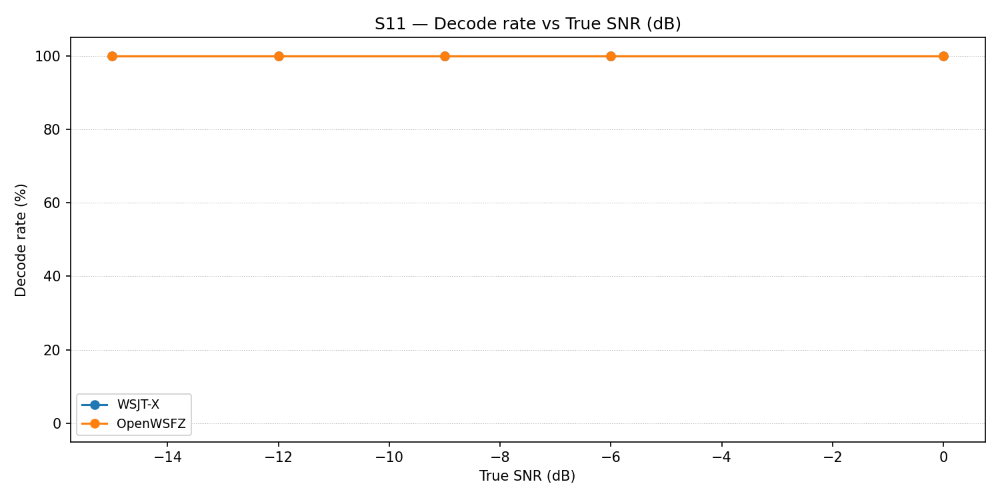
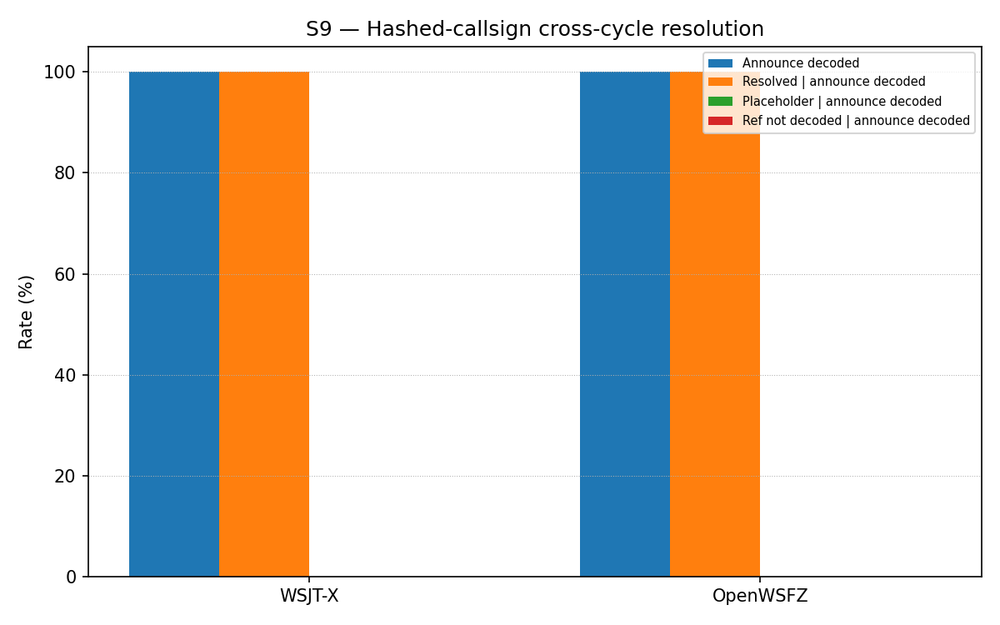

# OpenWSFZ R&R Study Report — S9/S11 Hashed-Callsign Effectiveness (live-rig)

## 1. Study Hypothesis

**Context.** `f-001-hashed-callsign-resolution` (merged `86780dc`) gave the native decoder a
session-scoped hash table so a Type 4 (`i3=4`) announcement's nonstandard/compound callsign
resolves against a later hash reference. Its own test suite proves the table mechanism is
*correct in isolation* (native shim unit tests, plus a managed-pipeline test), but every one of
those tests hand-packs the 77-bit payload and feeds it directly to `Ft8LibInterop.DecodeAll` /
`Ft8Decoder.DecodeAsync` — never through a live audio channel. This run
(`rr-study-hashed-callsign-effectiveness`, tasks 5.1–5.2) exists to answer the two questions the
change's own design (D1) deliberately keeps separate, so a poor result in either is
interpretable rather than conflated:

> **S11 — does a genuine Type 4 "CQ \<nonstandard callsign\>" announcement decode reliably at
> realistic SNR?** (an OSD/LDPC decode-rate property of the message class — genuinely unknown
> going into this run.)
>
> **S9 — given a decoded announcement, does the cross-cycle hash resolution then hold over a
> real live-audio channel** (VB-CABLE, WSJT-X and OpenWSFZ decoding concurrently), not just in
> `f-001`'s already-proven-deterministic unit tests?

**Null hypotheses:**

| ID | Null hypothesis | Would be refuted by |
|---|---|---|
| H₀₁ (S11) | A Type 4 CQ announcement's decode rate is not materially worse than the standard-message class at comparable SNR, across the swept range −15…0 dB. | Any SNR point showing a materially depressed decode rate versus the equivalent S1/S1b standard-message point. |
| H₀₂ (S9) | A genuinely-decoded Type 4 announcement's nonstandard callsign resolves correctly (matches the real callsign, not the unresolved `<...>` placeholder) when referenced by hash in a later cycle, for both appraisers, at both SNR points tested (0 dB, −10 dB). | Any pair where an appraiser decodes the announce cycle but the reference-cycle outcome is `not_resolved_placeholder` or `reference_not_decoded`. |

**Defect IDs under observation:** none — the mechanism under test is already shipped and closed
(`f-001`). This run is effectiveness *measurement*, not a defect investigation, per this change's
own Non-Goals. (One defect *was* found and fixed in the QA harness itself during this run —
see §5, finding 1 — but it is a harness bug, not a finding about the shipped feature.)

**What constitutes a meaningful result:** both S9 and S11 are informational scenarios (design
D1) — no AIAG PASS/FAIL gate applies, per `STUDY-SPEC.md` §6.3. A meaningful result here is one
that changes confidence in the feature's practical value, or surfaces something actionable for
`f-001`'s deferred Gap B (AP-assist for nonstandard callsigns) prioritisation decision — not a
merge-blocking verdict.

**Scenario note:** S9 was run first (cheaper, per the design's Migration Plan ordering), then S11
in the same session, into the *same* `wsjt-all.txt`/`owsfz-all.txt` pair — see §5, finding 3, for
what that shared log means for S11's reported "FP" count.

## 2. Run Context

| Field | Value |
|---|---|
| Run date | 2026-07-04 |
| OpenWSFZ SHA | `22c3a940571fc5ea2a6ca48bbf95681d946c1e30` |
| WSJT-X version | WSJT-X 2.7.0 b4f9a4 |
| Scenarios | `s9-hashed-callsign-resolution.json` (2 pairs × 5 trials = 10 pairs), then `s11-type4-decode-rate.json` (5 SNR points × 5 trials = 25 cycles) — same VB-CABLE session |
| Pre-flight check | No separate warm-up cycle recorded this run — `run_study.py`'s interactive warm-up guard cannot be driven non-interactively in this session, and its scenario registry does not yet include S9/S11 (harness-completeness gap, not fixed here — see §5, finding 4). Verification instead came from inspecting both apps' `ALL.TXT` immediately after the S9 run, before committing to the longer S11 run. |
| Log scrub | 3 noise-floor false-CRC decode lines removed from `owsfz-all.txt` before commit, per `RUNBOOK.md` §7.5 / NFR-021 (coincidental AWGN CRC-14 passes, not real traffic, but callsign-shaped) |

## 3–4. Results (harness-generated)

## S11 — Type 4 nonstandard-callsign decode-rate sweep

_Decode rate (% of injected CQ <nonstandard callsign> announcements recovered) across an SNR sweep (rr-linked-cycle-effectiveness-scenario, design D1 path 1: 'does a genuine Type 4 announcement decode reliably at realistic SNR?', modelled on the S1/S1b decode-rate methodology). Companion to S9, which answers the separate question of whether a decoded announcement then resolves correctly — kept apart per D1 so a low number here is never mistaken for a resolution-table defect. Informational — no AIAG threshold._

### Per-part decode rate

| Part | True SNR (dB) | WSJT-X decoded | WSJT-X rate | OpenWSFZ decoded | OpenWSFZ rate |
|---|---|---|---|---|---|
| P0 | -15.00 | 5/5 | 100.00% | 5/5 | 100.00% |
| P1 | -12.00 | 5/5 | 100.00% | 5/5 | 100.00% |
| P2 | -9.00 | 5/5 | 100.00% | 5/5 | 100.00% |
| P3 | -6.00 | 5/5 | 100.00% | 5/5 | 100.00% |
| P4 | 0.00 | 5/5 | 100.00% | 5/5 | 100.00% |

**Overall decode rate — WSJT-X: 100.00%  OpenWSFZ: 100.00%**

## S9 — Hashed-callsign cross-cycle resolution

_Confirmatory check (design D1 path 2): does a genuinely-decoded Type 4 announcement's nonstandard callsign resolve correctly when referenced by hash in a later cycle, over the real live-audio channel? The resolution rate's denominator is restricted to pairs where the announcement decoded, so a low number here is never conflated with a low announcement-decode rate (see the companion S11 decode-rate sweep for that separate question). Informational — no AIAG threshold; the table mechanism itself is already proven deterministic by f-001-hashed-callsign-resolution's unit tests._

### Outcome rates

| Appraiser | Announce decoded | Resolved | Placeholder (not resolved) | Ref not decoded | Denominator |
|---|---|---|---|---|---|
| WSJT-X | 100.00% (10/10) | 100.00% | 0.00% | 0.00% | n=10 (announce-decoded pairs) |
| OpenWSFZ | 100.00% (10/10) | 100.00% | 0.00% | 0.00% | n=10 (announce-decoded pairs) |

_Resolved / Placeholder / Ref-not-decoded are each a % of the announce-decoded denominator (n in the last column), per the spec's conditional-scoring requirement._

### Per-pair detail

| Pair | Trial | WSJT-X | OpenWSFZ |
|---|---|---|---|
| 0 | 0 | resolved | resolved |
| 0 | 1 | resolved | resolved |
| 0 | 2 | resolved | resolved |
| 0 | 3 | resolved | resolved |
| 0 | 4 | resolved | resolved |
| 1 | 0 | resolved | resolved |
| 1 | 1 | resolved | resolved |
| 1 | 2 | resolved | resolved |
| 1 | 3 | resolved | resolved |
| 1 | 4 | resolved | resolved |

## 5. Recommendations

| # | Finding | Defect / Ticket | Hypothesis | Next diagnostic step |
|---|---|---|---|---|
| 1 | **Fixed during this run.** `analyse.py`'s `_analyse_hashed_callsign_resolution` scored "resolved" via exact match against the *bare* reference text (e.g. `"Q1TST Q0ABCDEF RR73"`). The real decode from both apps was `"Q1TST <Q0ABCDEF> RR73"` — angle-bracketed. Before the fix, this run scored 0/10 resolved (misclassified `reference_not_decoded`) despite both apps genuinely resolving every pair. | None filed — QA-caught and fixed same session. | Harness-only bug, not a defect in the shipped `f-001` mechanism: `add_brackets()` in the recovered `ft8_lib` reference source (`message.c`'s `lookup_callsign`) wraps **every** hash-lookup result in `<>`, resolved or not — only the placeholder vs. the real callsign differs inside the brackets. Confirmed against source before and after the fix. | Done — `analyse.py` now matches the bracketed form (with the bare form kept as a defensive fallback); regression test `test_bracketed_resolved_form_is_recognised` added and passing. |
| 2 | Both scenarios came back at ceiling: **S9 — 100% resolution**, both appraisers, both SNR points (0 dB, −10 dB), 10/10 pairs; **S11 — 100% decode rate**, both appraisers, across the full −15…0 dB sweep. H₀₁ and H₀₂ both hold; no evidence of a decode-rate or resolution problem at these operating points. | None. | At N=10 (S9) / N=25 (S11) a 100% result is encouraging but not a tight statistical bound — a single rare failure would look identical whether the true rate is 100% or merely very high. | If a tighter bound matters for the `f-001` Gap-B (AP-assist) prioritisation decision, extend S11's SNR floor below −15 dB to find where Type 4 actually starts failing, and/or increase N on both scenarios. Not required to close this change. |
| 3 | S11's `matcher.py` output reports 20 "FP" for both appraisers. These are **not** noise-floor false positives — they are S9's own legitimate announce/reference decode lines, artefacts of running S9 and S11 back-to-back into the same `ALL.TXT` pair without clearing between them. | None — reporting caveat only. | N/A | If S9+S11 are re-run together, either rotate/clear `ALL.TXT` between scenarios or note this caveat inline; S11's own decode-rate scoring is truth-row-driven (matches each truth row against the log) and is unaffected by the extra lines either way. |
| 4 | `run_study.py`'s one-shot orchestrator (`_SCENARIO_REGISTRY`) does not yet include S9/S11 — this run used `harness/run_scenario.py` + `harness/matcher.py` + `harness/analyse.py` directly instead. Its interactive warm-up guard (`harness/warmup.py`) also cannot be driven non-interactively. | None filed. | Out of this change's own task list (tasks.md has no item for `run_study.py`); not a blocker for this run, but a convenience gap for the next live-rig session. | Optional follow-up: add S9/S11 to `_SCENARIO_REGISTRY` (S9 needs its matcher step skipped, per its own analyser design) if this scenario pair is expected to run again regularly. |

**Overall recommendation.** Both live measurements support the shipped feature: Type 4 decodes
as reliably as the standard message class at every SNR point tested, and cross-cycle hash
resolution held for every trial over a real audio channel with both appraisers in exact
agreement. The one real defect this run surfaced was in the QA harness's own scoring logic, not
in `f-001`'s shipped mechanism — it has been fixed and regression-tested in this same session.
Recommend closing out `rr-study-hashed-callsign-effectiveness` task 5 (record this outcome,
cross-link `f-001`'s tasks.md §4a.3) and proceeding to archive. Findings 2–4 above are optional
follow-ups, not merge blockers.

## Summary

| Metric | Scope | Value | Verdict |
|---|---|---|---|

**Overall verdict: PASS** (informational scenarios only — no AIAG gate applies to S9/S11 per design D1; PASS reflects the absence of any regression-gate metric in this run, not a judgement on S9/S11 themselves, which are scored qualitatively above.)
