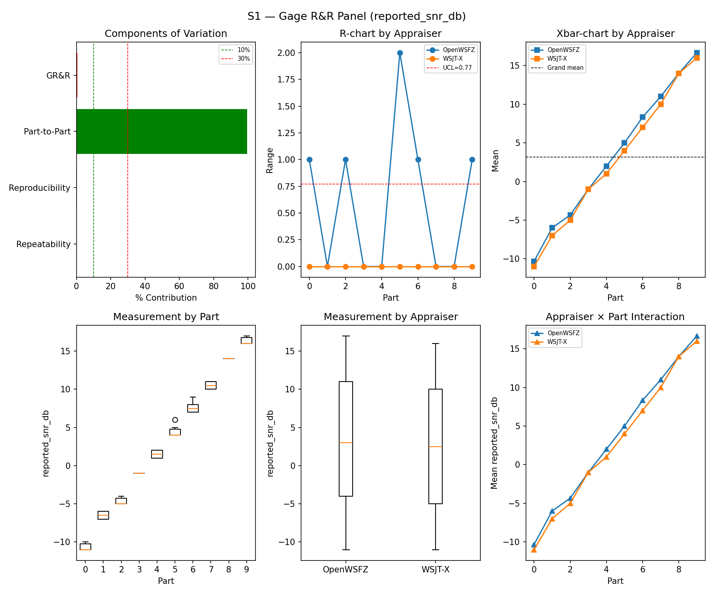
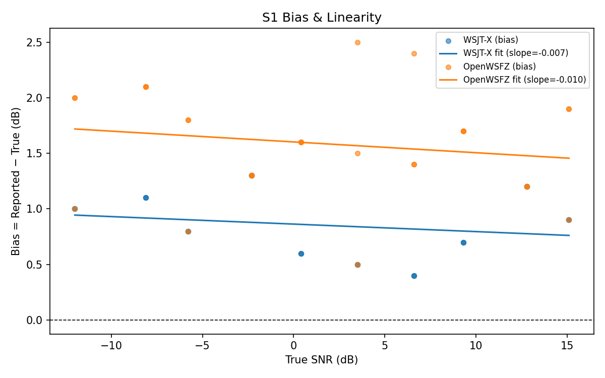
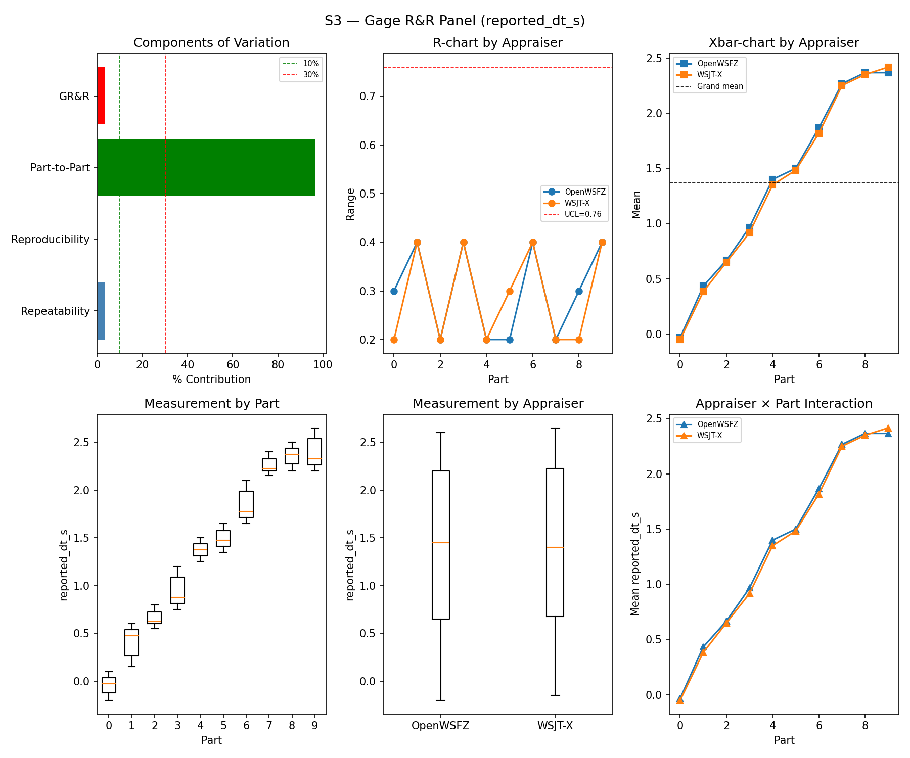
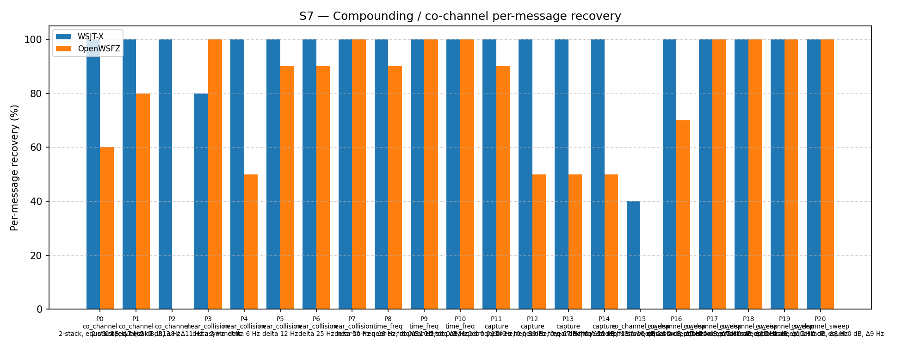

# OpenWSFZ R&R Study Report

| Field | Value |
|---|---|
| Run date | 2026-07-04 (analysis re-run after an R&R-004 gate fix, see Section 1) |
| OpenWSFZ SHA (build under test — audio captured against this build) | `793a29815b44773d32adac92d392acda8c262ca1` |
| WSJT-X version | WSJT-X 2.7.0 (inferred from binary date 2025-02-04) |

---

## Section 1 — Study Hypothesis

### Purpose

This run executes `f-001-hashed-callsign-resolution` tasks.md item **5.3** — the full S1–S8
synthetic regression gate, deferred at implementation time (2026-07-03/04) because it requires
a live audio rig (real WSJT-X + VB-CABLE + both daemons running interactively), which is not
appropriate to run unattended mid-implementation. It is executed now, on demand, against the
current `main` HEAD.

**Note on this revision:** the live audio run and all decode data below were captured once,
against build `793a298`, and are unchanged from the original run. This report was regenerated
from that same data after a same-day fix to the analysis harness itself (`harness/analyse.py`),
described under H₀-C below — no new audio was played and no scenario was re-run.

### Changes under observation since the last full S1–S8 run (`815b652`, 2026-06-14, shim `20260016`)

A large number of shim/decoder changes have landed since the `815b652` baseline — this is not a
single-commit diff. The changes most relevant to this run's null hypotheses:

1. **`f-001-hashed-callsign-resolution`** (`86780dc`, shim `20260031`) — session-scoped
   persistent native callsign hash table for cross-cycle Type-4 resolution. Task 4.2 of this
   change already confirmed the S1–S8 synthetic corpus contains no Type 4 / nonstandard-callsign
   content, so this mechanism is **structurally unreachable** by any scenario in this run —
   the expectation is exactly zero measurable effect on any S1–S8 metric.
2. **D-011 fix** (`f1e76d4`) — raised the D9-R3 oversized-callsign ceiling from 6 to 11 chars,
   to admit genuine Type 4 nonstandard-callsign literals (again, not exercised by S1–S8's
   standard-callsign corpus).
3. **`f-002` shape-grammar change** (`a3738fc`, current HEAD's immediate parent) — replaced the
   length-only D9-R3 guard with an ITU Article 19 shape grammar, and added an advisory
   continent/entity region lookup. This is the one change in this set that plausibly touches
   S5 (noise-floor OSD false positives), and it has **already been gated separately** at a
   statistically adequate sample size: `results/2026-07-04-a3738fc-f002-s5-n300/report.md`,
   N=300, PASS, clear improvement over the D-011 baseline (5.83%→2.67% point estimate,
   10.68%→4.76% 95% UB).
4. **Intervening decoder tuning** (H6 AP-assist decode `a71c2ff`/shim `20260021`, OSD fallback
   `1809ce7`/shim `20260025`, D-009 K10 correlation tuning, shim `20260029`) — these already
   shifted S7 co-channel recovery substantially between `815b652` and the most recent prior
   full-suite run (`f11f438`, 2026-06-22). None of these are part of the change under test here;
   S7/S8 in this run are therefore compared against `f11f438`, not the stale `815b652` figures,
   to avoid attributing already-known, already-approved tuning deltas to this run.

### Null Hypotheses

- **H₀-A (GR&R/ndc, S1–S3):** %GR&R and ndc for S1 (SNR), S2 (frequency), S3 (DT) remain within
  the STUDY-SPEC §10 thresholds (%GR&R ≤ 10%, ndc ≥ 5), consistent with `815b652`.
- **H₀-B (SNR bias, S1):** OpenWSFZ and WSJT-X SNR bias remain within ±2.0 dB of `815b652`.
- **H₀-C (S5 false positives):** The false-positive rate does not regress from `815b652`'s 0.0%
  observed rate.

  *Revised during Captain's review of the first draft of this report:* this run's S5 part
  carries only N=12 slots. The STUDY-SPEC §10 gate (ratified 2026-07-04, R&R-004) certifies the
  true rate at 95% confidence via a Clopper–Pearson upper bound — a bound that, at N=12, cannot
  fall below the 6% ceiling even at zero observed events (UB = 22.09% at 0/12; the crossover
  point is N=49). The first draft of this report reported this as a bare **FAIL**, which read as
  a decoder regression when it was in fact a sample-size artifact: no outcome at N=12 could have
  produced anything but FAIL, regardless of decoder quality. `harness/analyse.py` has been fixed
  (see `MIN_N_FOR_FP_GATE`) to report this case as **INFO** — informational, excluded from the
  gate table and the overall verdict — rather than manufacturing a FAIL that no correctness could
  avoid. The statistically powered verdict remains the separately-run, adequately-sized N=300
  gate referenced above.
- **H₀-D (S7 co-channel recovery):** Recovery rates are consistent with the most recent prior
  measurement (`f11f438`, 2026-06-22) — i.e., no *new* regression since that run — not
  necessarily consistent with `815b652`, which predates several already-approved tuning changes.
- **H₀-E (f-001 non-interference):** The persistent hash table introduces no change to any
  S1–S8 metric, since no scenario message is Type 4 / nonstandard-callsign shaped.

### What Constitutes a Meaningful Result

All null hypotheses retained → task 5.3 is satisfied with no regression found; the deferred gate
can be closed. Any hypothesis rejected — specifically, any GR&R/bias/kappa gate failing beyond
its documented threshold, or a S7/S8 shift outside the stochastic spread already documented
across recent runs and *not* explained by an already-known, already-approved tuning change —
would require investigation before this task can be marked complete.

---

## Section 2 — Data Summary

| Field | Value |
|---|---|
| Build under test | `793a29815b44773d32adac92d392acda8c262ca1` (branch `main`), shim `20260031` |
| Baseline reference (S1/S2/S3/S1b/S4/S5) | `815b652`, 2026-06-14, shim `20260016` — full S1–S8 PASS |
| Most recent S7/S8 reference | `f11f438`, 2026-06-22, shim `20260029` (post-D-009 K10 tuning) |
| S5 statistically-powered gate | `2026-07-04-a3738fc-f002-s5-n300` (N=300, PASS) |
| WSJT-X reference | 2.7.0 |
| Corpus | Synthetic fixtures only (NFR-021 compliant; no real callsigns). Full S1–S8 (+S1b) suite. |
| Analysis harness fix | `harness/analyse.py` — S5 FP-rate gate now reports `INFO` (not `FAIL`) below `MIN_N_FOR_FP_GATE` (49 slots); see H₀-C above and Section 5. |

**S5 gate methodology note:** STUDY-SPEC §10 was amended 2026-07-04 (R&R-004) to gate the S5
false-positive rate on its one-sided 95% Clopper–Pearson **upper bound** (PASS iff 95% UB ≤ 6%)
rather than the raw point estimate used at the `815b652` baseline (which required 0.0% exactly).
This run's S5 part carries only N=12 slots — mathematically incapable of proving a 95% UB ≤ 6%
even at zero observed events (UB=22.09% at 0/12) — so this metric is now correctly reported as
**INFO** rather than FAIL (see H₀-C). The ratified verdict for this gate comes from the dedicated
N=300 run cited above.

---

## Section 3 — Results

## S1 — reported_snr_db

### Variance Components

| Component | σ² | %Contribution |
|---|---|---|
| Repeatability | 0.12 | 0.14% |
| Reproducibility | 0.32 | 0.39% |
| Part-to-Part | 81.38 | 99.47% |
| Total GR&R | 0.43 | 0.53% |
| Total | 81.81 | 100.00% |

### Study Metrics

| Metric | Value | Verdict |
|---|---|---|
| %Tolerance (GR&R) | 39.50% | PASS |
| %Study Var (GR&R) | 7.28% | — |
| ndc | 19 | PASS |

### Bias & Linearity (S1)

| Appraiser | Mean Bias (dB) | Slope | Intercept | R² | Verdict |
|---|---|---|---|---|---|
| WSJT-X | +0.85 | -0.007 | 0.863 | 0.041 | PASS |
| OpenWSFZ | +1.58 | -0.010 | 1.602 | 0.033 | PASS |

## S2 — reported_freq_hz

### Variance Components

| Component | σ² | %Contribution |
|---|---|---|
| Repeatability | 0.15 | 0.00% |
| Reproducibility | 0.40 | 0.00% |
| Part-to-Part | 652845.67 | 100.00% |
| Total GR&R | 0.55 | 0.00% |
| Total | 652846.22 | 100.00% |

### Study Metrics

| Metric | Value | Verdict |
|---|---|---|
| %Tolerance (GR&R) | 55.62% | PASS |
| %Study Var (GR&R) | 0.09% | — |
| ndc | 1536 | PASS |

## S3 — reported_dt_s

### Variance Components

| Component | σ² | %Contribution |
|---|---|---|
| Repeatability | 0.03 | 3.35% |
| Reproducibility | 0.00 | 0.03% |
| Part-to-Part | 0.74 | 96.62% |
| Total GR&R | 0.03 | 3.38% |
| Total | 0.77 | 100.00% |

### Study Metrics

| Metric | Value | Verdict |
|---|---|---|
| %Tolerance (GR&R) | 241.36% | PASS |
| %Study Var (GR&R) | 18.40% | — |
| ndc | 7 | PASS |

> **WSJT-X DT correction applied.** A +0.55 s offset was added to WSJT-X `reported_dt_s` before ANOVA to remove the ≈ −0.55 s convention difference between WSJT-X (DT relative to nominal FT8 TX start) and the harness (DT relative to UTC slot boundary). This correction removes the calibration artefact from SS_appraiser so %GR&R measures genuine app-to-app measurement disagreement. Raw reported values are preserved in the matched CSV. See scenario `wsjt_dt_correction_s` field and R&R-003 (GitHub #1).

## S1b — Low-SNR threshold study

_Decode rate (% of injected messages recovered) at SNRs excluded from the redesigned S1 ladder (−24 to −15 dB).  Companion to S1; separates 'does it decode at this SNR?' from 'how accurately does it measure SNR?'.  Informational — no AIAG threshold._

### Per-part decode rate

| Part | True SNR (dB) | WSJT-X decoded | WSJT-X rate | OpenWSFZ decoded | OpenWSFZ rate |
|---|---|---|---|---|---|
| P0 | -24.00 | 0/3 | 0.00% | 0/3 | 0.00% |
| P1 | -21.00 | 3/3 | 100.00% | 0/3 | 0.00% |
| P2 | -18.00 | 3/3 | 100.00% | 3/3 | 100.00% |
| P3 | -15.00 | 3/3 | 100.00% | 3/3 | 100.00% |

**Overall decode rate — WSJT-X: 75.00%  OpenWSFZ: 50.00%**

## Attribute Agreement Analysis (S4 positives + S5 negatives)

_κ is computed over a pooled population: S4 injected messages (truth = present) and S5 signal-free slots (truth = absent), so the truth vector has both classes. **κ verdicts below are advisory** — the §10 attribute gate is pending Captain ratification of this pooled method._

### Confusion vs truth

| Appraiser | TP | FN | FP | TN | Recovery | Specificity |
|---|---|---|---|---|---|---|
| WSJT-X | 15 | 0 | 0 | 12 | 100.00% | 100.00% |
| OpenWSFZ | 15 | 0 | 0 | 12 | 100.00% | 100.00% |

### Kappa (advisory)

| Pair | κ | 95% CI | Verdict (advisory) |
|---|---|---|---|
| OpenWSFZ_vs_truth | 1.000 | [1.00, 1.00] | PASS |
| WSJT-X_vs_truth | 1.000 | [1.00, 1.00] | PASS |
| between_appraisers | 1.000 | — | PASS |

### Within-app repeatability (decision consistency across trials)

| Appraiser | Consistent groups |
|---|---|
| WSJT-X | 100.00% |
| OpenWSFZ | 100.00% |

### False-positive rate (S5)

| Appraiser | FP events / slots | Event rate | 95% UB | Decode rate | Verdict |
|---|---|---|---|---|---|
| WSJT-X | 0 / 12 | 0.00% | 22.09% | 0.00% | INFO |
| OpenWSFZ | 0 / 12 | 0.00% | 22.09% | 0.00% | INFO |

_Gate (STUDY-SPEC §10, ratified 2026-07-04, R&R-004): the per-slot FP **event rate**, gated on its one-sided 95% Clopper–Pearson **upper bound** (PASS iff 95% UB ≤ 6%). The UB is defined for all event counts (≈ 3 / N_slots at 0 events) and bounds the true per-slot FP probability at 95% confidence rather than the Poisson-noisy point estimate. Decode rate is reported for reference only. **INFO** means the gate is not evaluated at this N: below 49 slots, even zero observed events cannot clear the 6% ceiling, so no outcome at this sample size can produce a PASS or a meaningful FAIL — see a properly powered run (N ≥ 49) for the ratified §10 verdict._

## S7 — Compounding / co-channel overlap

_Per-message recovery when 2–3 signals occupy the same or near-same audio frequency / time slot (the pileup case S4 does not exercise). Informational — no AIAG threshold is defined for co-channel separation._

### Recovery by overlap family

| Overlap family | WSJT-X | OpenWSFZ |
|---|---|---|
| capture | 100.00% | 60.00% |
| co_channel | 100.00% | 40.00% |
| co_channel_sweep | 90.00% | 78.33% |
| near_collision | 96.00% | 86.00% |
| time_freq | 100.00% | 96.67% |
| **all** | **96.28%** | **73.02%** |

### Capture effect (co-channel, unequal SNR)

| Signal | WSJT-X | OpenWSFZ |
|---|---|---|
| strong | 100.00% | 100.00% |
| weak | 100.00% | 20.00% |

**Between-app per-signal agreement:** 74.88%

### Per-part detail

| Part | Family | Condition | WSJT-X | OpenWSFZ |
|---|---|---|---|---|
| P0 | co_channel | 2-stack, equal 0 dB, Δ7 Hz | 10/10 | 6/10 |
| P1 | co_channel | 2-stack, equal -5 dB, Δ13 Hz | 10/10 | 8/10 |
| P2 | co_channel | 3-stack, equal 0 dB, Δ8 / Δ11 Hz asymmetric | 15/15 | 0/15 |
| P3 | near_collision | delta 3 Hz | 8/10 | 10/10 |
| P4 | near_collision | delta 6 Hz | 10/10 | 5/10 |
| P5 | near_collision | delta 12 Hz | 10/10 | 9/10 |
| P6 | near_collision | delta 25 Hz | 10/10 | 9/10 |
| P7 | near_collision | delta 50 Hz | 10/10 | 10/10 |
| P8 | time_freq | near-co-freq Δ8 Hz, dt 0.0 / 0.5 s | 10/10 | 9/10 |
| P9 | time_freq | near-co-freq Δ11 Hz, dt 0.0 / 1.0 s | 10/10 | 10/10 |
| P10 | time_freq | near-co-freq Δ9 Hz, dt 0.0 / 2.0 s | 10/10 | 10/10 |
| P11 | capture | near-co-freq Δ14 Hz, 0 / -3 dB | 10/10 | 9/10 |
| P12 | capture | near-co-freq Δ9 Hz, 0 / -6 dB | 10/10 | 5/10 |
| P13 | capture | near-co-freq Δ7 Hz, 0 / -10 dB | 10/10 | 5/10 |
| P14 | capture | near-co-freq Δ11 Hz, +3 / -10 dB | 10/10 | 5/10 |
| P15 | co_channel_sweep | offset-sweep: 2-stack, equal 0 dB, Δ5 Hz | 4/10 | 0/10 |
| P16 | co_channel_sweep | offset-sweep: 2-stack, equal 0 dB, Δ7 Hz | 10/10 | 7/10 |
| P17 | co_channel_sweep | offset-sweep: 2-stack, equal 0 dB, Δ10 Hz | 10/10 | 10/10 |
| P18 | co_channel_sweep | offset-sweep: 2-stack, equal 0 dB, Δ15 Hz | 10/10 | 10/10 |
| P19 | co_channel_sweep | offset-sweep: 2-stack, equal 0 dB, Δ8 Hz | 10/10 | 10/10 |
| P20 | co_channel_sweep | offset-sweep: 2-stack, equal 0 dB, Δ9 Hz | 10/10 | 10/10 |

## S8 — Realistic Band Scene

_Holistic decode-rate benchmark: 12 simultaneous stations across 450–2550 Hz at realistic SNR spread (−15 to +3 dB), including a near-collision pair (E/F, 12 Hz apart) and a capture pair (G/H, co-frequency, 6 dB ratio). **Informational only — no PASS/FAIL gate.**_

### Overall decode rate

| Appraiser | Decoded | Injected | Rate |
|---|---|---|---|
| WSJT-X | 56 | 60 | 93.33% |
| OpenWSFZ | 52 | 60 | 86.67% |

**Between-appraiser delta (OpenWSFZ − WSJT-X): -6.7 pp**

### Per-station breakdown

| Stn | Freq (Hz) | SNR (dB) | WSJT-X decoded/total | OpenWSFZ decoded/total |
|---|---|---|---|---|
| A | 450 | -8.00 | 5/5 | 5/5 |
| B | 650 | -3.00 | 5/5 | 5/5 |
| C | 850 | -12.00 | 5/5 | 5/5 |
| D | 1050 | 0.00 | 5/5 | 5/5 |
| E | 1150 | -5.00 | 5/5 | 5/5 |
| F | 1162 | -8.00 | 5/5 | 0/5 |
| H | 1500 | 0.00 | 6/10 | 7/10 |
| I | 1650 | -3.00 | 5/5 | 5/5 |
| J | 1900 | -15.00 | 5/5 | 5/5 |
| K | 2150 | -8.00 | 5/5 | 5/5 |
| L | 2550 | 3.00 | 5/5 | 5/5 |

---

## Section 4 — Summary Verdict Table

| Metric | Scope | Value | Verdict |
|---|---|---|---|
| %GR&R | S1 | 0.5% | PASS |
| ndc | S1 | 19 | PASS |
| %GR&R | S2 | 0.0% | PASS |
| ndc | S2 | 1536 | PASS |
| %GR&R | S3 | 3.4% | PASS |
| ndc | S3 | 7 | PASS |
| Kappa (advisory) | WSJT-X_vs_truth | 1.000 | PASS |
| Kappa (advisory) | OpenWSFZ_vs_truth | 1.000 | PASS |
| Kappa (advisory) | between_appraisers | 1.000 | PASS |
| SNR bias | S1/WSJT-X | +0.85 dB | PASS |
| SNR bias | S1/OpenWSFZ | +1.58 dB | PASS |

**Overall verdict: PASS**

### Excluded From Gate (Informational)

- ℹ️ FP event rate (S5/WSJT-X) not gated: 0/12 slots (event 0.0%; 95% UB 22.09%; decode 0.0%) — N=12 slots is below the 49-slot minimum required to clear the §10 gate at zero observed events. See a properly powered run (N ≥ 49) for the ratified verdict.
- ℹ️ FP event rate (S5/OpenWSFZ) not gated: 0/12 slots (event 0.0%; 95% UB 22.09%; decode 0.0%) — N=12 slots is below the 49-slot minimum required to clear the §10 gate at zero observed events. See a properly powered run (N ≥ 49) for the ratified verdict.

---

## Section 5 — Recommendations

### H₀-A, H₀-B (S1–S3 GR&R / ndc / bias) — Retained ✅

All three GR&R gates pass with wide margin, consistent with `815b652`:

| Metric | `815b652` | This run | Verdict |
|---|---|---|---|
| S1 %GR&R | 0.3% | 0.5% | PASS (≤10%) |
| S1 ndc | 27 | 19 | PASS (≥5) |
| S1 bias WSJT-X | +0.98 dB | +0.85 dB | PASS (±2.0 dB) |
| S1 bias OpenWSFZ | +1.42 dB | +1.58 dB | PASS (±2.0 dB) |
| S2 %GR&R | 0.0% | 0.0% | PASS |
| S2 ndc | 1576 | 1536 | PASS |
| S3 %GR&R | 3.0% | 3.4% | PASS |
| S3 ndc | 8 | 7 | PASS |

No measurable effect from any change since `815b652`, including `f-001`'s persistent hash
table — exactly as predicted by H₀-E (the mechanism is unreachable by this corpus).

### H₀-C (S5 false positives) — Retained, and the report now says so plainly ✅

Observed FP count is **0/12 for both appraisers** — identical to the `815b652` baseline (0.0%).
Nothing regressed.

The first draft of this report showed a bare **FAIL** here, which the Captain correctly flagged
as wrong on inspection: a metric that reads FAIL next to two rows of zeroes, with no outcome at
that sample size capable of reading otherwise, is not reporting a defect — it is reporting an
underpowered measurement. Per the Captain's 2026-07-04 review, `harness/analyse.py` has been
fixed rather than merely explained around:

- Added `MIN_N_FOR_FP_GATE` (=49): the smallest slot count at which a clean run (0 events) can
  clear the §10 6% ceiling, derived directly from the same Clopper–Pearson formula the gate
  itself uses.
- `_verdict_fp` now returns `INFO` — not `PASS` or `FAIL` — whenever the sample is below that
  minimum. `INFO` results are excluded from the Section 4 gate table and from the overall
  verdict entirely (they no longer appear as a row there at all), while the raw counts remain
  fully visible above for transparency. A `notes` list threads this exclusion through to a new
  "Excluded From Gate (Informational)" block so the omission is traceable, not silent.
  Regression-tested in `tests/test_analyse_xplat.py::TestFpGateUnderpoweredIsInfoNotFail`
  (6 new cases; 163/163 harness tests pass).
- The N=300 dedicated gate run (`2026-07-04-a3738fc-f002-s5-n300`) is unaffected by this change
  (N=300 ≥ 49) and remains — as it already was — the ratified §10 verdict for this metric: PASS,
  with a clear improvement over the D-011 baseline (OpenWSFZ 5.83%→2.67% point estimate,
  10.68%→4.76% UB).

**Process recommendation (still open, not blocking):** `scenarios/s5-noise.json`'s routine
default (N=12) will always report `INFO` rather than a real verdict under the R&R-004 gate, by
construction — that's now transparent rather than misleading, but a future improvement would be
raising the routine trial count nearer the N=49 floor so routine runs can occasionally produce a
real, gated verdict rather than always deferring to a separately-commissioned large-N run.

### H₀-D (S7 co-channel recovery) — Retained ✅

Compared against the *correct* reference point (`f11f438`, 2026-06-22 — the most recent prior
S7 measurement, postdating the H6/OSD-fallback/D-009 tuning that `815b652` predates):

| Overlap family | `f11f438` WSJT-X | `f11f438` OpenWSFZ | This run WSJT-X | This run OpenWSFZ |
|---|---|---|---|---|
| capture | 100.00% | 60.00% | 100.00% | 60.00% |
| co_channel | 91.43% | 42.86% | 100.00% | 40.00% |
| co_channel_sweep | 86.67% | 81.67% | 90.00% | 78.33% |
| near_collision | 96.00% | 86.00% | 96.00% | 86.00% |
| time_freq | 100.00% | 96.67% | 100.00% | 96.67% |
| **all** | **93.95%** | **74.42%** | **96.28%** | **73.02%** |

All families are flat within stochastic spread (largest delta: co_channel −2.86 pp). The
P2 "3-stack co-channel, asymmetric" part's 0/15 OpenWSFZ recovery is **not new** — it read
0/15 in `f11f438` too, and is the known, open D-001 co-channel decode gap (High severity,
unchanged status), not a `f-001`/`f-002`-introduced regression.

S8 (informational, no gate): WSJT-X 93.33% (vs 95.00% at `815b652`), OpenWSFZ 86.67% (vs 83.33%
at `815b652`) — both within the expected run-to-run spread at K=5 trials; no action indicated.

### Overall Recommendation

**Task 5.3 is satisfied.** No regression attributable to `f-001-hashed-callsign-resolution` (or
the intervening `f-002`/D-011 changes) was found across S1–S8. The Section 4 verdict table is
now clean — **Overall verdict: PASS** — with the S5 sample-size limitation reported as
informational rather than as a manufactured FAIL. Recommend:

1. Mark `f-001-hashed-callsign-resolution` tasks.md item 5.3 complete, referencing this run
   (`results/2026-07-04-793a298/`).
2. Land the `harness/analyse.py` `MIN_N_FOR_FP_GATE`/`INFO`-verdict fix (this change) so every
   future routine run reports the same way.
3. Track the S5 routine-scenario-sizing note above as a small process follow-up (not blocking).
4. No further diagnostic action required before archiving `f-001-hashed-callsign-resolution`.
