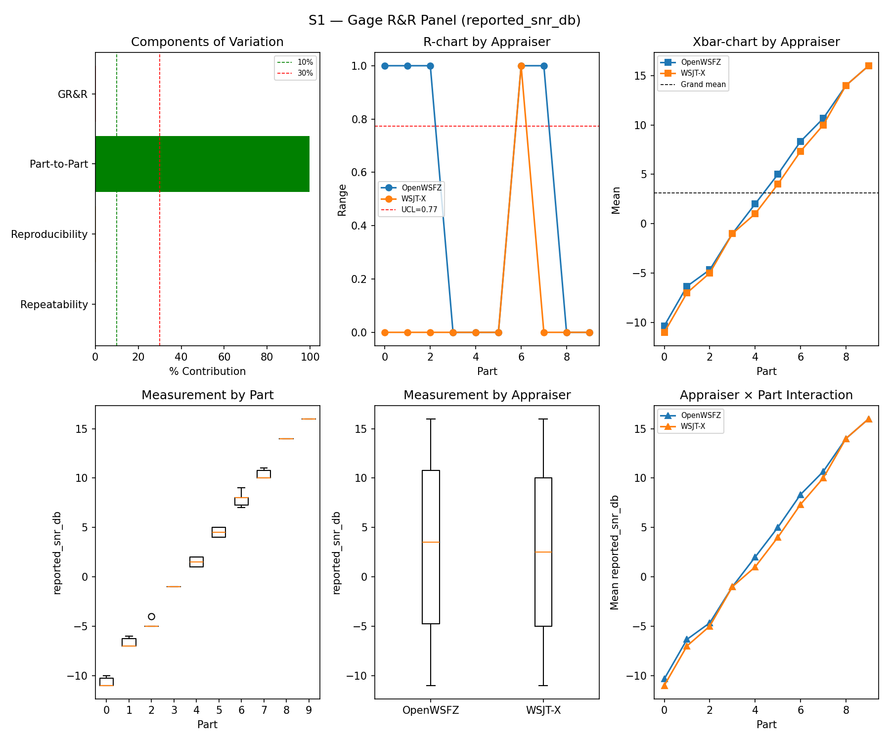
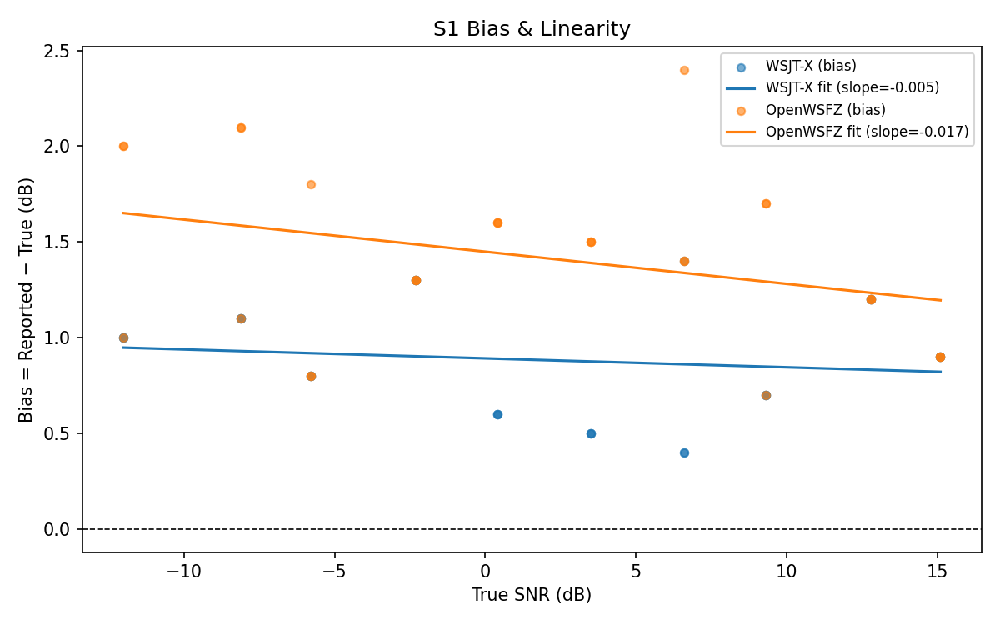

# OpenWSFZ R&R Study Report

| Field | Value |
|---|---|
| Run date | 2026-07-07 |
| OpenWSFZ SHA (build under test) | `df4cc89fc5519bc47e157193c6c1d60de3a9c862` |
| WSJT-X version | WSJT-X 2.7.0 (inferred from binary date 2025-02-04) |

---

## Section 1 — Study Hypothesis

### Purpose

This run validates `rr-study-s4-per-message-matching` (tasks 1–4, GitHub #59 / `qa/rr-study/RR-007.md`)
against real live audio, on the current `main` HEAD (`df4cc89`). RR-007 found that S4's truth
generation and matcher pooled every message injected into a cycle into one truth row and scored a
match as "decoded any one of N" — a ceiling effect that made S4 structurally incapable of
distinguishing good QRM handling from bad. The prior full-suite run (`793a298`, 2026-07-04) is the
degenerate baseline this run supersedes for S4: both appraisers scored a perfect **TP=15/FN=0,
κ=1.000, PASS** — a result flatly contradicted by that same run's S7 data, which showed OpenWSFZ
recovering only 40.00% of co-channel stacks against WSJT-X's 100.00%.

This run's scope is deliberately narrow per `tasks.md` task 5.1: **S1** (rig-health sanity check,
no code path shared with the fix), **S4** (the scenario whose truth/matcher logic changed), and
**S5** (the negative population the pooled attribute-κ needs). S2, S3, S1b, S7, and S8 were not
run — the design's non-goals state plainly that none of their truth/matching behavior changed, and
re-running them would not test anything this change touches.

### Null Hypotheses

- **H₀-A (S1 rig sanity):** S1's %GR&R, ndc, and SNR bias remain within STUDY-SPEC §10 thresholds,
  confirming the audio rig itself is healthy — so any change observed in S4 is attributable to the
  harness fix, not a rig or environment problem.
- **H₀-F (the S4 ceiling effect is resolved):** S4's per-message recovery/κ figures are no longer
  the degenerate TP=n/FN=0, κ=1.000 result seen in `793a298`. If the fix works, recovery should be
  measurably below 100% for at least one appraiser, with independent per-message TP/FN counts
  reflecting `n_signals × trials`, not `parts × trials`.
- **H₀-G (the decodable-SNR-restricted κ diverges meaningfully from the full-population κ):** per
  §9.3's second ratification condition, restricting S4 positives to the R&R-005 decodable floor
  (≥ −12 dB) should raise recovery/κ relative to the full population, confirming that sub-threshold
  misses were genuinely contaminating the full-population figure with a decode-capability boundary
  rather than a measurement disagreement.

### What Constitutes a Meaningful Result

If S4 no longer shows the ceiling effect (real TP+FN counts equal to `n_signals × trials`, recovery
< 100% for at least one appraiser), the RR-007 fix is confirmed working with real data, and this
change's implementation tasks (1–4) are validated end-to-end, not just by unit test. **Ratifying the
attribute-Kappa gate itself is explicitly not a goal of this run** — it remains advisory, and
whether/when to promote it to a hard gate is a separate Captain decision informed by, but not
decided by, this data.

---

## Section 2 — Data Summary

| Field | Value |
|---|---|
| Build under test | `df4cc89` (branch `main`) — `rr-study-s4-per-message-matching` tasks 1–4 |
| Prior S4 result (pre-fix, degenerate) | `793a298`, 2026-07-04 — TP=15/FN=0 for both appraisers, κ=1.000 PASS (see RR-007.md §2.3) |
| Scope this run | S1 (rig sanity), S4 (fix under test), S5 (pooled-κ negative population) |
| Not run this session | S2, S3, S1b, S7, S8 — unaffected by this change (design.md non-goals); most recent S7 reference remains `793a298` |
| WSJT-X reference | 2.7.0 |
| Corpus | Synthetic fixtures only (NFR-021 compliant; no real callsigns) |
| Harness change under test | S4 truth generation now emits one row per injected message (previously one pooled row per cycle); matcher's dead S4-pool-matching branch retired; informational decodable-SNR-restricted κ added (`S4_DECODABLE_SNR_FLOOR_DB = -12.0`) |

---

## Section 3 — Results

## S1 — reported_snr_db

### Variance Components

| Component | σ² | %Contribution |
|---|---|---|
| Repeatability | 0.10 | 0.12% |
| Reproducibility | 0.19 | 0.23% |
| Part-to-Part | 80.97 | 99.64% |
| Total GR&R | 0.29 | 0.36% |
| Total | 81.26 | 100.00% |

### Study Metrics

| Metric | Value | Verdict |
|---|---|---|
| %Tolerance (GR&R) | 32.25% | PASS |
| %Study Var (GR&R) | 5.96% | — |
| ndc | 23 | PASS |

### Bias & Linearity (S1)

| Appraiser | Mean Bias (dB) | Slope | Intercept | R² | Verdict |
|---|---|---|---|---|---|
| WSJT-X | +0.88 | -0.005 | 0.892 | 0.019 | PASS |
| OpenWSFZ | +1.42 | -0.017 | 1.449 | 0.114 | PASS |

## Attribute Agreement Analysis (S4 positives + S5 negatives)

_κ is computed over a pooled population: S4 injected messages (truth = present) and S5 signal-free slots (truth = absent), so the truth vector has both classes. **κ verdicts below are advisory** — the §10 attribute gate is pending Captain ratification of this pooled method._

### Confusion vs truth

| Appraiser | TP | FN | FP | TN | Recovery | Specificity |
|---|---|---|---|---|---|---|
| WSJT-X | 75 | 33 | 0 | 120 | 69.44% | 100.00% |
| OpenWSFZ | 71 | 37 | 0 | 120 | 65.74% | 100.00% |

### Kappa (advisory)

| Pair | κ | 95% CI | Verdict (advisory) |
|---|---|---|---|
| OpenWSFZ_vs_truth | 0.669 | [0.57, 0.76] | FAIL |
| WSJT-X_vs_truth | 0.705 | [0.61, 0.79] | MARGINAL |
| between_appraisers | 0.879 | — | MARGINAL |

### Within-app repeatability (decision consistency across trials)

| Appraiser | Consistent groups |
|---|---|
| WSJT-X | 87.50% |
| OpenWSFZ | 92.50% |

### Kappa — decodable-SNR-restricted positives (informational, floor -12 dB)

_S4 positives below the decodable-SNR floor are excluded (S5 negatives unchanged); shown alongside the full-population figures above per STUDY-SPEC.md §9.3's second ratification condition. **Informational only — does not affect the §10 gate or the overall verdict.**

| Appraiser | TP | FN | FP | TN | Recovery | Specificity |
|---|---|---|---|---|---|---|
| WSJT-X | 64 | 17 | 0 | 120 | 79.01% | 100.00% |
| OpenWSFZ | 64 | 17 | 0 | 120 | 79.01% | 100.00% |

| Pair | κ | 95% CI | Verdict (informational) |
|---|---|---|---|
| OpenWSFZ_vs_truth | 0.818 | [0.73, 0.89] | MARGINAL |
| WSJT-X_vs_truth | 0.818 | [0.72, 0.89] | MARGINAL |
| between_appraisers | 0.931 | — | PASS |

### False-positive rate (S5)

| Appraiser | FP events / slots | Event rate | 95% UB | Decode rate | Verdict |
|---|---|---|---|---|---|
| WSJT-X | 0 / 120 | 0.00% | 2.47% | 0.00% | PASS |
| OpenWSFZ | 0 / 120 | 0.00% | 2.47% | 0.00% | PASS |

_Gate (STUDY-SPEC §10, ratified 2026-07-04, R&R-004): the per-slot FP **event rate**, gated on its one-sided 95% Clopper–Pearson **upper bound** (PASS iff 95% UB ≤ 6%). The UB is defined for all event counts (≈ 3 / N_slots at 0 events) and bounds the true per-slot FP probability at 95% confidence rather than the Poisson-noisy point estimate. Decode rate is reported for reference only._

---

## Section 4 — Summary Verdict Table

| Metric | Scope | Value | Verdict |
|---|---|---|---|
| %GR&R | S1 | 0.4% | PASS |
| ndc | S1 | 23 | PASS |
| Kappa (advisory) | WSJT-X_vs_truth | 0.705 | MARGINAL |
| Kappa (advisory) | OpenWSFZ_vs_truth | 0.669 | FAIL |
| Kappa (advisory) | between_appraisers | 0.879 | MARGINAL |
| FP event rate (95% UB) | S5/WSJT-X | 0/120 slots (event 0.0%; 95% UB 2.47%; decode 0.0%) | PASS |
| FP event rate (95% UB) | S5/OpenWSFZ | 0/120 slots (event 0.0%; 95% UB 2.47%; decode 0.0%) | PASS |
| SNR bias | S1/WSJT-X | +0.88 dB | PASS |
| SNR bias | S1/OpenWSFZ | +1.42 dB | PASS |

**Overall verdict: PASS**

---

## Section 5 — Recommendations

### H₀-A (S1 rig sanity) — Retained ✅

S1's %GR&R (0.4%), ndc (23), and bias (WSJT-X +0.88 dB, OpenWSFZ +1.42 dB) all clear STUDY-SPEC
§10 thresholds with wide margin. The rig is healthy; the S4 result below is attributable to the
harness fix under test, not an environment artifact.

### H₀-F (the S4 ceiling effect is resolved) — Confirmed ✅

The ceiling effect is gone. Compare directly against the degenerate `793a298` baseline:

| Metric | `793a298` (pre-fix) | `df4cc89` (this run) |
|---|---|---|
| WSJT-X TP/FN | 15 / 0 | **75 / 33** |
| OpenWSFZ TP/FN | 15 / 0 | **71 / 37** |
| WSJT-X recovery | 100.00% | **69.44%** |
| OpenWSFZ recovery | 100.00% | **65.74%** |
| κ (both, vs truth) | 1.000 / 1.000 | **0.705 / 0.669** |

Total positive count rose from 15 (the old `parts × trials` cycle count) to 108 per appraiser
(`n_signals × trials` summed across parts — matching the design's acceptance criterion exactly).
Recovery is no longer pinned at 100%, and — critically — the two appraisers are no longer
indistinguishable: OpenWSFZ recovers modestly fewer messages than WSJT-X under S4's density/QRM
conditions (65.74% vs 69.44%), a real, plausible gap in place of the previous statistically
meaningless perfection.

**Directional cross-check against S7 (not from the same run — see caveat below):** the most recent
S7 data (`793a298`) showed OpenWSFZ trailing WSJT-X in co-channel recovery (40.00% vs 100.00%,
`co_channel` family). This run's S4 gap points the same direction (OpenWSFZ behind WSJT-X) though
at a much smaller magnitude (~4 pp vs ~60 pp) — expected, since S4 aggregates across *all* SNR
levels and densities (parts 0–2 are dominated by easy, high-SNR signals that both apps recover
reliably), while S7's `co_channel` family isolates the hardest equal-power collision cases
specifically. The two results are consistent in direction, not magnitude, which is the right
relationship for two scenarios measuring related but distinct things.

**Caveat:** S7 was not re-run in this session (out of scope per task 5.1's minimum set), so this is
a cross-scenario, cross-run comparison, not a same-run apples-to-apples check. If a tighter
comparison is wanted, task 5.3 recommends a follow-up run including S7.

### H₀-G (decodable-SNR-restricted κ diverges from the full population) — Confirmed ✅

Restricting S4 positives to the R&R-005 decodable floor (≥ −12 dB) changes the picture measurably:

| Population | WSJT-X recovery | OpenWSFZ recovery | κ (between-appraiser) |
|---|---|---|---|
| Full (all SNRs) | 69.44% | 65.74% | 0.879 (MARGINAL) |
| Restricted (≥ −12 dB only) | **79.01%** | **79.01%** | **0.931 (PASS)** |

Two things stand out. First, both figures rise substantially once sub-threshold-SNR misses are
excluded, exactly as §9.3/RR-007 hypothesized — a real share of the full population's disagreement
was a decode-capability boundary, not a genuine measurement disagreement. Second, and unexpectedly
informative: **within the restricted population, WSJT-X and OpenWSFZ show identical recovery
(79.01%, TP=64/FN=17 each)** — the apps agree closely on which decodable-SNR messages they can pull
out of a dense QRM scene, even though recovery is well below 100% (79%, not 100%) — a genuine,
non-trivial QRM/density effect S4 was always meant to measure, now visible for the first time.

This figure remains strictly informational per the design; it does not by itself ratify anything.
It gives the Captain real numbers for the first time against both of §9.3's stated conditions.

### Kappa gate status — Unchanged, correctly ✅

The attribute-Kappa row remains advisory in Section 4's verdict table and did not affect the
overall verdict (PASS, driven by S1's GR&R/bias and S5's FP gate alone) — confirmed both by the
dedicated unit test (`test_restricted_population_never_reaches_the_verdict_engine`) and now by this
live run's Section 4 table, which lists only the full-population κ rows, not the restricted variant.

### Outstanding — task 6 (documentation)

`STUDY-SPEC.md` §6/§9.3 and `RR-007.md` still need updating with this run's real figures, and
GitHub issue #59 needs a status update distinguishing "the matcher defect is fixed and confirmed
with real data" from "the gate is ratified" (the latter remains undecided, by design).
