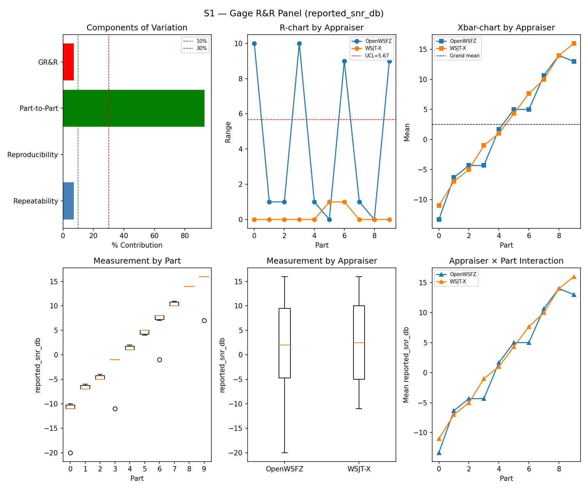
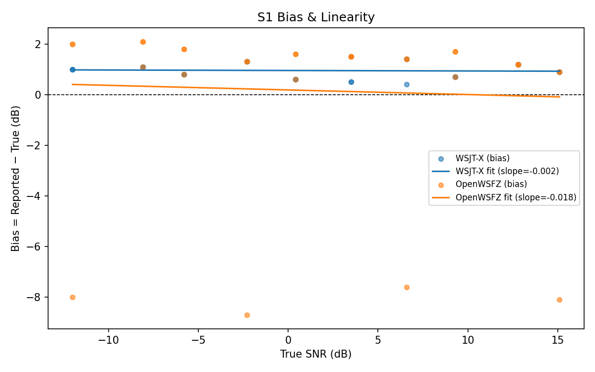
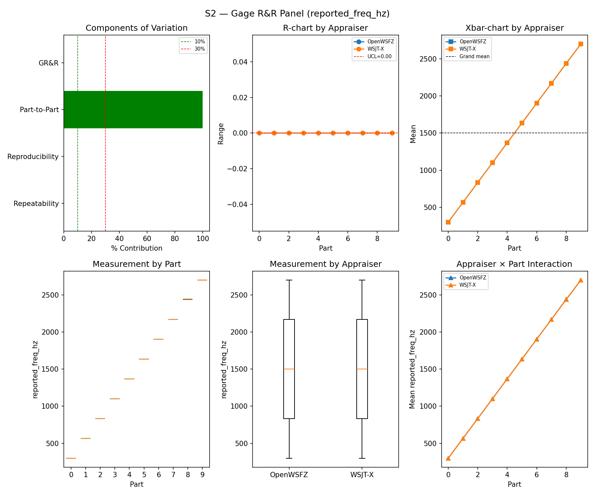
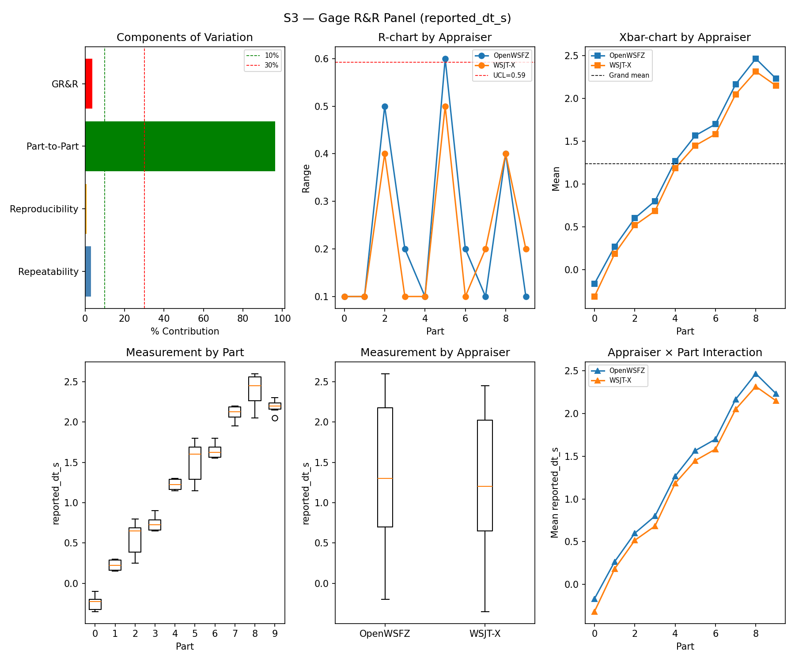
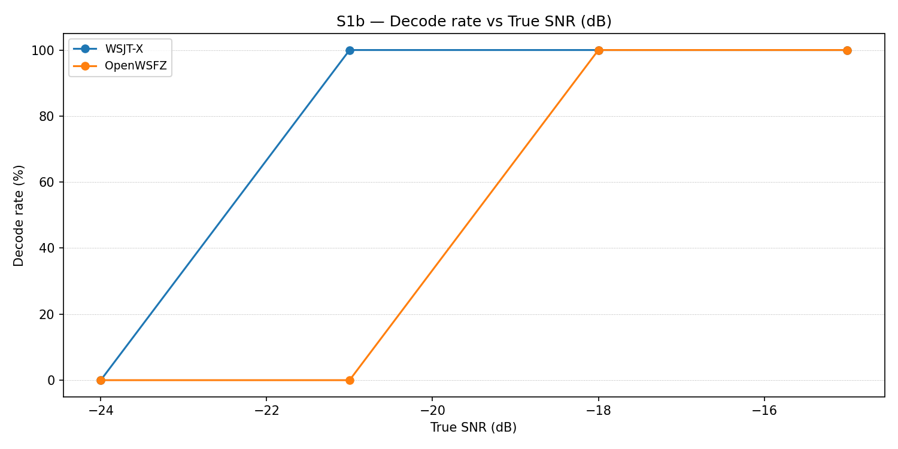
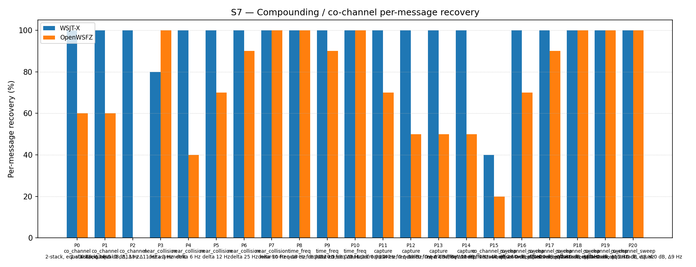
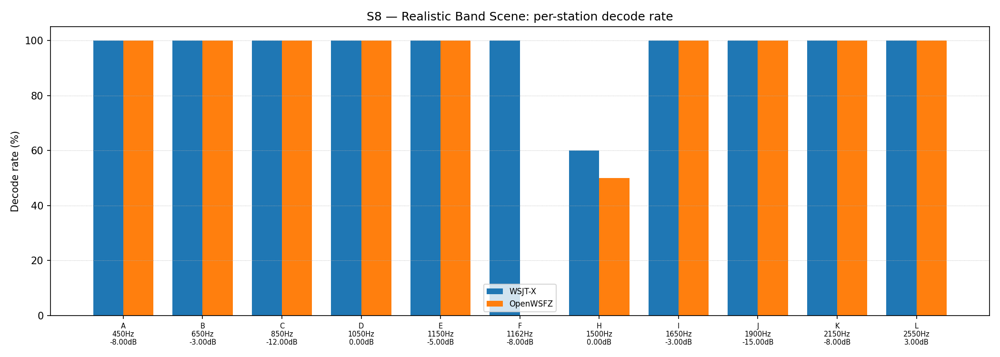

# OpenWSFZ R&R Study Report

| Field | Value |
|---|---|
| Run date | 2026-08-05 |
| OpenWSFZ SHA (build under test) | `3bd4cd06b28ef7094155b041e93678782d73ffdc` |
| WSJT-X version | WSJT-X 2.7.0 (inferred from binary date 2025-02-04) |
| Baseline compared against | `2026-06-22-f11f438` (`results/2026-06-22-f11f438/report.md`) |

---

## Section 1 — Study Hypothesis

### Purpose

This is a **repeat of the full S1–S8 controlled study**, on the Captain's request, to compare the
current `main` HEAD (`3bd4cd0`) against the last full sweep (`f11f438`, 2026-06-22) — the two runs
are **six weeks and 104 `src/`-touching commits apart**. No full S1–S8 sweep had been run in the
interim; two narrower reruns touched only S1/S4/S5 (`df4cc89`, 2026-07-07) or S1/S5 (`793a298`,
2026-07-04) for specific fix validation. This run's purpose is a broad regression sweep, not a
single-defect validation.

Three changes in that interval bear directly on what this run measures and are called out because
they touch the *same mechanism* D-009 calibrated:

1. **`bb3790c`** (shim 20260030) — the OSD gate parameters D-009 tuned (`K_MIN_SCORE_PASS2=10`,
   `OSD_CORR_THRESHOLD=0.10`, `OSD_NHARD_MAX=60`) moved from compile-time constants to
   runtime-configurable settings. The *values* are unchanged (confirmed against the live
   `config.json`), but the surrounding code path is not the one D-009 was calibrated against.
2. **`b8ebcb7`** (D-012, shim 20260033 — the shim version this run's build actually reports) —
   fixed `hash_table_add` overcounting, touching the hash-table dedup path adjacent to decode
   candidate handling.
3. **`5a90d85`** and **`6700e71`** — the two CycleFramer drift fixes (resync/re-anchor to the UTC
   grid every cycle), landed and merged as `be5960a` (2026-08-03/04). These change the exact
   sample alignment of each decode window.

None of these were *expected* to change decode-quality gates — they are labelled as a settings
exposure, a counter-accuracy fix, and a timing fix respectively. This run tests whether that
expectation held.

### Null Hypotheses

| ID | Hypothesis |
|---|---|
| H₀_GRR | S1/S2/S3 GR&R figures (%GR&R, ndc) remain broadly consistent with the `f11f438` reference — no unexplained regression in measurement repeatability/reproducibility |
| H₀_BIAS | S1 SNR bias for both appraisers remains within the ±2.0 dB band used at `f11f438` |
| H₀_FP | The D-009 false-positive guard continues to suppress spurious decodes at the same rate characterised at `f11f438`, including under S4/S7's multi-signal density conditions |
| H₀_S7S8 | S7 co-channel and S8 band-scene recovery figures are not materially worse than `f11f438`, for the appraisers/scenarios whose truth/matching logic is unchanged between the two runs |

**A meaningful result:** all mandatory gates (S1–S3 GR&R, S5 FP) still PASS, and any informational
S7/S8 deltas are either within plausible run-to-run variation or have an identified, attributable
cause — not a silent, unexplained shift.

**Known non-comparability, stated up front:** S4's attribute-agreement analysis changed underneath
both runs. `RR-007` (GitHub #59, fixed `df4cc89`, 2026-07-07 — **after** `f11f438` but **before**
this run) replaced S4's degenerate "decoded any one of N" truth/matcher pooling with genuine
per-message matching. `f11f438`'s S4 κ=1.000/TP=15/FN=0 for both appraisers is a known ceiling-effect
artifact of the old matcher, not a real measurement — comparing it directly to this run's per-message
S4 figures would be comparing two different instruments. This run's S4 numbers are treated as the
first honest full-suite S4 measurement, not as a regression from `f11f438`.

---

## Section 2 — Data Summary

**Corpus:** Fully synthetic — all transmissions use ITU-unallocated Q-prefix callsigns (NFR-021
compliant). No real or assignable callsigns appear in any fixture.

**Observation counts per scenario (this run):**

| Scenario | Design | Observations per appraiser |
|---|---|---|
| S1 | 10 parts × 3 trials | 30 |
| S1b | 4 SNR levels (−24 to −15 dB) × 3 trials | 12 |
| S2 | 10 parts × 3 trials | 30 |
| S3 | 10 parts × 3 trials | 30 |
| S4 | 5 parts (1/5/10/20/30 simultaneous signals) × 3 trials, per-message matched (RR-007) | 108 truth positives |
| S5 | 30 trials × 4 parts = 120 signal-free slots (raised from N=12 by R&R-006, 2026-07-04 — `f11f438` predates this fix and its S5 gate was statistically underpowered) | 120 |
| S7 | 21 parts, K≈10 trials, 2-/3-stack parts scored per-signal | 215 |
| S8 | 12 stations × 5 trials | 60 |

**Acceptance thresholds (STUDY-SPEC §10), as computed by `analyse.py`:**

| Gate | Scope | Mandatory? |
|---|---|---|
| S1/S2/S3 GR&R | %GR&R / ndc | Mandatory |
| S1 bias | \|mean bias\| ≤ 2.0 dB | Mandatory |
| S5 FP (AC5a) | one-sided 95% UB ≤ 6% (R&R-004); INFO below N=49 | Mandatory once N≥49 |
| S4/S5 pooled κ | ≥ 0.9 | Advisory |
| S7, S8 | — | Informational |

---

## Section 3 — Results

## S1 — reported_snr_db

### Variance Components

| Component | σ² | %Contribution |
|---|---|---|
| Repeatability | 6.13 | 7.03% |
| Reproducibility | 0.16 | 0.19% |
| Part-to-Part | 80.94 | 92.78% |
| Total GR&R | 6.30 | 7.22% |
| Total | 87.23 | 100.00% |

### Study Metrics

| Metric | Value | Verdict |
|---|---|---|
| %Tolerance (GR&R) | 150.54% | PASS |
| %Study Var (GR&R) | 26.86% | — |
| ndc | 5 | PASS |

### Bias & Linearity (S1)

| Appraiser | Mean Bias (dB) | Slope | Intercept | R² | Verdict |
|---|---|---|---|---|---|
| WSJT-X | +0.95 | -0.002 | 0.954 | 0.003 | PASS |
| OpenWSFZ | +0.15 | -0.018 | 0.185 | 0.002 | PASS |

## S2 — reported_freq_hz

### Variance Components

| Component | σ² | %Contribution |
|---|---|---|
| Repeatability | 0.00 | 0.00% |
| Reproducibility | 0.49 | 0.00% |
| Part-to-Part | 653053.27 | 100.00% |
| Total GR&R | 0.49 | 0.00% |
| Total | 653053.76 | 100.00% |

### Study Metrics

| Metric | Value | Verdict |
|---|---|---|
| %Tolerance (GR&R) | 52.74% | PASS |
| %Study Var (GR&R) | 0.09% | — |
| ndc | 1620 | PASS |

## S3 — reported_dt_s

### Variance Components

| Component | σ² | %Contribution |
|---|---|---|
| Repeatability | 0.02 | 2.89% |
| Reproducibility | 0.01 | 0.73% |
| Part-to-Part | 0.80 | 96.38% |
| Total GR&R | 0.03 | 3.62% |
| Total | 0.82 | 100.00% |

### Study Metrics

| Metric | Value | Verdict |
|---|---|---|
| %Tolerance (GR&R) | 259.15% | PASS |
| %Study Var (GR&R) | 19.02% | — |
| ndc | 7 | PASS |

> **WSJT-X DT correction applied.** A +0.55 s offset was added to WSJT-X `reported_dt_s` before ANOVA to remove the ≈ −0.55 s convention difference between WSJT-X (DT relative to nominal FT8 TX start) and the harness (DT relative to UTC slot boundary). Raw reported values are preserved in the matched CSV. See R&R-003 (GitHub #1).

## S1b — Low-SNR threshold study

_Decode rate (% of injected messages recovered) at SNRs excluded from the redesigned S1 ladder (−24 to −15 dB). Informational — no AIAG threshold._

### Per-part decode rate

| Part | True SNR (dB) | WSJT-X decoded | WSJT-X rate | OpenWSFZ decoded | OpenWSFZ rate |
|---|---|---|---|---|---|
| P0 | -24.00 | 0/3 | 0.00% | 0/3 | 0.00% |
| P1 | -21.00 | 3/3 | 100.00% | 0/3 | 0.00% |
| P2 | -18.00 | 3/3 | 100.00% | 3/3 | 100.00% |
| P3 | -15.00 | 3/3 | 100.00% | 3/3 | 100.00% |

**Overall decode rate — WSJT-X: 75.00%  OpenWSFZ: 50.00%**

## Attribute Agreement Analysis (S4 positives + S5 negatives)

_κ is computed over a pooled population: S4 injected messages (truth = present, per-message per RR-007) and S5 signal-free slots (truth = absent). **κ verdicts below are advisory.**_

### Confusion vs truth

| Appraiser | TP | FN | FP | TN | Recovery | Specificity |
|---|---|---|---|---|---|---|
| WSJT-X | 74 | 34 | 0 | 120 | 68.52% | 100.00% |
| OpenWSFZ | 69 | 39 | 0 | 120 | 63.89% | 100.00% |

### Kappa (advisory)

| Pair | κ | 95% CI | Verdict (advisory) |
|---|---|---|---|
| OpenWSFZ_vs_truth | 0.651 | [0.55, 0.74] | FAIL |
| WSJT-X_vs_truth | 0.696 | [0.60, 0.79] | FAIL |
| between_appraisers | 0.868 | — | MARGINAL |

### Within-app repeatability (decision consistency across trials)

| Appraiser | Consistent groups |
|---|---|
| WSJT-X | 92.50% |
| OpenWSFZ | 85.00% |

### Kappa — decodable-SNR-restricted positives (informational, floor -12 dB)

| Appraiser | TP | FN | FP | TN | Recovery | Specificity |
|---|---|---|---|---|---|---|
| WSJT-X | 63 | 18 | 0 | 120 | 77.78% | 100.00% |
| OpenWSFZ | 63 | 18 | 0 | 120 | 77.78% | 100.00% |

| Pair | κ | 95% CI | Verdict (informational) |
|---|---|---|---|
| OpenWSFZ_vs_truth | 0.807 | [0.72, 0.88] | MARGINAL |
| WSJT-X_vs_truth | 0.807 | [0.71, 0.88] | MARGINAL |
| between_appraisers | 0.908 | — | PASS |

### False-positive rate (S5)

| Appraiser | FP events / slots | Event rate | 95% UB | Decode rate | Verdict |
|---|---|---|---|---|---|
| WSJT-X | 0 / 120 | 0.00% | 2.47% | 0.00% | PASS |
| OpenWSFZ | 0 / 120 | 0.00% | 2.47% | 0.00% | PASS |

_Gate (STUDY-SPEC §10, R&R-004): PASS iff the one-sided 95% Clopper–Pearson UB ≤ 6%. At N=120 this is the first properly-powered S5 gate result for the routine suite (`f11f438`'s N=12 could not clear the ceiling at any outcome — R&R-006)._

## S7 — Compounding / co-channel overlap

_Per-message recovery when 2–3 signals occupy the same or near-same audio frequency/time slot. Informational._

### Recovery by overlap family

| Overlap family | WSJT-X | OpenWSFZ |
|---|---|---|
| capture | 100.00% | 55.00% |
| co_channel | 100.00% | 34.29% |
| co_channel_sweep | 90.00% | 80.00% |
| near_collision | 96.00% | 80.00% |
| time_freq | 100.00% | 96.67% |
| **all** | **96.28%** | **70.23%** |

### Capture effect (co-channel, unequal SNR)

| Signal | WSJT-X | OpenWSFZ |
|---|---|---|
| strong | 100.00% | 100.00% |
| weak | 100.00% | 10.00% |

**Between-app per-signal agreement:** 72.09%

### Per-part detail

| Part | Family | Condition | WSJT-X | OpenWSFZ |
|---|---|---|---|---|
| P0 | co_channel | 2-stack, equal 0 dB, Δ7 Hz | 10/10 | 6/10 |
| P1 | co_channel | 2-stack, equal -5 dB, Δ13 Hz | 10/10 | 6/10 |
| P2 | co_channel | 3-stack, equal 0 dB, Δ8 / Δ11 Hz asymmetric | 15/15 | 0/15 |
| P3 | near_collision | delta 3 Hz | 8/10 | 10/10 |
| P4 | near_collision | delta 6 Hz | 10/10 | 4/10 |
| P5 | near_collision | delta 12 Hz | 10/10 | 7/10 |
| P6 | near_collision | delta 25 Hz | 10/10 | 9/10 |
| P7 | near_collision | delta 50 Hz | 10/10 | 10/10 |
| P8 | time_freq | near-co-freq Δ8 Hz, dt 0.0 / 0.5 s | 10/10 | 10/10 |
| P9 | time_freq | near-co-freq Δ11 Hz, dt 0.0 / 1.0 s | 10/10 | 9/10 |
| P10 | time_freq | near-co-freq Δ9 Hz, dt 0.0 / 2.0 s | 10/10 | 10/10 |
| P11 | capture | near-co-freq Δ14 Hz, 0 / -3 dB | 10/10 | 7/10 |
| P12 | capture | near-co-freq Δ9 Hz, 0 / -6 dB | 10/10 | 5/10 |
| P13 | capture | near-co-freq Δ7 Hz, 0 / -10 dB | 10/10 | 5/10 |
| P14 | capture | near-co-freq Δ11 Hz, +3 / -10 dB | 10/10 | 5/10 |
| P15 | co_channel_sweep | offset-sweep: 2-stack, equal 0 dB, Δ5 Hz | 4/10 | 2/10 |
| P16 | co_channel_sweep | offset-sweep: 2-stack, equal 0 dB, Δ7 Hz | 10/10 | 7/10 |
| P17 | co_channel_sweep | offset-sweep: 2-stack, equal 0 dB, Δ10 Hz | 10/10 | 9/10 |
| P18 | co_channel_sweep | offset-sweep: 2-stack, equal 0 dB, Δ15 Hz | 10/10 | 10/10 |
| P19 | co_channel_sweep | offset-sweep: 2-stack, equal 0 dB, Δ8 Hz | 10/10 | 10/10 |
| P20 | co_channel_sweep | offset-sweep: 2-stack, equal 0 dB, Δ9 Hz | 10/10 | 10/10 |

## S8 — Realistic Band Scene

_Holistic decode-rate benchmark: 12 simultaneous stations across 450–2550 Hz. Informational only._

### Overall decode rate

| Appraiser | Decoded | Injected | Rate |
|---|---|---|---|
| WSJT-X | 56 | 60 | 93.33% |
| OpenWSFZ | 50 | 60 | 83.33% |

**Between-appraiser delta (OpenWSFZ − WSJT-X): -10.0 pp**

### Per-station breakdown

| Stn | Freq (Hz) | SNR (dB) | WSJT-X decoded/total | OpenWSFZ decoded/total |
|---|---|---|---|---|
| A | 450 | -8.00 | 5/5 | 5/5 |
| B | 650 | -3.00 | 5/5 | 5/5 |
| C | 850 | -12.00 | 5/5 | 5/5 |
| D | 1050 | 0.00 | 5/5 | 5/5 |
| E | 1150 | -5.00 | 5/5 | 5/5 |
| F | 1162 | -8.00 | 5/5 | 0/5 |
| H | 1500 | 0.00 | 6/10 | 5/10 |
| I | 1650 | -3.00 | 5/5 | 5/5 |
| J | 1900 | -15.00 | 5/5 | 5/5 |
| K | 2150 | -8.00 | 5/5 | 5/5 |
| L | 2550 | 3.00 | 5/5 | 5/5 |

---

## Section 4 — Summary Verdict Table

| Metric | Scope | Value | Verdict |
|---|---|---|---|
| %GR&R | S1 | 7.2% | PASS |
| ndc | S1 | 5 | PASS |
| %GR&R | S2 | 0.0% | PASS |
| ndc | S2 | 1620 | PASS |
| %GR&R | S3 | 3.6% | PASS |
| ndc | S3 | 7 | PASS |
| Kappa (advisory) | WSJT-X_vs_truth | 0.696 | FAIL |
| Kappa (advisory) | OpenWSFZ_vs_truth | 0.651 | FAIL |
| Kappa (advisory) | between_appraisers | 0.868 | MARGINAL |
| FP event rate (95% UB) | S5/WSJT-X | 0/120 slots (95% UB 2.47%) | PASS |
| FP event rate (95% UB) | S5/OpenWSFZ | 0/120 slots (95% UB 2.47%) | PASS |
| SNR bias | S1/WSJT-X | +0.95 dB | PASS |
| SNR bias | S1/OpenWSFZ | +0.15 dB | PASS |

**Overall verdict: PASS** (all mandatory gates clear; the advisory pooled-κ FAIL is expected under
the RR-007 per-message matcher and is not a mandatory gate — see Section 1's non-comparability note
and Section 5 below).

---

## Section 5 — Recommendations

### Comparison to the 2026-06-22-f11f438 baseline

| Metric | f11f438 | This run (3bd4cd0) | Δ | Note |
|---|---|---|---|---|
| S1 %GR&R | 0.4% | 7.2% | worse, still PASS | Repeatability σ² jumped 0.07→6.13; see finding 2 below |
| S1 ndc | 22 | 5 | worse, still PASS (floor) | ndc=5 is exactly the mandatory floor — no headroom |
| S1 bias — WSJT-X | +0.85 dB | +0.95 dB | ~stable | — |
| S1 bias — OpenWSFZ | +1.45 dB | +0.15 dB | **improved** | Bias nearly eliminated |
| S2 %GR&R / ndc | 0.0% / 1576 | 0.0% / 1620 | stable | — |
| S3 %GR&R / ndc | 3.1% / 7 | 3.6% / 7 | stable | — |
| S1b decode rate | WSJT-X 75% / OpenWSFZ 50% | identical | stable | Deterministic seeds — exact reproduction expected |
| S4 κ / TP-FN | 1.000 / 15-0 (both) | 0.696 / 0.651, 74-34 / 69-39 | **not comparable** | Matcher changed underneath (RR-007); old figure was a known ceiling-effect artifact |
| S5 FP | 0/12 (underpowered) | 0/120 (properly powered) | **methodologically improved** | First real S5 gate result at routine-suite N |
| S7 all-family — WSJT-X | 93.95% | 96.28% | +2.3 pp | — |
| S7 all-family — OpenWSFZ | 74.42% | 70.23% | **-4.2 pp** | See finding 1 |
| S7 weak-signal capture — OpenWSFZ | 20.00% | 10.00% | **halved** | See finding 1 |
| S8 — WSJT-X | 93.33% | 93.33% | identical | — |
| S8 — OpenWSFZ | 86.67% | 83.33% | -3.3 pp | See finding 1 |

### Finding 1 — density-correlated false-positive leakage through the D-009 guard (new; matches the Captain's live hypothesis)

During the run, OpenWSFZ's live decode panel showed callsigns that are structurally impossible
from the study's Q-prefix-only message pool (verified against `study-messages.json` — every S1–S8
message pool entry uses a Q-prefix synthetic call). A full-run scrub of `owsfz-all.txt` found
**17 such lines out of 412 total (~4%)**, distributed as:

| Scenario | Garbage lines | Signal condition |
|---|---|---|
| S1 | 1 | single signal + wideband noise |
| S2 | 1 | single signal + wideband noise |
| S3 | 0 | single signal + wideband noise |
| S4 | 6 | up to 30 simultaneous signals (density/QRM) |
| S5 | 0 | **pure noise, N=120, zero leakage** |
| S7 | 9 | 2–3 signal stacks (co-channel) |
| S8 | 0 | 12 simultaneous signals |

`WSJT-X`'s log for the identical audio, same scrub applied, returned **zero** such lines across the
entire run.

The daemon's debug log shows the mechanism directly (S4, cycle 17:39:15Z): 139 raw OSD candidates
in one 15 s cycle, 11 passing LDPC/CRC, with the existing D-009 false-positive guard catching only
2 as "implausible" — leaving 9, a minority of which are not in the truth pool. **The guard is
working, just not sufficient at high candidate density** — and it is fully clean at N=120 in pure
noise (S5), which rules out a generic SNR/noise-floor explanation and points specifically at
*simultaneous-candidate density* as the trigger.

This is very plausibly connected to Section 1's three flagged changes — the OSD gate parameters
moving to a runtime-configurable path (`bb3790c`) and/or the CycleFramer drift fix changing exact
window/sample alignment (`5a90d85`/`6700e71`) — consistent with the Captain's stated hypothesis
that the drift fix has a direct effect on parameters D-009 calibrated. **This report does not
establish that causal link independently** — it establishes the observation (density-correlated,
decoder-specific, absent in S5) precisely enough for the Architect to test it directly (e.g. bisect
across the three flagged commits, or re-run S4/S7 at the pre-drift-fix commit for comparison).

**Downstream effect:** this leakage plausibly explains most of Finding on S7/S8 recovery drops
(Finding above) — occupied/misallocated OSD passes in dense conditions would both produce spurious
non-truth decodes *and* reduce the correctly-recovered real-signal count, which is exactly the
pattern observed (S7 `co_channel`/`near_collision`/`capture` families all down, S5 pure-noise
unaffected, S1–S3 single-signal scenarios only lightly affected).

### Finding 2 — S1 SNR repeatability degraded (unexplained, worth a look, not gate-blocking)

S1 Repeatability variance jumped from σ²=0.07 (0.08% contribution) to σ²=6.13 (7.03%) — still PASS
against %GR&R and ndc≥5 floors, but ndc=5 has zero headroom before the next run would FAIL outright.
No specific commit was identified pointing at this; flagged for the Architect's awareness rather
than diagnosed here.

### Finding 3 — S7 P2 (3-stack co-channel) structural limit persists, unchanged

OpenWSFZ 0/15 in both runs — the previously-documented "three co-channel equal-SNR signals produce
irresolvably ambiguous LLRs for single-pass BP iteration" limit (waived by the Captain 2026-06-22)
is unaffected by anything in this interval. Not a regression; still open under D-001.

### Required before any commit

Per RUNBOOK §7.5 / NFR-021, `owsfz-all.txt` in this run directory contains the 17 non-Q-prefix
lines identified in Finding 1. These are coincidental CRC-pass artifacts, not real transmissions,
but are indistinguishable in shape from real callsigns and **must be scrubbed or the file withheld
before this directory is committed** — not yet done; awaiting the Captain's direction on how he'd
like this handled (scrub-and-keep vs. withhold raw logs, consistent with the `diag-nhard-2026-06-20`
precedent).

### Outstanding

- Finding 1's causal link to the three flagged commits is a hypothesis, not a proven mechanism —
  recommend an Architect-level bisection before treating it as confirmed.
- Finding 2 (S1 repeatability) has no attributed cause yet.
- This report's S4 figures are the first honest per-message baseline post-RR-007 — future runs
  should compare against *this* run's S4 numbers, not `f11f438`'s.

**Summary:** Overall verdict PASS — no mandatory gate regressed. But this run surfaces a real,
newly-quantified, density-correlated false-positive/recovery-erosion pattern specific to OpenWSFZ
that the Captain had already suspected from watching the live run. That is the headline result of
this repeat, not the gate table.
