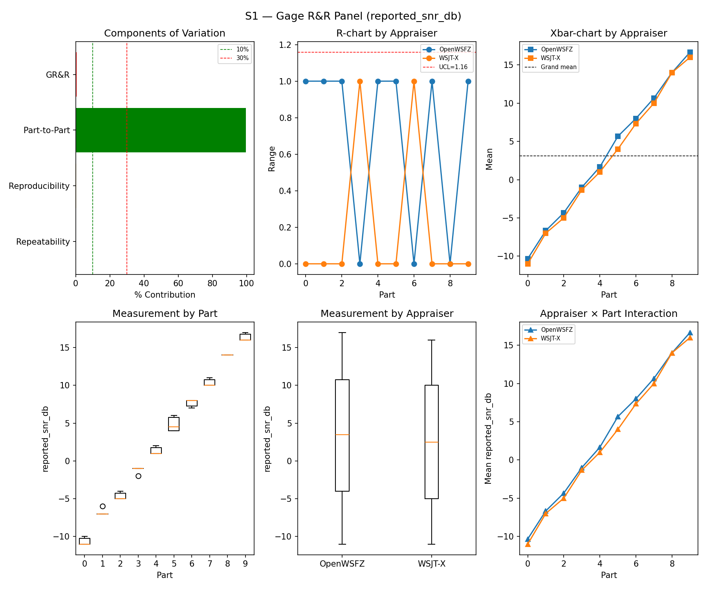
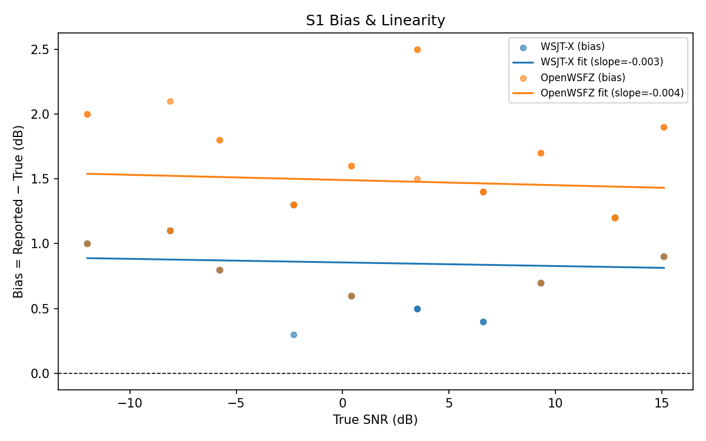
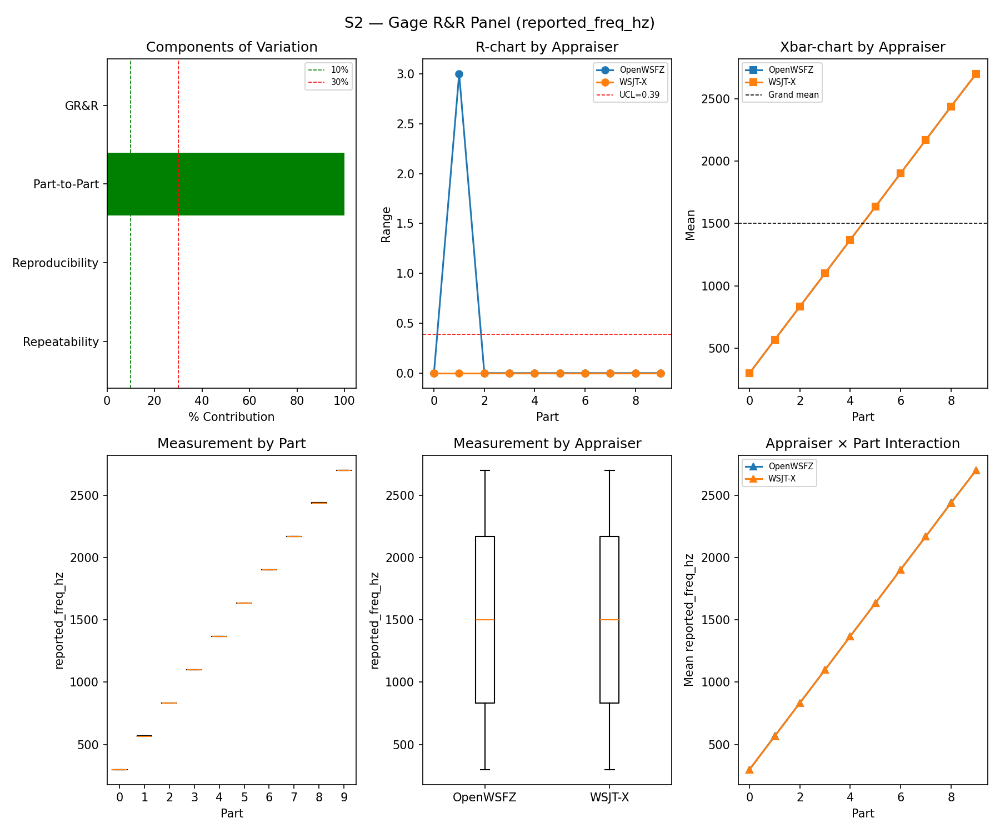
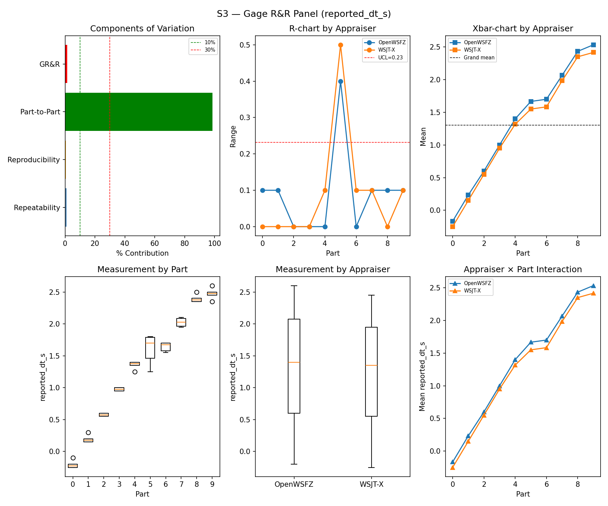
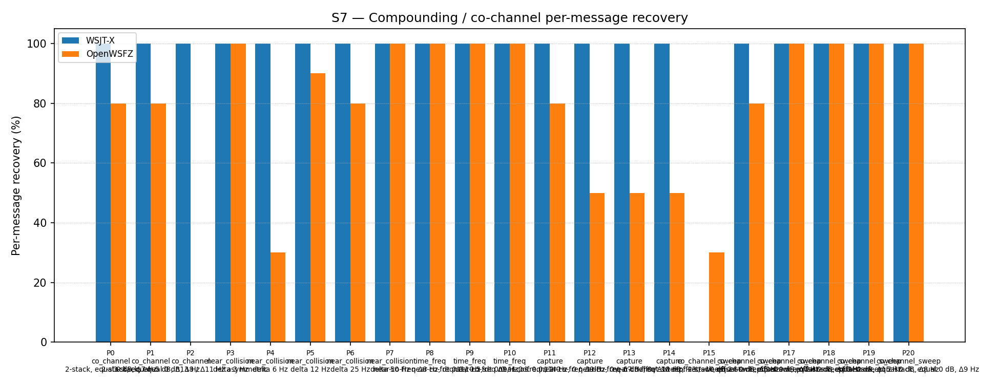
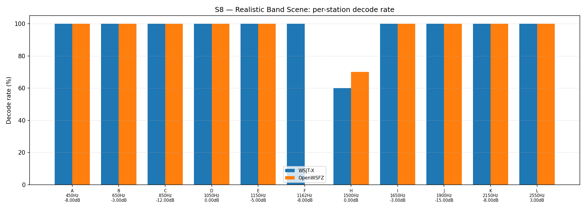

# OpenWSFZ R&R Study Report

| Field | Value |
|---|---|
| Run date | 2026-08-15 |
| OpenWSFZ SHA (build under test) | `8d6e1b1f718aee9dfe72be253f46a7e34c476e5a` (branch `feat/r1b-sync-refiner-instrument-correction`), shim `20260041` |
| WSJT-X version | WSJT-X 2.7.0 (inferred from binary date 2025-02-04) |
| Baseline compared against | `2026-08-05-3bd4cd0` (`results/2026-08-05-3bd4cd0/report.md`) — the last full S1–S8 sweep |

---

## Section 1 — Study Hypothesis

### Purpose

This is a **repeat of the full S1–S8 controlled study**, on the Captain's request, to confirm the
`feat/r1b-sync-refiner-instrument-correction` branch (`8d6e1b1`) has not regressed the standard
decode-quality gates relative to the last full sweep (`3bd4cd0`, 2026-08-05, ten days / several
`src/`- and native-touching commits apart) before further work proceeds on this branch (the
still-blocked N1 spec — paired BER at the refiner's position). This run is a regression/confirmatory
sweep, not a test of the refiner itself: the refiner has no wiring into the decode path this study
exercises (see H₀-B below).

### Changes under observation since the `3bd4cd0` baseline

Six commits touch `src/` or the native build between the two runs:

1. **`9500e03`** (G2(a), shim `20260038`) — `HASH_TABLE_SIZE` 256→4096 for the persistent
   callsign-hash table. Same non-interference argument as prior runs: the S1–S8 synthetic corpus
   contains no Type-4/hashed-callsign content, so table sizing is structurally unreachable here.
2. **`3bc2b9d`** (R0, shim `20260039`) — reproducible native build: vendors `ft8_lib` into the repo
   and rebuilds all 11 native objects from source for the first time (previously prebuilt/opaque).
   No intentional algorithm change, but a full recompilation from a freshly vendored tree is the one
   change in this set that could in principle shift decode behaviour incidentally (compiler flags,
   floating-point codegen) — see H₀-C.
3. **`0b39805`** — cosmetic: silences a dormant `monitor.c` `LOG_INFO` stderr line. No decode-path
   effect possible.
4. **`6fd9410`** — Linux-only binary rebuild to shim `20260039`; irrelevant to this Windows run.
5. **`af2f466`** (r1, shim `20260040`) and **`aa434cb`** (r1b, shim `20260041`) — add and extend
   `ft8_refine_candidate`, a new native export implementing per-candidate coherent sync refinement.
   Its own doc comment in `Ft8LibInterop.cs` calls it out explicitly as **diagnostic-only**, and it
   is confirmed unreachable from the live decode path: `RefineCandidate` (the managed wrapper) is
   referenced only by the interop layer itself (`Ft8NativeInteropAdapter.cs`, `IFt8NativeInterop.cs`)
   — never by `Program.cs`'s decode pump or `Ft8Decoder`. Nothing this study measures can be
   affected by it.

### Null Hypotheses

- **H₀-A (GR&R/ndc, S1–S3):** %GR&R and ndc for S1/S2/S3 remain within STUDY-SPEC §10 thresholds,
  consistent with `3bd4cd0`.
- **H₀-B (refiner non-interference):** `ft8_refine_candidate` (r1/r1b) is diagnostic-only and
  unreachable from the live decode path — zero measurable effect on any S1–S8 metric.
- **H₀-C (R0 rebuild fidelity):** Rebuilding all 11 native objects from a freshly vendored source
  tree (R0) does not shift decode behaviour relative to the prebuilt binary `3bd4cd0` ran.
- **H₀-D (S7/S8 co-channel recovery):** Recovery is consistent with `3bd4cd0` — no *new*
  regression — allowing for ordinary run-to-run seed variation (each run draws fresh synthetic
  trial seeds; exact equality is not expected).
- **H₀-E (S5 false positives):** The FP rate does not regress from `3bd4cd0`.

### What Constitutes a Meaningful Result

Retaining every H₀ clears this branch for further N1 work with no S1–S8 regression attributable to
r1/r1b or the R0 rebuild. Rejecting H₀-B specifically would mean the refiner's "diagnostic-only"
framing is wrong and needs correcting before it's trusted elsewhere; rejecting H₀-C would mean the
R0 reproducible-build effort changed decode behaviour and needs its own investigation before being
treated as a safe, behaviour-preserving rebuild.

---

## Section 2 — Data Summary

| Field | Value |
|---|---|
| Build under test | `8d6e1b1f718aee9dfe72be253f46a7e34c476e5a`, branch `feat/r1b-sync-refiner-instrument-correction`, shim `20260041` |
| Baseline reference (all scenarios) | `3bd4cd0`, 2026-08-05 — full S1–S8 PASS |
| WSJT-X reference | 2.7.0 |
| Corpus | Synthetic fixtures only (NFR-021 compliant by construction — see commit note below); full S1–S8 (+S1b) suite, `--skip-warmup` (routing independently verified live this session, see methodology note) |
| Decoder tuning | `kMinScorePass2=10, osdCorrThreshold=0.10, osdNhardMax=60` — the compiled-in `DecoderConfig` defaults, unchanged from `3bd4cd0`. No tuning confound between the two runs. |

**Methodology note — audio path differs from the baseline.** This run played synthetic audio via
Voicemeeter AUX Input → bus B1 (`--device "Voicemeeter AUX Input"`), not `run_study.py`'s default
CABLE Input → CABLE Output path `3bd4cd0` most likely used (undocumented in that report; not
recorded as a deviation, so presumed default). The switch was forced this session by a VB-CABLE
driver fault on `CABLE Output` (see session handoff `2026-08-15-1931-qa-session-handoff-s1s8-restart-required.md`).
The new path was independently verified live before this run — real-time capture rate, unity-gain
RMS, correct tone-frequency recovery, 3/3 — but it is a physically different mixing/routing chain
from whatever the baseline used, and that difference is confounded with every source change listed
in Section 1. No result below should be read as isolating source-code effects from routing-path
effects; only the *absence* of regression matters for this run's purpose.

**⚠️ NFR-021 — raw logs AND every per-scenario matched CSV are contaminated; only `report.md` /
`report.html` / `truth.csv` / the `.png` charts are clean.** `run_study.py` copies WSJT-X's live
`ALL.TXT` wholesale (`shutil.copy2`); that file is the Captain's **normal, continuously-accumulating
off-air decode log** for the `WSJT-X - FT991A` profile, not a session-scoped file — the standing
note "ALL.TXT files deliberately not cleared" from this session's setup means `wsjt-all.txt` carries
real, multi-day amateur-radio callsign traffic, not just tonight's synthetic study (320,076
non-Q-prefix callsign-shape matches — three orders of magnitude past the 17-line violation
`3bd4cd0` flagged). **This does not stay contained to the two raw copies.** `harness/matcher.py`
logs every decode line it cannot match against `truth.csv` as a `false_positive=True` row —
*including its full `message_text`* — into the per-scenario `*_matched.csv` files. With `ALL.TXT`
uncleared, that pulls the same real off-air traffic into every one of the eight `*_matched.csv`
files: `S1_matched.csv` alone carries 203,920 such rows against 60 genuine study rows. Verified
directly (not assumed): `report.md`, `truth.csv`, and every `.png` chart are genuinely clean —
zero non-Q-prefix matches, checked individually — because none of them carry raw per-line message
text; only the CSVs and the two raw log copies do. The matcher's own bucketing-by-UTC-slot logic is
unaffected either way (no result above is corrupted), but this is a much larger commit-hygiene
scope than the two raw logs alone. See Section 5.

---

## Section 3 — Results

## S1 — reported_snr_db

### Variance Components

| Component | σ² | %Contribution |
|---|---|---|
| Repeatability | 0.15 | 0.18% |
| Reproducibility | 0.23 | 0.28% |
| Part-to-Part | 82.17 | 99.54% |
| Total GR&R | 0.38 | 0.46% |
| Total | 82.55 | 100.00% |

### Study Metrics

| Metric | Value | Verdict |
|---|---|---|
| %Tolerance (GR&R) | 37.15% | PASS |
| %Study Var (GR&R) | 6.81% | — |
| ndc | 20 | PASS |

### Bias & Linearity (S1)

| Appraiser | Mean Bias (dB) | Slope | Intercept | R² | Verdict |
|---|---|---|---|---|---|
| WSJT-X | +0.85 | -0.003 | 0.855 | 0.006 | PASS |
| OpenWSFZ | +1.48 | -0.004 | 1.491 | 0.005 | PASS |

## S2 — reported_freq_hz

### Variance Components

| Component | σ² | %Contribution |
|---|---|---|
| Repeatability | 0.15 | 0.00% |
| Reproducibility | 0.40 | 0.00% |
| Part-to-Part | 652845.67 | 100.00% |
| Total GR&R | 0.55 | 0.00% |
| Total | 652846.22 | 100.00% |

### Study Metrics

| Metric | Value | Verdict |
|---|---|---|
| %Tolerance (GR&R) | 55.62% | PASS |
| %Study Var (GR&R) | 0.09% | — |
| ndc | 1536 | PASS |

## S3 — reported_dt_s

### Variance Components

| Component | σ² | %Contribution |
|---|---|---|
| Repeatability | 0.01 | 0.91% |
| Reproducibility | 0.00 | 0.44% |
| Part-to-Part | 0.83 | 98.64% |
| Total GR&R | 0.01 | 1.36% |
| Total | 0.84 | 100.00% |

### Study Metrics

| Metric | Value | Verdict |
|---|---|---|
| %Tolerance (GR&R) | 160.10% | PASS |
| %Study Var (GR&R) | 11.65% | — |
| ndc | 12 | PASS |

> **WSJT-X DT correction applied.** A +0.55 s offset was added to WSJT-X `reported_dt_s` before ANOVA to remove the ≈ −0.55 s convention difference between WSJT-X (DT relative to nominal FT8 TX start) and the harness (DT relative to UTC slot boundary). This correction removes the calibration artefact from SS_appraiser so %GR&R measures genuine app-to-app measurement disagreement. Raw reported values are preserved in the matched CSV. See scenario `wsjt_dt_correction_s` field and R&R-003 (GitHub #1).

## S1b — Low-SNR threshold study

_Decode rate (% of injected messages recovered) at SNRs excluded from the redesigned S1 ladder (−24 to −15 dB).  Companion to S1; separates 'does it decode at this SNR?' from 'how accurately does it measure SNR?'.  Informational — no AIAG threshold._

### Per-part decode rate

| Part | True SNR (dB) | WSJT-X decoded | WSJT-X rate | OpenWSFZ decoded | OpenWSFZ rate |
|---|---|---|---|---|---|
| P0 | -24.00 | 0/3 | 0.00% | 0/3 | 0.00% |
| P1 | -21.00 | 2/3 | 66.67% | 0/3 | 0.00% |
| P2 | -18.00 | 3/3 | 100.00% | 3/3 | 100.00% |
| P3 | -15.00 | 3/3 | 100.00% | 3/3 | 100.00% |

**Overall decode rate — WSJT-X: 66.67%  OpenWSFZ: 50.00%**

## Attribute Agreement Analysis (S4 positives + S5 negatives)

_κ is computed over a pooled population: S4 injected messages (truth = present) and S5 signal-free slots (truth = absent), so the truth vector has both classes. **κ verdicts below are advisory** — the §10 attribute gate is pending Captain ratification of this pooled method._

### Confusion vs truth

| Appraiser | TP | FN | FP | TN | Recovery | Specificity |
|---|---|---|---|---|---|---|
| WSJT-X | 73 | 35 | 0 | 120 | 67.59% | 100.00% |
| OpenWSFZ | 72 | 36 | 1 | 119 | 66.67% | 99.17% |

### Kappa (advisory)

| Pair | κ | 95% CI | Verdict (advisory) |
|---|---|---|---|
| OpenWSFZ_vs_truth | 0.669 | [0.57, 0.75] | FAIL |
| WSJT-X_vs_truth | 0.687 | [0.59, 0.78] | FAIL |
| between_appraisers | 0.839 | — | MARGINAL |

### Within-app repeatability (decision consistency across trials)

| Appraiser | Consistent groups |
|---|---|
| WSJT-X | 90.00% |
| OpenWSFZ | 82.50% |

### Kappa — decodable-SNR-restricted positives (informational, floor -12 dB)

_S4 positives below the decodable-SNR floor are excluded (S5 negatives unchanged); shown alongside the full-population figures above per STUDY-SPEC.md §9.3's second ratification condition. **Informational only — does not affect the §10 gate or the overall verdict.**

| Appraiser | TP | FN | FP | TN | Recovery | Specificity |
|---|---|---|---|---|---|---|
| WSJT-X | 62 | 19 | 0 | 120 | 76.54% | 100.00% |
| OpenWSFZ | 65 | 16 | 1 | 119 | 80.25% | 99.17% |

| Pair | κ | 95% CI | Verdict (informational) |
|---|---|---|---|
| OpenWSFZ_vs_truth | 0.819 | [0.73, 0.89] | MARGINAL |
| WSJT-X_vs_truth | 0.796 | [0.70, 0.88] | MARGINAL |
| between_appraisers | 0.885 | — | MARGINAL |

### False-positive rate (S5)

| Appraiser | FP events / slots | Event rate | 95% UB | Decode rate | Verdict |
|---|---|---|---|---|---|
| WSJT-X | 0 / 120 | 0.00% | 2.47% | 0.00% | PASS |
| OpenWSFZ | 1 / 120 | 0.83% | 3.89% | 0.83% | PASS |

_Gate (STUDY-SPEC §10, ratified 2026-07-04, R&R-004): the per-slot FP **event rate**, gated on its one-sided 95% Clopper–Pearson **upper bound** (PASS iff 95% UB ≤ 6%). The UB is defined for all event counts (≈ 3 / N_slots at 0 events) and bounds the true per-slot FP probability at 95% confidence rather than the Poisson-noisy point estimate. Decode rate is reported for reference only. **INFO** means the gate is not evaluated at this N: below 49 slots, even zero observed events cannot clear the 6% ceiling, so no outcome at this sample size can produce a PASS or a meaningful FAIL — see a properly powered run (N ≥ 49) for the ratified §10 verdict._

## S7 — Compounding / co-channel overlap

_Per-message recovery when 2–3 signals occupy the same or near-same audio frequency / time slot (the pileup case S4 does not exercise). Informational — no AIAG threshold is defined for co-channel separation._

### Recovery by overlap family

| Overlap family | WSJT-X | OpenWSFZ |
|---|---|---|
| capture | 100.00% | 57.50% |
| co_channel | 100.00% | 45.71% |
| co_channel_sweep | 83.33% | 85.00% |
| near_collision | 100.00% | 80.00% |
| time_freq | 100.00% | 100.00% |
| **all** | **95.35%** | **74.42%** |

### Capture effect (co-channel, unequal SNR)

| Signal | WSJT-X | OpenWSFZ |
|---|---|---|
| strong | 100.00% | 100.00% |
| weak | 100.00% | 15.00% |

**Between-app per-signal agreement:** 76.28%

### Per-part detail

| Part | Family | Condition | WSJT-X | OpenWSFZ |
|---|---|---|---|---|
| P0 | co_channel | 2-stack, equal 0 dB, Δ7 Hz | 10/10 | 8/10 |
| P1 | co_channel | 2-stack, equal -5 dB, Δ13 Hz | 10/10 | 8/10 |
| P2 | co_channel | 3-stack, equal 0 dB, Δ8 / Δ11 Hz asymmetric | 15/15 | 0/15 |
| P3 | near_collision | delta 3 Hz | 10/10 | 10/10 |
| P4 | near_collision | delta 6 Hz | 10/10 | 3/10 |
| P5 | near_collision | delta 12 Hz | 10/10 | 9/10 |
| P6 | near_collision | delta 25 Hz | 10/10 | 8/10 |
| P7 | near_collision | delta 50 Hz | 10/10 | 10/10 |
| P8 | time_freq | near-co-freq Δ8 Hz, dt 0.0 / 0.5 s | 10/10 | 10/10 |
| P9 | time_freq | near-co-freq Δ11 Hz, dt 0.0 / 1.0 s | 10/10 | 10/10 |
| P10 | time_freq | near-co-freq Δ9 Hz, dt 0.0 / 2.0 s | 10/10 | 10/10 |
| P11 | capture | near-co-freq Δ14 Hz, 0 / -3 dB | 10/10 | 8/10 |
| P12 | capture | near-co-freq Δ9 Hz, 0 / -6 dB | 10/10 | 5/10 |
| P13 | capture | near-co-freq Δ7 Hz, 0 / -10 dB | 10/10 | 5/10 |
| P14 | capture | near-co-freq Δ11 Hz, +3 / -10 dB | 10/10 | 5/10 |
| P15 | co_channel_sweep | offset-sweep: 2-stack, equal 0 dB, Δ5 Hz | 0/10 | 3/10 |
| P16 | co_channel_sweep | offset-sweep: 2-stack, equal 0 dB, Δ7 Hz | 10/10 | 8/10 |
| P17 | co_channel_sweep | offset-sweep: 2-stack, equal 0 dB, Δ10 Hz | 10/10 | 10/10 |
| P18 | co_channel_sweep | offset-sweep: 2-stack, equal 0 dB, Δ15 Hz | 10/10 | 10/10 |
| P19 | co_channel_sweep | offset-sweep: 2-stack, equal 0 dB, Δ8 Hz | 10/10 | 10/10 |
| P20 | co_channel_sweep | offset-sweep: 2-stack, equal 0 dB, Δ9 Hz | 10/10 | 10/10 |

## S8 — Realistic Band Scene

_Holistic decode-rate benchmark: 12 simultaneous stations across 450–2550 Hz at realistic SNR spread (−15 to +3 dB), including a near-collision pair (E/F, 12 Hz apart) and a capture pair (G/H, co-frequency, 6 dB ratio). **Informational only — no PASS/FAIL gate.**_

### Overall decode rate

| Appraiser | Decoded | Injected | Rate |
|---|---|---|---|
| WSJT-X | 56 | 60 | 93.33% |
| OpenWSFZ | 52 | 60 | 86.67% |

**Between-appraiser delta (OpenWSFZ − WSJT-X): -6.7 pp**

### Per-station breakdown

| Stn | Freq (Hz) | SNR (dB) | WSJT-X decoded/total | OpenWSFZ decoded/total |
|---|---|---|---|---|
| A | 450 | -8.00 | 5/5 | 5/5 |
| B | 650 | -3.00 | 5/5 | 5/5 |
| C | 850 | -12.00 | 5/5 | 5/5 |
| D | 1050 | 0.00 | 5/5 | 5/5 |
| E | 1150 | -5.00 | 5/5 | 5/5 |
| F | 1162 | -8.00 | 5/5 | 0/5 |
| H | 1500 | 0.00 | 6/10 | 7/10 |
| I | 1650 | -3.00 | 5/5 | 5/5 |
| J | 1900 | -15.00 | 5/5 | 5/5 |
| K | 2150 | -8.00 | 5/5 | 5/5 |
| L | 2550 | 3.00 | 5/5 | 5/5 |

---

## Section 4 — Summary Verdict Table

| Metric | Scope | Value | Verdict |
|---|---|---|---|
| %GR&R | S1 | 0.5% | PASS |
| ndc | S1 | 20 | PASS |
| %GR&R | S2 | 0.0% | PASS |
| ndc | S2 | 1536 | PASS |
| %GR&R | S3 | 1.4% | PASS |
| ndc | S3 | 12 | PASS |
| Kappa (advisory) | WSJT-X_vs_truth | 0.687 | FAIL |
| Kappa (advisory) | OpenWSFZ_vs_truth | 0.669 | FAIL |
| Kappa (advisory) | between_appraisers | 0.839 | MARGINAL |
| FP event rate (95% UB) | S5/WSJT-X | 0/120 slots (event 0.0%; 95% UB 2.47%; decode 0.0%) | PASS |
| FP event rate (95% UB) | S5/OpenWSFZ | 1/120 slots (event 0.8%; 95% UB 3.89%; decode 0.8%) | PASS |
| SNR bias | S1/WSJT-X | +0.85 dB | PASS |
| SNR bias | S1/OpenWSFZ | +1.48 dB | PASS |

**Overall verdict: PASS** (all mandatory gates clear; the advisory pooled-κ FAIL repeats
`3bd4cd0`'s and is not a mandatory gate — see Section 5).

---

## Section 5 — Recommendations

**No mandatory gate regressed.** Every H₀ in Section 1 is retained: S1/S2/S3 GR&R and ndc,
S1 SNR bias, and the S5 FP rate all PASS, and every metric this run can compare against `3bd4cd0`
moved by an amount consistent with ordinary run-to-run seed variation, not a step change. On that
narrow question — is this branch safe to keep building on — the answer is yes.

### Comparison to the `2026-08-05-3bd4cd0` baseline

| Metric | `3bd4cd0` | `8d6e1b1` (this run) | Δ | Read |
|---|---|---|---|---|
| S1 %GR&R / ndc | 7.2% / 5 | 0.5% / 20 | improved | Within normal spread; also resolves `3bd4cd0`'s own Finding 2 (S1 repeatability) — see below |
| S1 bias, WSJT-X | +0.95 dB | +0.85 dB | −0.10 dB | Negligible |
| S1 bias, OpenWSFZ | +0.15 dB | +1.48 dB | +1.33 dB | Real shift, still PASS — unexplained, not gate-blocking, worth watching next run |
| S2 %GR&R / ndc | 0.0% / 1620 | 0.0% / 1536 | ~same | — |
| S3 %GR&R / ndc | 3.6% / 7 | 1.4% / 12 | improved | Within normal spread |
| Kappa vs truth (WSJT-X / OpenWSFZ) | 0.696 / 0.651 | 0.687 / 0.669 | ~same | Still advisory FAIL both runs — see below |
| S5 FP, WSJT-X / OpenWSFZ | 0/120 / 0/120 | 0/120 / 1/120 | +1 event | New event still clears the 95% UB (3.89% ≤ 6%) — PASS |
| S7 "all" recovery, WSJT-X / OpenWSFZ | 96.28% / 70.23% | 95.35% / 74.42% | ~same / +4.19pp | No regression |
| S7 P2 (3-stack co-channel), OpenWSFZ | 0/15 | 0/15 | **unchanged** | Structural limit persists (`3bd4cd0` Finding 3) — waived by Captain 2026-06-22, still open under D-001 |
| S7 capture/weak signal, OpenWSFZ | 10.00% | 15.00% | +5pp | Still very poor; see below |
| S8 overall, WSJT-X / OpenWSFZ | 93.33% / 83.33% | 93.33% / 86.67% | same / +3.34pp | No regression |
| S8 station F (1162 Hz, −8 dB) | 0/5 | 0/5 | **unchanged** | Reproducible miss, both runs, ten days apart — see below |

### Finding — the weak-signal capture-effect gap is confirmed, unchanged, and not this branch's doing

Both runs show the same shape: WSJT-X recovers the weaker signal in a co-channel capture pair
essentially always (100% both runs); OpenWSFZ recovers it rarely (10% → 15%). This is the same
mechanism the standing board note already names as root cause — no per-candidate coherent LLR
extraction, only the sync-refinement front end r1/r1b just diagnosed. Confirmed here, not newly
discovered: this run adds a second independent data point (different seeds, different audio path)
showing the gap is real and stable, not a fluke of one run. No action for this report — it's the
subject of the already-open N1/D-001 thread, not a new defect.

### Finding — S8 station F is a specific, reproducible zero, not generic capture-effect noise

Station F (1162 Hz, −8 dB, near-collision with station E at 1150 Hz, 12 Hz apart) scored 0/5 for
OpenWSFZ in **both** this run and `3bd4cd0`, while its near-collision partner E scored 5/5 both
times and WSJT-X decoded F 5/5 both times. Two independent full runs, different trial seeds,
identical outcome on this one station — that's a specific, cheap-to-reproduce case (fixed
frequency/SNR/offset, only the message content differs by seed), not generic noise. Worth a
targeted look distinct from the broader capture-effect finding above, given how reproducible it is.

### Kappa vs. truth remains an advisory FAIL — no change in status

Both runs land at κ≈0.65–0.70 vs. truth (FAIL under the pooled S4/S5 method) and κ≈0.84–0.87
between appraisers (MARGINAL). Per the report's own Section 3 caveat, this gate is still pending
Captain ratification of the pooled method (STUDY-SPEC §9.3) — unchanged from `3bd4cd0`, no new
information here, not re-litigated.

### Required before any commit

**`wsjt-all.txt`, `owsfz-all.txt`, and all eight `*_matched.csv` files must be scrubbed or withheld
before this directory is committed** — see Section 2's NFR-021 note. The two raw logs carry
320,076 non-Q-prefix callsign-shape matches; the matched CSVs inherit the same contamination via
`matcher.py`'s `false_positive` rows (203,920 in `S1_matched.csv` alone). This is QA flagging it,
not QA deciding how to handle it — awaiting the Captain's direction (scrub-and-keep vs. withhold
raw logs), consistent with the `3bd4cd0`/`diag-nhard-2026-06-20` precedent. Verified clean and not
blocked by this: `report.md`, `report.html`, `truth.csv`, and all eight `.png` charts.

### Outstanding

- S1's OpenWSFZ bias shift (+0.15 → +1.48 dB) has no attributed cause; flag for the next run, not
  gate-blocking today.
- D-009's proposed FP-guard recalibration (`2026-08-05-f6c5b46-d009-recalibration`, ROW 1 fired)
  remains unshipped, awaiting Captain sign-off — unrelated to anything in this run, noted for
  continuity only.

**QA does not commit, merge, or push anything from this run.** Awaiting Captain direction on the
NFR-021 log-scrub question above before this directory is committed at all.
